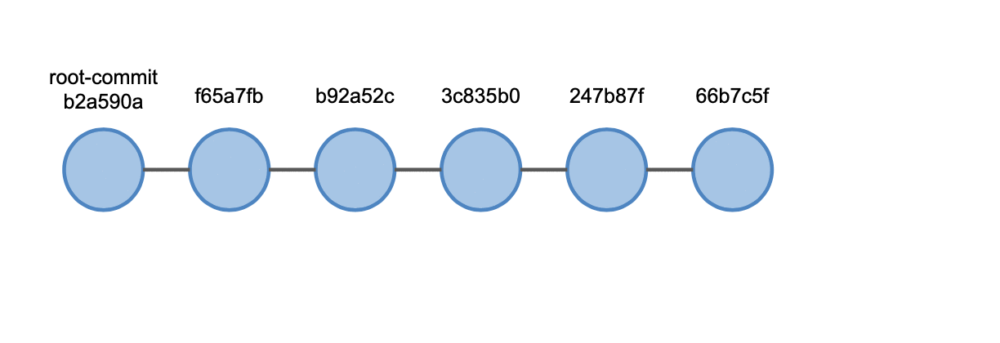
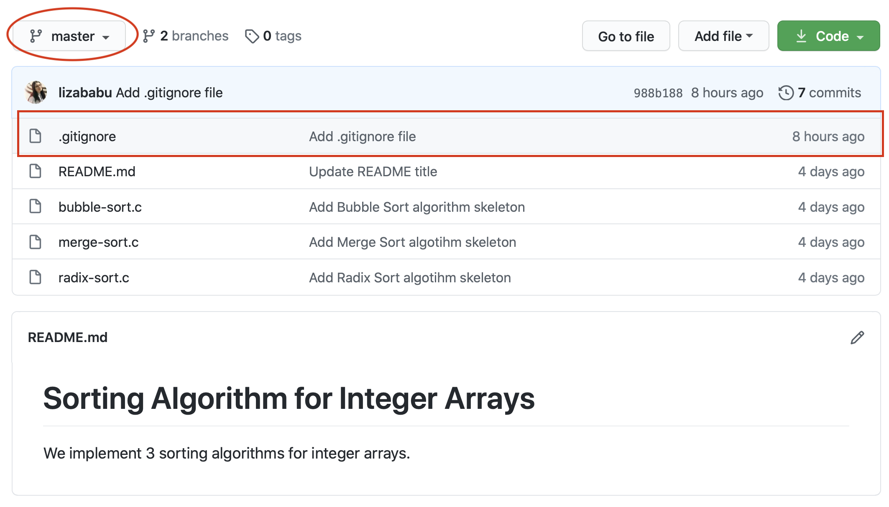
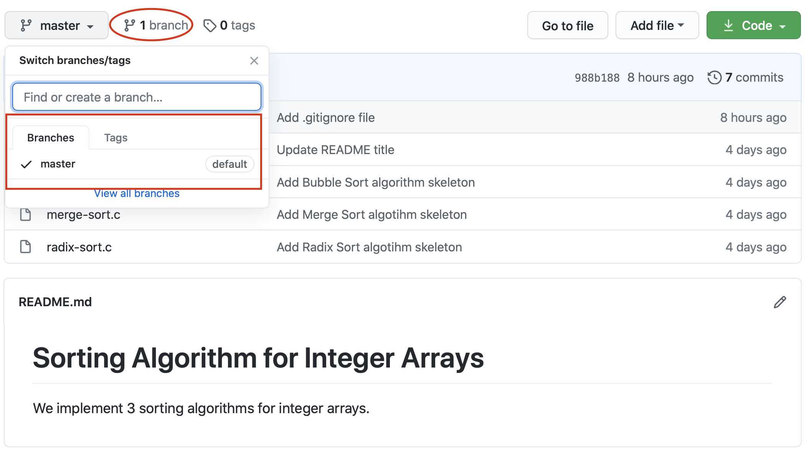
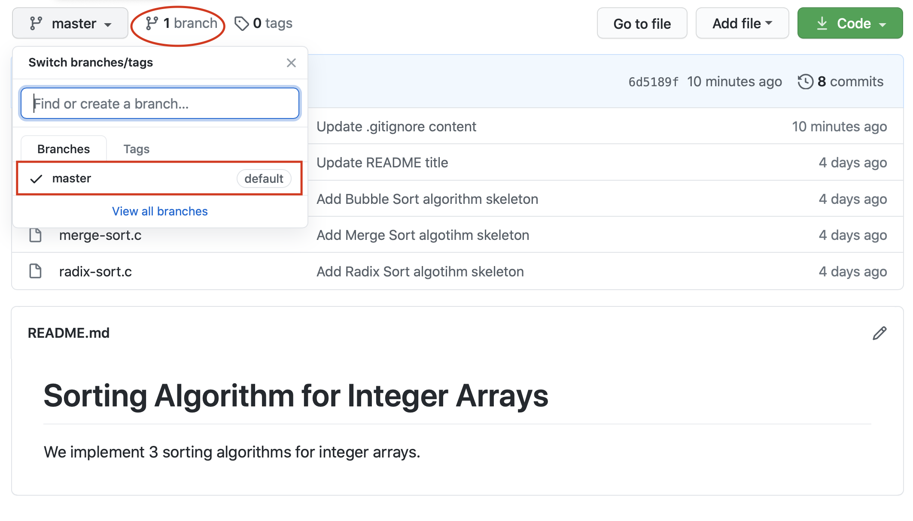

.. _app_dev_branches:

Lucrul pe branch-uri
====================

Un dezvoltator vrea să lucreze la o funcționalitate nouă, care poate destabiliza proiectul.
Pentru aceasta creează **o ramură de dezvoltare nouă** (*branch*) pe care face commituri noi.
Ulterior, dacă funcționalitatea este utilă, va fi adăugată în proiect prin unificarea acestui branch (*merge*); altfel branch-ul va fi șters.

Un repository Git are un branch principal de dezvoltare, numit **master**.
Branch-ul ``master`` este branch-ul implicit cu care lucrăm, în care adăugăm commituri și în care vedem istoricul de commituri.

În acest moment istoricul de commituri este următorul:

.. code-block:: bash 

    student@uso:~/array-sorting-algorithms$ git log
    commit 66b7c5fabb93b521326e6cd9ff219a06a3aec064
    Author: Liza Babu <lizababu@example.com>
    Date:   Thu Sep 24 10:40:06 2020 -0700

        Update README title

    commit 247b87f3f317816a204c4512f6fd9914527a03ad
    Author: Liza Babu <lizababu@example.com>
    Date:   Thu Sep 24 09:50:30 2020 -0700

        Update README with project explanation

    commit 3c835b0d8e7fc88ef45dfd3681867c21b75ed588
    Author: Liza Babu <lizababu@example.com>
    Date:   Thu Sep 24 09:45:13 2020 -0700

        Add Merge Sort algotihm skeleton

    commit b92a52c0fc5d66dce4b2562114cc84ea326b2763
    Author: Liza Babu <lizababu@example.com>
    Date:   Thu Sep 24 09:44:36 2020 -0700

        Add Radix Sort algotihm skeleton

    commit f65a7fbe8bbe1b36ba5c8e16607456a879bfb6fa
    Author: Liza Babu <lizababu@example.com>
    Date:   Thu Sep 24 09:21:49 2020 -0700

        Add Bubble Sort algorithm skeleton

    commit b2a590a8637f1eab96e557334dbd4be14bf95833
    Author: Liza Babu <lizababu@example.com>
    Date:   Thu Sep 24 09:09:51 2020 -0700

        Add README file

O reprezentare vizuală a istoricului commiturilor este:

**Root-commitul** este primul commit din istoric (*b2a590a8637f1eab96e557334dbd4be14bf95833*, *b2a590a*) [#hash]_.
Toate celelalte commituri vin în continuarea acestuia.
Spre exemplu, al doilea commit (*f65a7fbe8bbe1b36ba5c8e16607456a879bfb6fa*, *f65a7fb*) a avut la bază primul commit (*b2a590a*).
Modificările au fost făcute peste commitul *b2a590a*.

Crearea unui commit nou pe un *alt* branch va modifica istoricul ca în imaginea de mai jos:

În acest moment, pe repository-ul nostru aveți un singur branch - **master**.
În continuare vom lucra la proiectul nostru ``array-sorting-algorithms``, dar vom face schimbări de pe alte branch-uri.

În următoarea secțiune vom adăuga un fișier ``.gitignore`` proiectului și vom adăuga implementarea pentru agloritmul Merge Sort.

.. note::

    În general adăugăm fișierul ``.gitignore`` la un proiect de pe branch-ul master.
    
    În secțiunea :ref:`app_dev_add_gitignore` îl vom adăuga de pe un alt branch pe care îl numim ``add-gitignore`` ca să ne obișnuim să folosim branch-uri.

.. _app_dev_add_gitignore:

Adăugarea unui fișier .gitignore repository-ului
------------------------------------------------

De acum încolo, vom face toate modificările de pe un nou branch, diferit de branch-ul **master** [#good_practice]_.

În această subsecțiune vom crea un nou branch numit ``add-gitignore``.
Vom adăuga un fișier ``.gitignore`` proiectului de pe acest branch.

.. note::

    Într-un proiect Git, scriem în fișierul ``.gitignore`` nume de fișiere și directoare.
    Acestea sunt fișiere și directoare din directorul proiectului pe care nu vrem să le adăugăm în repository.

    Spre exemplu, nu punem fișiere obiect și fișiere executabile în repository pentru că sunt fișiere generate pentru un anumit tip de sistem.
    Având codul sursă, putem genera fișierele obiect și executabile pe sistemul nostru. 

Verificăm branch-ul pe care ne aflăm folosind comanda ``git branch``:

.. code-block:: bash

    student@uso:~/array-sorting-algorithms$ git branch
    *  master

Caracterul ``*`` se află în dreptul branch-ului pe care ne aflăm, în cazul nostru **master**.

Creăm un nou branch numit ``add-gitignore`` folosind comanda ``git branch`` urmată de numele noului branch:

.. code-block:: bash

    student@uso:~/array-sorting-algorithms$ git branch add-gitignore
    student@uso:~/array-sorting-algorithms$ git branch
    add-gitignore
    * master

Acum avem 2 branch-uri **add-gitignore** și **master** și ne aflăm pe branch-ul **master**.

Trecem pe branch-ul **add-gitignore** folosind comanda ``git checkout``:

.. code-block:: bash

    student@uso:~/array-sorting-algorithms$ git checkout add-gitignore
    Switched to a new branch 'add-gitignore'
    student@uso:~/array-sorting-algorithms$ git branch
    * add-gitignore
    master

Avem 2 branch-uri **add-gitignore** și **master** și ne aflăm pe branch-ul **add-gitignore**.

În acest moment branch-ul **add-gitignore** nu diferă de branch-ul **master**.
Când vom face schimbări (în formă de commituri), cele două branch-uri vor diverge.

Nu dorim să avem fișiere obiect în repository așa că vom configura Git să ignore aceste fișiere.
Facem acest lucru prin adăugarea șirului ``*.o`` în fișierul ``.gitignore``:

.. code-block:: bash

    student@uso:~/array-sorting-algorithms$ echo "*.o" > .gitignore
    student@uso:~/array-sorting-algorithms$ ls -a
    .  ..  bubble-sort.c  .git  .gitignore  merge-sort.c  radix-sort.c  README.md
    student@uso:~/array-sorting-algorithms$ git status
    On branch add-gitignore
    Untracked files:
    (use "git add <file>..." to include in what will be committed)

        .gitignore

    nothing added to commit but untracked files present (use "git add" to track)

Creăm un commit cu această modificare (``git add`` și ``git commit``) și îl publicăm (``git push``):

.. code-block:: bash

    student@uso:~/array-sorting-algorithms$ git add .gitignore
    student@uso:~/array-sorting-algorithms$ git status
    On branch add-gitignore
    Changes to be committed:
    (use "git reset HEAD <file>..." to unstage)

        new file:   .gitignore

    student@uso:~/array-sorting-algorithms$ git commit -m "Add .gitignore file"
    [add-gitignore 988b188] Add .gitignore file
    1 file changed, 1 insertion(+)
    create mode 100644 .gitignore
    student@uso:~/array-sorting-algorithms$ git push origin add-gitignore
    Counting objects: 3, done.
    Delta compression using up to 2 threads.
    Compressing objects: 100% (2/2), done.
    Writing objects: 100% (3/3), 283 bytes | 70.00 KiB/s, done.
    Total 3 (delta 1), reused 0 (delta 0)
    remote: Resolving deltas: 100% (1/1), completed with 1 local object.
    remote: 
    remote: Create a pull request for 'add-gitignore' on GitHub by visiting:
    remote:      https://github.com/lizababu/array-sorting-algorithmss/pull/new/add-gitignore
    remote: 
    To https://github.com/lizababu/array-sorting-algorithmss.git
    * [new branch]      add-gitignore -> add-gitignore

Am publicat commitul în repository-ul remote pe branch-ul ``add-gitignore``.
Odată cu publicarea commitului pe GitHub, a fost creat și branch-ul ``add-gitignore`` în repository-ul remote.

.. note::

    Orice operație trebuie să fie urmată de o operație de verficare.
    Din grabă sau neatenție, putem face operații incorecte și este mai ușor să le remediem pe loc decât mai târziu.
    Spre exemplu, după crearea unui commit, verificăm **statusul repository-ului** și **istoricul de commituri**.

.. _app_dev_merge:

Operația **merge** dintre un branch secundar și master
------------------------------------------------------

În secțiunea :ref:`app_dev_add_gitignore` de mai sus am creat un commit pe branch-ul **add-gitignore**.

.. note::

    Ne amintim că este **BAD PRACTICE** să facem modificări direct pe branch-ul **master**.

Vrem ca modificarea făcută de noi, în acest caz crearea unui fișier **gitignore**, să se regăsească și pe branch-ul master.
Facem acest lucru prin intermediul operației ``merge``, operație care unește două branch-uri: adică aduce conținutul unui branch pe un alt branch, în cazul nostru de pe **add-gitignore** pe **master**.
Pentru a face acest lucru trebuie să fim pe branch-ul **master**, adică pe branch-ul în care vrem să integrăm schimbările.

Trecem pe branch-ul **master** folosind comanda ``git checkout``:

.. code-block:: bash

    student@uso:~/array-sorting-algorithms$ git checkout master
    Switched to branch 'master'

Suntem pe branch-ul **master** local și ne asigurăm că este sincronizat cu cel remote folosind comanda ``git pull``:

.. code-block:: bash

    student@uso:~/array-sorting-algorithms$ git pull origin master
    From https://github.com/lizababu/array-sorting-algorithmss
    * branch            master     -> FETCH_HEAD
    Already up to date.

Branch-ul **master** local este sincronizat cu cel remote (*Already up to date*).
Integrăm branch-ul **add-gitignore** în branch-ul **master** folosind comanda ``git merge``:

.. code-block:: bash 

    student@uso:~/array-sorting-algorithms$ git merge add-gitignore
    Updating 66b7c5f..988b188
    Fast-forward
    .gitignore | 1 +
    1 file changed, 1 insertion(+)
    create mode 100644 .gitignore
    student@uso:~/array-sorting-algorithms$ git status
    On branch master
    Your branch is ahead of 'origin/master' by 1 commit.
    (use "git push" to publish your local commits)

    nothing to commit, working tree clean

Acum avem pe repository-ul local un commit în plus față de repository-ul origin (*Your branch is ahead of 'origin/master' by 1 commit*), adică avem un commit care nu a fost publicat.
Verificăm istoricul de commituri pentru a-l vedea folosind comanda ``git log``:

.. code-block:: bash

    commit 988b188d2c6422a3162d1da25653f4682f7df6db (HEAD -> master, origin/add-gitignore, add-gitignore)
    Author: Liza Babu <lizababu@example.com>
    Date:   Mon Sep 28 02:29:00 2020 -0700

        Add .gitignore file

    commit 66b7c5fabb93b521326e6cd9ff219a06a3aec064 (origin/master, origin/HEAD)
    Merge: f59ba10 23d5cfa
    Author: Liza Babu <lizababu@example.com>
    Date:   Thu Sep 24 10:40:06 2020 -0700

        Update README title
    (...)

După integrarea branch-ului **add-gitignore** în branch-ul **master** vedem că ultimul commit (hash *988b188d2c6422a3162d1da25653f4682f7df6db*) se află în istoric.
Îl publicăm în repository-ul origin folosind comanda ``git push``:

.. code-block:: bash

    student@uso:~/array-sorting-algorithms$ git push origin master
    Enumerating objects: 4, done.
    Counting objects: 100% (4/4), done.
    Delta compression using up to 4 threads
    Compressing objects: 100% (2/2), done.
    Writing objects: 100% (2/2), 296 bytes | 296.00 KiB/s, done.
    Total 2 (delta 0), reused 0 (delta 0), pack-reused 0
    To https://github.com/lizababu/array-sorting-algorithms
    5c982a1..1f553ab  master -> master

Vedem commitul și pe GitHub ca în imaginea de mai jos pe branch-ul **master**:

.. _app_dev_delete_branch:

Ștergerea unui branch
---------------------

După ce terminăm lucrul pe un branch, îl ștergem.
Vom folosi noi ramuri de dezvoltare (*branch-uri*) pentru alte funcționalități, deci nu vom mai avea nevoie de branch-urile vechi.

În acestă secțiune vom șterge branch-ul **add-gitignore** atât din repository-ul local cât și din interfața GitHub.

Trebuie să ne aflăm pe un branch diferit față de cel pe care vrem să-l ștergem.
Verificăm branch-ul pe care ne aflăm folosind comanda ``git branch``:

.. code-block:: bash 

    student@uso:~/array-sorting-algorithms$ git branch
      add-gitignore
    * master

Ne aflăm pe branch-ul **master**.
Ștergem branch-ul **add-gitignore** din repository-ul local folosind comanda ``git branch -d``:

.. code-block:: bash

    student@uso:~/array-sorting-algorithms$ git branch -d add-gitignore
    Deleted branch add-gitignore (was 988b188).
    student@uso:~/array-sorting-algorithms$ git branch
    * master

Am șters branch-ul **add-gitignore** din repository-ul local și am rămas doar cu branch-ul **master**.
Ștergem acum branch-ul **add-gitiginore** și din repository-ul origin folosind comanda ``git push``:

.. code-block:: bash

    student@uso:~/array-sorting-algorithms$ git push origin --delete add-gitignore
    To https://github.com/lizababu/array-sorting-algorithms.git
    - [deleted]         add-gitignore

Vedem și din interfața GitHub că nu mai există branch-ul **add-gitignore** ca în imaginea de mai jos:

.. _app_dev_another_merge:

Modificarea fișierului .gitignore
----------------------------------

În această subsecțiune vom relua pașii prezentați în subsecțiunile anterioare.
Vom lucra în continuare pe branch-uri.
Vom adăuga o nouă linie în fișierul ``.gitignore``, vom crea un commit cu această schimbare și vom integra schimbările din branch-ul secundar în branch-ul **master** prin operația **merge**.

Creăm un branch numit **update-gitiginore** și ne mutăm pe el.

.. code-block:: bash

    student@uso:~/array-sorting-algorithms$ git branch update-gitignore
    student@uso:~/array-sorting-algorithms$ git checkout update-gitignore 
    Switched to branch 'update-gitignore'

Suntem pe branch-ul **update-gitignore** și adăugăm linia ``build/`` în fișierul ``.gitignore``.

.. note::

    De obicei, într-un proiect vom avea un director în care punem fișierele generate (spre exemplu, fișierele excutabile).
    Astfel, punem doar numele directorului în ``.gitginore`` și toate fișierele din el vor fi ignorate de Git.

    Alternativa ar fi să adăugăm numele tuturor fișierelor executabile pe care le generăm în ``.gitignore``.
    Dezavantajul aici este că nu putem refolosi un fișier ``.gitignore`` de la un proiect la altul pentru că numele executabilelor vor fi, cel mai probabil, diferite.

Putem face acest lucru folosind un editor text sau folosind următoarea comandă:

.. code-block:: bash

    student@uso:~/array-sorting-algorithms$ echo "build/" >> .gitignore

Creăm un commit care să conțină modificărea din fișierul ``.gitignore``.

.. code-block:: bash

    student@uso:~/array-sorting-algorithms$ git status
    On branch update-gitignore
    Changes not staged for commit:
    (use "git add <file>..." to update what will be committed)
    (use "git checkout -- <file>..." to discard changes in working directory)

        modified:   .gitignore

    no changes added to commit (use "git add" and/or "git commit -a")
    student@uso:~/array-sorting-algorithms$ git add .gitignore
    student@uso:~/array-sorting-algorithms$ git status 
    On branch update-gitignore
    Changes to be committed:
    (use "git reset HEAD <file>..." to unstage)

        modified:   .gitignore

    student@uso:~/array-sorting-algorithms$ git commit -m "Update .gitignore content"
    [update-gitignore 6d5189f] Update .gitignore content
     1 file changed, 1 insertion(+)
    student@uso:~/array-sorting-algorithms$ git log
    commit 6d5189fd7095a19a6ad9bddb8c95491b37d9e828 (HEAD -> update-gitignore)
    Author: Liza Babu <lizababu@example.com>
    Date:   Mon Sep 28 11:47:36 2020 -0700

        Update .gitignore content

    commit 988b188d2c6422a3162d1da25653f4682f7df6db (origin/master, master)
    Author: Liza Babu <lizababu@example.com>
    Date:   Mon Sep 28 02:29:00 2020 -0700

        Add .gitignore file

    commit 66b7c5fabb93b521326e6cd9ff219a06a3aec064
    Author: Liza Babu <lizababu@example.com>
    Date:   Thu Sep 24 10:40:06 2020 -0700

        Update README title
    (...)

Am verificat istoricul de commituri și vedem că ultimul commit este cel cu identificatorul *6d5189fd7095a19a6ad9bddb8c95491b37d9e828*, adică cel creat în această subsecțiune.
    
Publicăm commitul și în repository-ul origin, pentru ca acesta să fie vizibil și celorlalți colaboratori ai proiectului, folosind comanda ``git push`` 

.. code-block:: bash

    student@uso:~/array-sorting-algorithms$ git push origin update-gitignore
    Counting objects: 3, done.
    Delta compression using up to 2 threads.
    Compressing objects: 100% (2/2), done.
    Writing objects: 100% (3/3), 295 bytes | 295.00 KiB/s, done.
    Total 3 (delta 1), reused 0 (delta 0)
    remote: Resolving deltas: 100% (1/1), completed with 1 local object.
    remote: 
    remote: Create a pull request for 'update-gitignore' on GitHub by visiting:
    remote:      https://github.com/lizababu/array-sorting-algorithms/pull/new/update-gitignore
    remote: 
    To https://github.com/lizababu/array-sorting-algorithms.git
    * [new branch]      update-gitignore -> update-gitignore

Revenim pe branch-ul **master** și efectuăm operația **merge** între branch-ul **update-gitignore** și **master**.

.. code-block:: bash

    student@uso:~/array-sorting-algorithms$ git checkout master
    Switched to branch 'master'
    student@uso:~/array-sorting-algorithms$ git merge update-gitignore
    Updating 988b188..6d5189f
    Fast-forward
    .gitignore | 1 +
    1 file changed, 1 insertion(+)
    student@uso:~/array-sorting-algorithms$ git push origin master
    Enumerating objects: 4, done.
    Counting objects: 100% (4/4), done.
    Delta compression using up to 4 threads
    Compressing objects: 100% (2/2), done.
    Writing objects: 100% (2/2), 296 bytes | 296.00 KiB/s, done.
    Total 2 (delta 0), reused 0 (delta 0), pack-reused 0
    To https://github.com/lizababu/array-sorting-algorithms
    5c982a1..1f553ab  master -> master

Ștergem branch-ul **update-gitignore** în repository-ul local și în cel origin.

.. code-block:: bash

    student@uso:~/array-sorting-algorithms$ git branch -d update-gitignore 
    Deleted branch update-gitignore (was 6d5189f).
    student@uso:~/array-sorting-algorithms$ git push origin --delete update-gitignore
    To https://github.com/lizababu/array-sorting-algorithms.git
     - [deleted]         update-gitignore

Vedem și din interfața GitHub că nu mai există branch-ul **update-gitignore** ca în imaginea de mai jos:

.. _app_dev_branches_ex:

Exerciții
---------

#. Creați un branch cu numele ``merge-sort-implementation``.
#. Treceți pe branch-ul ``merge-sort-implementation``.
#. Modificați conținutul fișierului **merge-sort.c** cu următorul conținut:

   .. code-block:: c

    #include <stdio.h>

    #define MAX_LEN 100

    static void merge(int arr[], int left, int mid, int right) 
    { 
        int i, j, k; 
        int n1 = mid - left + 1; 
        int n2 = right - mid; 

        int aux_left[n1], aux_right[n2]; 

        for (i = 0; i < n1; i++) 
            aux_left[i] = arr[left + i]; 
        for (j = 0; j < n2; j++) 
            aux_right[j] = arr[mid + 1 + j]; 

        i = 0;
        j = 0;
        k = l;
        while (i < n1 && j < n2) { 
            if (aux_left[i] <= aux_right[j]) { 
                arr[k] = aux_left[i]; 
                i++; 
            } 
            else { 
                arr[k] = aux_right[j]; 
                j++; 
            } 
            k++; 
        } 

        while (i < n1) { 
            arr[k] = aux_left[i]; 
            i++; 
            k++; 
        } 

        while (j < n2) { 
            arr[k] = R[j]; 
            j++; 
            k++; 
        } 
    }

    static void sort(int arr[], int left, int right)
    {
        if (left < right) {
            int mid = left + (right - left) / 2; 

            sort(arr, left, mid); 
            sort(arr, mid + 1, right); 

            merge(arr, left, mid, right); 
        } 
    }

    static void print_array(int *arr, int len)
    {
        int i;

        for (i = 0; i < len; i++) {
            printf("%d ", arr[i]);
        }
        printf("\n");
    }

    int main()
    {
        int arr[MAX_LEN], len, i;
        
        printf("What's the length of the array? Maximum lenght is %d\n", MAX_LEN);
        scanf("%d", &len);

        printf("Gimme the %d elements\n", len);
        for (i = 0; i < len; i++) {
        scanf("%d", &arr[i]);
        }

        printf("Nonsorted array: ");
        print_array(arr, len);

        sort(arr, len);

        printf("Sorted array: ");
        print_array(arr, len);

        return 0; 
    }

#. Creați un nou commit cu această schimbare folosind mesajul de commit ``Add Merge Sort implementation``.
#. Publicați commitul folosind comanda ``git push origin merge-sort-implementation``.
#. Efectuați operația **merge** între branch-ul **master** și **merge-sort-implementation**.
#. Ștergeți branch-ul **merge-sort-implementation**.

.. _app_dev_branches_good_practices:

Bune practici
-------------

Atunci când contribuim la un proiect putem să lucrăm fie pe branch-ul **master**, fie pe un alt branch.
Este considerat **BAD PRACTICE** să lucrăm pe branch-ul **master** din mai multe motive:

#. Pe branch-ul **master** se ține întotdeauna o versiune de cod funcțională.
   Astfel, lucrul pe acest branch ar însemna să facem commituri doar atunci când o funcționalitate este finalizată, altfel pe branch-ul **master** vom avea o bucată de cod neterminată care poate să afecteze întreg proiectul.

#. Lucrul pe un singur branch nu oferă posibilitatea de a da feedback pe schimbările făcute pe repository.
   Dacă nu avem posibilitatea să oferim feedback unui coleg prin intermediul GitHub, atunci vom avea nevoie să comunicăm pe un alt mediu observațiile noastre, iar ei vor trebui să creeze un nou commit pentru rezolvarea problemelor.
   Mult mai simplu este să se realizeze întreaga etapă de feedback, numită **code review** înainte ca schimbările să apară pe **master**.
   Vom vorbi în următoarea secțiune, :ref:`app_dev_pr`, termenul de *pull request*, folosit pentru code review.

.. rubric:: Note de subsol

.. [#hash]

    ID-ul unui commit are o formă lungă, completă, și o formă scurtă formată din primele 7 caractere.
    De exemplu, pentru commitul cu ID-ul *b2a590a8637f1eab96e557334dbd4be14bf95833*, forma scurtă este *b2a590a*.

.. [#good_practice]

    Este **GOOD PRACTICE** ca fiecare modificare făcută pe un repository să fie făcută pe un branch nou.
    Branch-ul trebuie să aibă un nume sugestiv pentru ca ceilalți să poată înțelege rapid ce schimbări se fac pe el.
