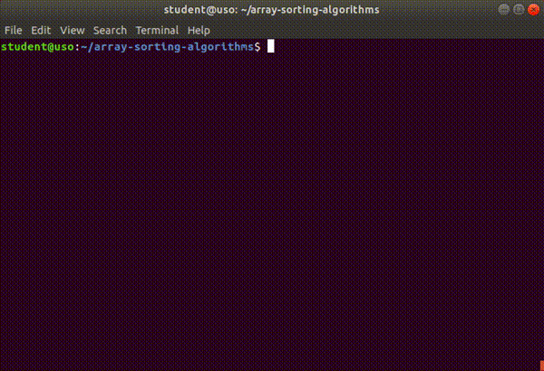
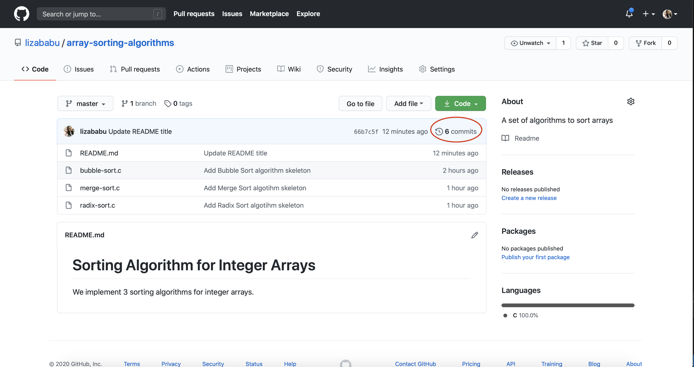

.. _app_dev_first_commits:

Primele commituri
=================

Odată creat repository-ul, putem să începem să lucrăm la proiect.

Lucrul la proiect înseamnă să adăugăm și să ștergem fișiere sau să modificăm fișiere existente.
De obicei este vorba de fișiere text (*human-readable*), cel mai des fișiere cod sursă [#source_code]_.
Vrem să salvăm aceste adăugări și modificări; apoi să salvăm din nou alte modificări; și tot așa.

Salvarea acestor modificări înseamnă crearea unui **commit** în repository.

Același lucru îl fac și ceilalți colegi care lucrează la același proiect.
Fiecare commit împachetează un set de adăugări și modificări realizate de un dezvoltator al proiectului.
Având commiturile în repository putem să gestionăm mai ușor proiectul, adică:

* să revenim la un commit anterior (adesea chiar ultimul) dacă modificările cele mai recente "strică" proiectul
* să vedem cine este autorul anumitor modificări
* să creăm o ramură de dezvoltare separată pornind de la un commit anterior, pe care să încercăm o funcționalitate nouă, fără a afecta restul proiectului

Putem să ne gândim la un commit ca la un checkpoint. Când lucrăm pe repository-ul local, orice modificări aducem sunt doar la noi pe calculator.
Asta înseamnă că un coleg cu care lucrezi la proiect nu va vedea ce ai lucrat tu. Astfel că, atunci când lucrăm la un proiect, periodic sau când terminăm un anumit task / o funcție importantă ce vrem să fim singuri că s-a salvat, vom face un commit.
Mai exact, salvăm tot ce am lucrat într-un checkpoint cu nume sugestiv (un mesaj de commit) la care vom putea reveni mai târziu în cazul în care stricăm ceva în program.

Git se ocupă de păstrarea și gestiunea istoricului repository-ului nostru prin păstrarea listei de commituri făcute.
Adică Git păstrează un istoric de versiuni al proiectului.

.. note::

    Când facem un commit, acesta va fi reținut în repository-ul Git local, nu și în repository-ul Git remote.

    Fără a actualiza și repository-ul remote, ceilalți colegi nu vor putea vedea schimbările făcute de noi.
    Vrem, așadar, ca modificările făcute local să se găsească și remote.
    Adică să publicăm commiturile din repository-ul local în repository-ul remote.
    Realizăm publicarea prin operația **push**.

    Vom vedea în următoarele secțiuni care sunt pașii pentru a crea un commit și pentru a-l publica.

În următoarele secțiuni vom lucra în repository-ul ``array-sorting-algorithms`` creat în secțiunea :ref:`app_dev_git_intro`.
Vom crea, pas cu pas, un proiect software scris în limbajul de programare C, care conține mai mulți algoritmi de sortare a unui vector de elemente întregi.

Punctual, în această secțiune, vom crea fișierul ``README`` al proiectului și scheletul de cod pentru algoritmii de sortare **Bubble Sort**, **Merge Sort** și **Radix Sort**.
Vom crea commituri în repository-ul local pentru fiecare schimbare, după care vom publica commiturile astfel încât schimbările să fie vizibile și pe GitHub, în repository-ul remote.

.. _app_dev_add_readme:

Adăugarea unui fișier README
----------------------------

.. admonition:: Reamintire

    O bună practică, prezentă în majoritatea proiectelor software, este să adăugăm un fișier ``README`` în care se află informații despre un proiect.
    Spre exemplu, în ``README`` se află informații despre ce funcționalități are proiectul nostru, cum se compilează un proiect, cum se rulează, pe ce tip de platforme poate fi rulat etc.

Un fișier ``README`` este un fișier text.
Îl putem crea și îi putem adăuga titlul ``Sorting Algorithms for Beginners`` folosind un editor sau, mai simplu și mai direct, folosind comanda de mai jos:

.. code-block:: bash

    student@uso:~/array-sorting-algorithms$ echo "# Sorting Algorithms for Beginners" > README.md
    student@uso:~/array-sorting-algorithms$ ls -a
    ./         ../        .git/      README.md

.. note::

    Caracterul ``#`` din fața textului ``Sorting Algorithms for Beginners`` are rol de a formata textul sub formă de titlu.
    Nu intrăm în mai multe detalii aici pentru că nu face obiectul cărții.

    Folosim extensia ``.md`` care semnalează un fișier de tip `Markdown <https://www.markdownguide.org>`_.
    Facem acest lucru deoarece pe GitHub fișierele ``README`` sunt afișate în format Markdown.
    Acest format este simplu de înțeles, însă nu face obiectul acestei cărți, deci nu vom insista pe înțelegerea lui.

.. _app_dev_create_first_commit:

Crearea primului commit
-----------------------

Acum avem în repository un nou fișier: ``README.md``.
Vrem să reținem acest lucru în repository prin crearea unui commit, primul.

Pașii creării unui commit sunt următorii:

#. Verificăm repository-ului.
   Cu alte cuvinte, verificăm ce modificări au fost făcute în repository de la ultimul commit.
#. Adăugăm fișierele pe care vrem să le împachetăm într-un commit în **staging area**, adică în lista de fișiere pe care Git le organizează.
#. Alegem un mesaj de commit.
   Creăm commitul.
#. Publicăm commitul și pe repository-ul remote.

Detaliem acești pași în continuare.

.. _app_dev_check status:

Verificarea stării repository-ului local
^^^^^^^^^^^^^^^^^^^^^^^^^^^^^^^^^^^^^^^^

Prin **starea repository-ului** înțelegem forma la care am adus proiectul prin modificările noastre.
Aceasta include ce fișiere am creat, modificat sau șters de la ultimul commit.
Ne interesează întotdeauna starea repository-ului pe care lucrăm.

Pentru a verifica starea repository-ului folosim comanda ``git status``:

.. code-block:: bash

    student@uso:~/array-sorting-algorithms$ git status
    On branch master

    No commits yet

    Untracked files:
    (use "git add <file>..." to include in what will be committed)

        README.md

Prima linie afișată ``On branch master`` se referă la branch-ul ``master`` local.
Vom discuta în secțiunea :ref:`app_dev_branches` despre branch-uri.

A doua linie afișată ``No commits yet`` ne spune că nu am făcut până acum niciun commit, adică am pornit de la un repository gol.

În ultima parte a outputului se află o listă de fișiere ``untracked``, adică lista fișierelor pe care Git le vede ca nou adăugate în repository-ul curent, dar pe care nu le monitorizează încă.
Acest lucru înseamnă că, deocamdată, orice modificare vom face asupra acestor fișiere nu va fi urmărită (*tracked*) de Git.
În cazul nostru, fișierul aflat în starea *untracked* este ``README.md``.

.. _app_dev_add_staging:

Adăugarea unui fișier (în **staging area**)
^^^^^^^^^^^^^^^^^^^^^^^^^^^^^^^^^^^^^^^^^^^

Un commit va conține o listă de modificări: fișiere adăugate, fișiere șterse, conținut modificat.
Un pas intermediar în crearea unui commit este pregătirea modificărilor ce vor fi parte din commit.
Acest pas de pregătire înseamnă să adăugăm (*add*) aceste modificări într-o zonă de lucru pentru Git, numită **staging area**.

În cazul nostru, vrem să adăugăm fișierul ``README.md`` în *staging area*. Facem acest lucru folosind comanda ``git add``:

.. code-block:: bash

    student@uso:~/array-sorting-algorithms$ git add README.md

Verificăm ce s-a schimbat în urma adăugării fișierului ``README.md`` în staging folosind comanda ``git status``:

.. code-block:: bash

    student@uso:~/array-sorting-algorithms$ git status
    On branch master

    No commits yet

    Changes to be committed:
    (use "git rm --cached <file>..." to unstage)

        new file:   README.md

Primele 2 mesaje afișate au rămas neschimbate.
Partea interesantă apare la ultima parte a outputului.
Vedem că mesajul a devenit ``Changes to be commited``.
Acest lucru înseamnă că acum Git urmărește noile modificări și așteaptă ca modificările să fie adunate într-un commit.

.. _app_dev_local_commit:

Crearea commitului local
^^^^^^^^^^^^^^^^^^^^^^^^

Acum vrem ca modificările de mai sus să ajungă în repository.
Pentru aceasta creăm un commit folosind comanda ``git commit``:

.. code-block::

    student@uso:~/array-sorting-algorithms$ git commit -m "Add README file"
    [master (root-commit) b2a590a] Add README.md
    1 file changed, 1 insertion(+)
    create mode 100644 README.md  
    student@uso:~/array-sorting-algorithms$ git status
    On branch master
    nothing to commit, working tree clean  

Am folosit descrierea ``Add README file`` la comanda ``git commit`` drept **mesaj de commit** [#commit_message]_.
Aceasta este o descriere succintă a modificărilor făcute prin acest commit.

.. _app_dev_create_new_commit:

Crearea unui nou commit
^^^^^^^^^^^^^^^^^^^^^^^

În continuare vom adăuga scheletul de cod pentru algoritmul Bubble Sort în repository.
Vom crea un nou fișier cod sursă C ``bubble-sort.c`` și vom scrie în el scheletul de cod pentru algoritm.
Vom crea un nou commit care va conține fișierul ``bubble-sort.c``.
Pentru aceasta vom folosi un editor, precum nano, ca în imaginea de mai jos:

Mai sus am creat un commit cu fișierul ``bubble-sort.c`` urmând pași similari cu cei din secțiunea :ref:`app_dev_local_commit`:

.. code-block:: bash

    student@uso:~/array-sorting-algorithms$ git status
    (...)
    student@uso:~/array-sorting-algorithms$ git add bubble-sort.c
    student@uso:~/array-sorting-algorithms$ git status
    (...)
    student@uso:~/array-sorting-algorithms$ git commit -m "Add Bubble Sort skeleton"
    (...)

Conținutul fișierului ``bubble-sort.c`` este:

.. code-block:: c

    #include <stdio.h>

    static void sort(void)
    {
        // TODO: add bubble sort algorithm here
    }

    int main()
    {
        return 0;
    }

.. _app_dev_add_new_file_ex:

Exerciții
"""""""""

#. Creați un nou fișier numit ``radix-sort.c`` cu următorul conținut:

   .. code-block:: c

    #include <stdio.h>

    static void sort(void)
    {
        // TODO: add radix sort algorithm here
    }

    int main()
    {
        return 0;
    }

#. Creați un commit care să conțină fișierul ``radix-sort.c``.
   Folosiți următorul mesaj de commit: ``Add Radix Sort algorithm skeleton``.

#. Dați comanda de verificare ``git log``.
   Detaliem outputul comenzii ``git log`` în subsecțiunea :ref:`app_dev_check_history`.

#. Creați un nou fișier numit ``merge-sort.c`` cu următorul conținut:

   .. code-block:: c

    #include <stdio.h>

    static void sort(void)
    {
        // TODO: add merge sort algorithm here
    }

    int main()
    {
        return 0;
    }

#. Creați un commit care să conțină fișierul ``merge-sort.c``.
   Folosiți următorul mesaj de commit: ``Add Merge Sort algorithm skeleton``.

#. Dați comanda de verificare ``git log``.

.. _app_dev_modify_commit:

Crearea unui commit cu modificări în fișiere existente
^^^^^^^^^^^^^^^^^^^^^^^^^^^^^^^^^^^^^^^^^^^^^^^^^^^^^^

Până acum am creat commituri care conțineau un fișier nou creat.
În această secțiune vom modifica conțintului fișierului ``README.md`` și vom crea un nou commit, așa cum apare în comenzile de mai jos:

.. code-block::

    student@uso:~/array-sorting-algorithms$ echo "We implement 3 sorting algorithms for integer arrays." >> README.md
    student@uso:~/array-sorting-algorithms$ git status
    On branch master
    Changes not staged for commit:
    (use "git add <file>..." to update what will be committed)
    (use "git checkout -- <file>..." to discard changes in working directory)

        modified:   README.md

    no changes added to commit (use "git add" and/or "git commit -a")
    student@uso:~/array-sorting-algorithms$ git add README.md
    student@uso:~/array-sorting-algorithms$ git status
    On branch master
    Changes to be committed:
    (use "git reset HEAD <file>..." to unstage)

        modified:   README.md

    student@uso:~/array-sorting-algorithms$ git commit -m "Update README with project explanation"
    t explanation"
    [master 247b87f] Update README with project explanation
    1 file changed, 1 insertion(+)

Spre deosebire de secțiunea :ref:`app_dev_create_new_commit`, unde comanda ``git status`` arăta că fișierul modificat (în acel caz, ``bubble-sort.c``) este nou (*new file*), acum comanda ``git status`` arată că fișierul modificat (în acest caz, ``README.md``) a fost modificat (*modified*).
Deși apare această diferență în outputul comenzii ``git status``, pașii pentru crearea unui commit care conține un fișier nou sau unul deja existent (dar modificat) sunt aceiași.

.. _app_dev_modify_commit_ex:

Exerciții
"""""""""

#. Modificați titlul fișierului ``README.md`` în ``# Sorting Algorithm for Integer Arrays``.

#. Creați un commit care să conțină modificările la fișierul ``README.md``.
   Folosiți următorul mesaj de commit: ``Update README title``.

.. _app_dev_check_history:

Verificarea istoricului de commituri
^^^^^^^^^^^^^^^^^^^^^^^^^^^^^^^^^^^^

La orice pas al dezvoltării proiectului vrem să știm în ce stadiu ne aflăm ca să ne dăm seama ce am făcut deja și ce trebuie să mai facem în continuare. 
De aceea folosim un sistem de versionare a codului, în cazul nostru ``Git``.
Verificăm istoricul commiturilor folosind comanda ``git log``:

.. code-block::

    student@uso:~/array-sorting-algorithms$ git log
    commit 66b7c5fabb93b521326e6cd9ff219a06a3aec064 (HEAD -> master)
    Author: Liza Babu <lizababu@example.com>
    Date:   Thu Sep 24 10:40:06 2020 -0700

        Update README title

    commit 247b87f3f317816a204c4512f6fd9914527a03ad
    Author: Liza Babu <lizababu@example.com>
    Date:   Thu Sep 24 09:50:30 2020 -0700

        Update README with project explanation

    commit 3c835b0d8e7fc88ef45dfd3681867c21b75ed588
    Author: Liza Babu <lizababu@example.com>
    Date:   Thu Sep 24 09:45:13 2020 -0700

        Add Merge Sort algotihm skeleton

    commit b92a52c0fc5d66dce4b2562114cc84ea326b2763
    Author: Liza Babu <lizababu@example.com>
    Date:   Thu Sep 24 09:44:36 2020 -0700

        Add Radix Sort algotihm skeleton

    commit f65a7fbe8bbe1b36ba5c8e16607456a879bfb6fa
    Author: Liza Babu <lizababu@example.com>
    Date:   Thu Sep 24 09:21:49 2020 -0700

        Add Bubble Sort algorithm skeleton

    commit b2a590a8637f1eab96e557334dbd4be14bf95833
    Author: Liza Babu <lizababu@example.com>
    Date:   Thu Sep 24 09:09:51 2020 -0700

        Add README file

.. note::

    Navigați prin outputul comenzii ``git log`` prin intermediul săgeților sus/jos.
    Apăsați tasta **q** când ați terminat de inspectat.

.. note::

    În cazul autorului acestui capitol, numele, prenumele și emailul sunt ``Liza Babu <lizababu@example.com>``, așa cum apare în exemplul de mai sus: ``Author: Liza Babu <lizababu@example.com>``.

Fiecare commit este identificat unic printr-un cod, numit **cod hash** [#hash]_.
Discutăm în continuare despre ultimul commit din listă.
Acesta are codul hash ``66b7c5fabb93b521326e6cd9ff219a06a3aec064`` și mesajul de commit ``Update README title``.

Acum vedem că repository-ul indică spre acest nou commit.
Ne dăm seama de acest lucru pentru că ``HEAD`` se află în dreptul commitului tocmai făcut.
``HEAD`` ne indică starea repository-ului, adică ne arată care este ultimul commit pe care l-am făcut în repository.

.. _app_dev_publish_commits:

Publicarea commiturilor în repository-ul remote
^^^^^^^^^^^^^^^^^^^^^^^^^^^^^^^^^^^^^^^^^^^^^^^

Vrem să publicăm pe GitHub toate schimbările făcute, pentru a fi vizibile și altor colaboratori ai proiectului.
Publicăm commitul folosind comanda ``git push``:

.. code-block::

    student@uso:~/array-sorting-algorithms$ git push origin master
    Counting objects: 18, done.
    Delta compression using up to 2 threads.
    Compressing objects: 100% (16/16), done.
    Writing objects: 100% (18/18), 1.95 KiB | 222.00 KiB/s, done.
    Total 18 (delta 3), reused 0 (delta 0)
    remote: Resolving deltas: 100% (3/3), done.
    To https://github.com/lizababu/array-sorting-algorithms.git
    * [new branch]      master -> master

În felul acesta commiturile locale au fost publicate ("împinse", *push*) din repository-ul local în repository-ul remote identificat de ``origin``.
Commiturile locale se aflau pe branch-ul **master** din repository-ul **local** și au fost publicate tot în branch-ul **master** al repository-ului **origin**.
Vorbim despre **branch-uri** în secțiunea :ref:`app_dev_branches`.

Ca să verificăm publicarea commiturilor, folosim interfața GitHub:

.. _app_dev_pull:

Obținerea commiturilor din repository-ul remote
-----------------------------------------------

În lucrul cu Git / GitHub, există bune practici pe care recomandăm să le urmăm.

Atunci când ne apucăm de lucru vrem să sincronizăm repository-ul local cu cel remote.
Pot apărea diferențe în momentul în care altcineva a publicat schimbări remote după ce am făcut noi ultima sincronizare.
În momentul în care cineva a publicat modificări asupra unei secvențe de cod pe care și noi o modificăm, apar conflicte.
Conflictele trebuie rezolvate.

Facem acest lucru prin operația ``pull``, care aduce local toate modificările și încearcă să rezolve conflicetele în mod automat [#git_pull]_.
Dacă rezolvarea conflictelor nu se poate face automat, trebuie să ne ocupăm de acest pas.

.. rubric:: Note de subsol

.. [#source_code]

    https://en.wikipedia.org/wiki/Source_code

.. [#hash]

    Codul hash este calculat ca o sumă de control `SHA-1 <https://en.wikipedia.org/wiki/SHA-1>`_ a conținutului commitului.

.. [#git_pull]

    Noi am pornit de la un repository gol, așadar operația ``pull`` nu a fost necesară.

.. [#commit_message]

    Mesajele de commit trebuie să fie punctuale și ușor de înțeles.
    Alte persoane care lucrează la același proiect software vor vrea să înțeleagă rapid ce am modificat printr-un anumit commit.
    
    Recomandări punctuale legate de crearea unor bune mesaje de commit găsiți aici: https://chris.beams.io/posts/git-commit/