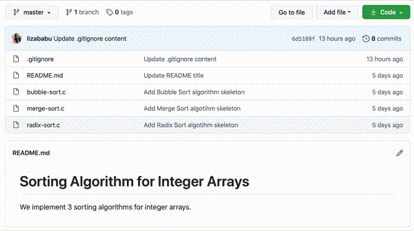
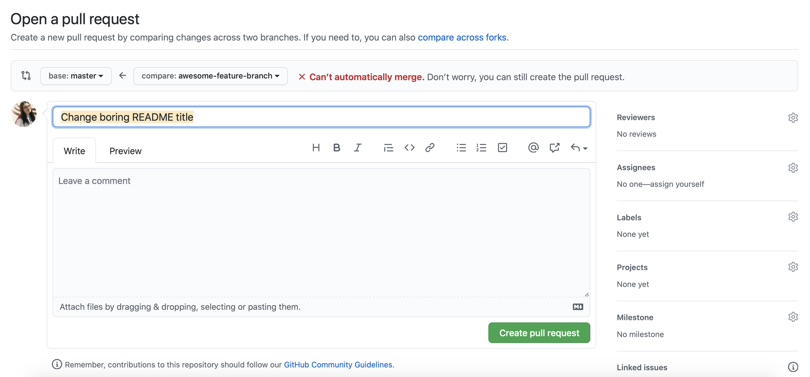
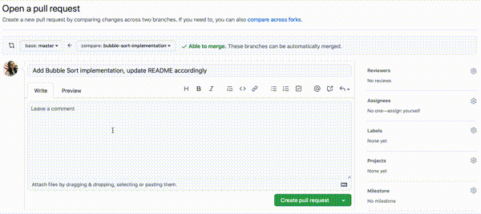
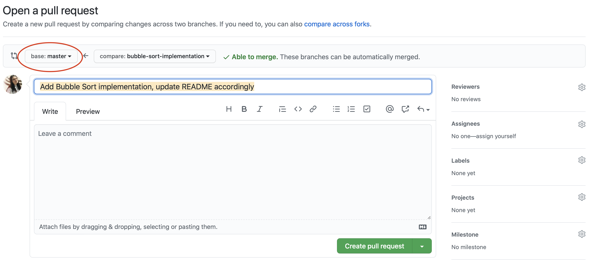
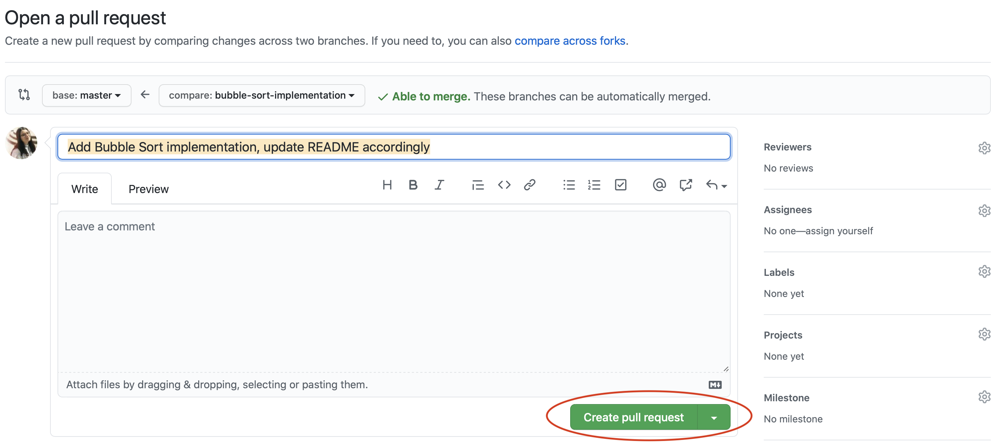
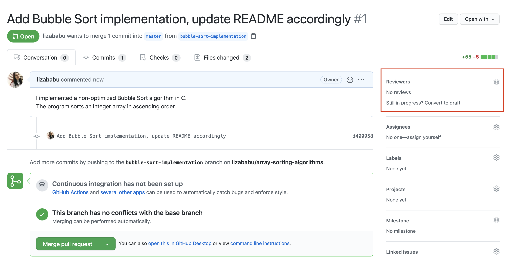
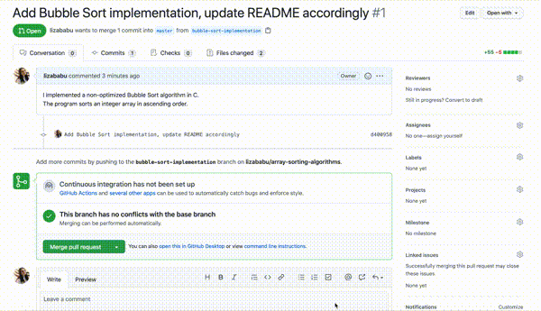
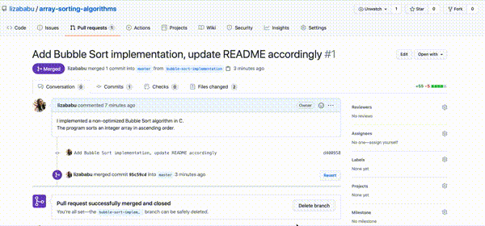

.. _app_dev_pr:

Crearea unui Pull Request (PR) pe GitHub
========================================

În momentul în care vrem să adăugăm o funcționalitate nouă unui proiect software pe GitHub este recomandat să o facem printr-un **Pull Request**, prescurtat **PR**.
Un **Pull Request** este o cerere de modificare a repository-ului.
Alți colaboratori ai proiectului vor recenza modificările și vor aproba, vor sugera schimbări sau vor respinge această cerere.
În momentul în care un Pull Request este aprobat, schimbările propuse în Pull Request pot fi integrate în proiect, adică se va putea face merge între codul sursă curent și noile modificări.

Practic, un Pull Request este o interfață GitHub de contribuit la proiecte software, interfață bazată pe lucrul cu branch-uri Git.

Spunem că deschidem un Pull Request care urmează să fie integrat într-un anumit branch.
De obicei acel branch este **master**.
În acest tutorial vom deschide un Pull Request care urmează să fie integrat în branch-ul **master**.

În secțiunea :ref:`app_dev_branches` am adus modificările de pe branch-ul **add-gitignore** pe branch-ul **master** prin operația **merge**.
În această secțiune vom integra schimbările prin intermediul unui **Pull Request** [#pull_request]_ urmând pașii din subsecțiunea :ref:`app_dev_pr_steps`.

.. note::

	Folosirea unui **Pull Request** în loc de a efectua o operație **merge** vine cu mai multe beneficii:

	#. În general, schimbările nu pot fi integrate fără ca PR-ul să fie aprobat. Aprobarea vine în mod normal de la un alt coleg de echipă.
	#. Recenzia codului sursă se face ușor pe un Pull Request. Vom vedea în secțiunea :ref:`app_dev_pr_reviewers` cum adăugăm recenzenți.

.. _app_dev_pr_steps:

Pași Pull Request
-----------------

Ca să avem o contribuție prin Pull Request, în mod uzual se urmează pașii:

#. Creăm un fork sau o clonă a repository-ului. Noi vom folosi în continuare repository-ul **array-sorting-algorithms**.
#. Creăm un branch nou.
#. Creăm un commit (sau mai multe) pe noul branch și îl publicăm pe GitHub.
#. Creăm un PR în interfața GitHub.
#. Ulterior, un maintainer al repository-ului va recenza PR-ul. Dacă e nevoie de modificări, vom face actualizări pe care le vom adăuga (prin operația **push**) din nou în branch-ul nou creat, PR-ul fiind actualizat.
#. După un număr dat de iterații, PR-ul va fi definitivat. Atunci maintainerul va integra branch-ul în **master** (operația **merge**).

În următoarele subsecțiuni vom implementa algoritmul Bubble Sort și vom modifica repository-ul ``array-sorting-algorithms`` prin intermediul unui **Pull Request**.

.. _app_dev_pr_create_branch:

Crearea unui branch nou
-----------------------

Pentru a putea deschide un Pull Request, trebuie să lucrăm pe un branch diferit față de cel în care vrem să integrăm schimbările.
Vom lucra pe un nou branch, diferit de branch-ul **master**.

Creăm un branch numit **bubble-sort-implementation** folosind comanda ``git branch``:

.. code-block:: bash

	student@uso:~/array-sorting-algorithms$ git branch
	*  master
	student@uso:~/array-sorting-algorithms$ git branch bubble-sort-implementation
	student@uso:~/array-sorting-algorithms$ git checkout bubble-sort-implementation
	Switched to a new branch 'bubble-sort-implementation'
	student@uso:~/array-sorting-algorithms$ git branch
	* bubble-sort-implementation
	master

Până la acest moment am făcut deja o serie de commituri în repository-ul nostru. 

.. code-block:: bash

	student@uso:~/array-sorting-algorithms$ git log
	commit 6d5189fd7095a19a6ad9bddb8c95491b37d9e828 (HEAD -> bubble-sort-implementation, origin/master, master)
	Author: Liza Babu <lizababu@example.com>
	Date:   Mon Sep 28 11:47:36 2020 -0700

		Update .gitignore content

	commit 988b188d2c6422a3162d1da25653f4682f7df6db
	Author: Liza Babu <lizababu@example.com>
	Date:   Mon Sep 28 02:29:00 2020 -0700

		Add .gitignore file
	(...)

Vedem același istoric de commituri și prin intermediul interfeței grafice GitHub ca în imaginea de mai jos:

În următoarea secțiune vom face încă un commit.

.. _app_dev_create_new_commit_on_branch:

Crearea unui commit pe branch-ul nou creat
------------------------------------------

Vom actualiza fișierul ``bubble-sort.c`` cu implementarea algoritmului ales.
Modificăm fișierul ``bubble-sort.c`` astfel încât conținutul său să fie următorul:

.. code-block:: c

	#include <stdio.h> 

	#define MAX_LEN 100

	static void swap(int *x, int *y)
	{ 
		int tmp = *x; 
		*x = *y; 
		*y = tmp; 
	} 

	static void bubble_sort(int *array, int len)
	{ 
		int i, j;

		for (i = 0; i < len - 1; i++)
			for (j = 0; j < len - 1; j++)  
				if (array[j] > array[j + 1]) 
					swap(&array[j], &array[j + 1]); 
	}

	static void print_array(int *array, int len)
	{
		int i;

		for (i = 0; i < len; i++) {
			printf("%d ", array[i]);
		}
		printf("\n");
	}

	int main()
	{
		int array[MAX_LEN], len, i;
		
		printf("What's the length of the array? Maximum lenght is %d\n", MAX_LEN);
		scanf("%d", &len);

		printf("Gimme the %d elements\n", len);
		for (i = 0; i < len; i++) {
		scanf("%d", &array[i]);
		}

		printf("Nonsorted array: ");
		print_array(array, len);

		bubble_sort(array, len);

		printf("Sorted array: ");
		print_array(array, len);

		return 0; 
	} 

Algoritmul de mai sus sortează crescător un vector de numere întregi citit de la tastatură.
Vrem să precizăm acest lucru și în fișierul ``README.md``.

Modificăm fișierul ``README.md`` ca să aibă conținutul de mai jos:

.. code-block:: 

	# Sorting Algorithm for Integer Arrays

	We implement 3 sorting algorithms for integer arrays.

	## Bubble Sort

	The Bubble Sort algorithm sorts the array in ascending order.

	The algorithm is implemented in C.

Creăm un **commit** cu schimbările făcute.
Adăugăm întâi modificările în zona de lucru (*staging area*) folosind comanda ``git add``:

.. code-block:: bash

	student@uso:~/array-sorting-algorithms$ git status
	On branch bubble-sort-implementation
	Changes not staged for commit:
	(use "git add <file>..." to update what will be committed)
	(use "git checkout -- <file>..." to discard changes in working directory)

		modified:   README.md
		modified:   bubble-sort.c

	no changes added to commit (use "git add" and/or "git commit -a")
	student@uso:~/array-sorting-algorithms$ git add README.md
	student@uso:~/array-sorting-algorithms$ git add bubble-sort.c
	student@uso:~/array-sorting-algorithms$ git status
	On branch bubble-sort-implementation
	Changes to be committed:
	(use "git reset HEAD <file>..." to unstage)

		modified:   README.md
		modified:   bubble-sort.c

Creăm un commit cu modificările din staging area:

.. code-block:: bash

	student@uso:~/array-sorting-algorithms$ git commit -m "Add Bubble Sort implementation, update README accordingly"
	[bubble-sort-implementation d400958] Add Bubble Sort implementation, update README accordingly
	2 files changed, 61 insertions(+), 11 deletions(-)
	rewrite bubble-sort.c (82%)

	student@uso:~/array-sorting-algorithms$ git log
	commit d400958efb8a49cd9b6050fc03783b218891d165 (HEAD -> bubble-sort-implementation)
	Author: Liza Babu <lizababu@example.com>
	Date:   Tue Sep 29 01:59:27 2020 -0700

		Add Bubble Sort implementation, update README accordingly

	commit 6d5189fd7095a19a6ad9bddb8c95491b37d9e828 (origin/master, master)
	Author: Liza Babu <lizababu@example.com>
	Date:   Mon Sep 28 11:47:36 2020 -0700

		Update .gitignore content

Acum ultimul commit din istoric pe branch-ul **bubble-sort-implementation** este *d400958efb8a49cd9b6050fc03783b218891d165*.

Publicăm commitul în repository-ul origin folosind comanda ``git push``:

.. code-block:: bash

	student@uso:~/array-sorting-algorithms$ git push origin bubble-sort-implementation
	Counting objects: 4, done.
	Delta compression using up to 2 threads.
	Compressing objects: 100% (4/4), done.
	Writing objects: 100% (4/4), 924 bytes | 924.00 KiB/s, done.
	Total 4 (delta 0), reused 0 (delta 0)
	remote: 
	remote: Create a pull request for 'bubble-sort-implementation' on GitHub by visiting:
	remote:      https://github.com/lizababu/array-sorting-algorithms/pull/new/bubble-sort-implementation
	remote: 
	To https://github.com/lizababu/array-sorting-algorithms.git
	* [new branch]      bubble-sort-implementation -> bubble-sort-implementation

Linkul ``https://github.com/{username}/array-sorting-algorithms/pull/new/bubble-sort-implementation`` este link la **Pull Request**.

În loc de ``{username}`` veți avea username-ul vostru de pe GitHub.
Pentru autorul acestui capitol este ``lizababu``.

.. _app_dev_create_pr:

Crearea Pull Requestului
------------------------

Accesăm linkul PR-ului: **https://github.com/{username}/array-sorting-algorithms/pull/new/bubble-sort-implementation**

În acest moment s-a deschis o nouă pagină care arată că în imaginea de mai jos.

Mai jos explicăm semnificația celor mai importante componente prezente în imagine.

.. _app_dev_pr_description:

Descrierea Pull Requestului
^^^^^^^^^^^^^^^^^^^^^^^^^^^

În imaginea de mai jos vedem o parte a interfeței GitHub în care putem lăsa un comentariu în care să descriem (chiar și mai în detaliu decât într-un mesaj de commit) ce schimbări am făcut. 

În cazul nostru, comentariul poate conține detalii despre implementarea algoritmului.
O descriere potrivită poate fi:

.. code-block::

	I implemented a non-optimized Bubble Sort algorithm in C.
	The program sorts an integer array in ascending order.

.. _app_dev_pr_config:

Configurarea branch-ului în care vom integra PR-ul
^^^^^^^^^^^^^^^^^^^^^^^^^^^^^^^^^^^^^^^^^^^^^^^^^^

Ca să finalizăm PR-ul, modificările din acesta trebuie să fie adăugate într-un branch, cel mai adesea în branch-ul **master** [#base_branch]_.
	
În acest tutorial vom folosi branch-ul ``master`` ca în imaginea de mai jos:

Acum creăm **Pull Requestul** apăsând pe butonul ``Create pull request`` ca în imaginea de mai jos:

.. _app_dev_pr_reviewers:

Recenzii și recenzenți
^^^^^^^^^^^^^^^^^^^^^^

Folosirea PR-urilor ne aduce un beneficiu important: putem primi feedback pe modificările aduse.
Din interfața grafică GitHub putem adăuga recenzenți care să dea feedback pe modificări.
Recenzenții fac parte din colaboratorii proiectului.

În acest tutorial nu vom adăuga recenzenți la PR-ul creat.

.. _app_dev_pr_integration:

Integrarea PR-ului
------------------

După mai multe runde de feedback și aplicarea acestuia, PR-ul va fi gata de integrat în branch-ul **master**.

.. note::

	Acest scenariu *ping-pong* se va repeta până când voi, împreună cu recenzenții, ajungeți la concluzia că schimbările pot fi integrate.

Acum vom face operația **merge** a PR-ului.
Apăsăm mai întâi butonul ``Merge pull request`` după care butonul ``Confirm merge`` ca în imaginea de mai jos.

Am făcut operația **merge** în repository-ul remote (*origin*).
Avem pe branch-ul **master** implementarea algoritmului Bubble Sort.
Actualizăm și repository-ul local folosind comanda ``git pull``:

.. code-block:: bash

	student@uso:~/array-sorting-algorithms$ git checkout master
	Switched to branch 'master'
	student@uso:~/array-sorting-algorithms$ git pull origin master
	remote: Enumerating objects: 1, done.
	remote: Counting objects: 100% (1/1), done.
	remote: Total 1 (delta 0), reused 0 (delta 0), pack-reused 0
	Unpacking objects: 100% (1/1), done.
	From https://github.com/lizababu/array-sorting-algorithms
	* branch            master     -> FETCH_HEAD
	6d5189f..95c59cd  master     -> origin/master
	Updating 6d5189f..95c59cd
	Fast-forward
	README.md     |  7 +++++++
	bubble-sort.c | 53 ++++++++++++++++++++++++++++++++++++++++++++++++-----
	2 files changed, 55 insertions(+), 5 deletions(-)

.. _app_dev_pr_delete_branch:

Ștergerea branch-ului în urma integrării în branch-ul master
------------------------------------------------------------

Odată făcută operația ``merge``, putem șterge branch-ul pe care am lucrat apăsând pe butonul ``Delete branch``.

Această operație va șterge branch-ul doar pe GitHub.
Ca să ștergem branch-ul **bubble-sort-implementation** și din repository-ul local folosim comanda ``git branch -d``:

.. code-block:: bash

	student@uso:~/array-sorting-algorithms$ git branch -d bubble-sort-implementation
	Deleted branch bubble-sort-implementation (was d400958).
	student@uso:~/array-sorting-algorithms$ git branch
	* master

În final am ajuns să integrăm modificările de pe branch-ul **bubble-sort-implementation** în branch-ul **master** prin intermediul unui **Pull Request**.
Am șters branch-ul **bubble-sort-implementation**.

.. _app_dev_pr_ex:

Exercițiu - Crearea unui PR
---------------------------

Veți folosi repository-ul ``array-sorting-algorithms`` pentru rezolvarea acestui exercțiu.

Creați un **Pull Request** urmând pașii descriși mai sus în care să adăugați algoritmul de sortare Radix Sort.
De această dată veți modifica fișierul ``radix-sort.c`` cu următorul conținut:

.. code-block:: c

	#include <stdio.h>

	#define MAX_LEN 100

	static int get_max(int array[], int n) 
	{ 
		int max = array[0]; 
		for (int i = 1; i < n; i++) 
			if (array[i] > max) 
				max = array[i]; 
		return max; 
	}

	static void count_sort(int array[], int n, int exp) 
	{ 
		int output[n];
		int i, count[10] = {0};

		for (i = 0; i < 10; i++) {
			count[i] = 0;
		}

		for (i = 0; i < n; i++) {
			count[(array[i] / exp) % 10]++;
		}

		for (i = 1; i < 10; i++) {
			count[i] += count[i - 1];
		} 

		for (i = n - 1; i >= 0; i--) { 
			output[count[(array[i] / exp) % 10] - 1] = array[i]; 
			count[(array[i] / exp) % 10]--; 
		}

		for (i = 0; i < n; i++) 
			array[i] = output[i]; 
	} 

	static void sort(int array[], int n) 
	{ 
		int m = get_max(array, n); 
	
		for (int exp = 1; m / exp > 0; exp *= 10) 
			count_sort(array, n, exp); 
	} 

	static void print_array(int *array, int len)
	{
		int i;

		for (i = 0; i < len; i++) {
			printf("%d ", array[i]);
		}
		printf("\n");
	}

	int main()
	{
		int array[MAX_LEN], len, i;
		
		printf("What's the length of the array? Maximum lenght is %d\n", MAX_LEN);
		scanf("%d", &len);

		printf("Gimme the %d elements\n", len);
		for (i = 0; i < len; i++) {
		scanf("%d", &array[i]);
		}

		printf("Nonsorted array: ");
		print_array(array, len);

		sort(array, len);

		printf("Sorted array: ");
		print_array(array, len);

		return 0; 
	}

Pe parcursul creării acestui Pull Request țineți cont de următoarele:

#. Alegeți nume relevant pentru branch-ul pe care îl veți crea.
#. Adăugați o secțiune în ``README.md`` în care să descrieți algoritmul pe care l-ați implementat (*Radix Sort*).
#. Dați un mesaj de commit și o descriere potrivită PR-ului vostru.
#. Verificați pe tot parcursul dezvoltării starea repository-ului (``git status``) și istoricul de commituri (``git log``).

Exercițiu colaborativ
---------------------------

Pentru proiecte mai mari, se generează încă de la început un branch numit 'development' pentru a păstra branch-ul principal *doar* pentru cod funcțional. De exemplu, în dezvoltarea unei aplicații, aceasta va fi dezvoltată pe branch-ul development (din care fiecare programator va lucra la funcționalități diferite, făcându-și alte branch-ul din acesta), iar, la final, când aplicația este completă, va fi încărcată printr-un Pull Request pe branch-ul principal. În viitor, dacă vor exista update-uri, se va lucra în continuare pe development, astfel încât aplicația acum lansată pe piață să fie mereu *sigură și stabilă*, branch-ul main fiind asociat și branch-ului de producție.

#. Creează cu un coleg un repository, iar în el adăugați un fișier README și un fișier sursă .c.
#. Creați-va un branch numit 'development'.
#. Din branch-ul development, implementati niște simple funcționalități (funcții de afișare, comentarii, etc...)
#. Dați push pentru a trimite commit-urile voastre către branch-urile de pe remote.
#. Faceți câte un PR pentru a adauga modificările fiecăruia și asignati-l pe colegul vostru ca 'Reviewer'.
#. După ce programul de pe branch-ul development este complet, treceți totul în branch-ul de producție 'master/main' printr-un PR.
#. Dacă apar merge conflicts, cum le rezolvați?
#. Good practice: după ce dați merge și integrați toată funcționalitatea de pe un anumit branch, este recomandat să îl ștergeți. Altfel, riscați să ajungeți la un proiect cu zeci de branch-uri printre care va veți pierde.

.. _app_dev_pr_good_practices:

Bune practici
-------------

Alternativa la a crea un **Pull Request** ar fi să lucrăm direct pe branch-ul **master**.

Așa cum am menționat și în secțiunile anterioare, este **BAD-PRACTICE** să lucrăm direct pe branch-ul **master** din mai multe motive:

#. Pe branch-ul **master** se ține întotdeauna o versiune de cod funcțională.
   Astfel, lucrul pe acest branch ar însemna să facem commituri doar atunci când o funcționalitate este finalizată.
   Altfel pe branch-ul **master** vom avea o bucată de cod neterminată care poate să afecteze întreg proiectul.
#. Lucrul pe un singur branch nu oferă posibilitatea de a da feedback pe schimbările făcute pe repository.
   Dacă nu avem posibilitatea să oferim feedback unui coleg prin intermediul GitHub, atunci vom avea nevoie să comunicăm pe un alt mediu observațiile noastre, iar ei vor trebui să creeze un nou commit pentru rezolvarea problemelor.
   Mult mai simplu este să se realizeze întreaga etapă de feedback, numită **code review**, înainte ca schimbările să apară pe **master**.
#. În unele situații nici nu vom avea drepturi să scriem pe branch-ul **master**, astfel devenind obligatoriu lucrul pe un alt branch și integrarea codului în branch-ul **master** printr-un **Pull Request**.

.. rubric:: Note de subsol

.. [#pull_request]

	https://docs.github.com/en/github/collaborating-with-issues-and-pull-requests/about-pull-requests

	https://www.atlassian.com/git/tutorials/making-a-pull-request

.. [#base_branch]

	Putem schimba acest branch prin apăsarea butonului ``base: master``.
	Vor fi afișate toate branch-urile din acest repository și vom putea alege în ce branch să integrăm PR-ul.
