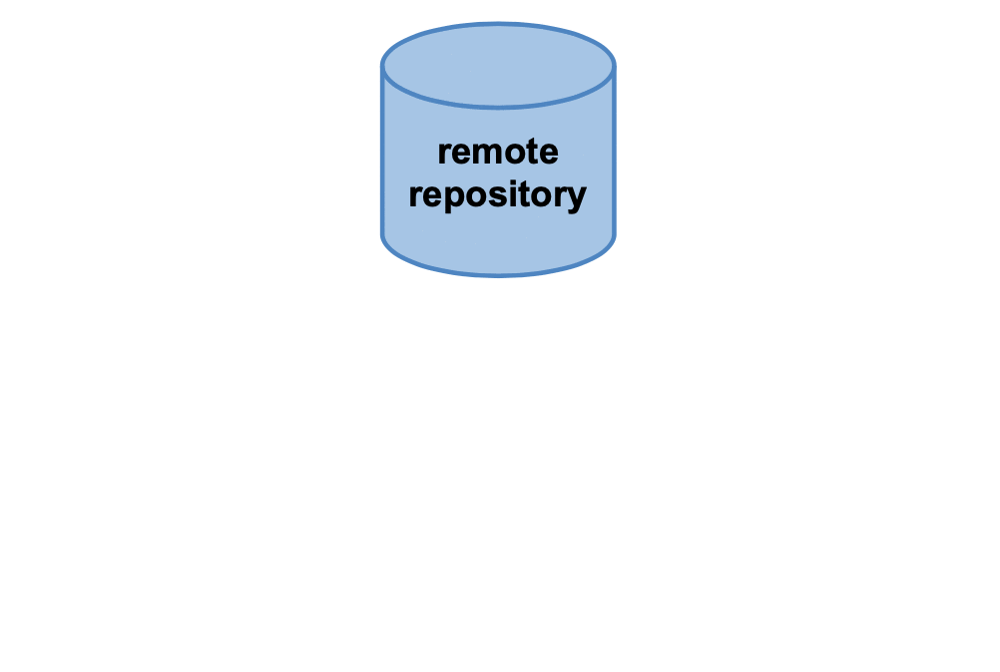

.. _app_dev_git_intro:

Introducere în Git și GitHub
============================

Vor fi cazuri când vom *strica* o versiune a codului și vom avea nevoie să revenim la o versiune corectă, caz în care un istoric de versiuni ne-ar fi de folos.
Vom putea să lucrăm la un proiect de pe un alt sistem, în afară de al nostru, sau vom vrea să cerem feedback pe codul scris de noi.

Când vorbim despre un proiect software vrem să avem dezvoltatori, oameni care să lucreze împreună cu noi la proiect.
Dezvoltatorii au nevoie de acces la codul sursă al proiectului software la care lucrăm.
După ce le dăm acces, vrem ca fiecare dezvoltator să știe la ce a lucrat și la ce lucrează ceilalți; ca să nu se suprapună, ca să ajute și ca să ofere feedback.

Pentru a putea rezolva problemele de sincronizare între doi sau mai mulți colegi de echipă care lucrează la același proiect, ne ajută să avem un **sistem de versionare a codului**, adică să avem un istoric de modificări.
Fiecare modificare înseamnă o nouă versiune a proiectului; avem astfel o listă de versiuni gestionată de sistemul de versionare a codului.
Pe lângă rezolvarea problemelor de sincronizare, versionarea codului aduce și alte avantaje cum ar fi revenirea la o versiune mai veche a proiectului, găsirea rapidă a autorului unei secvențe de cod sau, pur și simplu, organizarea unui proiect.

**Git** este un sistem de management și versionare a codului sursă care permite lucrul eficient la un proiect software.

`GitHub <http://www.github.com/>`_ este o platformă online, bazată pe Git, pe care dezvoltatorii o pot folosi pentru a stoca și versiona codul lor sursă.
Git este utilitarul folosit, iar GitHub este serverul și aplicația web pe care rulează acesta, locul în care păstrăm repository-ul remote.

.. note:: 

  Similar cu GitHub există și alte platforme precum `Bitbucket <https://bitbucket.org>`_ sau `GitLab <https://about.gitlab.com>`_.
  Comenzile pe care le vom studia se aplică pentru toate platformele care folosesc **Git**, doar interfața grafică diferă.

  În această carte vom folosi GitHub ca suport.
  În mare parte, acesta nu diferă foarte mult de alte platforme.

.. _app_dev_create_github_account:

Crearea unui cont pe GitHub (dacă nu aveți deja)
------------------------------------------------

Înainte de toate, ne asigurăm că avem cont pe GitHub.
Dacă aveți deja un cont pe GitHub, puteți trece la subsecțiunea următoare: :ref:`app_dev_git_setup`.

Dacă nu aveți cont, intrați pe `GitHub <http://www.github.com/>`_.
Pagina de pornire va arăta similar cu cea din imaginea de mai jos.

Introduceți un nume de utilizator (*username*), adresa voastră de e-mail și o parolă sigură pentru cont.
Pentru validarea contului, accesați-vă căsuța de e-mail.
Acolo veți găsi un e-mail în care vi se explică cum se poate valida noul cont creat.
Verificați și căsuța **spam** în caz că nu ați primit nimic în inbox.

.. admonition:: **GitHub Student Pack**

  GitHub oferă studenților numeroase beneficii care în mod normal sunt contra cost (plătite). 
  Găsiți mai multe detalii pe `site-ul oficial <https://education.github.com/pack>`_.

.. _app_dev_git_setup:

Pregătirea inițială a mediului Git
----------------------------------

Ca să utilizăm Git, facem în primă fază niște pași de configurare. Adică vom configura numele și e-mail-ul nostru, ca mai jos:

.. code-block:: bash

    student@uso:~$ git config --global user.name "Prenume Nume"
    student@uso:~$ git config --global user.email "adresa_de_email@example.com"

În listingul de mai sus "Prenume Nume" și "adresa_de_email@example.com" sunt placeholdere.
Le înlocuiți cu datele voastre.  
De exemplu, pentru autorul acestei secțiuni, comenzile rulate sunt:

.. code-block:: bash

    student@uso:~$ git config --global user.name "Liza Babu"
    student@uso:~$ git config --global user.email "lizababu@example.com"

.. _app_dev_create_first_repo:

Crearea primului repository
---------------------------

Pentru a lucra la un proiect software, creăm un **repository software**.
Vom crea unul pe GitHub, unul local, după care le vom interconecta.

.. admonition:: **Repository software**

  Proiectul este stocat într-un **repository software**.
  Repository-ul conține fișierele proiectului: codul sursă, fișiere de configurare.
  De obicei acesta vine însoțit și de un fișier **README.md** în care se găsesc informații despre proiect: care este scopul proiectului, cum se compilează, pe ce platforme rulează.

  Repository-urile sunt de două tipuri: **locale** și **remote**.
  Acestea pot fi interconectate și să refere de fapt același proiect.
  Repository-ul local este cel pe care îl avem la noi pe calculator, pe când cel remote este unul stocat pe un server (în cazul nostru **GitHub**).
  Este doar o diferență de perspectivă între cele două, ele nu diferă din punct de vedere tehnic.
  De obicei, într-un proiect Git / GitHub există un repository central (remote) și mai multe repository-uri secundare (locale), câte unul pentru fiecare dezvoltator din echipa proiectului.

  Printre cele mai importante operații cu un repository sunt: **init**, **fork**, **clone**.
  Vom detalia aceste operații când le vom folosi în acest capitol.

.. _app_dev_create_github_repo:

Crearea unui repository gol pe GitHub 
^^^^^^^^^^^^^^^^^^^^^^^^^^^^^^^^^^^^^

Ne autentificăm pe GitHub.
Urmărim pașii prezentați în imaginea de mai jos și explicați imediat după.

.. figure:: ./gifs/GitHub-create-repo.gif
  :alt: Crearea unui repository nou pe GitHub

#. Apăsăm pe săgeată din meniul din dreapta sus și vedem ceva similar cu imaginea de mai sus.

#. Apăsăm pe ``Your profile`` pentru a merge pe profilul nostru.
   Aici este locul în care vom putea vedea contribuțiile noastre pe GitHub.
   În partea de sus a ecranului vom vedea un meniu orizonatal care conține 4 opțiuni: ``Overview``, ``Repositories``, ``Projects`` și ``Packages``.

#. Apăsăm pe ``Repositories``.
   Acum vom vedea întreaga listă de repository-uri pe care le avem. Pentru a crea unul nou, apăsăm pe butonul verde din dreapta sus pe care scrie ``New``.

#. Acum este momentul în care vom da un nume proiectului nostru, o descriere succintă a acestuia și vom putea decide dacă să fie **public** (vizibil tuturor utilizatorilor) sau **privat** (vizibil doar pentru noi și eventualii colaboratori ai proiectului).
   Ne va apărea un formular similar cu cel din imaginea de mai sus.
   Pentru acest tutorial vom crea un repository **public**.
   Este indicat ca numele repository-ului să descrie bine proiectul, în cazul nostru ``array-sorting-algorithms``.
   Descrierea proiectului este opțională, dar e recomandat să o adăugăm pentru a fi ușor de înțeles pentru cei care vor ajunge la proiectul nostru.

#. Apăsăm pe ``Create repository``.
   Vor apărea câteva instrucțiuni pentru crearea unui repository local nou și conectarea celui nou cu cel remote.
   Acest lucru este acoperit în secțiunile următoare.

Acum avem un repository creat remote, pe GitHub, numit ``array-sorting-algorithms``.

.. _app_dev_create_local_repo:

Crearea unui repository gol local
^^^^^^^^^^^^^^^^^^^^^^^^^^^^^^^^^

Creăm un director din ierarhia de fișiere în care vom inițializa repository-ul Git.

În acest tutorial creăm directorul ``array-sorting-algorithms`` în directorul home (adică ``/home/student`` sau ``~``), folosind comenzile de mai jos:

.. code-block:: bash

    student@uso:~$ pwd
    /home/student
    student@uso:~$ mkdir array-sorting-algorithms
    student@uso:~$ cd array-sorting-algorithms
    student@uso:~/array-sorting-algorithms$ git init
    Initialized empty Git repository in /home/student/array-sorting-algorithms/.git/
    student@uso:~/array-sorting-algorithms$ ls -a
    ./    ../   .git/

Mai sus am inițializat repository-ul local prin comanda ``git init``, dată în directorul ales (``array-sorting-algorithms``) din directorul home al utilizatorului student (``/home/student``).

Acum avem un repository creat local, numit ``array-sorting-algorithms``.

.. admonition:: **Init**

  Operația **init** este una locală și are rolul de a inițializa un repository gol, local.
  Inițializarea repository-ului local înseamnă crearea, în directorul ales, a mediului pentru a putea lucra la un proiect software versionat Git.
  Această operare duce la crearea unui director numit ``.git`` în care se vor ține ulterior date suplimentare despre repository, numite **metadatele** repository-ului.

  Am folosit opțiunea ``-a`` (``ls -a``) pentru a afișa și fișierele și directoarele ascunse.
  Directorul ``.git`` este un director ascuns.

.. _app_dev_connect_repos:

Conectarea celor două repository-uri
^^^^^^^^^^^^^^^^^^^^^^^^^^^^^^^^^^^^

Am creat până în acest moment un repository local și unul remote.
Trebuie să le interconectăm pentru a lucra cu ele.

În cazul în care suntem mai mulți membri în echipă, fiecare membru va conecta repository-ul său local, la repository-ul remote.
Pentru conectarea celor două repository-uri folosim comanda de mai jos, dată în directorul unde este repository-ul local Git (în cazul nostru ``/home/student/array-sorting-algorithms``):

.. code-block:: bash

    student@uso:~/array-sorting-algorithms$ git remote add origin https://github.com/{username}/array-sorting-algorithms.git

În comanda de mai sus ``{username}`` este numele utilizatorului nostru de pe GitHub.
De exemplu, pentru autorul acestui capitol, ``{username}`` se înlocuiește cu ``lizababu``.

Conectarea celor două repository-uri înseamnă setarea repository-ului ``origin``, adică repository-ului remote la care se conectează cel local.

Imaginea de mai jos arată cum arată cum se contectează repository-urile **remote** și **local**.
Sincronizarea lor se face prin intermediul operațiilor **push** și **pull** care sunt prezentate pe parcursul secțiunii :ref:`app_dev_first_commits`.

