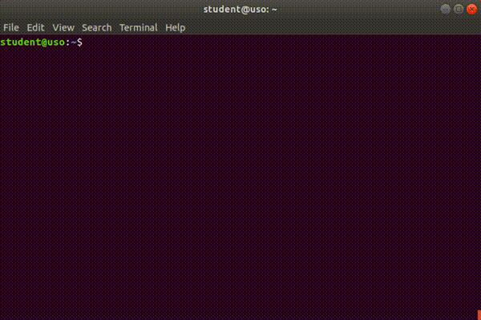

.. _app_dev_compile_source_file:

Compilarea unui fișier cod sursă C
==================================

În această secțiune urmărim să învățăm pașii pentru a compila un program, adică a-l aduce de la cod sursă la executabil.
Pentru aceasta vom crea un program care verifică dacă un număr citit de la tastatură este prim sau nu.

Pașii pe care îi vom face sunt:
* vom scrie într-un nou fișier cu extensia .c programul care implementează algoritmul
* vom compila codul sursă folosind `compilatorul GCC <https://gcc.gnu.org>`_ 
* vom testa că programul funcționează.

.. _app_dev_create_source_file:

Crearea unui fișier cod sursă
-----------------------------

Creăm un fișier nou cu numele ``is-prime.c`` cu implementarea algoritmului de verificare.
Copiem codul sursă de mai jos și îl lipim în nano ca în imaginea de mai jos:

.. code-block:: c

    #include <stdio.h>

    int check_if_prime(int n)
    {
        int i;

        for (i = 2; i < n / 2; i++) {
            if (n % i == 0) {
                return 0;
            }
        }

        return 1;
    }

    int main(void)
    {
        int n;

        printf("Please gimme a number: ");
        scanf("%d", &n);
        
        if (check_if_prime(n)) {
            printf("%d is prime\n", n);
        } else {
            printf("%d is not prime\n", n);
        }

        return 0;
    }

Mai multe detalii despre folosirea editorului de text ``nano`` găsim în capitolul *Lucrul cu fișiere*.

.. _app_dev_compile_aout:

Compilarea codului sursă în executabilul ``a.out``
--------------------------------------------------

Avem fișierul cod sursă ``is-prime.c`` și vrem să obținem un program pe care să-l rulăm pe sistemul nostru.
Pentru aceasta, trebuie să compilăm fișierul ``is-prime.c``.
Acest program este de fapt un **executabil** (*fișier binar*).
Executabilele sunt fișiere care conțin instrucțiuni pe care sistemul de calcul le poate interpreta și rula.

Creăm un executabil din fișierul ``is-prime.c`` folosind comanda ``gcc``: Astfel invocăm compilatorul GCC(GNU Compiler Collection) instalat anterior și îi dăm ca argument numele fișierului dorit.

.. code-block:: bash

    student@uso:~$ gcc is-prime.c 
    student@uso:~$ ls -l
    total 16
    -rwxr-xr-x 1 student student 8448 Oct 26 06:34 a.out
    -rw-r--r-- 1 student student  406 Oct 26 06:17 is-prime.c

Așa cum vedem în rezultatul rulări comenzii ``ls -l`` de mai sus, executabilul se numește ``a.out``.
Acesta este numele **implicit** dat de GCC.
Adică ``a.out`` va fi numele tuturor fișierelor executabile generate cu GCC, indiferent de fișierul cod sursă.
Verificăm că fișierul ``a.out`` este într-adevăr un fișier executabil:

.. code-block:: bash

    student@uso:~$ file a.out 
    a.out: ELF 64-bit LSB shared object, x86-64, version 1 (SYSV), dynamically linked, interpreter /lib64/l, for GNU/Linux 3.2.0, BuildID[sha1]=14553360a84b6dbe4dba5f287a665047572bde7f, not stripped

Acronimele **ELF** (*Executable and Linkable Format) și **LSB** (*Linux Standard Base*) nu sunt relevante în această carte, dar reținem că atunci când vedem un fișier **ELF**, acesta este un fișier *executabil*.

Rulăm executabilul ``a.out`` în felul următor și introducem de la tastatură un număr:

.. code-block:: bash

    student@uso:~$ ./a.out
    Please gimme a number: 13
    13 is prime

Programul funcționează: citește un număr de la tastatură și afișează dacă acesta este prim sau nu.

.. _app_dev_compile_custom:

Compilarea codului sursă într-un executabil cu nume diferit
-----------------------------------------------------------

Numele ``a.out`` este implicit, deci toate programele compilate cu GCC se vor numi ``a.out``.
Putem configura un nume diferit pentru executabilul obținut.

Spre exemplu, pentru programul care verifică dacă un număr este prim sau nu, numim executabilul ``is-prime``.
Creăm un executabil cu numele ``is-prime`` din fișierul ``is-prime.c`` folosind opțiunea ``-o`` a comenzii ``gcc``:

.. code-block:: bash

    student@uso:~$ gcc -o is-prime is-prime.c 
    student@uso:~$ ls -l
    total 28
    -rwxr-xr-x 1 student student 8448 Oct 26 06:34 a.out
    -rwxr-xr-x 1 student student 8448 Oct 26 06:57 is-prime
    -rw-r--r-- 1 student student  406 Oct 26 06:17 is-prime.c
    student@uso:~$ file is-prime
    is-prime: ELF 64-bit LSB shared object, x86-64, version 1 (SYSV), dynamically linked, interpreter /lib64/l, for GNU/Linux 3.2.0, BuildID[sha1]=14553360a84b6dbe4dba5f287a665047572bde7f, not stripped

Opțiunea ``-o`` urmată de numele ales pentru program (``is-prime``) transmite compilatorului ca programul să se numească ``is-prime``, și nu ``a.out``.
Rulăm executabilul ``is-prime`` în felul următor și introducem de la tastatură un număr:

.. code-block:: bash

    student@uso:~$ ./is-prime
    Please gimme a number: 13
    13 is prime

Vedem că, deși au nume diferit, programele ``a.out`` și ``is-prime`` au același comportament.
Acest lucru este normal deoarece ele sunt 2 fișiere executabile obținute din același fișier cod sursă obținute folosind același compilator: GCC.

.. _app_dev_make_intro_ex:

Exerciții
---------

#. Creați un fișier cu numele ``is-palindrome.c`` care să conțină următorul conținut:

   .. code-block:: c

    #include <stdio.h>

    int check_if_palindrome(int n)
    {
        int new_n = 0;

        while (n > 0) {
            int r = n % 10;
            n /= 10;
            new_n = new_n * 10 + r;
        }

        return (new_n == n) ? 1 : 0;
    }

    int main(void)
    {
        int n;

        printf("Please gimme a number: ");
        scanf("%d", &n);
        
        if (check_if_palindrome(n)) {
            printf("%d is a palindome\n", n);
        } else {
            printf("%d is not a palindrome\n", n);
        }

        return 0;
    }

#. Compilați fișierul ``is-palindrome.c`` într-un executabil cu numele ``a.out`` folosind ``gcc``.
   Verificați funcționalitatea programului.
#. Compilați fișierul ``is-palindrome.c`` într-un executabil cu numele ``is-palindrome`` folosind ``gcc``.
   Verificați funcționalitatea programului.
   