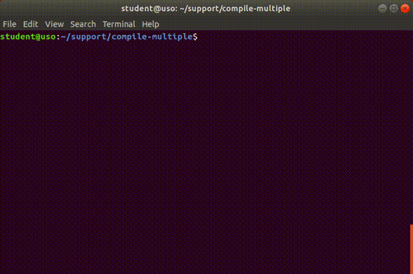

.. _app_dev_compile_multiple_files:

Compilarea unui program din fișiere multiple
============================================

În secțiunea anterioară, :ref:`app_dev_compile_source_file`, am creat și am compilat un sigur fișier cod sursă C, ``is-prime.c``.

În această secțiune vom compila un program pornind de la mai multe fișiere cod sursă și fișiere header.
Mai exact, vom crea un program care afișează factorialul și inversul unui număr întreg.

.. _app_dev_inspect_files:

Inspectarea fișierelor
----------------------

Afișăm conținutul directorului ``support/compile-multiple``, folosind comanda ``ls``:

.. code-block:: bash

    student@uso:~$ ls support/compile-multiple
    algorithms.c  algorithms.h  main.c

``main.c`` este fișier cod sursă și conține funcția ``main`` din care pornim logica programului.

``algorithms.h`` este fișier *header* (cu extensia ``.h``), conține **declarația** (*antetul*) funcției ``factorial``:  ``unsigned factorial(int n);``.

``algorithms.c`` este fișier cod sursă și conține **definiția** (*implementarea*) funcției ``factorial``.

**Exercițiu:** Verificați conținutul fișierelor ``main.c``, ``algorithms.c`` și ``algorithms.h`` folosind comanda ``cat``, pagerul ``less`` sau editorul ``nano``.

.. _app_dev_compile_multiple_sources:

Compilarea programului din surse multiple
-----------------------------------------

Ne plasăm în directorul ``support/compile-multiple`` folosind comanda ``cd``:

.. code-block:: bash

    student@uso:~$ cd support/compile-multiple
    student@uso:~/support/compile-multiple$ ls
    algorithms.c  algorithms.h  main.c

Compilăm fișierele ``algorithms.c`` și ``main.c`` într-un singur program numit ``algorithms`` folosind comanda ``gcc``:

.. code-block:: bash

    student@uso:~/support/compile-multiple$ gcc -o algorithms main.c algorithms.c
    student@uso:~/support/compile-multiple$ ls
    algorithms  algorithms.c  algorithms.h  main.c

Acum GCC a compilat ambele fișiere cod sursă (``main.c`` și ``algorithms.c``), le-a legat, și a creat fișierul executabil ``algorithms``.
Rulăm programul ``algorithms`` ca mai jos:

.. code-block:: bash

    student@uso:~/support/compile-multiple$ ./algorithms 
    gimme number and i'll give you factorial: 12
    12! = 479001600

Acum, de fiecare dată când modificăm fișierul ``main.c``, compilatorul va trece iar prin etapa de compilare pentru ambele fișiere cod sursă, chiar dacă ``algorithms.c`` nu a fost și el modificat; la fel și vice-versa.
Acest lucru este ineficient atunci când lucrăm la un proiect mai mare, unde etapa de compilare durează mult [#compile_linux_kernel]_.
În secțiunea următoare, :ref:`app_dev_object_files`, vedem cum scăpăm de această problemă.

Ștergem fișierul ``algorithms`` ca să avem directorul curat, folosind comanda ``rm``.

.. code-block:: bash

    student@uso:~/support/compile-multiple$ rm algorithms
    student@uso:~/support/compile-multiple$ ls
    algorithms.c  algorithms.h  main.c

Vom reface executabilul ``algorithms`` în secțiunea :ref:`app_dev_object_files`.

.. _app_dev_object_files:

Fișiere obiect
--------------

Ca să evităm recompilarea fișierelor cod sursă care nu au fost modifcate, putem să *descompunem* etapa de compilare în 2 părți:

#. Compilarea tuturor fișierelor cod sursă (*fișiere cu extensia .c*) până la **fișiere obiect** (*fișiere cu extensia .o*)
#. Legarea fișierelor obiect într-un *executabil*.

Diagrama de mai jos descrie aceste două etape:

.. ditaa::

    +--------+           +--------+
    | cBLU   |     1     | cYEL   |
    | main.c |---------->+ main.o +---------+ 
    |        |           |        |         |     +------------+
    |     {d}|           |     {d}|         |  2  |            |
    +--------+           +--------+         +---->| algorithms |
                                            |     |            |
    +--------------+     +--------------+   |     | cGRE       |
    | cBLU         |  1  | cYEL         |   |     +------------+
    | algorithms.c |---->+ algorithms.o +---+
    |              |     |              |
    |           {d}|     |           {d}|
    +--------------+     +--------------+

.. note::

    Pașii 1 reprezintă pașii de compilare, iar pasul 2 este pas de legare.

Astfel, executabilul final depinde doar de fișierele obiect.
Fiecare fișier obiect depinde de fișierul cod sursă asociat (``main.o`` de ``main.c`` și ``algorithms.o`` de ``algorithms.c``).
Atunci când vom modifica fișierul ``main.c``, vom regenera doar fișierul obiect ``main.o``.
Nu este nevoie să regenerăm fișierul ``algorithms.o`` pentru că ``algorithms.c`` nu a fost modificat. 

În subsecțiunile următoare vom compila fișierele sursă, ``main.c`` și ``algorithms.c``, în fișiere obiect și le vom lega astfel încât, în final, vom obține executabilul ``algorithms``.

.. _app_dev_compile_to_object_files:

Compilarea fișierelor cod sursă în fișiere obiect
^^^^^^^^^^^^^^^^^^^^^^^^^^^^^^^^^^^^^^^^^^^^^^^^^

În această subsecțiune vom trece prin pasul ``1`` din diagrama din secțiunea :ref:`app_dev_object_files`, adică pașii de *compilare*.

Compilăm fișierul ``main.c`` într-un fișier obiect ``main.o`` folosind opțiunea ``-c`` a comenzii ``gcc``:

.. code-block:: bash

    student@uso:~/support/compile-multiple$ gcc -c main.c
    student@uso:~/support/compile-multiple$ ls
    algorithms.c  algorithms.h  main.c  main.o

Opțiunea ``-c`` compilează fișierul cod sursă ``main.c`` într-un fișier obiect ``main.o``.

Facem același lucru pentru ``algorithms.c``:

.. code-block:: bash

    student@uso:~/support/compile-multiple$ gcc -c algorithms.c
    student@uso:~/support/compile-multiple$ ls
    algorithms.c  algorithms.h  algorithms.o  main.c  main.o

Acum avem 2 fișiere obiect, ``main.o`` și ``algorithms.o``, pe care urmează să le legăm și să formăm executabilul ``algorithms``.

.. _app_dev_link_object_files:

Legarea fișierelor obiect într-un fișier executabil
^^^^^^^^^^^^^^^^^^^^^^^^^^^^^^^^^^^^^^^^^^^^^^^^^^^

În această subsecțiune vom trece prin pasul ``2`` din diagrama din secțiunea :ref:`app_dev_object_files`, adică pasul de *legare*.

Acum că avem 2 fișiere obiect, trebuie să le legăm pentru a obține executabilul final.
Legăm fișierele obiect ``main.o`` și ``algorithms.o`` folosind comanda ``gcc``:

.. code-block:: bash

    student@uso:~/support/compile-multiple$ gcc -o algorithms main.o algorithms.o
    student@uso:~/support/compile-multiple$ ls
    algorithms  algorithms.c  algorithms.h  algorithms.o  main.c  main.o

Am creat executabilul final ``algorithms`` din 2 fișiere obiect.
Rulăm executabilul și vedem că are același comportament ca în secțiunea :ref:`app_dev_compile_multiple_sources`:

.. code-block:: bash

    student@uso:~/support/compile-multiple$ ./algorithms 
    gimme number and i'll give you factorial: 12
    12! = 479001600

Ștergem fișierul ``algorithms`` folosind comanda ``rm``:

.. code-block:: bash

    student@uso:~/support/compile-multiple$ rm algorithms
    student@uso:~/support/compile-multiple$ ls
    algorithms.c  algorithms.h  algorithms.o    main.c  main.o

Plecând de la 2 fișiere obiect, ``main.o`` și ``algorithms.o``, am obținut același executabil ``algorithms``.

Știind cum compilăm individual 2 fișiere cod sursă, vedem în secțiunea următoare, :ref:`app_dev_modify_recompile`, beneficiile compilării incrementale.
Recompilăm *doar* fișierele care au fost modificate de la ultima compilare și refacem executabilul prin legarea fișierelor obiect vechi (nemodificate de la ultima compilare) cu cele noi (recompilate după modificarea fișierelor cod sursă).

.. _app_dev_modify_recompile:

Modificarea fișierelor sursă și recompilarea lor
^^^^^^^^^^^^^^^^^^^^^^^^^^^^^^^^^^^^^^^^^^^^^^^^

În continuare, vedem care sunt avantajele compilării incrementale, în care unele operații de compilare nu au loc.

Modificăm fișierul ``main.c``, îl recompilăm într-un fișier obiect ``main.o``.
Fișierul ``algorithms.o`` rămâne nemodificat.
Legăm noul fișier ``main.o`` cu vechiul fișier ``algorithms.o`` pentru a obține un nou executabil ``algorithms``.

Adăugăm linia ``printf("%d! = %u\n", n + 1, factorial(n + 1));`` în fișierul ``main.c``, ca în imaginea de mai jos:

Compilăm fișierul ``main.c`` într-un fișier obiect ``main.o`` folosind ``gcc``:

.. code-block:: bash

    student@uso:~/support/compile-multiple$ gcc -c main.c
    student@uso:~/support/compile-multiple$ ls
    algorithms.c  algorithms.h  algorithms.o    main.c  main.o

Legăm fișierele obiect ``main.o`` și ``algorithms.o`` folosind comanda ``gcc``:

.. code-block:: bash

    student@uso:~/support/compile-multiple$ gcc -o algorithms main.o algorithms.o
    student@uso:~/support/compile-multiple$ ls
    algorithms  algorithms.c  algorithms.h  algorithms.o  main.c  main.o

Am creat executabilul final ``algorithms`` din 2 fișiere obiect, fără să recompilăm fișierul ``algorithms.c`` (care nu a fost modificat).

Rulăm executabilul ``algorithms``, ca mai jos:

.. code-block:: bash

    student@uso:~/support/compile-multiple$ ./algorithms 
    gimme number and i'll give you factorial: 10
    10! = 3628800
    11! = 39916800

Am văzut în această secțiune cum compilăm eficient un program din mai multe fișiere cod sursă.
Concret, am compilat fișierele ``main.c`` și ``algorithms.c``, independent unul față de celălalt, în fișierele obiect ``main.o`` și ``algorithms.o``, le-am legat, și am creat executabilul ``algorithms``.

.. _app_dev_make_multiple_ex:

Exerciții
---------

#. Mergeți în directorul ``~/support/compile-multiple-ex``.
#. Inspectați fișierele ``main.c`` și ``lottery.c``.
#. Compilați fișierul cod sursă ``main.c`` în fișierul obiect ``main.o``.
#. Compilați fișierul cod sursă ``lottery.c`` în fișierul obiect ``lottery.o``.
#. Legați fișierele obiect ``main.o`` și ``lottery.o`` în executabilul ``lottery``.
#. Verificați că funcționează executabilul ``lottery``. 

.. rubric:: Note de subsol

.. [#compile_linux_kernel]

    Compilarea `nucleului Linux <https://github.com/torvalds/linux>`_ durează, în general, mult.
    https://ubuntuforums.org/showthread.php?t=650461