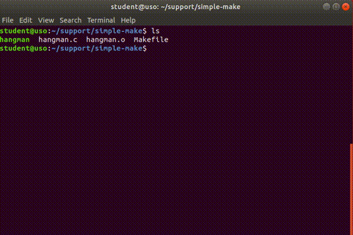

.. _app_dev_simple_make:

Introducere în utilitarul Make și fișiere Makefile
==================================================

În secțiunile anterioare, am compilat fișiere cod sursă C folosind compilatorul GCC.
Dezvoltarea unui program este un proces *continuu*, nu scriem tot codul dintr-o singură iterație și de multe ori ajungem să îl modificăm pe parcurs.
Vrem să testăm schimbările aduse în program.
Pentru aceasta trebuie să *recompilăm* fișierul pe care l-am modificat și să creăm un nou executabil.

Automatizarea procesului de compilare ne ajută să fim eficienți atunci când dezvoltăm un proiect.
În loc să dăm de fiecare dată toate comenzile pentru recompilarea fișierelor, putem să dăm o singură comandă care să le facă pe toate.
Acest proces se numește *build automation*.
Există mai multe soluții de build automation [#build_automation]_.
În această carte vom folosi utilitarul `Make <https://linux.die.net/man/1/make>`_ împreună cu fișiere `Makefile <https://www.gnu.org/software/make/manual/make.html#Makefiles>`_ ca să automatizăm procesul de compilare.

În secțiunile următoare vom vedea cum funcționează utilitarul Make și cum arată un fișier Makefile.
După, vom crea un fișier Makefile pentru un proiect dat.

.. _app_dev_use_makefile:

Folosirea unui Makefile existent
--------------------------------

În această secțiune vom compila programul `Hangman <https://rextester.com/WYT71966>`_ folosind un fișier Makefile.

Întrăm în directorul ``~/support/simple-make`` folosind comanda ``cd``:

.. code-block:: bash

    student@uso:~$ cd ~/support/simple-make
    student@uso:~/support/simple-make$ ls
    hangman.c  Makefile

Avem în director un fișier cod sursă C, ``hangman.c``, și un fișier Makefile.
Ca să compilăm programul, folosim comanda ``make``:

.. code-block:: bash

    student@uso:~/support/simple-make$ make
    gcc -c hangman.c
    gcc -o hangman hangman.o
    student@uso:~/support/simple-make$ ls
    hangman  hangman.c  hangman.o  Makefile

Comanda ``make`` a rulat, de fapt, 2 comenzi:

#. De *compilare*: ``gcc -c hangman.c``, comandă prin care am creat fișierul obiect ``hangman.o``
#. De *legare*: ``gcc -o hangman hangman.o``, comandă prin care am creat executabilul ``hangman``.

Practic, scriind doar comanda ``make``, am trecut fișierul ``hangman.c`` prin toate etapele compilării și am obținut executabilul final, așa cum am făcut în secțiunea :ref:`app_dev_compile_multiple_sources` pentru fișierele ``main.c`` și ``algorithms.c``.

Rulăm executabilul ``hangman`` ca să vedem că funcționează, ca în imaginea de mai jos:

.. _app_dev_understand_makefile:

Înțelegerea formatului Makefile
-------------------------------

În secțiunea anterioară, :ref:`app_dev_use_makefile`, am folosit fișierul ``Makefile`` ca să compilăm programul Hangman.
Ca să putem crea un Makefile pentru un proiect al nostru, trebuie să înțelegem formatul fișierului Makefile.
În această secțiune vom folosi fișierul Makefile pe care l-am folosit anterior ca suport.

Fișierul ``Makefile`` folosit la programul Hangman are următorul conținut:

.. code-block:: 

    all: hangman

    hangman: hangman.o
        gcc -o hangman hangman.o

    hangman.o: hangman.c
        gcc -c hangman.c

    clean:
        rm -rf *.o hangman

Liniile din fișier sunt de două tipuri:

#. **Regulă**, care are formatul ``regulă: <dependență>`` (``all: hangman`` sau ``clean:``). Regula trebuie să existe, dependența este opțională. Vom explica ce este o dependentă în secțiunea :ref:`app_dev_dependency_makefile`
#. **Comandă**, care începe cu un ``Tab`` la începutul rândului, urmat de o comandă (``gcc -o hangman hangman.o``).

O *regulă* din fișierul Makefile este, de fapt, un nume asociat unei *comenzi*. Spunem că rulăm *regula* ``clean`` atunci când vrem să executăm *comanda* ``rm -rf *.o hangman``.
În terminal, facem acest lucru folosind comanda ``make`` urmată de numele regulii, în acest caz ``make clean``:

.. code-block:: bash

    student@uso:~/support/simple-make$ make clean
    rm *.o hangman
    student@uso:~/support/simple-make$ ls
    hangman.c   Makefile

.. _app_dev_create_first_makefile:

Crearea primului Makefile
-------------------------

În această secțiune vom crea un Makefile pentru programul TODO. Scopul final este să avem un target pentru compilare și unul pentru curățarea directorului sursă.

.. _app_dev_add_all_target_makefile:

Adăugarea targetului all
^^^^^^^^^^^^^^^^^^^^^^^^

În directorul TODO avem fișierul cod sursă TODO:

.. code-block:: bash

    student@uso: cd TODO
    student@uso:$ ls
    TODO

Creăm un fișier numit `Makefile` în care vom scrie primul target: `all` care trebuie să compileze codul sursă:

.. code-block:: bash

    student@uso: touch Makfile
    student@uso: cat Makefile
    TODO

Ne asigurăm că Makefile-ul funcționează corect:

.. code-block:: bash

    student@uso: make all
    TODO
    student@uso: ./TODO
    TODO

.. _app_dev_add_clean_target_makefile:

Adăugarea targetului clean
^^^^^^^^^^^^^^^^^^^^^^^^^^

Targetul `clean` este folositor pentru a șterge fișierele generate în urma procesului de compilare. Aceste fișiere sunt de obicei executabile și fișiere obiect, dar nu se limitează la acestea.
Adăugăm targetul `clean` la fișierul `Makefile` creat anterior.

.. code-block:: bash

    student@uso: cat Makefile
    TODO

Testăm că regula funcționează corect.

.. code-block:: bash

    student@uso: ls
    TODO
    student@uso: make clean
    TODO
    student@uso: ls
    TODO

.. _app_dev_other_names_makefile:

Fișiere Makefile cu alte nume
-----------------------------

Fișierele `Makefile` au în general numele `Makefile`, însă, într-un proiect mai mare pot exista mai multe fișiere Makefile în același loc, și deci vrem să le diferențiem. Facem asta dându-le câte un nume unic.
Utilitarul `make` se uită, predefinit, după fișiere numite `GNUmakefile`, `makefile`, și `Makefile`. Pentru a putea avea un fișier Makefile cu nume propriu, folosim opțiunea `make -f`.

Redenumim fișierul `Makefile` anterior în `Makefile.TODO` și compilăm din nou codul sursă:

.. code-block:: bash

    student@uso: mv Makefile mv Makefile.TODO
    TODO
    student@uso: make -f 
    TODO
    student@uso: ./TODO
    TODO

Observăm că efectul compilării este același.

.. _app_dev_add_target_for_object_files_makefile:

Adăugarea de targeturi pentru crearea fișierelor obiect
-------------------------------------------------------

Am văzut în secțiunea :ref:`app_dev_use_makefile` că atunci când am compilat codul sursă pentru jocul Hangman, acesta a trecut mai întâi prin etapa de cod obiect și abia după am obținut fișierul executabil.

Pentru a face acest lucru pentru proiectul TODO, vom crea mai întâi targeturi pentru crearea fișierelor obiect în fișierul Makefile. Creăm targetul `TODO.o` care are scopul de a compila fișierul `TODO.c` până în stadiul de fișier obiect.
La fel facem și pentru celelalte fișiere cod sursă din proiect.

.. code-block:: bash

    student@uso: cat Makefile
    TODO

Creăm fișierele obiect pentru fiecare cod sursă în parte:

.. code-block:: bash

    student@uso: make TODO.o
    TODO

.. _app_dev_update_build_target_makefile:

Modificarea targetului de creare a executabilului
^^^^^^^^^^^^^^^^^^^^^^^^^^^^^^^^^^^^^^^^^^^^^^^^^

Acum că avem targeturi pentru creearea fișierelor obiect, trebuie să modificăm targetul pentru compilarea executabilului final. Acesta trebuie să folosească acum fișierele obiect în loc de fișierele cod sursă pentru a compila programul.

.. code-block:: bash

    student@uso: cat Makefile
    TODO

.. _app_dev_update_clean_target_makefile:

Modificarea targetului clean
^^^^^^^^^^^^^^^^^^^^^^^^^^^^

Fișierele obiect obținute prin targeturile intermediare sunt fișiere generate care nu ne trebuie pentru a putea rula programul final. Acestea unt fișiere pe care nu vrem să le păstrăm în proiectul nostru mereu deoarece le vom regenera de fiecare dată când avem nevoie. Modificăm targetul `clean` astfel încât acesta să șteargă și fișierele obiect generate pe parcursul compilării.

.. code-block:: bash

    student@uso: cat Makefile
    TODO

.. _app_dev_test_makefile:

Testarea fișierului Makefile
^^^^^^^^^^^^^^^^^^^^^^^^^^^^

În secțiunile anterioare, am creat un fișier Makefile care trece codul sursă al programului TODO mai întâi prin etapa de cod obiect, după care în aduce în starea finală de executabil. Testăm Makefile-ul pe care l-am făcut.
Rulăm comanda `make` în terminal. În urma rulării ei obținem executabilul TODO.

.. code-block:: bash

    student@uso: make
    TODO
    student@uso: ls
    TODO

Ștergem toate fișierele generate (obiect și executabil) folosind targetul `clean`:

.. code-block:: bash

    student@uso: make clean
    TODO

Anterior, când am rulat targetul `make`, acesta a putut să creeze fișierul executabil TODO din fișierele obiect TODO deoarece acestea erau deja generate.
Acum, avem un director curat, fără fișiere generate. Compilăm încă o dată tot proiectul:

Mai întâi generăm fișierele obiect, după care generăm fișierul executabil:

.. code-block:: bash

    student@uso: make TODO.o
    TODO
    student@uso: make TODO.o
    TODO
    student@uso: make TODO
    TODO

Faptul că trebuie să dăm 3 comenzi în terminal pentru a compila un program nu este ideal. În secțiunea următoare, :ref:`app_dev_advanced_makefile`, vom vedea cum adăugăm dependențe pentru reguli astfel încât în final, să folosim doar comanda `make` în terminal pentru a trece fișierul cod sursă prin toate etapele compilării.

Ștergem fișierele generate folosind comanda `make clean`:

.. code-block:: bash

    student@uso: make clean
    TODO

.. rubric:: Note de subsol

.. [#build_automation]

    Exemple de soluții de build automation sunt `Maven <https://maven.apache.org>`_, `Ant <https://ant.apache.org>`_, `Gradle <https://gradle.org>`_.
    
    https://en.wikipedia.org/wiki/Build_automation
    
    https://www.softwaretestinghelp.com/best-build-automation-software-tools/