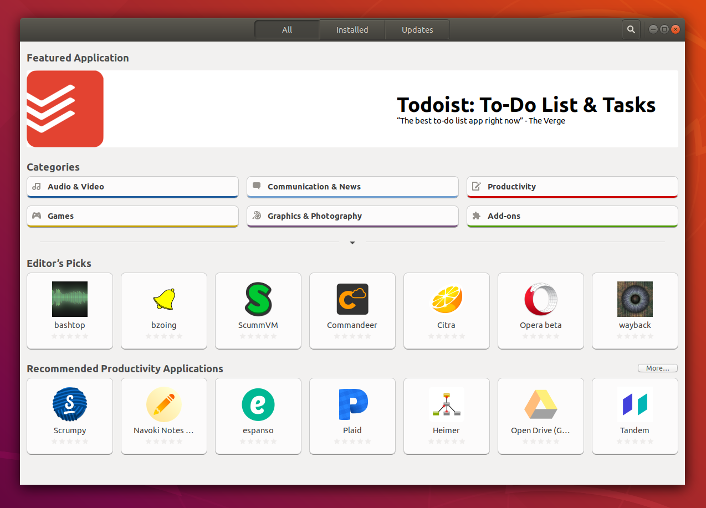
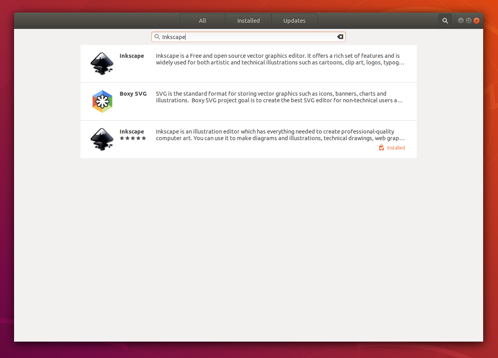
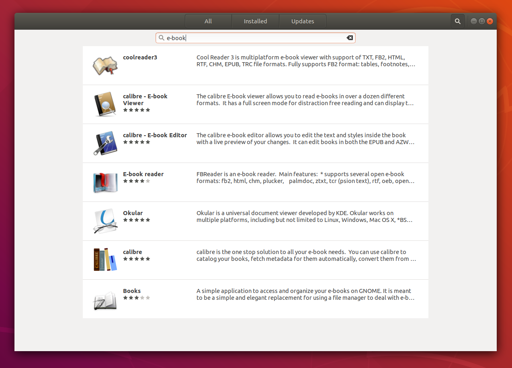
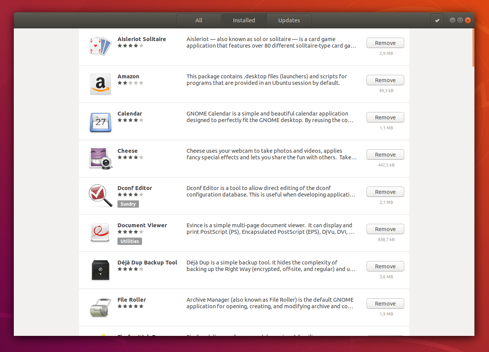
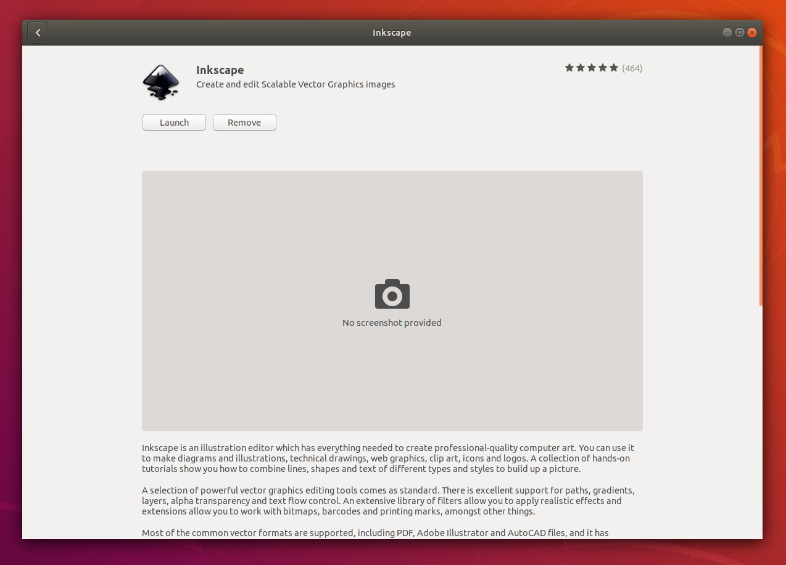

.. _app_install_install_uninstall:

Instalarea și dezinstalarea aplicațiilor
========================================

Instalarea unui sistem de operare duce la instalarea unui set de bază de aplicații pe acel sistem.
Acest set este minimal; dacă dorim funcționalități peste acest set, instalăm noi aplicații.
Instalarea unei aplicații duce la adăugarea în sistem a unui fișier executabil (sau mai multe) pentru rularea aplicației și eventuale fișiere de configurare, de documentare și de stocare a datelor aplicației.
Instalarea unei aplicații presupune obținerea unui fișier specializat numit **pachet software** și apoi despachetarea acestuia în fișierele specifice aplicației.
Un pachet este efectiv o arhivă cu fișierele specifice aplicației.
După instalarea aplicației / pachetului, aceasta poate fi pornită și rulată de utilizator pentru nevoile sale.

Instalarea unei aplicații dintr-un pachet software este prezentată schematic mai jos:

.. ditaa::

    +---------------------------+                    +---------------------------+
    |cGRE                       |                    |cPNK                       |
    |                           |                    |                           |
    |/-----------------------\  |                    |/-----------------------\  |
    ||                       |  |                    ||                       |  |
    ||  fișiere executabile  |  +------------------->||  fișiere executabile  |  |
    ||{d}                    |  |                    ||{d}                    |  |
    |\-----------------------/  |                    |\-----------------------/  |
    |                           |                    |                           |
    |/-----------------------\  |                    |/-----------------------\  |
    ||                       |  |                    ||                       |  |
    ||fișiere de configurare |  +------------------->||fișiere de configurare |  |
    ||{d}                    |  |                    ||{d}                    |  |
    |\-----------------------/  |                    |\-----------------------/  |
    |                           |                    |                           |
    |/-----------------------\  |                    |/-----------------------\  |
    ||                       |  |                    ||                       |  |
    ||      documentație     |  +------------------->||      documentație     |  |
    ||{d}                    |  |                    ||{d}                    |  |
    |\-----------------------/  |                    |\-----------------------/  |
    |                           |                    |                           |
    |/-----------------------\  |                    |/-----------------------\  |
    ||                       |  |                    ||                       |  |
    ||         date          |  +------------------->||         date          |  |
    ||{d}                    |  |                    ||{d}                    |  |
    |\-----------------------/  |                    |\-----------------------/  |
    |                           |                    |                           |
    |      pachet software      |                    |   sistemul de fișiere     |
    |                           |                    |                           |
    |                        {d}|                    |                        {s}|
    +---------------------------+                    +---------------------------+

De partea cealaltă, dezinstalarea unei aplicații / unui pachet înseamnă ștergerea din sistem a fișierelor specifice.
După dezinstalarea aplicației, aceasta nu mai poate fi pornită, nemaiexistând fișierul executabil corespunzător sau celelalte fișiere specifice.

Acțiunile de instalare, dezinstalare și configurare a pachetelor într-un sistem sunt numite colectiv **gestiunea pachetelor (software)** (*(software) package management*).

În Linux, aplicațiile sunt, în general, instalate prin intermediul unei aplicații dedicate numite **manager de pachete (software)** (*(software) package manager* sau *(software) package management system*).
În distribuțiile Linux bazate pe Debian / Ubuntu, managerul de pachete oferă utilitarele ``apt`` și ``dpkg`` (și altele) și aplicații precum Synaptic.
În distribuțiile Linux bazate pe RedHat / Fedora, managerul de pachete oferă utilitarele ``yum`` sau ``dnf`` sau ``rpm`` (și altele) precum PackageKit.

.. note::

    Mașina virtuală de suport folosește o distribuție Ubuntu.
    De aceea ne vom concentra doar pe distribuțiile bazate pe Debian / Ubuntu și deci, pe utilitarele ``apt`` și ``dpkg``.

.. _app_install_install_uninstall_gui:

Gestiunea pachetelor din interfața grafică
------------------------------------------

Pe lângă utilitarele implicite în linia de comandă, un manager de pachete oferă adesea o interfață grafică.
Pe o instalare implicită de Ubuntu, aplicația Ubuntu Software (GNOME Software) permite interacțiunea cu managerul de pachete.

Această aplicație poate fi pornită din meniurile grafice sau cu ajutorul comenzii ``ubuntu-software`` sau ``gnome-software`` (folosind, de exemplu, combinația de taste ``Alt+F2``).

Dacă pornim aplicația Ubuntu Software, vom obține o fereastră precum cea din imaginea de mai jos:

Această fereastră are butoane care permit gestiunea pachetelor software:

* ``All``: acces la lista completă de pachete disponibile pentru a fi instalate
* ``Installed``: lista de pachete deja instalate
* ``Updates``: lista de pachete care pot fi actualizate
* un buton de căutare (în dreapta): căutarea pachetelor dorite

În continuare vom prezenta acțiunile de instalare și dezinstalare a unui pachet, atât folosind interfața grafică a managerului de pachete, cât și interfața în linia de comandă.

Instalarea unei aplicații cunoscute
-----------------------------------

Cel mai adesea, dorim rapid să avem o aplicație care să ne rezolve o nevoie.
Să presupunem că avem nevoia să lucrăm cu fișiere în format SVG (*Scalable Vector Graphics*).
Pentru aceasta vom instala aplicația Inkscape.

Instalarea din interfața grafică
^^^^^^^^^^^^^^^^^^^^^^^^^^^^^^^^

În interfața grafică, folosim butonul de căutare și introducem șirul ``inkscape`` și obținem o imagine precum cea de mai jos:

În imaginea de mai sus observăm că pachetul este deja instalat.
Dacă nu ar fi fost instalat, am fi accesat intrarea din imagine și apoi am fi folosit butonul ``Install``.

Instalarea din linia de comandă
^^^^^^^^^^^^^^^^^^^^^^^^^^^^^^^

În linia de comandă, folosim utilitarul ``apt`` pentru a instala pachetul ``inkscape``:

.. code-block:: bash

    student@uso:~$ sudo apt update
    [sudo] password for student:
    Hit:1 http://ro.archive.ubuntu.com/ubuntu bionic InRelease
    [...]

    student@uso:~$ sudo apt install inkscape
    [...]

Comanda ``sudo apt update`` actualizează informațiile despre pachete; vom clarifica mai jos rolul său, inclusiv de ce este recomandată rularea sa (fără a fi obligatorie).
Comanda ``sudo apt install inkscape`` instalează efectiv pachetul numit ``inkscape``, care va instala aplicația Inkscape.
Instalarea pachetelor în sistem este o acțiune privilegiată, care necesită permisiuni administrative.
Din acest motiv cele două comenzi de mai sus sunt prefixate de comanda ``sudo``.

În acest moment, aplicația Inkscape este instalată și poate fi pornită.

**Exercițiu**: Porniți aplicația Inkscape în toate modurile descrise în secțiunea :ref:`app_install_start_stop_gui`.

Instalarea de noi aplicații
^^^^^^^^^^^^^^^^^^^^^^^^^^^

Instalarea VLC
""""""""""""""

Avem nevoie de un player video și știm că `VLC <https://www.videolan.org/vlc/index.html>`_ este unul dintre cele mai folosite playere.
Pentru a îl folosi pe sistem, instalăm pachetul ``vlc``:

.. code-block:: bash

    student@uso:~$ sudo apt install vlc
    [sudo] password for student:
    [...]
    Do you want to continue? [Y/n] Y
    [...]

Acum aplicația VLC este disponibilă în sistem.

**Exercițiu**: Porniți aplicația VLC în modurile descrise în :ref:`app_install_start_stop_gui`.

.. note::

    Mai sus nu am mai rulat comanda ``sudo apt update`` pentru că sistemul este deja actualizat de la instalarea pachetului ``inkscape``.

Instalarea Glances
""""""""""""""""""

Pentru a monitoriza sistemul și procesele sistemului putem folosi utilitarele ``top`` sau ``htop``.
Utilitarul Glances rulează tot în linia de comandă și oferă o interfață mai complexă a sistemului, utilă mai ales pentru administratorii de sisteme.
Instalăm pachetul ``glances``:

.. code-block:: bash

    student@uso:~$ sudo apt install glances
    [...]
    Do you want to continue? [Y/n] Y
    [...]

**Exercițiu**: Porniți utilitarul în linia de comandă folosind comanda ``glances``.
Ieșirea din utilitar se face, la fel ca în cazul ``top`` și ``htop``, folosind tasta ``q``.

Exerciții de instalare de aplicații
^^^^^^^^^^^^^^^^^^^^^^^^^^^^^^^^^^^

Instalați și porniți următoarele pachete:

* ``wikit``: pachet care instalează utilitarului ``wikit`` (în linia de comandă) care obține informații din Wikipedia
* ``gimp``: pachet care instalează aplicația Gimp (cu interfață grafică), un editor de imagini
* ``neofetch``: pachet care instalează utilitarul ``neofetch`` (în linia de comandă), care afișează un sumar informativ despre sistem
* ``audacity``: pachet care instalează aplicația Audacity (cu interfață grafică), un editor audio

Puteți realiza instalarea din interfața grafică a managerului de pachete sau din interfața în linia de comandă.

.. _app_install_uninstall_identify:

Identificarea unei aplicații de instalat
----------------------------------------

În exemplele și exercițiile de mai sus am știut ce aplicație dorim să folosim și am instalat pachetul corespunzător.
Numele pachetului este cel mai adesea același cu numele aplicației.

În anumite situații, însă, vom ști doar ce nevoie avem dar nu și ce aplicație să instalăm.
Adică vom avea nevoi precum:

* Vreau să aflu care este viteza conexiunii mele la Internet.
* Vreau să gestionez mai bine documentele PDF și cărțile format electronic (e-book).
* Vreau să descarc un video de pe YouTube.
* Vreau să fac un tutorial video: să creez o filmare în care să înregistrez ecranul laptopului meu.
* Vreau să editez un fișier PDF ca să pot adăuga o semnătură simplă.

Pentru aceste nevoi vrem să căutăm o aplicație potrivită, să o instalăm și să o folosim.

.. important::

    Este important să ne gândim la nevoie (la obiectiv, la finalitate) nu la aplicație (la mijloc).
    O nevoie poate fi rezolvată în mai multe moduri și cu mai multe aplicații și trebuie să alegem ce ni se pare mai potrivit.
    Poate nu este nevoie de o aplicație instalată, poate există un site / aplicație web sau un plugin de browser suficient.
    Sau poate există o aplicație pe telefonul mobil care poate fi folosită rapid și ușor.

Căutarea unei aplicații în Internet
^^^^^^^^^^^^^^^^^^^^^^^^^^^^^^^^^^^

Întrucât este cel mai ușor mod, vom folosi un motor de căutare din Internet pentru a căuta o aplicație potrivită unei nevoi.
Ne vom gândi la un șir de căutare potrivit nevoii noastre și vom folosi `Google <https://www.google.com/>`_ sau `Bing <https://www.bing.com/>`_ sau `DuckDuckGo <https://duckduckgo.com/>`_ sau alt motor de căutare.
Astfel, pentru nevoile de mai sus, exemple de șiruri de căutare sunt:

* *internet speed test*
* *manage e-book library*
* *download youtube video*
* *video record screen*
* *edit pdf add signature*

**Exercițiu**: Folosiți șirurile de căutare de mai sus într-un motor de căutare din Internet.

Pentru fiecare șir de căutare, motorul de căutare folosit ne va indica:

* un site / aplicație web care rezolvă acea nevoie
* sau un articol care prezintă mai multe aplicații
* sau chiar pagina unei aplicații care rezolvă nevoia

Aici utilizatorul poate decide dacă un site rezolvă nevoia sau vrea să instaleze o aplicație și care să fie acea aplicație.

De exemplu, pentru nevoia de a afla viteza conexiunii la Internet, se poate folosi direct aplicația web `Speedtest <https://www.speedtest.net/>`_, descoperită de motorul de căutare cu șirul *Internet speed test*.
Dacă dorim o aplicație sau un utilitar, actualizăm șirul de căutare la *internet speed test application linux* [#linux_search]_.
Și găsim că putem instala utilitarul ``speedtest-cli``.

În mod similar, ajută să actualizăm șirul de căutare la *download youtube video linux*, pentru a găsi o aplicație Linux cu ajutorul căreia să descărcăm un video de pe YouTube.
Descoperim astfel utilitarul ``youtube-dl``.

În urma folosirii motoarelor de căutare, identificăm, așadar, următoarele aplicații:

* ``speedtest-cli``
* Calibre
* ``youtube-dl``
* Kazam sau OBS sau SimpleScreenRecorder sau recordMyDesktop
* Gimp sau Inkscape sau Libreoffice Draw sau Xournal

În general numele aplicației corespunde cu numele pachetului.
Pentru siguranță, e recomandat să căutăm pachetul și folosind managerul de pachete pe care îl vom folosi pentru instalare.

Căutarea unei aplicații cu managerul de pachete
^^^^^^^^^^^^^^^^^^^^^^^^^^^^^^^^^^^^^^^^^^^^^^^

Căutarea unei aplicații cu managerul de pachete este utilă atât pentru a căuta un pachet potrivit unei nevoi, cât și pentru a identifica ce pachet corespunde unei aplicații de care știm.
De exemplu o aplicație descoperită prin Internet.

Față de căutarea în Internet, căutarea în managerul de pachete este avantajoasă pentru că va căuta doar în pachetele disponibile și instalabile în sistem cu ajutorul managerului de pachete.
Este dezavantajoasă pentru că șirul de căutare nu este la fel de flexibil: în general se căută fix acel șir sau acea expresie (*keyword*).
Există astfel un risc să nu localizăm cea mai potrivită aplicație pentru nevoia noastră, dacă folosim un șir nepotrivit.

Căutarea folosind interfața grafică
"""""""""""""""""""""""""""""""""""

Pentru căutare putem folosi interfața grafică a managerului de pachete, ca în imaginea de mai jos:

În imaginea de mai sus, am folosit șirul de căutare ``e-book`` pentru a găsi aplicațiile instalabile în sistem care se referă la cărți în format electronic.

Căutarea folosind linia de comandă
""""""""""""""""""""""""""""""""""

În linia de comandă putem folosi șirul de căutare ca argument pentru comanda ``apt search``:

.. code-block:: bash

    student@uso:~$ apt search e-book
    Sorting... Done
    Full Text Search... Done
    calibre/bionic,bionic 3.21.0+dfsg-1build1 all
      powerful and easy to use e-book manager
    [...]
    fbreader/bionic 0.12.10dfsg2-2 amd64
      e-book reader
    [...]

În rezultatul comenzii de mai sus [#aptsearch]_ apar aplicațiile care au legătură cu șirul ``e-book``, printre care și Calibre, aplicație pe care am descoperit-o și folosind căutarea în Internet și interfața grafică.

Putem folosi șirul de căutare ``e-book manager`` pentru a simplifica rezultatele obținute:

.. code-block:: bash

    student@uso:~$ apt search e-book manager
    Sorting... Done
    Full Text Search... Done
    calibre/bionic,bionic 3.21.0+dfsg-1build1 all
      powerful and easy to use e-book manager

    calibre-bin/bionic 3.21.0+dfsg-1build1 amd64
      powerful and easy to use e-book manager

Exerciții de căutare și instalare
^^^^^^^^^^^^^^^^^^^^^^^^^^^^^^^^^

Căutați aplicațiile potrivite pentru următoarele nevoi:

* Vreau să editez un fișier video.
* Vreau să-mi organizez sarcinile / taskurile.
* Vreau să-mi organizez rețetele de mâncare.

Folosiți atât căutarea în Internet, cât și căutarea folosind managerul de pachete (interfața grafică și/sau în linia de comandă).

Instalați, porniți și folosiți aplicațiile găsite.

Exercițiu: Căutarea și instalarea unei aplicații pentru o nevoie proprie
""""""""""""""""""""""""""""""""""""""""""""""""""""""""""""""""""""""""

Gândiți-vă la nevoi pe care le aveți și căutați aplicații corespunzătoare pentru acele nevoi.
Instalați, porniți și folosiți aplicațiile găsite.

.. note::

    Găsiți pe Internet liste de aplicații recomandate să fie instalate și folosite.
    De exemplu https://itsfoss.com/essential-linux-applications/ conține o listă de aplicații considerate esențiale în Linux.
    Iar https://github.com/agarrharr/awesome-cli-apps conține o listă extinsă de aplicații utile în linia de comandă.

Dezinstalarea aplicațiilor
--------------------------

Dacă nu mai folosim o aplicație și dorim să eliberăm spațiul ocupat pe disc, putem opta pentru a dezinstala o aplicație.
Dezinstalarea înseamnă că toate fișierele corespunzătoare aplicației vor fi șterse de pe disc.

Acțiunea de dezinstalare este mai rară.
Beneficiul principal al dezinstalării este eliberarea spațiului ocupat pe disc de fișiere corespunzătoare aplicației.
Dar pentru că spațiul pe disc este suficient, apelăm mai rar la această acțiune.

La fel ca în cazul instalării, o aplicație poate fi instalată sau dezinstalată din interfața grafică a managerului de pachete sau din cea în linia de comandă.
Dezinstalarea poate fi făcută din interfața în linia de comandă chiar dacă aplicația a fost instalată din interfața grafică și invers.

La fel ca în cazul instalării, acțiunea de dezinstalare este privilegiată.

Dezinstalarea din interfața grafică
^^^^^^^^^^^^^^^^^^^^^^^^^^^^^^^^^^^

Dezinstalarea din interfața grafică se face din tabul ``Installed`` al ferestrei managerului de pachete, ca în imaginea de mai jos:

Se folosește apoi butonul ``Remove`` pentru a porni dezinstalarea aplicației.

Sau se poate căuta respectiva aplicație și apoi se poate dezinstala, ca în imaginea de mai jos:

Dezinstalarea din linia de comandă
^^^^^^^^^^^^^^^^^^^^^^^^^^^^^^^^^^

Dezinstalarea din linia de comandă se face cu o comandă precum:

.. code-block::

    student@uso:~$ sudo apt remove neofetch
    [sudo] password for student:
    Reading package lists... Done
    Building dependency tree
    Reading state information... Done
    The following packages will be REMOVED:
      neofetch
    0 upgraded, 0 newly installed, 1 to remove and 311 not upgraded.
    After this operation, 365 kB disk space will be freed.
    Do you want to continue? [Y/n] Y
    (Reading database ... 199030 files and directories currently installed.)
    Removing neofetch (3.4.0-1) ...
    Processing triggers for man-db (2.8.3-2) ...

În comanda de mai sus, am dezinstalat pachetul ``neofetch``.
Comanda de dezinstalare (``apt remove``) a fost prefixată de comanda ``sudo`` pentru că este vorba de o acțiune privilegiată.
La dezinstalare se cere confirmarea că dorim dezinstalarea pachetului.

În urma acestei acțiuni, fișierele corespunzătoare pachetului ``neofetch`` au fost șterse, incluzând fișierul executabil corespunzător.
Acum nu mai avem acces la utilitar și comanda ``neofetch`` va eșua.

Comanda ``apt remove`` șterge fișierele corespunzătoare pachetului, dar lasă anumite fișiere de configurare modificate de utilizator.
Aceasta pentru a permite ca o instalare ulterioară să refolosească vechea configurare.
Dacă dorim ștergerea inclusiv a fișierelor de configurare modificate, folosim comanda:

.. code-block::

    student@uso:~$ sudo apt purge neofetch
    [sudo] password for student:
    Reading package lists... Done
    Building dependency tree
    Reading state information... Done
    The following packages will be REMOVED:
      neofetch*
    0 upgraded, 0 newly installed, 1 to remove and 311 not upgraded.
    After this operation, 0 B of additional disk space will be used.
    Do you want to continue? [Y/n] Y
    (Reading database ... 198873 files and directories currently installed.)
    Purging configuration files for neofetch (3.4.0-1) ...

Comanda de mai sus a șters fișierele de configurare pentru pachetul ``neofetch``.
Comanda ``apt purge`` poate fi folosită pentru a dezinstala pachete instalate, sau pentru a "curăța" (*purge*) pachete care au fost dezinstalate dar care mai au fișiere de configurare.

Exerciții de dezinstalare
^^^^^^^^^^^^^^^^^^^^^^^^^

Dezinstalați două dintre pachetele pe care le-ați instalat mai sus.
Dezinstalați primul pachet folosind interfața grafică a managerului de pachete.
Dezinstalați al doilea pachet folosind interfața în linia de comandă a managerului de pachete.

Actualizarea aplicațiilor
-------------------------

O aplicație este, în general, dezvoltată în continuu.
Dezvoltatorii aplicației adaugă noi funcționalități, sau rezolvă probleme de funcționare sau de securitate, sau fac aplicația mai robustă sau mai eficientă [#update]_.

La fel ca în cazul instalării și dezinstalării, actualizarea aplicațiilor duce la modificarea fișierelor din sistem, deci este o acțiune privilegiată.

Actualizarea individuală a unei aplicații
^^^^^^^^^^^^^^^^^^^^^^^^^^^^^^^^^^^^^^^^^

Dacă dorim actualizarea individuală a unui pachet, putem folosi interfața grafică, navigând până la zona specifică aplicației.

Altfel, putem folosi o comandă precum:

.. code-block:: bash

    student@uso:~$ sudo apt install inkscape
    [sudo] password for student:
    Reading package lists... Done
    Building dependency tree
    Reading state information... Done
    inkscape is already the newest version (0.92.3-1).
    0 upgraded, 0 newly installed, 0 to remove and 311 not upgraded.

Când comanda ``apt install`` primește ca argument un pachet deja instalat, va verifica dacă există o versiune actualizată a acestuia.
În cazul de mai sus, versiunea instalată a pachetului ``inkscape`` (``0.92.3-1``) este cea mai nouă și nu este nevoie de actualizare.

Actualizarea tuturor aplicațiilor
^^^^^^^^^^^^^^^^^^^^^^^^^^^^^^^^^

Cel mai adesea, un utilizator va opta pentru actualizarea tuturor aplicațiilor sistemului, sau pe scurt, pentru actualizarea sistemului.
Acest lucru se întâmplă și pentru că sistemul notifică periodic utilizatorul de prezența unor versiuni noi de aplicații.

Când este cazul, utilizatorul poate folosi interfața grafică sau sau cea în linia de comandă a managerului de pachete pentru actualizarea sistemului.
De obicei, utilizatorul va folosi interfața grafică în momentul primirii unei notificări.

Pentru actualizarea sistemului din interfața în linia de comandă, vom folosi o comandă precum:

.. code-block:: bash

    student@uso:~$ sudo apt update
    [...]
    student@uso:~$ sudo apt upgrade
    [...]
    311 upgraded, 4 newly installed, 0 to remove and 0 not upgraded.
    Need to get 0 B/301 MB of archives.
    After this operation, 100 MB of additional disk space will be used.
    Do you want to continue? [Y/n] Y
    [...]

Folosind comanda ``apt upgrade`` actualizăm toate aplicațiile în sistem [#apt_upgrade]_.
Este recomandat să actualizăm informațiile interne despre pachetele sistemului folosind comanda ``apt update``.

Bune practici și greșeli comune
-------------------------------

Acțiuni neinteractive
^^^^^^^^^^^^^^^^^^^^^

Atunci când instalăm, dezinstalăm sau actualizăm pachete în linia de comandă, utilitarul ``apt`` solicită confirmare pentru executarea acțiunii.
Trebuie să introducem la tastatură ``Y`` (pentru *Yes*) sau doar să apăsăm ``Enter`` la un prompt precum cel de mai jos [#enter]_:

.. code-block:: bash

    Do you want to continue? [Y/n] Y

Această confirmare necesită intervenția utilizatorului.
Utilizatorul poate opta să nu mai fie cerută confirmare; sau poate să considere adăugarea unei comenzi într-un script neinteractiv.
Pentru aceasta, se poate folosi opțiunea ``-y`` la comandă ca mai jos:

  .. code-block:: bash

      student@uso:~$ sudo apt install -y neofetch
      student@uso:~$ sudo apt remove -y neofetch
      student@uso:~$ sudo apt upgrade -y

Folosirea opțiunii ``-y`` la oricare dintre comenzile de instalare, dezinstalare sau actualizare de pachete va duce la executarea acelei acțiuni în mod neinteractiv, fără nevoia de confirmare din partea utilizatorului.

.. important::

    Acțiunile de instalare, dezinstalare și actualizare de pachete pot duce la efecte nedorite precum dezinstalarea unei aplicații existente sau instalarea unui număr prea mare de aplicații dependente.
    De aceea, opțiunea ``-y`` trebuie folosită cu grijă și evitată în momentul în care efectuăm operații critice.

.. rubric:: Note de subsol

.. [#linux_search]

    În general, dacă dorim aplicații Linux, este de ajutor ca *linux* să fie parte din șirul de căutare folosit.

.. [#aptsearch]

    Comanda ``apt search`` nu este privilegiată (nu modifică informații critice în sistem) și nu trebuie prefixată de comanda ``sudo``.

.. [#update]

    Aducerea unei aplicații la o versiune mai nouă (*update* sau *upgrade*) are plusuri și minusuri.
    Avantajul este că noua versiune va avea cele mai noi funcționalități și va avea rezolvate probleme vechi de configurare.
    Dezavantajul este că noua versiune va fi mai puțin folosită și deci mai puțin stabilă, cu posible probleme noi de funcționare.
    În general este recomandat ca aplicațiile sistemului să fie actualizate (*up-to-date*) cu versiuni care au îmbunătățiri de funcționare sau securitate (*security updates*).
    Dacă se optează pentru cea mai recentă versiune a aplicației (posibil mai puțin stabilă), trebuie cântărit beneficiul adus de noile funcționalități față de posibilele probleme de funcționare.

    De obicei un utilizator obișnuit va opta pentru cea mai nouă versiune, fiind interesat în primul rând de cele mai noi funcționalități.
    Un administrator de sistem va opta pentru versiunile mai stabile care asigură o robustețe ridicată a sistemului.

.. [#apt_upgrade]

    Comanda ``apt upgrade`` face actualizare conservatoare a sistemului.
    Dacă un anumit pachet ar fi dezinstalat de acțiunea de actualizare a sistemului, pachetul nu va fi atins de managerul de pachete.
    Dacă dorim o actualizare completă a sistemului, incluzând dezinstalarea anumitor pachete (pentru că sunt incompatibile cu alte apchete), vom folosi comanda:

    .. code-block:: bash

        student@uso:~$ sudo apt full-upgrade

.. [#enter] De fapt, atunci când ni se prezintă un prompt de forma ``[Y/n]`` apăsarea tastei ``Enter`` este echivalentă cu introducerea tastei marcate cu literă mare (aici ``Y``). Dacă, de exemplu, ar fi fost un prompt de forma ``[y/N]``, apăsarea tastei ``Enter`` era echivalentă cu introducerea tastei ``N``.
