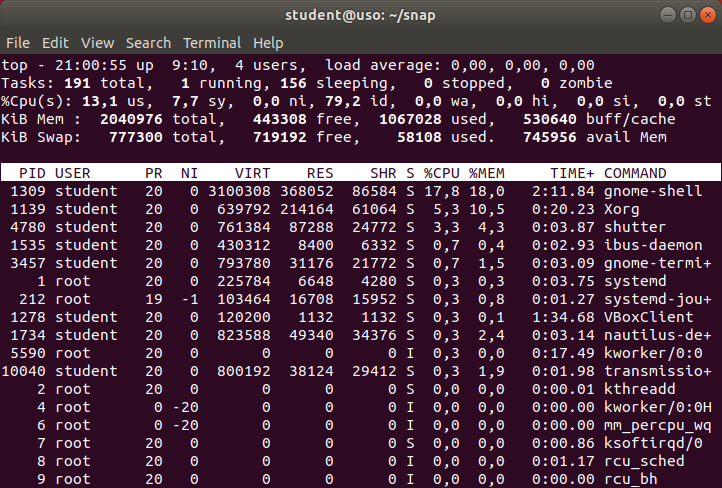
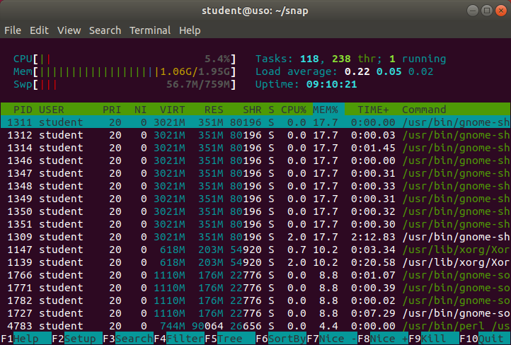

.. _app_install_run:

Rularea aplicațiilor
====================

Pornirea unei aplicații înseamnă că se alocă resursele sistemului (procesor, memorie, dispozitive de intrare/ieșire) pentru a rula aplicația.
O aplicație care rulează, adică folosește resursele sistemului pentru a executa cod și a prelucra date, se numește **proces**.
Atunci când pornim o aplicație, se creează un proces; atunci când oprim aplicația, sau când își încheie execuția, ne referim la încheierea execuției procesului.

Procesul este pornit dintr-un fișier executabil care conține codul (instrucțiunile) și datele aplicației.
Fișierul executabil este un **program**.
Spunem că procesul este un program aflat în execuție [#load_time_run_time]_.

.. _app_instal_run_exec:

Identificarea fișierului executabil al unei aplicații
-----------------------------------------------------

Fișierul executabil al unei aplicații este încărcat în memoria sistemului și codul este executat; din acest moment spunem că aplicația **rulează**.

De exemplu aplicația Firefox (browser web) are asociat fișierul executabil ``/usr/bin/firefox``; aplicația Vim (editor) are asociat fișierul executabil ``/usr/bin/vim``; aplicația LibreOffice (suită office) are asociat fișierul executabil ``/usr/bin/libreoffice``.
Putem identifica fișierul executabil al unei aplicații folosind comanda ``which``, urmată de comanda pentru pornirea aplicației ca mai jos:

.. code-block:: bash

    student@uso:~$ which firefox
    /usr/bin/firefox
    student@uso:~$ which vim
    /usr/bin/vim
    student@uso:~$ which libreoffice
    /usr/bin/libreoffice

**Exercițiu**: Identificați fișierul executabil al aplicațiilor / utilitarelor Shutter, Gedit, ``ls``, ``df``.

.. _app_install_run_ps:

Investigarea proceselor
-----------------------

Un sistem de operare are de obicei mai multe aplicații care rulează, deci mai multe procese.
Prea multe procese pot duce la o încărcare prea mare a sistemului, încetinind sau împiedicând funcționarea acestuia.
Anumite procese pot consuma excesiv resurse afectând celelalte procese.
De aceea, este util să investigăm procesele unui sistem și consumul de resurse al acestora.

Listarea proceselor
^^^^^^^^^^^^^^^^^^^

La nivel mai degrabă didactic, putem vizualiza lista de procese a unui sistem.
Utilitarul ``ps`` afișează procesele curente în sistem (un *snapshot* al proceselor sistemului).
La o rulare simplă, utilitarul ``ps`` afișează procesele din terminalul curent:

.. code-block:: bash

    student@uso:~$ ps
      PID TTY          TIME CMD
    14897 pts/4    00:00:00 bash
    14910 pts/4    00:00:00 ps

În terminalul curent (indicat de coloana ``TTY`` din afișare, adică terminalul ``pts/4``) sunt două procese:

#. procesul shell (``bash``) în care rulăm comenzi care creează noi procese;
#. procesul de listare (``ps``) pe care tocmai l-am lansat prin comanda ``ps``; practic se afișează pe sine

Pentru a afișa toate procesele sistemului folosim opțiunea ``-e`` (pentru *everything*) a utilitarului ``ps`` ca în comanda de mai jos:

.. code-block:: bash

    student@uso:~$ ps -e
      PID TTY          TIME CMD
        1 ?        00:00:19 systemd
        2 ?        00:00:00 kthreadd
        4 ?        00:00:00 kworker/0:0H
        6 ?        00:00:00 mm_percpu_wq
        7 ?        00:00:09 ksoftirqd/0
        8 ?        00:00:06 rcu_sched
        9 ?        00:00:00 rcu_bh
       10 ?        00:00:00 migration/0
       11 ?        00:00:00 watchdog/0
    [...]

Ierarhia proceselor
^^^^^^^^^^^^^^^^^^^

Un proces este creat de un alt proces.
De exemplu, mai sus, procesul ``ps`` a fost creat dintr-un proces shell (``bash``).
Procesul shell a fost, la rândul său, creat de un alt proces.
Un proces are un proces părinte; un proces poate avea mai multe procese copil.
Procesele sunt, așadar, parte dintr-o ierarhie.

Pentru a vizualiza ierarhia de procese, folosim utilitarul ``pstree``:

.. code-block:: bash

   student@uso:~$ pstree
   systemd-+-ModemManager---2*[{ModemManager}]
           |-NetworkManager-+-2*[dhclient]
           |                `-2*[{NetworkManager}]
           [...]
           |-acpid
           |-avahi-daemon---avahi-daemon
           |-boltd---2*[{boltd}]
           |-colord---2*[{colord}]
           |-cron
           [...]
           |-systemd-+-(sd-pam)
           |         |-gnome-terminal--+-bash
           |         |                 `-3*[{gnome-terminal-}]
           [...]

În vârful ierarhiei de procese este procesul numit clasic ``init``.
În listarea de mai sus vedem că procesul din vârful ierarhiei este ``systemd``.
``systemd`` [#systemd]_ este implementarea de ``init`` prezentă în cea mai mare parte a distribuțiilor Linux curente [#init]_.

Atributele proceselor
^^^^^^^^^^^^^^^^^^^^^

Utilitarul ``ps`` are o afișare tabelară a proceselor, fiecare coloană corespunzând unui atribut al proceselor.
La o rulare simplă, așa cum am văzut mai sus sunt afișate patru coloane:

* ``PID``: reprezentând identificatorul procesului
* ``TTY``: terminalul în care rulează procesul (apare ``?`` pentru un proces care nu are terminal - în general procesele de tip serviciu, numite și procese daemon nu au terminal)
* ``TIME``: timpul de rulare pe procesor (în ore, minute, secunde)
* ``CMD``: numele comenzii care a pornit procesul (uzual numele executabilului / programului din care a fost creat procesul)

Identificarea unui proces
"""""""""""""""""""""""""

``PID`` (*Process Id*) este atributul esențial al procesului, un index care identifică procesul la nivelul sistemului.
Un proces este identificat după PID, nu după numele executabilului (``CMD``).
Putem avea mai multe procese create din același executabil, fiecare proces având PID-ul său [#process]_.

Pentru a verifica existența mai multor procese, o să creăm mai multe procese shell.
Pentru început, deschidem mai multe sesiuni de terminal, folosind, de exemplu, ``Alt+F2`` în mediul grafic și introducând comanda ``gnome-terminal`` în promptul creat.
Apoi vizualizăm doar procesele create din executabilul ``bash`` rulând comanda:

.. code-block:: bash

    student@uso:~$ ps -e | grep bash
     2181 pts/1    00:00:00 bash
     2194 pts/2    00:00:00 bash
     2205 pts/3    00:00:00 bash
    14750 pts/0    00:00:00 bash
    14897 pts/4    00:00:00 bash

Obținem un rezultat precum cel de mai sus.
Sunt cinci procese, toate create din executabilul ``bash``, cu cinci PID-uri diferite: ``2181``, ``2194``, ``2205``, ``14705``, ``14879``.

Afișarea atributelor unui proces
""""""""""""""""""""""""""""""""

Un proces are mai mult decât cele patru atribute afișate la o rulare simplă a utilitarului ``ps``.
Pentru a afișa mai multe atribute, folosim opțiunea ``-f`` (de la *full format*) sau opțiunea ``-F`` (de la *extra full format*), ca mai jos:

.. code-block:: bash

    student@uso:~$ ps -f
    UID        PID  PPID  C STIME TTY          TIME CMD
    student  14897 14896  0 17:12 pts/4    00:00:00 -bash
    student  15026 14897  0 17:46 pts/4    00:00:00 ps -f

    student@uso:~$ ps -F
    UID        PID  PPID  C    SZ   RSS PSR STIME TTY          TIME CMD
    student  14897 14896  0  6056  5136   0 17:12 pts/4    00:00:00 -bash
    student  15027 14897  0  9728  3340   0 17:46 pts/4    00:00:00 ps -F

Desigur, putem să combinăm aceste opțiuni cu opțiunea ``-e`` de afișare a tuturor proceselor:

.. code-block:: bash

    student@uso:~$ ps -ef
    UID        PID  PPID  C STIME TTY          TIME CMD
    root         1     0  0 Aug18 ?        00:00:19 /lib/systemd/systemd --system --deserialize 39
    root         2     0  0 Aug18 ?        00:00:00 [kthreadd]
    root         4     2  0 Aug18 ?        00:00:00 [kworker/0:0H]
    root         6     2  0 Aug18 ?        00:00:00 [mm_percpu_wq]
    root         7     2  0 Aug18 ?        00:00:09 [ksoftirqd/0]
    root         8     2  0 Aug18 ?        00:00:06 [rcu_sched]
    root         9     2  0 Aug18 ?        00:00:00 [rcu_bh]
    root        10     2  0 Aug18 ?        00:00:00 [migration/0]
    root        11     2  0 Aug18 ?        00:00:00 [watchdog/0]
    [...]

Opțiunile ``-f`` și ``-F`` afișează și alte atribute ale procesului, precum:

* ``UID``: numele utilizatorului care deține procesul
* ``PPID``: identificatorul procesului părinte
* ``C``: procentul de procesor ocupat
* ``STIME``: timpul de pornire (*start time*)
* ``RSS``: memoria RAM ocupată (*resident set size*)

Astfel de atribute sunt utile pentru a vedea care sunt procesele cele mai consumatoare de resurse (de exemplu procesor sau memorie).

.. _app_install_run_mon:

Monitorizarea proceselor
------------------------

Utilitarul ``ps`` afișează procesele și atributele acestora la un moment dat, un *snapshot* al proceselor sistemului.
De multe ori ne interesează și evoluția în timp a proceselor: schimbarea în consumul de resurse, apariția de noi procese.
Adică să monitorizăm procesele.
Monitorizarea proceselor înseamnă obținerea periodică de informații despre procese.

Evident, un mod simplu de monitorizare este să rulăm utilitarul ``ps`` periodic.
Există, însă, utilitare dedicate pentru monitorizare.

Monitorizarea folosind top
^^^^^^^^^^^^^^^^^^^^^^^^^^

Utilitarul ``top`` este utilitarul de bază de monitorizare a proceselor în lumea Linux.
Este echivalent Task Manager din Windows.
Rularea ``top`` duce la afișarea, în terminal, a proceselor sistemului și reîmprospătarea informației periodic (implicit ``2`` secunde).
Imaginea de mai jos este o fereastră de terminal cu rularea ``top``:

``top`` afișează informații periodice despre procese **și** despre starea sistemului: consum de procesor, de memorie.
La fiecare perioadă (implicit ``2`` secunde) informația afișată este reîmprospătată.

La fel ca în cazul utilitarului ``less``, ieșirea din utilitarul ``top`` se realizează folosind tasta ``q`` [#top]_.

Utilitarul htop
^^^^^^^^^^^^^^^

Un utilitar similar ``top`` ceva mai prietenos este utilitarul ``htop`` [#monitor]_.
La fel ca în cazul ``top``, utilitarul ``htop`` rulează în linia de comandă prin introducerea comenzii ``htop`` și pornește, în terminal, o fereastră interactivă, ca în imaginea de mai jos:

``htop`` este, de asemenea, un utilitar interactiv, un sumar al comenzilor ce pot fi folosite fiind prezentat în bara de jos a ferestrei sale.
De exemplu, așa cum vedem și în imaginea de mai sus, cu ajutorul tastei ``F6`` putem alege un atribut după care să sortăm procesele.

.. _app_install_run_signal:

Oprirea proceselor. Semnale
---------------------------

Odată pornit, un proces rulează și consumă resursele sistemului.
După ce execută codul din executabilul corespunzător, procesul își încheie execuția și eliberează resursele consumate.
Dar anumite programe (de exemplu serverele) nu au un punct de oprire, ci rulează într-o buclă, teoretic la infinit.
La fel, anumite programe (de exemplu un browser web) sunt interactive și își încheie execuția doar la acțiunea explicită a utilizatorului.

Deosebim astfel între următoarele tipuri de oprire a unui proces:

#. Procesul ajunge la sfârșitul codului programului și își încheie execuția.
#. Un comportament neașteptat sau o eroare în funcționarea programului cauzează încheierea execuției acestuia (*crash*).
#. Utilizatorul execută o acțiune interactivă care trimite comanda de încheiere a execuției procesului: de exemplu folosirea tastei ``q`` pentru a încheia un proces ``top`` sau folosirea butonului ``x`` dintr-o aplicație grafică pentru a încheia execuția acesteia.
#. Utilizatorul sau sistemul de operare decide că un proces nu rulează corespunzător și decide terminarea acestuia.

Ultimul punct din pasul de mai sus, numit și terminarea unui proces (sau, informal, omorârea unui proces) este realizat, în Linux, prin folosirea **semnalelor**.

Folosirea semnalelor pentru omorârea proceselor
^^^^^^^^^^^^^^^^^^^^^^^^^^^^^^^^^^^^^^^^^^^^^^^

Ca să terminăm forțat (omorâm) un proces folosim semnale.
Un semnal este o notificare trimisă de utilizator sau de sistemul de operare către un proces.
Nu este obligatoriu ca un semnal să omoare procesul care îl primește, dar este cel mai des întâlnit comportament, și principala utilizare a semnalelor.

Ca să trimitem un semnal unui proces trebuie să știm PID-ul acestuia și folosim utilitarul ``kill`` urmat de PID-ul procesului.
Adică, dacă pornim într-un terminal un proces ``sleep`` folosind comanda de mai jos:

.. code-block:: bash

    student@uso:~$ sleep 60

în alt terminal vom afla PID-ul său (folosind ``pidof``):

.. code-block:: bash

    student@uso:~$ pidof sleep
    9486

și apoi îl vom omorî (folosind ``kill``):

.. code-block:: bash

    student@uso:~$ kill 9486

Comanda ``kill`` primește ca argument PID-ul procesului de omorât, adică ``9486``.

Verificăm din nou dacă există un proces ``sleep`` folosind ``pidof``:

.. code-block:: bash

    student@uso:~$ pidof sleep
    student@uso:~$

Vedem din output că nu mai există procesul ``sleep``, deci a fost omorât.

În terminalul inițial, în care am rulat comanda ``sleep``, apare un mesaj care indică omorârea procesului:

.. code-block:: bash

    student@uso:~$ sleep 60
    Terminated

Folosirea semnalului SIGKILL
""""""""""""""""""""""""""""

În anumite situații, folosirea utilitarului ``kill`` nu duce la omorârea procesului țintă.
În această situație, vom transmite procesului țintă semnalul ``SIGKILL`` care este garantat că va omorî procesul.
Adică, amuzant spus, ``SIGKILL`` este o bombă nucleară, un glonț care trece prin vesta anti-glonț, cianură de potasiu.
Astfel, dacă pornim pe un terminal un proces ``sleep`` la fel ca mai sus, în alt terminal vom omorî procesul folosind semnalul ``SIGKILL`` ca mai jos:

.. code-block:: bash

    student@uso:~$ pidof sleep
    9834
    student@uso:~$ kill -KILL 9834
    student@uso:~$ pidof sleep
    student@uso:~$

Secvența de comenzi este similară secvenței anterioare cu excepția folosirii opțiunii ``-KILL`` la comanda ``kill`` care înseamnă trimiterea semnalului ``SIGKILL``.

Efectul este similar dar, pe terminalul în care am rulat comanda ``sleep``, apare un mesaj de forma:

.. code-block:: bash

    student@uso:~$ sleep 60
    Killed

Mesajul ``Killed`` este afișat atunci când un proces primește semnalul ``SIGKILL``.

Exerciții: Oprirea proceselor
^^^^^^^^^^^^^^^^^^^^^^^^^^^^^

#. Porniți în trei terminale diferite trei procese ``sleep``.
   Omorâți-le pe toate cu o singură comandă.

#. PID-ul shellului curent poate fi aflat folosind comanda

   .. code-block:: bash

       student@uso:~$ echo $$
       9477

   Omorâți shellul curent.

#. Porniți o aplicație ``shutter``.
   Porniți o aplicație ``libreoffice``.
   Porniți o aplicație ``firefox``.
   Porniți o aplicație ``transmission-gtk``.
   Omorâți aceste procese folosind utilitarul ``kill``.

Exercițiu: Proces abuziv
""""""""""""""""""""""""

Folosiți scriptul ``cpu_hog`` din directorul de suport, pentru a porni un proces care consumă mult procesor. Îl porniți folosind o comandă de forma:

.. code-block:: bash

    $ ./cpu_hog

Scriptul ``cpu_hog`` pornește un proces care execută o buclă infinită.

Observați, cu ajutorul comenzii ``top``, că procesorul este încărcat.
Identificați procesul cel mai consumator de resurse și omorâți-l.
Observați, cu ajutorul comenzii ``top``, că acum procesorul nu mai este încărcat.

.. rubric:: Note de subsol

.. [#load_time_run_time]

    Momentul creării unui proces dintr-un fișier executabil, prin încărcarea codului și datelor fișierului executabil în memorie, se numește **load-time**.
    Rularea procesului și folosirea resurselor sistemului se numește **run-time**.

.. [#systemd] https://freedesktop.org/wiki/Software/systemd/

.. [#init]

    Procesul ``init`` va exista în permanență în vârful ierarhiei de procese, indiferent de faptul că se va numi ``systemd``, ``init``, ``upstart`` sau altfel.

.. [#process]

    Este impropriu să spunem "procesul bash"; corect este "un proces creat din programul / executabilul bash" sau "procesul cu PID-ul XY".
    Cu toate acestea vom folosi în general expresia "procesul bash" pentru că reiese din context despre ce proces este vorba.

.. [#top]

    ``top`` este un utilitar interactiv.
    Adică în timpul rulării sale utilizatorul poate interacționa cu procesele sau poate modifica informațiile afișate.
    De exemplu, folosirea tastei ``M`` într-o rulare ``top`` afișează procesele sortate după consumul de memorie.
    Un sumar al comenzilor interactive din ``top`` se obține folosind tasta ``?``.

.. [#monitor]

    Monitorizarea proceselor este o activitate foarte importantă în administrarea unui sistem de calcul.
    Un proces care, intenționat sau nu, consumă abuziv resursele sistemului va duce la o proastă funcționare sau chiar la blocarea sistemului.
    De aceea, utilitarele de monitorizare a sistemului (și a proceselor) sunt diverse. Amintim:

    * ``iotop``: utilitar pentru monitorizarea consumului de I/O al proceselor
    * ``sysstat``: o suită de utilitare pentru monitorizarea sistemului (procese, memorie, I/O, rețea)
