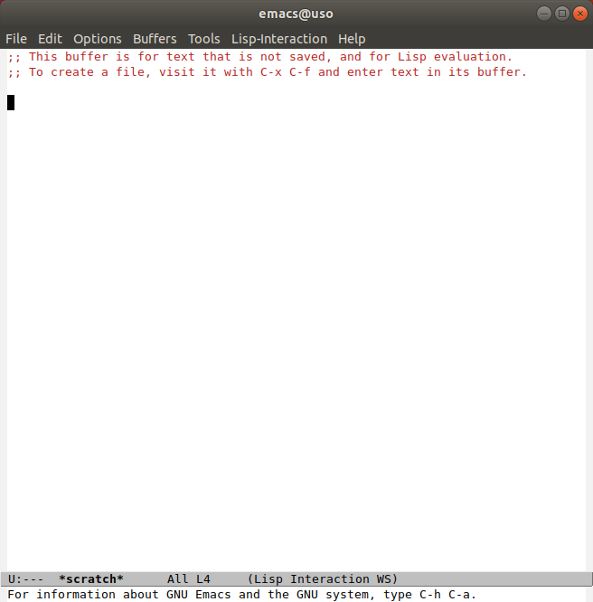
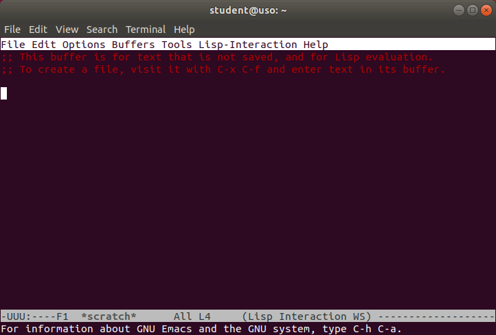

.. _app_install_start_stop:

Pornirea și oprirea aplicațiilor
================================

Pe un sistem se găsesc mai multe aplicații.
Utilizatorul pornește aplicația potrivită pentru o nevoie pe care o are.
De exemplu, pornește un browser web pentru a accesa Wikipedia sau pornește aplicația Spotify pentru a asculta muzică.

Utilizatorul poate porni aplicațiile folosind interfața grafică (*Graphical User Interface*, GUI) sau interfața în linia de comandă (*Command Line Interface*, CLI).
În cazul interfeței grafice pornirea se face folosind elementele grafice (mouse, meniuri, iconuri de desktop).
În cazul interfeței în linia de comandă pornirea se face introducând și rulând comenzi.

.. _app_install_start_stop_gui:

Pornirea și oprirea aplicațiilor grafice
----------------------------------------

Reminder: Pornirea aplicațiilor din interfața grafică
^^^^^^^^^^^^^^^^^^^^^^^^^^^^^^^^^^^^^^^^^^^^^^^^^^^^^

Am prezentat informații despre pornirea și oprirea aplicațiilor grafice în :ref:`basic_start_stop_apps`.
Am văzut că o aplicație grafică poate fi pornită în două moduri:

#. Folosind iconuri în interfața grafică.
   Iconurile se găsesc direct pe desktop sau în barele de desktop sau în meniurile și ferestrele mediului grafic.
   Plasarea iconurilor depinde de distribuția folosită.
#. Folosind un prompt de tip *application launcher*.
   Acest prompt este lansat, în Linux, de combinația de taste ``Alt+F2``.
   În Windows se folosește combinația de taste ``Windows+r``.
   În macOS se folosește combinația de taste ``Command+Space``.
   La acest prompt se introduce șirul (comanda) care identifică aplicația.

Exerciții
"""""""""

#. Porniți o aplicație browser de fișiere (*file browser*) folosind ``Alt+F2``.
   În Ubuntu 18.04 GNOME browserul de sistem de fișiere este **Nautilus**, identificat de șirul (comanda) ``nautilus``.
#. Porniți aplicația **LibreOffice**, identificată de șirul (comanda) ``libreoffice``, folosind ``Alt+F2``.
#. Porniți aplicația ``ls`` (de listare a conținutului unui director în linia de comandă (CLI)) folosind ``Alt+F2``.
   Observați că nu este afișat nimic.
   Acest lucru se întâmplă pentru că aplicația ``ls`` nu are interfața grafică; are sens să fie rulată doar din linia de comandă.

Pornirea unei aplicații grafice folosind linia de comandă
^^^^^^^^^^^^^^^^^^^^^^^^^^^^^^^^^^^^^^^^^^^^^^^^^^^^^^^^^

Pe lângă cele două moduri de mai sus, pornirea unei aplicații grafice poate fi realizată din linia de comandă (CLI), folosind șirul care identifică aplicația, la fel ca în cazul folosirii ``Alt+F2``.
Pentru a porni o aplicație grafică din linia de comandă, avem nevoie de un terminal.
Terminalul este un dispozitiv în care rulează o aplicație numită **shell**, care este interpretorul comenzilor introduse.
Pe parcursul acestui capitol și a întregii cărți vom folosi interschimbabil shell și terminal.

Pornim o aplicație de terminal folosind fie iconul corespunzător, fie ``Alt+F2`` urmat de șirul (comanda) ``gnome-terminal``.
În aplicația de terminal, pornim aplicația Firefox scriind șirul (comanda) ``firefox``, urmat de apăsarea tastei ``Enter``, ca în imaginea de mai jos.
Aplicația Firefox va porni.

.. image:: img/firefox-cli.png
    :align: center
    :alt: Ponirea Firefox din linia de comandă:

În acest moment, în aplicația de terminal nu mai putem introduce noi comenzi pentru a porni alte aplicații.
Va trebui să oprim aplicația Firefox.
Oprim aplicația Firefox:

* din mediul grafic: click pe butonul de închidere a ferestrei sau folosirea combinației de taste ``Alt+F4``
* din terminal: folosind combinația de taste ``Ctrl+c``

Exerciții
"""""""""

#. La fel ca mai sus, porniți o aplicație browser de fișiere (*file browser*) folosind linia de comandă.
   În Ubuntu 18.04 GNOME, browserul de sistem de fișiere este ``nautilus``.
#. Porniți aplicația LibreOffice folosind linia de comandă.

Menținerea accesului la terminal
^^^^^^^^^^^^^^^^^^^^^^^^^^^^^^^^

Atunci când pornim o aplicație grafică din linia de comandă, aplicația "acaparează" terminalul; nu mai putem introduce noi comenzi pentru a porni alte aplicații.
Putem rezolva acest lucru prin trecerea aplicației grafice în **backgroundul** shellului.
Adică urmăm pașii:

#. Pornim, în terminal, aplicația grafică (**Firefox**) folosind comanda ``firefox``.
   Spunem că aplicația rulează în **foreground** și controlează terminalul; adică nu permite rularea unei alte comenzi.
#. În terminal, folosim combinația de taste ``Ctrl+z`` pentru a trece aplicația în background.
   În acest moment, avem din nou promptul terminalului, ca mai jos:

   .. code-block:: bash

       student@uso:~$ firefox
       ^Z
       [1]+  Stopped                 firefox

   Dar aplicația este acum "înghețată", nu mai răspunde. Spunem că este **suspendată**.
#. Folosim, în terminal, comanda ``bg``, ca mai jos:

   .. code-block:: bash

       student@uso:~$ bg
       [1]+ firefox &

   Astfel am "dezghețat" aplicația, care acum este interactivă.

În acest mod, avem aplicația **Firefox** în rulare și avem acces la terminal să introducem noi comenzi.

**Exercițiu**: Folosiți pașii de mai sus pentru a porni și aplicația **LibreOffice** din linie de comandă și să mențineți accesul la terminal.

.. note::

    Vom afla mai multe despre background și suspendarea proceselor în :ref:`app_install_run_signal`.

Exerciții de aprofundare
^^^^^^^^^^^^^^^^^^^^^^^^

Porniți aplicațiile grafice:

* Gedit (identificată de șirul ``gedit``), editor
* Mines (identificată de șirul ``gnome-mines``), joc de tip Minesweeper
* ToDo (identificată de șirul ``gnome-todo``), aplicație de gestiune de taskuri / todo-uri

Porniți fiecare aplicație în două moduri:

#. folosind ``Alt+F2``
#. folosind interfața în linia de comandă (CLI)

.. _app_install_start_stop_cli:

Pornirea aplicațiilor în linia de comandă
-----------------------------------------

Pornirea de aplicații CLI folosind linia de comandă
^^^^^^^^^^^^^^^^^^^^^^^^^^^^^^^^^^^^^^^^^^^^^^^^^^^

Aplicațiile CLI, numite și utilitare, sunt proiectate pentru a fi pornite și folosite în linia de comandă.
Cel mai adesea numim aplicațiile în linie de comandă **utilitare** sau, pur și simplu, **comenzi**.
Scriem numele utilitarului / comenzii într-un terminal și utilitarul va fi pornit [#commandline]_.
De exemplu, dacă dorim să afișăm utilizatorii prezenți în sistem, pornim o aplicație de terminal și folosim utilitarul ``who``:

.. code::

    student@uso:~$ who
    student  :0           2020-09-04 17:42 (:0)
    student  pts/0        2020-09-19 15:57 (192.168.56.1)

Sau, dacă dorim să vedem câtă memorie avem (disponibilă) în sistem, folosim utilitarul ``free``:

.. code::

    student@uso:~$ free
                  total        used        free      shared  buff/cache   available
    Mem:        2040972     1025716       83824       32916      931432      794692
    Swap:        777300       37056      740244

Exerciții
"""""""""

#. Porniți utilitarul ``ls`` (de listare a conținutului unui director în linia de comandă (CLI)) folosind linia de comandă.

#. Porniți utilitarul ``df`` (de afișare a spațiului ocupat pe disc) folosind linia de comandă.

Argumente în linia de comandă
^^^^^^^^^^^^^^^^^^^^^^^^^^^^^

Pentru a porni aplicații / utilitare în linia de comandă, folosim comenzi care conțin numele utilitarului urmate, eventual, de argumente.
Astfel, pentru a porni utilitarele ``ls`` sau ``ps``, folosim comenzi precum cele de mai jos, simple sau cu argumente:

.. code-block:: bash

    student@uso:~$ ls
    Desktop  Documents  Downloads  examples.desktop  Music  Pictures  Public  snap  Templates  uso.git  Videos  vm-actions-log.txt
    student@uso:~$ ls -l
    total 60
    drwxr-xr-x  2 student student 4096 Aug  6  2018 Desktop
    drwxr-xr-x  3 student student 4096 Aug 20  2018 Documents
    drwxr-xr-x  2 student student 4096 Aug  6  2018 Downloads
    -rw-r--r--  1 student student 8980 Aug  6  2018 examples.desktop
    drwxr-xr-x  2 student student 4096 Aug  6  2018 Music
    drwxr-xr-x  2 student student 4096 Aug  8 11:52 Pictures
    drwxr-xr-x  2 student student 4096 Aug  6  2018 Public
    drwxr-xr-x  3 student student 4096 Aug  8 09:02 snap
    drwxr-xr-x  2 student student 4096 Aug  6  2018 Templates
    drwxr-xr-x 14 student student 4096 Aug 20  2018 uso.git
    drwxr-xr-x  2 student student 4096 Aug  6  2018 Videos
    -rw-r--r--  1 student student 4827 Aug 21  2018 vm-actions-log.txt
    student@uso:~$ ps
      PID TTY          TIME CMD
     3370 pts/4    00:00:00 bash
     7979 pts/4    00:00:00 ps
    student@uso:~$ ps -f
    UID        PID  PPID  C STIME TTY          TIME CMD
    student   3370  3369  0 08:55 pts/4    00:00:00 -bash
    student   7982  3370  0 13:17 pts/4    00:00:00 ps -f

Aplicații interactive în linia de comandă
^^^^^^^^^^^^^^^^^^^^^^^^^^^^^^^^^^^^^^^^^

Utilitarele ``ls`` și ``ps``, pe care le-am folosit mai sus, pornesc, rulează, afișează informații utilizatorului în terminal și apoi se opresc.
Alte utilitare în linia de comandă sunt interactive.
Adică folosesc date introduse de utilizator și își încheie execuția doar după introducerea acestor date sau la comanda utilizatorului.

De exemplu, utilitarul ``less``, folosit pentru afișarea paginată a conținutului unui fișier, este interactiv.
Îl folosim ca mai jos:

.. code-block:: bash

    student@uso:~$ less /etc/services

O dată pornit utilitarul, putem controla afișarea sa folosind tastele săgeți sau alte combinații de taste precum ``Ctrl+b`` (pagină sus) sau ``Ctrl+f`` (pagină jos).
Pentru a opri utilitarul folosim tasta ``q`` (*quit*) și obținem controlul terminalului pentru a introduce noi comenzi.

**Exercițiu**: Porniți în linia de comandă aplicația interactivă ``vim`` pentru a edita fișierul ``~/.bashrc``.
Opriți aplicația folosind combinația de taste ``<Esc>:q!`` urmată de ``Enter``.

Oprirea forțată a aplicațiilor în linia de comandă
^^^^^^^^^^^^^^^^^^^^^^^^^^^^^^^^^^^^^^^^^^^^^^^^^^

Se poate întâmpla ca o aplicație în linia de comandă să ruleze pentru prea mult timp sau să se blocheze.
Caz în care dorim să o oprim.
Soluția de avarie este să închidem fereastra de terminal, lucru care, de obicei, închide și aplicația.
Soluția mai bună este să închidem doar aplicația.
Acest lucru îl facem folosind combinația de taste ``Ctrl+c`` care oprește aplicația care rulează în terminal [#ctrlc]_.
Acest lucru poate fi realizat și pentru aplicații grafice, așa cum am văzut mai sus.

De exemplu, dacă folosim comanda ``sleep 100`` care se va bloca pentru 100 de secunde, o vom opri folosind ``Ctrl+c`` ca mai jos:

.. code-block:: bash

    student@uso:~$ sleep 100
    ^C
    student@uso:~$

**Exercițiu**: Folosiți următoarele comenzi care pornesc aplicații care durează mult și opriți-le forțat:

* ``ls -R /usr``: pentru a afișa recursiv conținutul directorului ``/usr``
* ``watch ps``: pentru a monitoriza procesele din terminalul curent

.. _app_install_start_stop_advanced:

Scenarii avansate
-----------------

Studiu de caz: Emacs: Aplicație hibridă
^^^^^^^^^^^^^^^^^^^^^^^^^^^^^^^^^^^^^^^

Aplicația Emacs (un editor) poate rula cu interfață grafică și cu interfață în linia de comandă.
Dacă pornim aplicația Emacs în linia de comandă, folosind comanda ``emacs``, se va crea un proces cu interfața grafică, așa cum apare în imaginea de mai jos:

Putem opta să folosim interfața în linia de comandă a aplicației Emacs, nu interfața grafică, din rațiuni de resurse consumate, pornire mai rapidă sau interfață universală.
Pentru a face acest lucru, folosim comanda ``emacs -nw`` (``nw`` de la *no window system*), ca mai jos:

Aplicația este interactivă.
În interfața grafică poate fi oprită folosind butonul de închidere a ferestrei sau combinația de taste ``Alt+F4``.
În linia de comandă (și în interfața grafică) poate fi oprită folosind combinația de taste specifică pentru oprirea aplicației: ``Ctrl+x`` urmat de ``Ctrl+c``.

Pornirea aplicațiilor grafice în modul headless
^^^^^^^^^^^^^^^^^^^^^^^^^^^^^^^^^^^^^^^^^^^^^^^

Atunci când lucrăm la distanță (*remote connection*) [#ssh]_, e posibil să nu avem acces facil la interfață grafică.
Sau, chiar când lucrăm pe sistemul local, nu vrem să complicăm mediul de lucru cu o încă o aplicație grafică.
Dorim să rulăm o aplicație în background fără interfață grafică.
Nu interacționăm cu aplicația direct, cu butoane, meniuri, clickuri, ci indirect, prin comenzi specializate.
Anumite aplicații grafice au acest mod, numit mod *headless*, de rulare fără interfață grafică.

De exemplu, Firefox are modul headless.
Acest mod nu este util pentru navigarea web, nefiind interactiv.
Dar este folosit pentru testarea sa automată folosind, de exemplu, `Selenium <https://www.selenium.dev/>`_.

Pentru pornirea Firefox în modul headless folosim, într-un terminal, comanda:

.. code:: bash

    student@uso:~$ firefox -headless
    *** You are running in headless mode.

Aplicația Firefox este pornită, fără interfață grafică.
Ca să confirmăm că aplicația este pornită, investigăm existența unui proces Firefox.
Pentru aceasta, putem rula, într-un alt terminal, comanda:

.. code:: bash

    student@uso:~$ ps -e | grep firefox
     9897 pts/5    00:00:02 firefox

Pentru a opri procesul Firefox pornit în modul headless, folosim, în primul terminal, combinația de taste ``Ctrl+c``.

Folosirea Inkscape fără interfață grafică
"""""""""""""""""""""""""""""""""""""""""

Aplicația Inkscape este folosită pentru crearea și editarea de imagini format SVG (*Scalable Vector Graphics*).
Inkscape nu are propriu zis un mod headless, dar poate fi folosită în mod neinteractiv pentru exportarea fișierelor într-un anumit format și chiar editarea acestora [#inkscape]_.

.. note::

    Aplicația trebuie instalată dacă nu există deja.
    Pe sistemele Debian/Ubuntu folosim comenzi precum cele de mai jos:

    .. code:: bash

        student@uso:~$ sudo apt update
        student@uso:~$ sudo apt -y install inkscape

    Vom detalia instalarea aplicațiilor în :ref:`app_install_install_uninstall`.

De exemplu, pentru a converti o imagine SVG în format PDF, folosim o comandă precum cea de mai jos:

.. code:: bash

    student@uso:~/uso-lab-book$ inkscape chapters/app-install/support/Tux.svg --export-pdf Tux.pdf
    student@uso:~/uso-lab-book$ file Tux.pdf
    Tux.pdf: PDF document, version 1.4

În mod similar, pentru a converti o imagine SVG în format PNG, folosim o comanda precum cea de mai jos:

.. code:: bash

    student@uso:~/uso-lab-book$ inkscape chapters/app-install/support/Tux.svg --export-png Tux.png
    Background RRGGBBAA: ffffff00
    Area 0:0:299.149:354.188 exported to 299 x 354 pixels (96 dpi)
    Bitmap saved as: Tux.png
    student@uso:~/uso-lab-book$ file Tux.png
    Tux.png: PNG image data, 299 x 354, 8-bit/color RGBA, non-interlaced

**Exercițiu**: Căutați pe Internet și descărcați un fișier imagine SVG.
Folosiți Inkscape fără interfață grafică pentru a converti imaginea în format PDF și în format PNG.

Exercițiu: Folosirea Emacs Daemon
"""""""""""""""""""""""""""""""""

.. warning::

    Acest exercițiu are dificultate sporită.

Emacs este o aplicație consumatoare de resurse.
Pentru a reduce timpul de pornire, este ideal să fie pornită o singură dată și apoi să fie folosită acea instanță.
Pentru a nu încărca interfața grafică, Emacs are o formă de server, numită Emacs Daemon.
În forma de server, procesul Emacs este pornit dar fără interfață grafică.
Pentru a folosi Emacs, se folosește o aplicație minimală (*lightweight*) numită ``emacsclient``.

Realizați următoarele:

#. Porniți Emacs Daemon.
#. Verificați folosind ``ps`` sau GNOME System Monitor că procesul Emacs există.
#. Conectați-vă la Emacs Daemon folosind ``emacsclient``.
#. Deconectați-vă de la Emacs Daemon.
#. Conectați-vă din nou la Emacs Daemon.
#. Opriți Emacs Daemon.
#. Verificați folosind ``ps`` sau GNOME System Monitor că procesul Emacs nu mai există.

.. rubric:: Note de subsol

.. [#taskmanager] Aplicația **GNOME System Monitor** este similară aplicației **Task Manager** din Windows.
.. [#inkscape] https://wiki.inkscape.org/wiki/index.php/Using_the_Command_Line

.. [#app_launcher]

    Funcționalitatea de tip *application launcher*, pornită folosind ``Alt+F2``, se găsește și în alte sisteme de operare, nu doar în Linux.
    În Windows pornim un prompt de tip *application launcher* folosind combinația de taste ``Windows+r``.
    În macOS folosim ``Command+Space``.

.. [#gnome_terminal]

    Aplicația GNOME Terminal, pornită folosind comanda ``gnome-terminal``, este aplicația de tip terminal specifică mediului GNOME.
    Alte medii pot folosi alte aplicații de tip terminal.
    De exemplu, aplicația de tip terminal pe mediul KDE este Konsole.
    Sau utilizatorul poate decide instalarea unei alte aplicații de tip terminal, precum Terminator.

.. [#commandline]

    Spre deosebire de scenariul folosirii ``Alt+F2``, când folosim aplicații CLI în linia de comandă, mesajele vor fi vizibile.
    Acest lucru se întâmplă pentru că linia de comandă înseamnă existența unui terminal unde putem vizualiza mesajele.

.. [#ctrlc]

    Pentru anumite aplicații combinația de taste ``Ctrl+c`` poate să nu funcționeze.
    În acest caz putem folosi combinația de taste ``Ctrl+\``, mai puternică.
    Dacă nici ``Ctrl+\`` nu funcționează, va trebui să trimitem aplicației un semnal mai puternic care să o oprească.
    Vom discuta despre semnale în :ref:`app_install_run_signal`.

.. [#ssh]

    De exemplu folosind o conexiune SSH.
    Vom prezenta SSH în secțiunea TODO.
