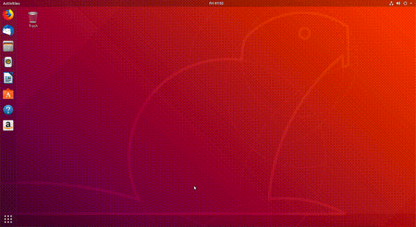
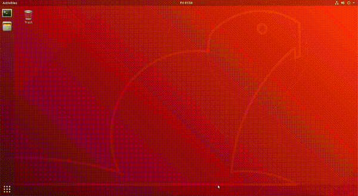

.. _basic_start_stop_apps:

Pornirea și oprirea aplicațiilor
================================

Aplicațiile sunt pornite de utilizator sau de sistemul de operare.
Utilizatorul pornește aplicațiile pentru că are o nevoie pe care aplicația o rezolvă.
De exemplu, pornește un browser web pentru a accesa Wikipedia, sau pornește aplicația Spotify pentru a asculta muzică.
Sistemul de operare pornește aplicații (fără intervenția utilizatorului) pentru a asigura buna funcționare a sistemului.
De exemplu, sistemul pornește un client DHCP pentru a obține automat parametrii de rețea care asigură conexiunea la Internet; sau pornește o aplicație care sincronizează data sistemului cu data indicată de un server din Internet.

Utilizatorul poate porni aplicațiile folosind interfața grafică (*Graphical User Interface*, GUI) sau interfața în linia de comandă (*Command Line Interface*, CLI).
În cazul interfeței grafice, pornirea se face folosind elementele grafice (mouse, meniuri, iconuri de desktop).
În cazul interfeței în linia de comandă, pornirea se face introducând și rulând comenzi.
Vorbim despre pornirea aplicațiilor din terminal în capitolul ``Instalarea și utilizarea aplicațiilor``.

În această secțiune vorbim despre pornirea și oprirea aplicațiilor.
Instalarea aplicațiilor este acoperită în capitolul ``Instalarea și utilizarea aplicațiilor``.

.. _basic_start_gui_app_icons:

Pornirea unei aplicații grafice folosind iconuri
------------------------------------------------

Cel mai simplu mod de a porni o aplicație grafică este folosind iconuri.
Folosim mouse-ul și facem click pe icon pentru a porni aplicația.
De exemplu, în Ubuntu 18.04, pentru a porni aplicația Rhythmbox, folosim iconul din bara de jos în stânga, la fel ca în imaginea de mai jos:

După un click pe icon, aplicația va porni și o putem folosi.

Spunem că acum aplicația **rulează**.
Rularea înseamnă că aplicația folosește resursele sistemului pentru a îndeplini nevoile utilizatorului sau sistemului.

În mod similar putem porni alte aplicații care au iconuri.
Aceste iconuri pot fi prezente pe bare de iconuri sau în diferite meniuri, depinzând de mediul grafic și distribuția folosită.

.. _basic_stop_gui_app_icons:

Oprirea unei aplicații grafice
------------------------------

Odată pornită, o aplicație grafică rulează, de obicei, până la o oprire explicită din partea utilizatorului.
Utilizatorul poate opri o aplicație grafică în mai multe moduri:

* Folosind butonul de închidere a ferestrei grafice, în general în forma unui simbol **x**, ca în imaginea de mai jos:

  .. figure:: ./gifs/close-rhythmbox-x.gif
    :alt: Oprirea aplicației Rhythmbox folosind butonul ``x``

* Folosind combinația de taste ``Alt+F4``, care închide fereastra grafică, o scurtătură pentru folosirea butonului de închidere.
* Folosind intrarea de tip *Quit* / *Close* / *Exit* din meniul grafic al aplicației, ca în imaginea de mai jos, specifică aplicației LibreOffice:

  .. figure:: ./gifs/close-libreoffice-menu.gif
    :alt: Oprirea aplicației LibreOffice folosind meniul grafic al aplicației

* Folosind o combinație de taste care este asociată intrării din meniul grafic al aplicației.
  În imaginea de mai sus, specifică aplicației LibreOffice, combinația de taste este ``Ctrl+q``.
  Această combinație de taste depinde de aplicație, spre deosebire combinației de taste ``Alt+F4``, care se aplică tuturor aplicațiilor grafice.

* Folosind utilitarul ``xkill``.
  După ce pornim utilitarul ``xkill``, cursorul mouse-ului capătă o formă de ``x``.
  Un click pe o aplicație grafică duce la oprirea acesteia.

**Exerciții**

#. Porniți aplicația *Thunderbird Mail* și opriți-o în toate modurile de mai sus.

.. _basic_start_gui_using_alt_f2:

Pornirea unei aplicații grafice folosind Alt+F2
-----------------------------------------------

Pentru a porni o aplicație grafică folosind iconuri trebuie să existe acele iconuri.
Dacă iconul nu este prezent, sau dacă este greu accesibil (trebuie să căutăm prin meniuri), preferăm o altă soluție.
Soluția este folosirea unui mod generic de a lansa o aplicație în interfața grafică, adică folosirea unui prompt de tip *application launcher*.

În mediile grafice Linux pornim un prompt de tip *application launcher* folosind combinația de taste ``Alt+F2`` [#app_launcher]_.
Când apăsăm ``Alt+F2``, mediul grafic prezintă un prompt în care introducem șirul care identifică aplicația.
De exemplu, pentru a porni aplicația Rhythmbox, introducem șirul ``rhythmbox`` în prompt, ca în figura de mai jos:

În urma introducerii șirului ``rhythmbox`` în prompt, urmat de apăsarea tastei ``Enter``, aplicația Rhythmbox va porni.

În mod similar, dacă dorim să pornim o aplicație de tip terminal (**GNOME Terminal**), folosim ``Alt+F2`` și introducem șirul ``gnome-terminal`` [#gnome_terminal]_.

Șirurile ``rhythmbox`` și ``gnome-terminal`` sunt șiruri identifică aplicațiile Rhythmbox, respectiv GNOME Terminal.
Numim un astfel de șir o **comandă**; comenzile sunt șiruri introduse de utilizator pentru a porni o anumită aplicație.

**Exerciții**

#. Porniți aplicația **LibreOffice**, identificată de șirul (comanda) ``libreoffice``, folosind ``Alt+F2``.

.. _basic_start_stop_apps_ex:

Exerciții
---------

Porniți fiecare dintre aplicațiile de mai jos in două moduri:

* Shutter (identificată de șirul ``shutter``), aplicație de creare de screenshoturi
* Gedit (identificată de șirul ``gedit``), editor
* Mines (identificată de șirul ``gnome-mines``), joc de tip Minesweeper
* ToDo (identificată de șirul ``gnome-todo``), aplicație de gestiune de taskuri / todo-uri

Porniți fiecare aplicație în cele două moduri:

* Folosind iconuri în interfața grafică.
  Localizați iconul în meniurile interfeței grafice.
  
  .. hint::
    Aplicațiile cu icon de pornire pot fi localizate cu iconul cu 9 puncte în formă de pătrat din stânga jos a ecranului.

* Folosind combinația de taste ``Alt+F2``.

.. rubric:: Note de subsol

.. [#app_launcher]

    Funcționalitatea de tip *application launcher*, pornită folosind ``Alt+F2``, se găsește și în alte sisteme de operare, nu doar în Linux.
    În Windows, pornim un prompt de tip *application launcher* folosind combinația de taste ``Windows+r``.
    În macOS folosim ``Command+Space``.

.. [#gnome_terminal]

    Aplicația GNOME Terminal, pornită folosind comanda ``gnome-terminal``, este aplicația de tip terminal specifică mediului GNOME.
    Alte medii pot folosi alte aplicații de tip terminal.
    De exemplu, aplicația de tip terminal pe mediul KDE este Konsole.
    Sau utilizatorul poate decide instalarea unei alte aplicații de tip terminal, precum Terminator.
