.. _basic_use_browser:

Folosirea eficientă a browserului web
=====================================

În viața de zi cu zi aplicația pe care o folosim cel mai des, indiferent de platformă sau sistem de operare, este **browserul web**.
Acesta rulează pe smartphone-uri, laptopuri, tablete și este folosit pentru rularea aplicațiilor web cum ar fi clienți de mesagerie, rularea de jocuri, afișarea de conținut al unei pagini cu știri, sau conținut pe rețelele de socializare.

Așadar **browserul web** este o aplicație pe care o folosim în mod constant și ne dorim să o folosim într-un mod cât mai eficient.
Astfel petrecem cât mai puțin timp manevrând aplicația și cat mai mult timp folosind aplicația la capacitate maximă.

Vom folosi `Firefox <https://www.mozilla.org/en-US/firefox/new/>`_ în această carte, însă conceptele prezentate sunt similare și în alte browsere (`Google Chrome <https://www.google.com/chrome/>`_, `Chromium <https://www.chromium.org>`_, `Safari <https://www.apple.com/safari/>`_, `Opera <https://www.opera.com>`_, `Edge <https://www.microsoft.com/en-us/edge>`_, etc).
Acesta este browserul default instalat în Ubuntu 20.04. 

.. _basic_start_stop_browser:

Pornirea și oprirea browserului
-------------------------------

Browserul web este un exemplu de *aplicație software*.
Am vorbit despre pornirea și oprirea aplicațiilor în secțiunea :ref:`basic_start_stop_apps`.

Atunci când browserul este pornit spunem că acesta *rulează*.

.. _basic_start_browser:

Pornirea browserului web
^^^^^^^^^^^^^^^^^^^^^^^^

Putem opri browserul Firefox în mai multe moduri:

* Folosind iconuri ca în imaginea de mai jos:

* Folosind combinația de taste ``Alt+F2`` și introducând șirul ``firefox`` ca în imaginea de mai jos:

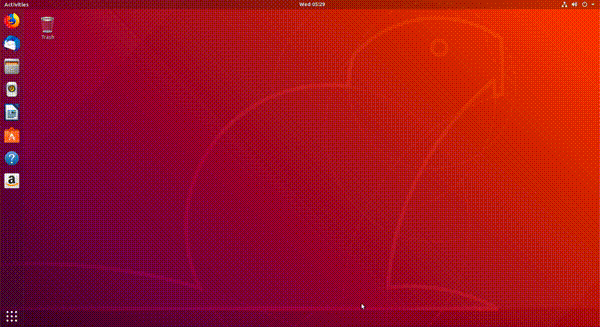

* Folosind linia de comandă ca în imaginea de mai jos:

.. _basic_stop_browser:

Oprirea browserului web
^^^^^^^^^^^^^^^^^^^^^^^

Putem opri browserul Firefox în mai multe moduri:

* Folosind butonul de închidere a ferestrei grafice, în forma unui simbol ``x``, ca în imaginea de mai jos:

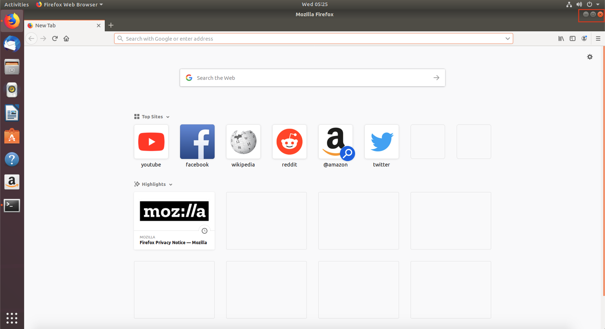

* Folosind intrarea de tip *Quit* din meniul grafic al aplicației, ca în imaginea de mai jos, specifică aplicației Firefox:

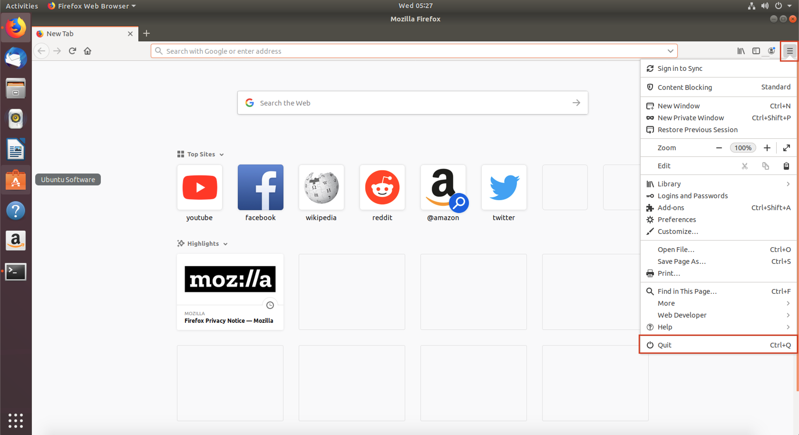

* Folosind combinația de taste ``Alt+F4`` care închide fereastra grafică, o scurtătură pentru folosirea butonului de închidere.
* Folosind combinația de taste ``Ctrl+q``, specifică aplicației Firefox.

.. _basic_actions_browser:

Acțiuni în browserul web
------------------------

În această subsecțiune vom învăța care sunt cele mai folosite componente ale unui browser web și cum să le folosim eficient.
În general avem cel puțin 2 variante pentru a face o acțiune: *folosind butoane din interfața grafică* sau *folosind shortcuturi din tastatură echivalente clickurilor*.
Vom face o paralelă între cele 2 în această subsecțiune.

.. _basic_address_bar_browser:

Folosirea barei de adresă
^^^^^^^^^^^^^^^^^^^^^^^^^

*Bara de adresă* este locul în care scriem adresa (*URL-ul*, *site-ul*, *pagina web*, *linkul*) pe care vrem să o accesăm.
Accesăm pagina **www.google.com**.
Putem scrie adresa în bara de adrese în 2 moduri:

* Folosind click-uri și scriind adresa în bara de adrese ca în imaginea de mai jos:

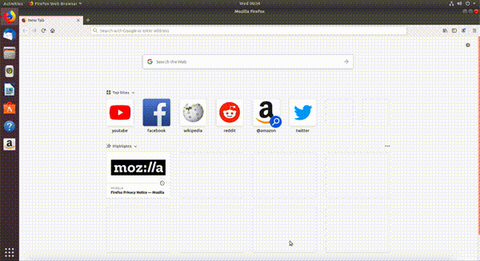

* Folosind scurtătura (*shortcutul*) ``Ctrl+l`` și scriind adresa în bara de adrese.

.. _basic_address_bar_browser_ex:

Exerciții practice
""""""""""""""""""

#. Accesați pagina **www.upb.curs.ro** folosind click-uri.
#. Accesați pagina **www.studenti.pub.ro**  folosind click-uri.
#. Accesați pagina **www.hotnews.ro** folosind ``Ctrl+l``.
#. Accesați pagina **www.facebook.com** folosind ``Ctrl+l``.

.. _basic_navigation_buttons_browser:

Navigarea folosind butoane
^^^^^^^^^^^^^^^^^^^^^^^^^^

Uneori avem nevoie să revenim la pagini accesate anterior.
Spre exemplu, navigam pe o rețea de socializare, am deschis un articol apărut în feed, l-am citit și acum vrem să revenim la feedul de pe rețeaua de socializare.
Navigăm la pagina anterioară pentru a reveni pe rețea.

Putem naviga la pagini navigate anterior în 2 moduri:

* Folosind butoanele **săgeată stânga** (*Go back one page*) și **săgeată dreapta** (*Go forward one page*) ca în imaginea de mai jos:

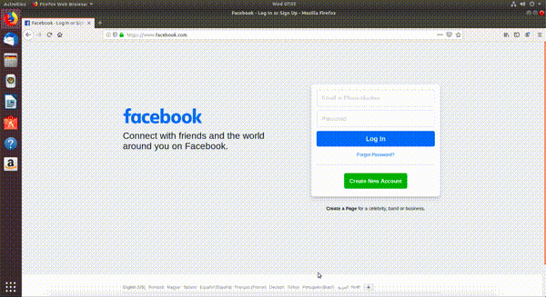

Am trecut prin paginile **www.facebook.com**, **www.hotnews.ro**, **www.hotnews.ro** și înapoi la **www.hotnews.ro**, **www.facebook.com**.

* Folosind scurtături (*shortcuturi*) echivalente cu clickurile pe săgețile stânga/dreapta din browser:
    * Navigare înapoi: ``Alt+săgeată stânga`` sau ``Ctrl+[``.
    * Navigare înainte: ``Alt+săgeată dreapta`` sau ``Ctrl+]``.

.. _basic_navigation_buttons_browser_ex:

Exerciții practice
""""""""""""""""""

#. Deschideți pagina **www.youtube.com**.
   Accesați bara de adrese folsind combinația de taste ``Ctrl+l``.
#. Navigați **înapoi** folosind butonul *Go back one page* până ajungeți la pagina **www.hotnews.com**.
#. Navigați **înainte** folosind combinația de taste ``Alt+săgeată dreapta`` până ajungeți la pagina **www.facebook.com**.
#. Navigați **înapoi** folosind combinația de taste ``Alt+săgeată stânga`` până ajungeți la pagina **www.google.com**.
#. Navigați **înainte** folosind combinația de taste ``Ctrl+]`` până când ajungeți la pagina **www.youtube.com**.
#. Navigați **înapoi** folosind combinația de taste ``Ctrl+[`` până ajungeți la pagina **www.studenti.pub.ro**.
#. Navigați **înainte** folosind butonul *Go forward one page* până ajungeți la pagina **www.youtube.com**.

.. _basic_scroll_browser:

Scroll în browser
^^^^^^^^^^^^^^^^^

Principalul motiv pentru care folosim browsere web este ca să vizualizăm content de pagini.
Navigarea sus/jos în cadrul unei pagini web se numește **scroll**.

Accesăm pagina **https://www.hotnews.ro**.
Putem da scroll în pagină în mai multe moduri:

* Folosind mouse-ul prin rotiță.
* Folosind touchpad-ul.
* Folosind tastele *săgeată sus*/*săgeată* jos.
  Așa ne deplasăm în sus/jos cu câte o linie.
* Folosind combinația de taste ``Alt+scroll up`` și ``Alt+scroll down``.
  Așa ne deplasăm în sus/jos cu câte o linie.
* Folosind butoanele ``PageUp`` și ``PageDown`` de pe tastatură.
  Așa ne deplasăm câte un "ecran" în jos sau în sus.

În imaginea de mai jos se vede cum dăm scroll sus și jos pe pagina **www.hotnews.ro**:

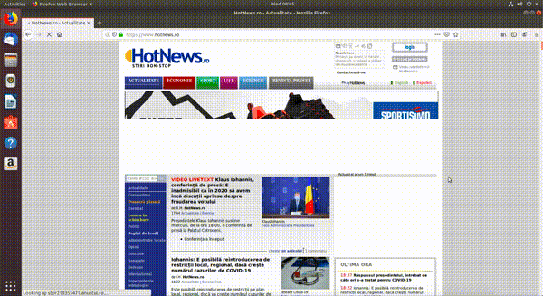

.. _basic_refresh_browser_page:

Reîmprospătarea paginii
^^^^^^^^^^^^^^^^^^^^^^^

Avem situații în care trebuie să reîmprospătăm (*refresh*) conținutul unei pagini web.
Spre exemplu, am deschis o pagină și imaginile nu au fost încărcate corect (am avut probleme cu conexiunea la Internet în acel moment).
Alt caz ar putea fi atunci când așteptăm ca pe o pagină să fie publicate notele noastre la un examen, așa că vrem să reîmpropătăm pagina web să vedem dacă aceasta a fost actualizată.

Întrăm pe pagina **www.bbc.com**.

Putem împrospăta pagina web în mai multe moduri:

* Folosind butonul de remîprospătare (*refresh*) din browser ca în imaginea de mai jos:

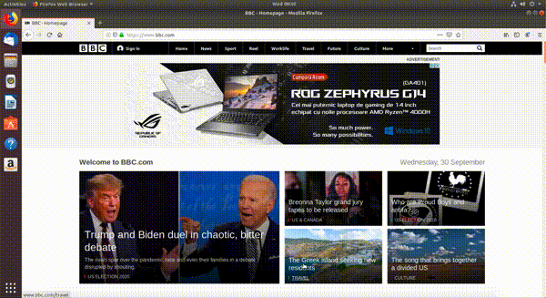

* Folosind tasta ``F5``.
* Folosind shortcutul (*scurtătura*, *combinația de taste*) ``Ctrl+r``.

.. _basic_tabs_browser:

Lucrul cu taburi
^^^^^^^^^^^^^^^^

Un caz pe care îl întâlnim des atunci când lucrăm cu un browser web este să avem mai multe pagini web deschise simultan.
Spre exemplu, avem nevoie să căutăm o informație pe Google cum ar fi *Cum gătim supă de pui acasă*.
Există multe rețete pe Internet, vrem să citim mai multe până să ne hotărăm pe care să o folosim.

Cel mai eficient mod pentru a face acest lucru este să folosim **taburi în browser**.
Aplicația Firefox care rulează poate avea unul sau mai multe taburi pornite.

În sub-subsecțiunile următoare vom învăța cum să deschidem, sa navigăm printre taburi și să închidem taburi eficient.

.. _basic_open_tabs_browser:

Deschiderea taburilor
"""""""""""""""""""""

Atunci când deschide aplicația Firefox se deschide într-un tab, pe pagina principală.
Accesăm pagina **www.google.com**.

Putem deschide un alt tab în browser în mai multe moduri:

* Folosind butonul cu simbolul ``+`` din browser:

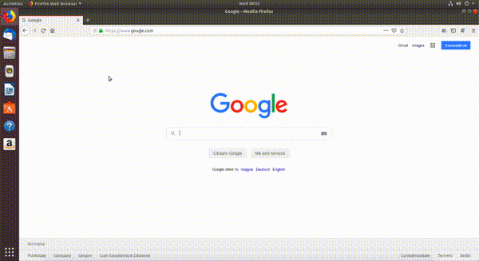

* Folosind scurtătura (*shortcutul*, *combinația de taste*) ``Ctrl+t``.

**Exerciții practice**

#. Deschideți 2 taburi noi folosind simbolul ``+``.
#. În primul tab deschis navigați pe pagina **www.ubuntu.com**, iar în al doilea pe pagina **www.google.com/gmail/**. Folosiți shortcutul ``Ctrl+l`` și apoi scrieți adresa paginilor.

.. _basic_navigate_tabs_browser:

Navigarea printre taburi
""""""""""""""""""""""""

Avem acum 3 taburi deschise: 

#. Primul pe pagina **www.google.com**.
#. Al doilea pe pagina **www.ubuntu.com**.
#. Al treilea pe pagina **www.google.com/gmail/**.

Putem naviga printre cele 3 (la modul general *N*) taburi în mai multe moduri:

* Folosind clickuri. Dăm click pe fiecare tab în parte ca în imaginea de mai jos:

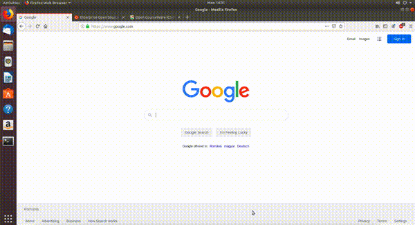

* Folosind shortcutul (*scurtătura*, *combinația de taste*) ``Alt+număr``.
  Spre exemplu, combinația de taste ``Alt+2`` ne va duce pe al doilea tab, adică pe pagina **www.ubuntu.com**.

**Exerciții practice**

#. Deschideți încă 2 taburi pe lângă cele 3 deja deschise.
#. Accesați al patrulea tab folosind combinația de taste ``Alt+4``.
#. Accesați primul tab folosind combinația de taste ``Alt+1``.
#. Apăsați combinația de taste ``Alt+9``. Ce observați?

.. _basic_close_tabs_browser:

Închiderea taburilor
""""""""""""""""""""

Atunci când nu mai avem nevoie să avem o pagină deschisă este bine să închidem tabul.
Fiecare tab deschis consumă resurse ale sistemului, așadar este bine să închidem aplicațiile (sau taburi ale lor) atunci când nu le mai folosim.

Putem închide un tab în browser în mai multe moduri:

* Folosind butonul cu simbolul ``x`` din browser ca în imaginea de mai jos:

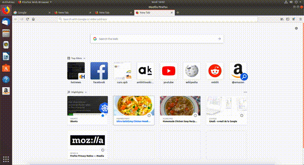

* Folosind combinația de taste ``Ctrl+w``.
* Folosind combinația de taste ``Ctrl+F4``.

**Exerciții practice**

#. Închideți al cincilea tab folosind butonul ``x``.
#. Închideți al doilea și al treilea tab folosind combinația de taste ``Ctrl+w``. Navigați printre taburi folosind combinația de taste ``Alt+număr``.
#. Închideți ultimele 2 taburi folosind combinația de taste ``Ctrl+F4``.

.. note::

    La închiderea ultimului tab din browser se închide aplicația Firefox.

.. _basic_open_link_in_tab_browser:

Deschiderea unui link în alt tab
""""""""""""""""""""""""""""""""

Vrem să găsim rețeta perfectă pentru supă de pui gătită în casă și vrem să deschidem mai multe rețete, fiecare într-un tab, pentru a le compara și a alege rețeta cea mai bună.
Vom învăța cum să deschide linkurile de rețete găsite pe Google într-un alt tab.

Deschidem din nou browserul Firefox.
Întrăm pe `Google <www.google.com>`_ și căutăm *Homemade chicken soup recipe* ca în imaginea de mai jos:

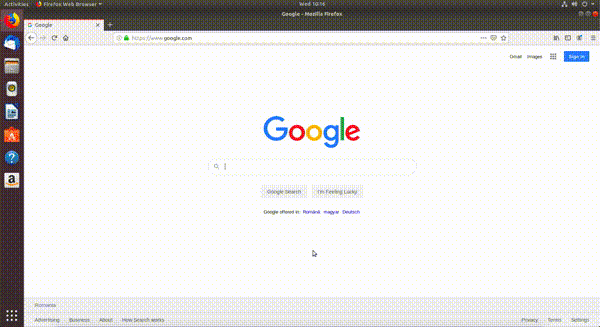

Putem deschide rețele găsite în alte taburi în mai multe moduri:

* Folosind clickuri. Folosim *click dreapta* pe link după care apăsăm *Open Link in New Tab* ca în imaginea de mai jos:

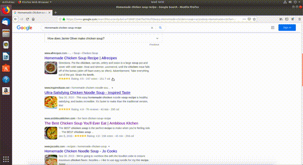

* Apăsând tasta ``Ctrl`` și click pe link.

**Exerciții practice**

#. Deschideți un tab nou și accesați pagina **www.google.com**.
#. Căutați pe Google întrebarea *Which browser should I use Linux*.
#. Deschideți primele 2 linkuri găsite în taburi diferite folosind clickuri.
#. Deschideți următoarele 2 linkuri găsite în taburi diferite folosind tasta ``Ctrl`` urmată de click pe link.
#. Navigați printre paginile deschise folosind combinația de taste ``Alt+număr``.
#. Închideți browserul folosind combinația de taste ``Ctrl+F4``.

.. _basic_bookmarks_browser:

Folosirea bookmark-urilor
^^^^^^^^^^^^^^^^^^^^^^^^^

Atunci când navigăm pe Internet putem să găsim, voluntar sau nu, pagini interesante pe care vrem să le revizităm cândva în viitor.
Ca să nu pierdem aceste pagini folosim **Bookmarkuri**.
În această sub-subsecțiune vom adăuga bookmark-uri noi pentru rețetele cele mai bune de prăjituri găsite pe Internet.

Deschidem din nou browserul Firefox, accesăm pagina **www.google.com** și căutăm *Best cake recipes* ca în imaginea de mai jos:

.. figure:: ./gifs/firefox-best-cake-recipes.gif
    :alt: Căutarea cele mai bune rețete de tort pe Google

Putem să adăugăm un nou bookmark în mai multe moduri:

* Folosind meniul din dreapta sus a browserului ca în imaginea de mai jos:

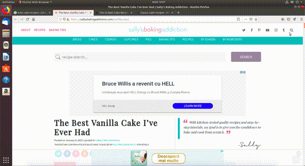

Pașii pentru această variantă sunt:

#. Click pe butonul meniu (*burger button*)
#. Click pe butonul *Library*
#. Click pe butonul *Bookmarks*
#. Click pe butonul *Bookmark This Page*.
#. Click pe butonul *Done*

* Apăsând pe butonul în formă de stea din browser din dreapta sus și apăsarea butonului *Done* ca în imaginea de mai jos:

.. figure:: ./gifs/firefox-bookmark-page-short.gif
    :alt: Adăugarea unei pagini la Bookmarks folosind butonul stea

* Folosind combinația de taste (*scurtătura*, *shortcutul*) ``Ctrl+d`` și apăsarea butonului *Done* ca în modurile de mai sus.

Putem vizualiza toate bookmark-urile pe care le-am create în mai multe moduri:

* Folosind meniul din dreapta sus a browserului ca în imaginea de mai jos:

.. figure:: ./gifs/firefox-view-bookmarks.gif
    :alt: Vizualizarea bookmarkurilor din browser

* Folosind shortcutul (*combinația de taste*) ``Ctrl+Shift+o``.

Exerciții practice
""""""""""""""""""

#. Deschideți pagina **www.youtube.com** într-un tab nou.
#. Căutați primele 3 melodii preferate ale voastre și deschideți-le în taburi noi.
#. Salvați câte un bookmark pentru fiecare melodie.
#. Vizualizați toate bookmark-urile folosind combinația de taste ``Ctrl+Shift+o``.

.. _basic_use_ad_blocker:

Instalarea şi folosirea unui ad blocker
^^^^^^^^^^^^^^^^^^^^^^^^^^^^^^^^^^^^^^^

Atunci când navigăm pe Internet găsim foarte multe informații utile, dar și foarte multe reclame.
Recomandăm instalarea unui **ad blocker** [#ad_blocker]_ pentru a filtra reclamele care apar pe paginile web pe care le deschidem.

În această sub-subsecțiune vom instala ad blocker-ul `AdBlock Plus <https://adblockplus.org>`_ care vine sub forma unui **plug-in** (*o extensie*) pentru browerul web care elimină (pe cât posibil) reclamele de pe paginile web pe care le deschidem.

Pentru a instala ad blockerul *AdBlock Plus* urmăm pașii din imaginea de mai jos:

.. figure:: ./gifs/firefox-install-adblock-plus.gif
    :alt: Instalarea AdBlock Plus

Pașii instalării unui ad blocker
""""""""""""""""""""""""""""""""

#. Apăsăm pe meniul browserului din dreapta sus
#. Apăsăm pe butonul *Add-ons*
#. Ne aflăm în secțiunea *Extensions*.
   În bara de căutare din partea de sus a ecranului scriem *adblock plus* și apăsăm tasta ``Enter``.
   Se deschide un nou tab.
#. Apăsăm pe primul link apărut pe care scrie *AdBlock Plus*.
#. Apăsăm pe butonul *Add to Firefox*.
#. O fereastră de tip pop-up apare și apăsăm pe butonul *Add*.
#. O altă fereastră de tip pop-up apare și apăsăm pe butonul *Okay, Got it*.

.. rubric:: Notă de subsol

.. [#ad_blocker]

        https://en.wikipedia.org/wiki/Ad_blocking

        https://www.monetizemore.com/blog/what-is-an-ad-blocker/