.. _basic_use_cli:

Lucrul în terminal
==================

**Gnome Terminal** (uzual folosit *terminalul*) este o aplicație software, la fel ca *LibreOffice* și *Firefox*.
Terminalul este folosit în general pentru rularea **aplicații software** (*programe*, *utilitare*) care nu au **interfață grafică** (*GUI*).
Exemple de astfel de aplicații / programe / utilitare sunt: **ls**, **tree**, **ps** și **echo**.
Toate acestea (și altele) vor fi prezentate ulterior în această carte.
Pentru moment este suficient să știm că ele există.

Folosim linia de comandă prin intermediul aplicației *Gnome Terminal* care are identificatorul **gnome-terminal**.
Avem nevoie de linia de comandă ca să rezolvăm mai rapid unele taskuri.
Vom aprofunda aceste lucruri în capitolul TODO.

.. _basic_start_cli:

Deschiderea și închiderea terminalului
--------------------------------------

Fiind o aplicație ca oricare alta, avem mai multe moduri prin care putem să **deschidem** aplicația *Gnome Terminal*:

* Folosind iconuri ca în imaginea de mai jos:

* Folosind combinația de taste ``Alt+F2`` ca în imaginea de mai jos:

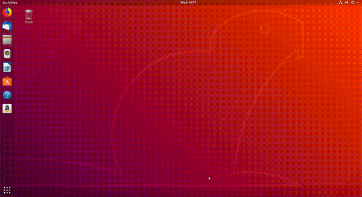

* Apăsând *click dreapta* și apoi butonul *Open Terminal* ca în imaginea de mai jos:

.. figure:: ./gifs/open-terminal-right-click.gif
    :alt: Deschiderea aplicației *Gnome Terminal* folosind click dreapta

* Folosind combinația de taste ``Ctrl+Alt+t``.

Pentru **închiderea** terminalului avem următoarele variante:

* Folosind butonul ``x`` din partea dreaptă-sus a aplicației ca în imaginea de mai jos:

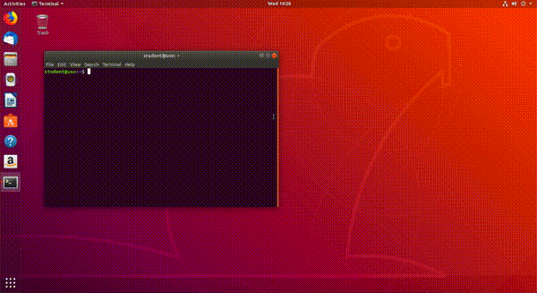

* Folosind combinația de taste ``Shift+Ctrl+q``.

* Folosind comabinația de taste ``Alt+F4`` la fel ca în cazul oricărei alte aplicații.

Exerciții practice
^^^^^^^^^^^^^^^^^^

#. Deschideți aplicația *Gnome Terminal* în toate modurile de mai sus (veți avea aplicația *Gnome Terminal* deschisă de 4 ori).
#. Închideți toate aplicațiile *Gnome Terminal* deschise folosind modurile de mai sus.

.. _basic_tabs_cli:

Folosirea taburilor în terminal
-------------------------------

Avem următoarea situație: deschidem o aplicație din terminal și vrem să monitorizăm câte resurse folosește, totul din linia de comandă.
Ca să facem acest lucru putem să deschidem 2 terminale: unul cu aplicația pe care vrem să o monitorizăm și unul în care pornim aplicația de monitorizare.
Pe lângă aceste 2 acțiuni putem să avem nevoie să facem și altele, iar lucrul cu mai multe terminale deschise devine dificil.

La fel ca atunci când folosim un browser web, avem nevoie de taburi și în terminal.

În următoarele sub-subsecțiuni vom vorbi despre cum să deschidem, să închidem și să navigăm printe taburile din terminal.
Deschide din nou aplicația *Gnome Terminal*.

.. _basic_open_close_tabs_cli:

Deschiderea și închiderea taburilor
^^^^^^^^^^^^^^^^^^^^^^^^^^^^^^^^^^^

Deschidem un nou tab atunci când avem nevoie să facem o altă operație fără a o întrerupe pe cea de acum.
Închidem taburile în momentul în care am terminat o operație pentru a nu încărca sistemul.

Putem **deschide** un nou tab în terminal în mai multe moduri:

* Folosind meniul aplicației ca în imaginea de mai jos:

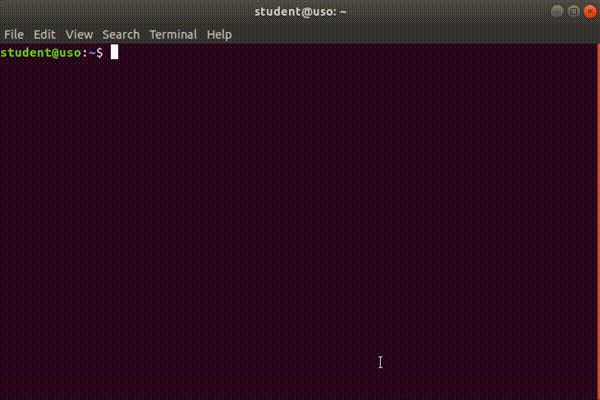

Apăsăm pe butonul *File* după care pe butonul *New Tab*.

* Apăsând *click dreapta* în interiorul terminalului după care pe butonul *New Tab* ca în imaginea de mai jos:

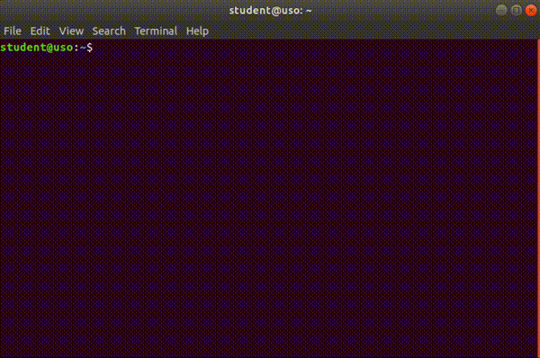

* Folosind shortcutul (*combinația de taste*) ``Ctrl+Shift+t``.

Putem **închide** un tab în terminal în mai multe moduri:

* Folosind meniul aplicației ca în imaginea de mai jos:

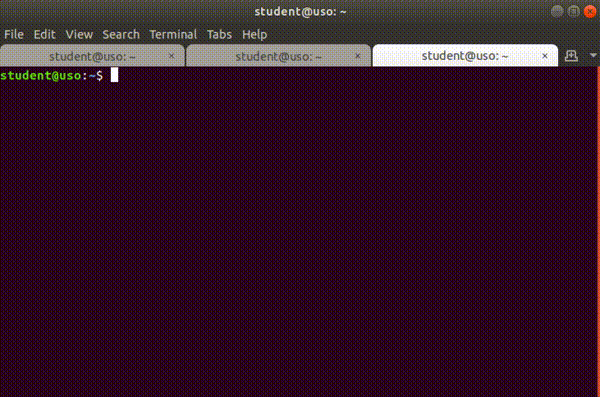

* Folosind butonul (*simbolul*) ``x`` din dreptul tabului ca în imaginea de mai jos:

* Folosind combinația de taste ``Ctrl+Shift+w``.

.. _basic_open_close_tabs_cli_ex:

Exerciții practice
""""""""""""""""""

#. Deschideți un nou terminal folosind combinația de taste ``Ctrl+Alt+t``.
#. Deschideți 2 taburi de terminal noi folosind combinația de taste ``Ctrl+Shift+t``,
#. Închideți primul tab din terminal folosind butonul ``x``.
#. Închideți tabul rămas folosind combinația de taste ``Ctrl+Shift+w``.

.. _basic_navigate_tabs_cli:

Navigarea printe taburi
^^^^^^^^^^^^^^^^^^^^^^^

Vrem să navigăm printre taburile din terminal la fel ca în cazul browserului web pentru a putea trece de la o operație începută la alta rapid.

Avem mai multe variante să facem acest lucru:

* Folosind clickuri ca în imaginea de mai jos:

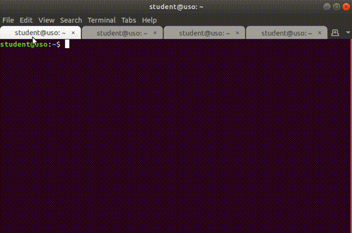

* Folosind combinația de taste ``Alt+număr`` unde *număr* este numărul (*indexul*) tabului la care vrem să ajungem.
  Primul tab are numărul 1, al nouălea tab are numărul 9, iar al zecelea are numărul 0.

* Folosind combinațiile de taste (*shortcuturile*) ``Ctrl+PageUp`` pentru a merge la următorul tab și ``Ctrl+PageDown`` pentru a trece la tabul anterior.

.. _basic_navigate_tabs_cli_ex:

Exerciții practice
""""""""""""""""""

#. Deschdideți un nou terminal folosind combinația de taste ``Ctrl+Alt+t``.
#. Deschideți 2 taburi folosind meniul aplicațitei.
#. Deschideți încă 2 taburi folosind combinația de taste ``Ctrl+Shift+t``.
#. Mergeți pe primul tab folosind combinația de taste ``Alt+1``.
#. Mergeți pe al treilea tab folosind combinația de taste ``Ctrl+PageUp`` de câte ori este nevoie.
#. Mergeți pe al doilea tab folosind combinația de taste ``Alt+2``.
#. Mergeți pe primul tab folosind combinația de taste ``Ctrl+PageDown``.
#. Închideți aplicația *Gnome Terminal* în orice mod vreți.

.. _basic_start_apps_cli:

.. _basic_shortcuts_cli:

Alte shortcuturi utile în terminal
----------------------------------

Pe lângă shortcuturile de pornire/oprire a terminalului, de lucru cu taburi în terminal, mai există și alte shortcuturi pe care dacă le reținem vom putea lucra în terminal foarte rapid.

În sub-subsecțiunile următoare vom vorbi despre scrollul, copierea și lipirea textului în terminal și despre golirea ecranului de termninal.

.. _basic_scroll_cli:

Scroll
^^^^^^

Pentru a da scroll în terminal avem mai multe moduri:

* Folosind mouse-ul sau touchpad-ul.
* Folosind combinațiile de taste ``Shift+PageUp`` și ``Shift+PageDown``.

.. _basic_copy_paste_cli:

Copierea și lipirea textului
^^^^^^^^^^^^^^^^^^^^^^^^^^^^

Copierea și lipirea de text sunt operații *foarte* importante.
Vrem să evităm greșile de scriere pe cât posibil.
Folosirea acestor feature-uri este un mod de a preveni greșeli de scriere.

.. _basic_clear_screen_cli:

Golirea ecranului de terminal
^^^^^^^^^^^^^^^^^^^^^^^^^^^^^

Pentru reîmprospătarea ecranului de termninal avem mai multe variante:

* Folosind comanda ``clear`` în terminal ca în imaginea de mai jos:

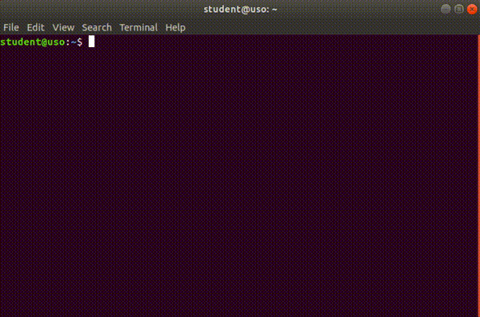

* Folosind combinația de taste ``Ctrl+l`` în terminal.

.. _basic_copy_cli:

Copierea textului
"""""""""""""""""

În Ubuntu 20.04, copiem text în mai multe moduri:

* Selectăm textul, apăsăm *click dreapta* și apăsăm butonul *Copy* ca în imaginea de mai jos:

* Selectăm textul și apăsăm combinația de taste ``Ctrl+c``.

În cadrul aplicației *Gnome Terminal* copierea textului se face diferit față de alte aplicații, în mai multe moduri:

* Selectăm textul, apăsăm *click dreapta* și apăsăm butonul *Copy* ca în imaginea de mai jos:

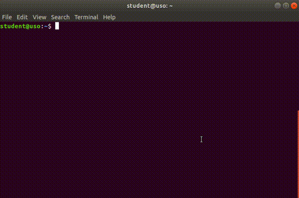

* Selectăm textul și apăsăm combinația de taste ``Ctrl+Shift+c``.

.. warning::

    Pentru copierea textului din terminal folosim combinația de taste ``Ctrl+Shift+c`` și **NU** ``Ctrl+c``.
    În terminal, combinația de taste ``Ctrl+c`` are rolul de a opri o aplicație / un utilitar pornit [#ctrlc]_.

.. _basic_paste_cli:

Lipirea textului
""""""""""""""""

În Ubuntu 20.04, lipim text în mai multe moduri:

* Apăsăm *click dreapta* și apăsăm butonul *Paste* ca în imaginea de mai jos:

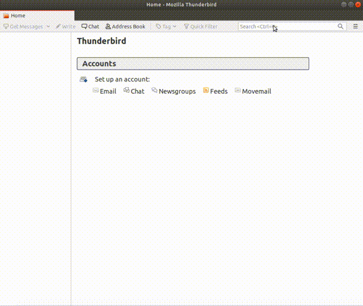

* Selectăm textul și apăsăm combinația de taste ``Ctrl+v``.

În cadrul aplicației *Gnome Terminal* lipirea textului se face diferit față de alte aplicații, în mai multe moduri:

* Apăsăm *click dreapta* și apăsăm butonul *Paste* ca în imaginea de mai jos:

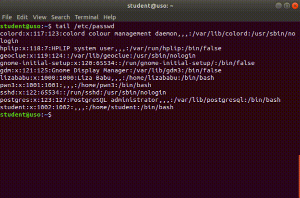

* Apăsăm combinația de taste ``Ctrl+Shift+v``.

.. warning::

    Pentru lipirea textului în terminal folosim combinația de taste ``Ctrl+Shift+v`` și **NU** ``Ctrl+v``.

Pornirea aplicațiilor din terminal
----------------------------------

Pornirea unei aplicații poate fi realizată din linia de comandă (CLI) folosind șirul care identifică aplicația, la fel ca în cazul folosirii ``Alt+F2``.

.. _basic_start_gui_apps_cli:

Pornirea aplicațiilor grafice din terminal
^^^^^^^^^^^^^^^^^^^^^^^^^^^^^^^^^^^^^^^^^^

Pornim o aplicație de terminal folosind fie iconul corespunzător fie Alt+F2 urmat de șirul (comanda) gnome-terminal.
În aplicația de terminal, pornim aplicația Firefox scriind șirul (*comanda*) **firefox**, urmat de apăsarea tastei ``Enter``, ca în imaginea de mai jos:

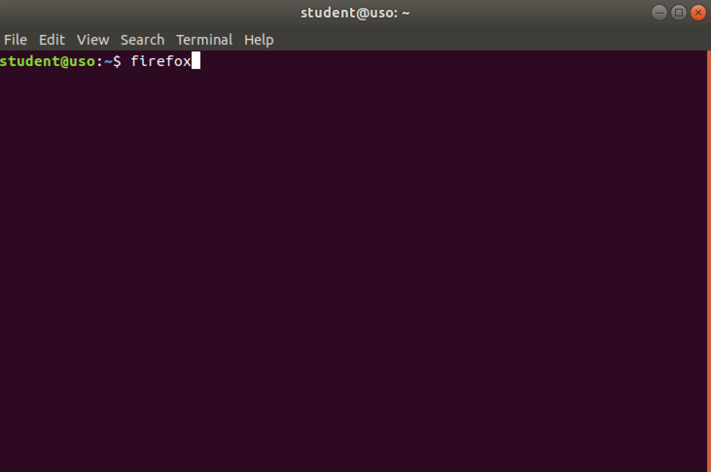

Aplicația Firefox va porni.

În acest moment, în aplicația de terminal nu mai putem introduce noi comenzi pentru a porni alte aplicații.
Va trebui să oprim aplicația Firefox.
Oprim aplicația Firefox din mediul grafic (click pe butonul de închidere a ferestrei sau folosirea combinației de taste ``Alt+F4``) sau din terminal folosind combinația de taste ``Ctrl+c``.

.. _basic_start_gui_apps_cli_ex:

Exerciții practice
""""""""""""""""""

#. La fel ca mai sus, porniți o aplicație browser de fișiere (file browser) folosind linia de comandă. În Ubuntu 20.04 GNOME browserul de sistem de fișiere este ``nautilus``.
#. Porniți aplicația *LibreOffice* folosind linia de comandă.

.. _basic_start_cli_apps_cli:

Pornirea aplicațiilor CLI din terminal
^^^^^^^^^^^^^^^^^^^^^^^^^^^^^^^^^^^^^^

*Aplicațiile CLI*, numite și **utilitare**, sunt proiectate pentru a fi pornite și folosite în linia de comandă.
Cel mai adesea numim aplicațiile în linie de comandă *utilitare* sau, pur și simplu, *comenzi*.
Scriem numele utilitarului / comenzii într-un terminal și aceasta va fi pornită [#commandline]_ . De exemplu, dacă dorim să afișăm utilizatorii prezenți în sistem, pornim o aplicație de terminal și folosim utilitarul who:

.. code::

    student@uso:~$ who
    student  :0           2020-09-04 17:42 (:0)
    student  pts/0        2020-09-19 15:57 (192.168.56.1)

Sau, dacă dorim să vedem câtă memorie avem (disponibilă) în sistem, folosim utilitarul ``free``:

.. code::

    student@uso:~$ free
                total        used        free      shared  buff/cache   available
    Mem:        2040972     1025716       83824       32916      931432      794692
    Swap:        777300       37056      740244

.. _basic_start_cli_apps_cli_ex:

Exerciții practice
""""""""""""""""""

#. Porniți utilitarul ``ls`` (de listare a conținutului unui director în linia de comandă (CLI)) folosind linia de comandă.
#. Porniți utilitarul ``df`` (de afișare a spațiului ocupat pe disc) folosind linia de comandă.

.. _basic_stop_cli_apps_cli:

Oprirea forțată a aplicațiilor în linia de comandă
^^^^^^^^^^^^^^^^^^^^^^^^^^^^^^^^^^^^^^^^^^^^^^^^^^

Se poate întâmpla ca o aplicație în linia de comandă să ruleze pentru prea mult timp sau să se blocheze.
Caz în care dorim să o oprim.
Soluția de avarie este să închidem fereastra de terminal, lucru care, de obicei, închide și aplicația.
Soluția mai bună este să închidem doar aplicația.
Acest lucru îl facem folosind combinația de taste ``Ctrl+c`` care oprește aplicația care rulează în terminal [#ctrlc]_.
Acest lucru poate fi realizat și pentru aplicații grafice, așa cum am văzut mai sus.

De exemplu, dacă folosim comanda ``sleep 100`` care se va bloca pentru 100 de secunde, o vom opri folosind ``Ctrl+c`` ca mai jos:

.. code-block:: bash

    student@uso:~$ sleep 100
    ^C
    student@uso:~$

.. _basic_stop_cli_apps_cli_ex:

Exerciții practice
""""""""""""""""""

#. Folosiți următoarele comenzi care pornesc aplicații care durează mult și opriți-le forțat:
    * ``ls -R /usr``: pentru a afișa recursiv conținutul directorului ``/usr``
    * ``dd if=/dev/zero of=/dev/null``: pentru a consuma timp de procesor (*busy waiting*)
    * ``watch ps``: pentru a monitoriza procesele din terminalul curent

.. rubric:: Note de subsol

.. [#commandline]

    Spre deosebire de scenariul folosirii ``Alt+F2``, când folosim aplicații CLI în linia de comandă, mesajele vor fi vizibile.
    Acest lucru se întâmplă pentru că linia de comandă înseamnă existența unui terminal unde putem vizualiza mesajele.

.. [#ctrlc]

    Pentru anumite aplicații combinația de taste ``Ctrl+c`` poate să nu funcționeze.
    În acest caz putem folosi combinația de taste ``Ctrl+\``, mai puternică.
    Dacă nici ``Ctrl+\`` nu funcționează, va trebui să trimitem aplicației un semnal mai puternic care să o oprească.
    Vom discuta despre semnale în TODO.