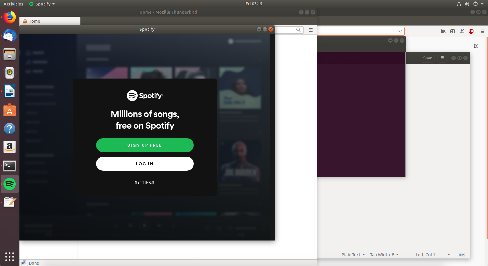
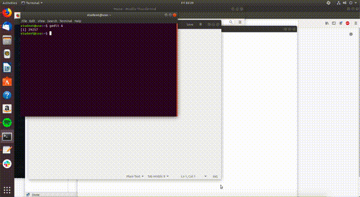
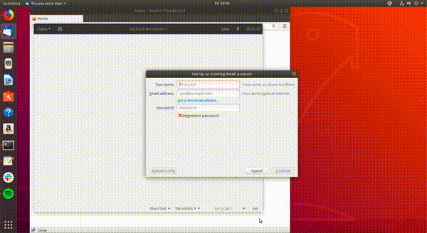

.. _basic_workspaces:

Lucrul cu workspace-uri
=======================

Putem să ajungem la un moment dat să avem foarte multe aplicații deschise simultan, ca în imaginea de mai jos:

Navigarea printre aplicații se poate face în 2 moduri:

* Folosind bara de aplicații (din stângă), ca în imaginea de mai jos:

  .. figure:: ./gifs/change-app-menu.gif
    :alt: Schimbarea aplicației din bara de aplicații

* Folosind combinația de taste ``Alt+Tab``, ca în imaginea de mai jos:

  .. figure:: ./gifs/change-app-alt-tab.gif
    :alt: Schimbarea aplicației folosind ``Alt+Tab``

În imaginile de mai sus avem următoarele aplicații deschise:

* Thunderbird Mail (*aplicație pentru e-mail*)
* Firefox (*browser web*)
* GNOME Terminal (*aplicație de tip terminal*)
* Slack (*aplicație pentru comunicare*)
* Spotify (*aplicație pentru redarea muzicii*)
* Gedit (*editor de text*)

Pentru gestionarea facilă a acestor aplicații putem lucra cu workspace-uri.
În subsecțiunile de mai jos vom vorbi despre cum creăm un nou workspace, cum ne mutăm dintr-un workspace în altul și cum ștergem un workspace.

.. _basic_create_workspace:

Crearea unui workspace nou
--------------------------

Când avem prea multe aplicații deschise simultan, navigarea între ele devine dificilă și consumatoare de timp.
Pentru a face o separare între aplicații folosim **workspace-uri**.
Putem grupa aplicațiile în trei **workspace-uri**:

* **De lucru**: cu aplicațiile *Firefox*, *GNOME Terminal* și *Gedit*
* **De comunicare**: cu aplicațiile *Thunderbird Mail* și *Slack*
* **De media**: cu aplicația *Spotify*

Creăm workspace-urile descrise mai sus, ca în imaginea de mai jos:

Pașii pentru crearea unui workspace nou sunt:

#. Apăsarea pe butonul ``Activities`` din stânga-sus a ecranului.
#. Tragerea aplicației pe care vrem să o mutăm într-un nou workspace, în partea dreaptă a ecranului.
#. Când am terminat apăsăm tasta ``Esc``.

În imaginea de mai sus am separat aplicațiile deschise în 3 workspace-uri.

.. _basic_change_workspace:

Shimbarea workspace-ului
------------------------

Vrem să ne mutăm rapid dintr-un workspace în altul pentru a eficientiza lucrul pe calculator.

Facem acest lucru folosind combinații de taste:

* Folosim combinația de taste ``Alt+Ctrl+săgeată sus`` pentru a merge la workspace-ul anterior.
* Folosim combinația de taste ``Alt+Ctrl+săgeată jos`` pentru a merge la workspace-ul următor.

În imaginea de mai jos vedem cum navigăm între cele 3 workspace-uri pe care le avem:

.. _basic_remove_workspace:

Ștergerea unui workspace
------------------------

Avem două moduri prin care putem să ștergem un workspace:

* Închizând toate aplicațiile deschise din el, ca în imaginea de mai jos:

  .. figure:: ./gifs/remove-workspace-close-apps.gif
    :alt: Ștergerea unui workspace prin închiderea aplicațiilor din el

  În imaginea de mai sus am șters workspace-ul **de media** prin închiderea aplicației *Spotify*.

* Mutând toate aplicațiile din el într-un alt workspace, ca în imaginea de mai jos:

  .. figure:: ./gifs/remove-workspace-move-apps.gif
    :alt: Ștergerea unui workspace prin mutarea aplicațiilor din el

  În imaginea de mai jos ștergem workspace-ul **de comunicare** prin mutarea aplicațiilor *Slack* și *Thunderbird Mail* în workspace-ul **de lucru**.
