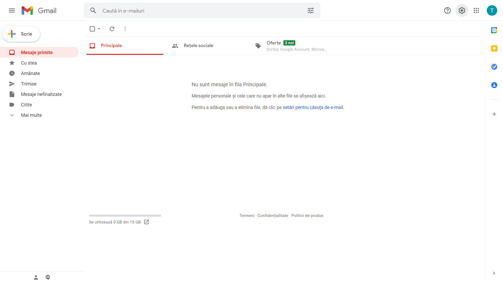
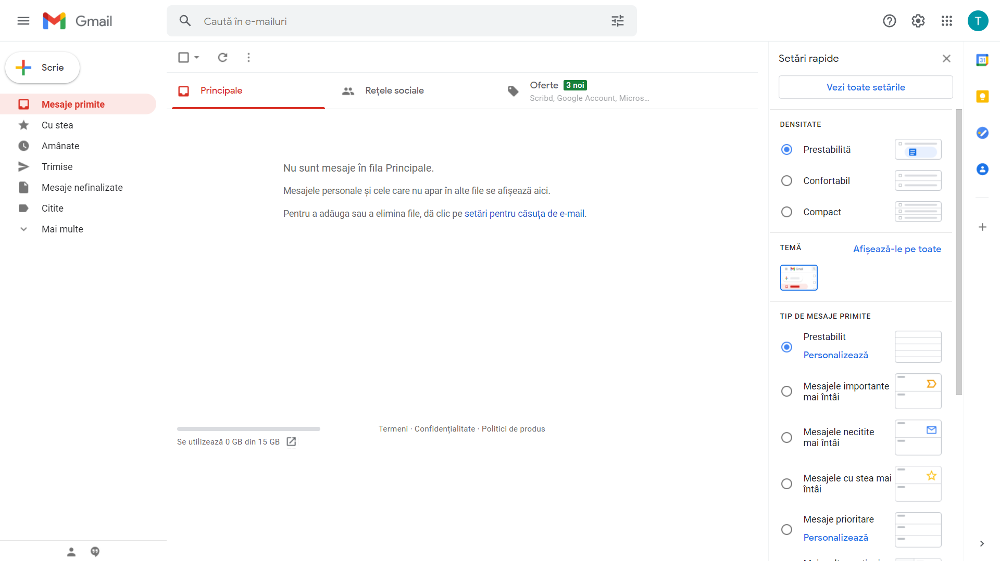
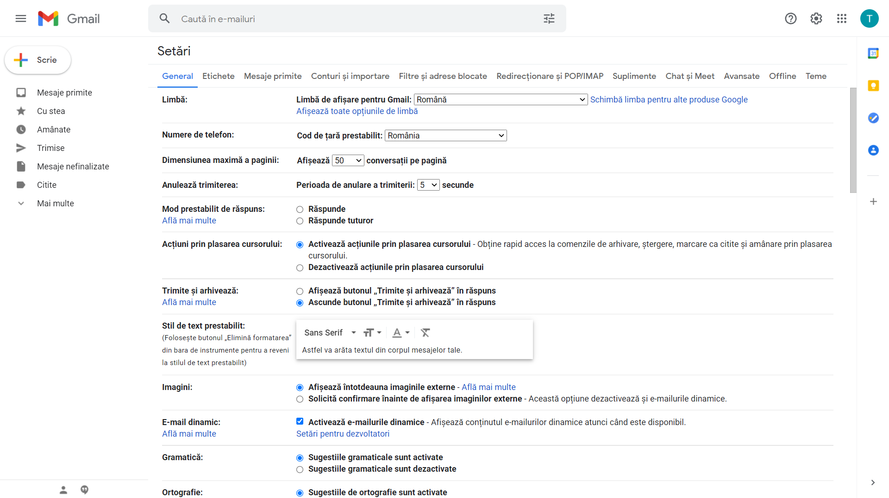
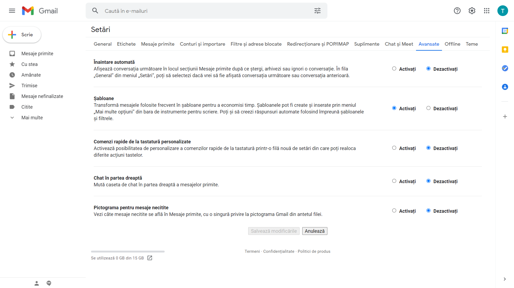
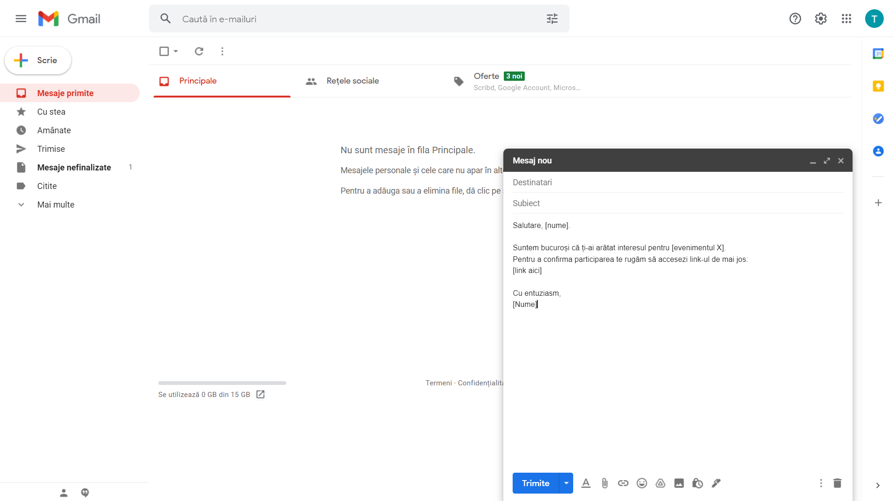
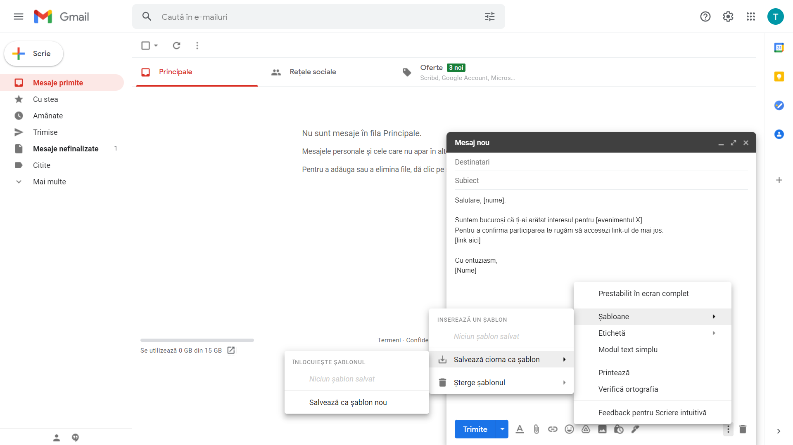
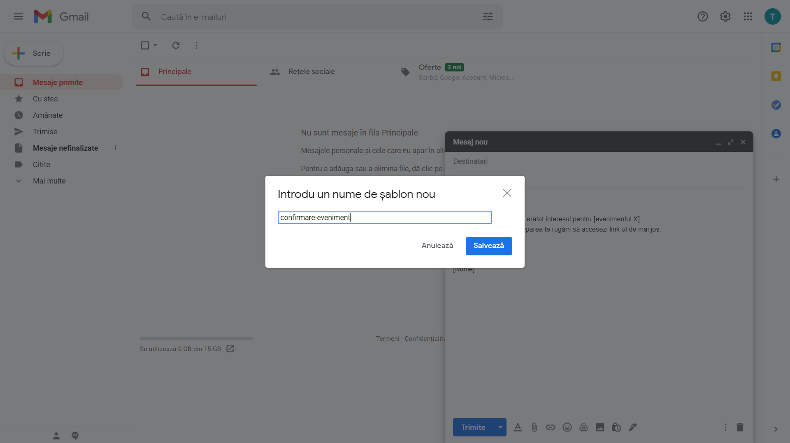
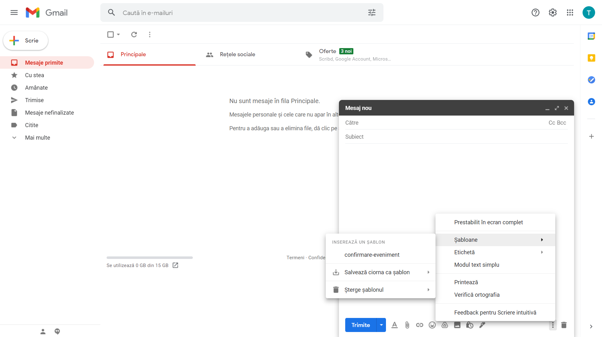
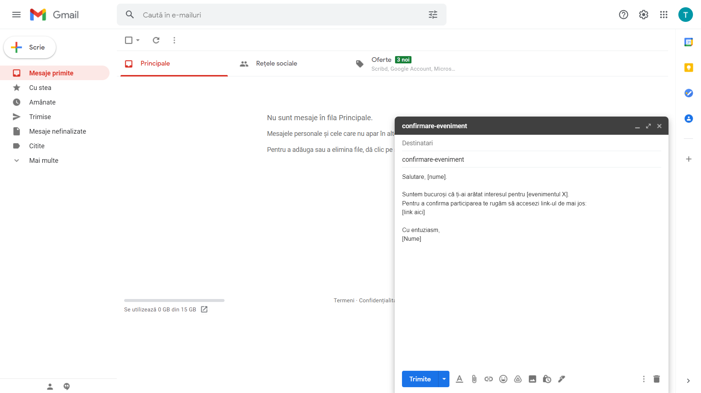

.. _gmail_templates:

Automatizarea scrierii emailurilor
==================================

Mailul este o formă de comunicare omniprezentă în viața profesională de astăzi.
Putem împărți mailurile pe care le scriem în două categorii:

#. nestructurate: sunt obiective, adresează o problemă, o acțiune specifică și nu respectă un șablon anume
#. generice: promovăm un eveniment, un program de internship, mulțumim celor care ne-au ajutat în organizarea unui eveniment, anunțăm un examen, etc.

Pentru mailurile generice ne putem defini șabloane care au un conținut predefinit pe care apoi putem să îl reutilizăm.
Toți clienții de email oferă această funcționalitate.
Pentru simplicate, în cele ce urmează vom folosi ca exemplu serviciul ``GMail``.

Accesăm serviciul GMail navigând pe adresa ``mail.google.com``.

Pentru a putea folosi șabloane, mai întâi trebuie să activăm funcționalitatea.
Accesăm *Setările* făcând click pe imaginea "roții dințate".
Aceasta ne va afișa setările rapide.

Dăm click pe butonul *Vezi toate setările*.

Funcția șabloanelor se găsește în tabul setărilor avansate.
Dăm click pe butonul *Avansate*.

În dreptul categoriei *Șabloane* dăm click pe butonul *Activați* și apoi dăm click pe butonul *Salvează modificările*.

Acum putem salva șabloane, pe care apoi să le refolosim.
Să presupunem că am promovat un eveniment și avem o listă cu adresele de email ale oamenilor care s-au arătat interesați de acest eveniment.
Vrem să dăm un email în care să le cerem oamenilor să acceseze un link pentru a confirma participarea.
Începem prin a compune emailul.

Folosim sintaxa **[Nume]**, **[evenimentul X]**, etc pe post de placeholder; astfel ne va fi mai ușor să identificăm textul pe care vrem să-l completăm cu detaliile specifice evenimentului.
Pentru a salva șablonul dăm click pe cele trei puncte (mai multe opțiuni) din colțul dreapta-jos, click pe *Șabloane*, apoi *Salvează ciorna ca șablon* și în final *Salvează ca șablon nou*.

Dăm un nume intuitiv șablonului a.î. să îl putem identifica cu ușurință pe viitor.

Pentru a folosi șablonul salvat compunem un email nou, dăm click pe cele trei puncte (mai multe opțiuni) din colțul dreapta-jos, click pe *Șabloane*, apoi selectăm șablonul dorit (în acest exemplu: *confirmare-eveniment*).

Textul predefinit va fi introdus în corpul emailului, iar numele șablonului va fi folosit ca **Subiectul** emailului.

Exerciții
"""""""""

#. Numele unui șablon este folosit, în mod automat, pentru câmpul **Subiect**.
   Numele folosit anterior (*confirmare-eveniment*) nu este potrivit.
   Un nume mai potrivit este *Confirmare participare eveniment*.
   Modificați numele șablonului.

#. Textul șablonului de mai devreme începe cu formularea "Salutare, [nume]".
   Aceasta presupune că vom trimite câte un email fiecărei persoane în parte, urmând să modificăm *[nume]* cu numele acesteia.
   Această abordare ne-ar consuma foarte mult timp.
   Preferăm să trimitem un mail mai generic către toți participanții.
   Modificați textul șablonului astfel încât acesta să înceapă doar cu "Salutare.".

   **Notă:** o greșeală frecventă, atunci când sunt trimise emailuri către liste de oameni, este ca emailul să conțină în câmpul **To:** întreaga listă.
   Această abordare nu este O.K. deoarece participantul X a fost de acord să împărtășească adresa lui de email doar cu organizatorii, nu și cu ceilalți participanți.
   Modul corect în care trimitem un email către un grup de persoane este folosind câmpul **BCC** (Blind Carbon Copy): persoanele incluse în BCC vor primi emailul, dar nu vor vedea celelalte adrese de email incluse în BCC.

#. Utilizarea șabloanelor este o metodă bună de automatizare a scrierii emailurilor.
   O altă metodă utilă este definirea unei semnături.
   Aceasta va fi inclusă în mod automat la finalul fiecărui email, ex. "Crunch it, Echipa USO!".
   Pentru a creea o semnătură accesați (1) *Setări*, (2) *Vezi toate setările*, (3) în categoria *General* există câmpul *Semnătură*.
   Definiți-vă o semnătură folosind butonul *Creează o etichetă nouă*.

#. Atunci când suntem plecați în vacanță, putem activa funcția de *Răspuns automat* a serviciului de email.
   Pentru a defini un răspuns automat accesați (1) *Setări*, (2) *Vezi toate setările*, (3) în categoria *General* există câmpul *Răspuns automat*.
   Definiți-vă un răspuns automat pentru ziua de astăzi și rugați un coleg să vă dea un email pentru a testa comportamentul.