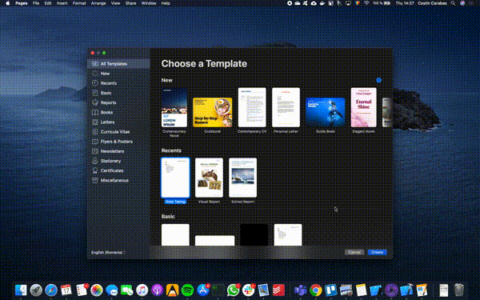
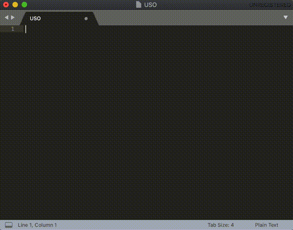
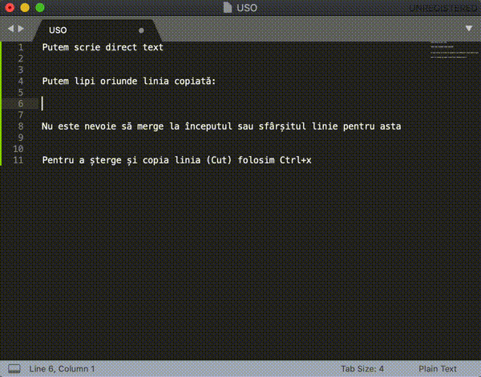
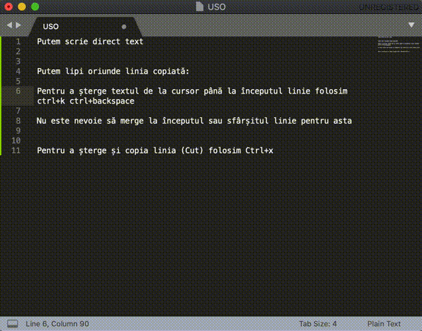
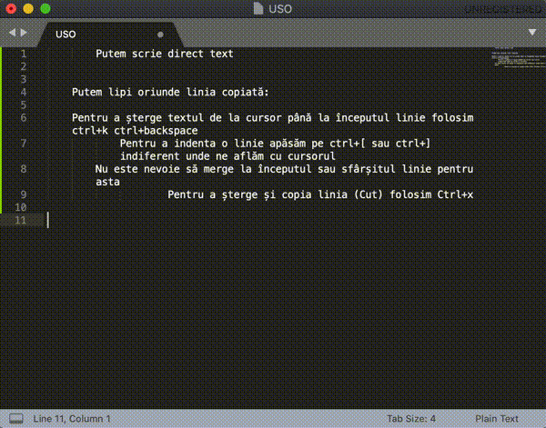
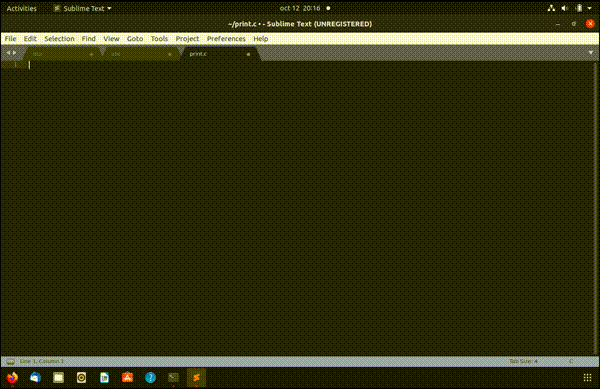
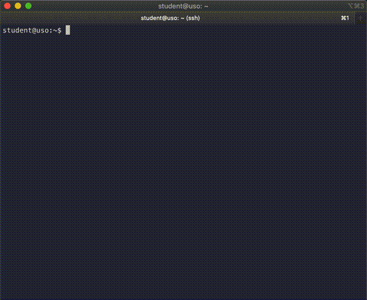

Editor de text
==============

O acțiune foarte des întâlnită este modificarea unor fișiere.
Fie că scriem în jurnal, facem un TODO list sau scriem cod, trebuie să scriem într-un fișier.
Pentru a modifica un fișier, folosim un program numit **editor de fișier**.
Există două tipuri de editoare de fișier: **editoare în mod grafic** sau **editoare în linie de comandă**.
Vom detalia în continuare aceste două categorii.

.. note::
    Nu există un editor bun sau prost.
    Există un editor potrivit sau nepotrivit.

Editor grafic
-------------
Folosit în mod uzual de utilizatori non-tehnici, aceste tipuri de editoare au o interfață grafică ce permit modificarea fișierelor într-un mod cât mai ușor, facil.

Poate cel mai folosit editor din această categorie este `Microsoft Word`_.
Scopul acestuia este ușurința în folosință: există multe capabilități (culori, marime font, stil, aranjare în pagină) pentru crearea de conținut, iar opțiunile sunt ușor de găsit și folosit.
Acesta este salvat într-un fișier cu format specific.
Utilizarea acestuia se rezumă doar la documente.
Un alt editor de text este `Notepad++`_.
Acesta este mai simplu, cu mai puține opțiuni, ceea ce îl face mai adecvat pentru programare.

Un editor foarte folosit pentru programare este `Sublime`_.
Acesta este și editorul grafic pe care îl vom folosi în această carte.
Are opțiuni specifice pentru a ajuta un programator să scrie cod mai ușor, mai facil, ceea ce îl face mai bun decât `Notepad`++`.
Ele pot oferi următoarele:

* Buton pentru compilare și execuție
* Auto-indentare (alinierea liniilor de cod)
* Auto-completare a numelor de funcții și variabile
* Suport pentru debugging
* Integrarea cu alte componente: de exemplu editorul `Xcode`_ (de la Apple) este integrat cu simulator (iPhone). Printr-o singură apăsare de buton, se pornește simulatorul de iPhone și se execută aplicația.

Alte editoare grafice: `Sublime`_, `gedit`_, `Visual Studio`_, `Xcode`_.

.. _gedit: https://wiki.gnome.org/Apps/Gedit
.. _Visual Studio: https://visualstudio.microsoft.com/
.. _Sublime: https://www.sublimetext.com/3
.. _Microsoft Word: https://www.microsoft.com/en-us/microsoft-365/word>
.. _Notepad++: https://notepad-plus-plus.org/
.. _Xcode: https://developer.apple.com/xcode/

Interacțiunea cu fișiere cu ajutorul editoarelor grafice
^^^^^^^^^^^^^^^^^^^^^^^^^^^^^^^^^^^^^^^^^^^^^^^^^^^^^^^^

Mai jos este un exemplu de interacțiune cu editorul `Pages`_, un editor de text de la Apple.
Editarea documentelor este simplă, intuitivă și cu multe opțiuni.

.. _Pages: https://www.apple.com/pages/

Putem adăuga text foarte intuitiv.
Am modificat dimensiunea, culoarea, fontul textului foarte ușor.
Aceasta este puterea unui editor grafic.

Însă, acest tip de editor grafic nu are opțiuni utile pentru programare.
În continuare vom folosi ``sublime``.

Deschiderea unui fișier se poate face folosind utilitarul ``subl``:

.. code-block: bash

    student@uso:~$ subl fișier

O listă de comenzi utile pentru editorul Sublime găsim `aici`_.
În continuare prezentăm cele mai populare dintre ele.

.. _aici: https://www.shortcutfoo.com/app/dojos/sublime-text-3-win/cheatsheet

Folosim combinația de taste ``Ctrl+x`` pentru *cut*:

Folosim combinația de taste ``Ctrl+u`` pentru *undo*, iar pentru a șterge de la cursor până la începutul liniei ``Ctrl+k Ctrl+backspace``:

Indentarea se face cu ``Ctrl+[`` și ``Ctrl+]``:

Duplicăm o linie folosind ``Shift+Ctrl+d``:

Pentru a compila cod folosim combinația de taste ``Ctrl+b``:

Exerciții - editor grafic
"""""""""""""""""""""""""

#. * Folosind editorul de text `Sublime`, disponibil de VM, deschideți fișierul ``Romanian Presidents`` și completați fișierul cu cel puțin 3 președinți ai României.
   * Salvați fișierul în directorul vostru ``home``.
   * Duplicați textul scris anterior (copiat/lipit) de 5 ori;
   * Indentați fiecare linie o dată;

#. * Folosind editorul de text `Sublime`, deschideți fișierul ``program.c``.
   * Salvați fișierul în directorul vostru ``home``.
   * Scrieti cod C (similar exemplului de mai sus) pentru a afișa textul ``Make USO Great Again!``;
   * Folosiți scurtăturile pentru indentare;
   * Compilați folosind scurtătura ``Ctrl+b``.
   * Comentați liniile 2-8.

Editor în linie de comandă
--------------------------

Editoarele în linia de comandă sunt făcute pentru interacțiunea cu terminalul.
Acestea asigură funcționalitați restrânse de formatare în comparație cu editoarele grafice.
Nu există butoane fizice; de obicei comenzile se dau prin combinații de taste.

Un alt caz în care folosim editoarele în linie de comandă este lucrul la distanță.
Atunci când ne conectăm la distanță la un server și nu avem interfață grafică, utilizarea unui editor în linie de comandă este necesară.

Există editoare mai puternice `vim`_, `emacs`_ care permit automatizarea unor sarcini precum cele de mai sus.

Un editor în linie de comandă uzual folosit este `nano`_.
Acesta are funcționalități de bază și este ușor de folosit.

.. _nano : https://www.nano-editor.org/
.. _vim : https://www.vim.org/
.. _emacs : https://www.gnu.org/software/emacs/

Interacțiunea cu fișiere cu ajutorul editoarelor în linie de comandă
^^^^^^^^^^^^^^^^^^^^^^^^^^^^^^^^^^^^^^^^^^^^^^^^^^^^^^^^^^^^^^^^^^^^

Pe parcursul acestei cărți vom folosi ``nano`` pentru a interacționa cu un fișier.

În exemplul de mai sus am deschis fișierul ``avengers`` cu ``nano``.
În urma comenzii, s-a creat fișierul dacă acesta nu exista.
Am adăugat numele a 4 supereroi și am salvat folosind combinația de taste ``Ctrl+x`` după care a apărut întrebarea dacă vrem să salvăm modificările.
În partea de jos apare optiunea de ``Y``
(*yes*) și ``N``
(*no*).
Apăsând pe tasta ``Y``, ne cere să trecem numele fișierului, după care să confirmăm cu tasta **Enter**.

O listă de comenzi utile găsim la `cheatsheet nano`_.

.. _cheatsheet nano : https://www.nano-editor.org/dist/latest/cheatsheet.html

În continuare vom exemplifica scurtături cu ajutorul combinațiilor de taste pentru a spori eficiența.

Exerciții - editor în linie de comandă
""""""""""""""""""""""""""""""""""""""

#. * Folosind editorul în linie de comandă disponibil pe VM (`nano`), deschideți fișierul ``US Presidents`` și completați fișierul cu cel puțin 3 președinți ai Statelor Unite are Americii.
   * Salvati fișierul în directorul vostru ``home``.
   * Duplicați textul scris anterior (copiat/lipit) de 5 ori;
   * Indentați fiecare linie de două ori;
   * Comentați liniile 2-8.

   * Salvați fișierul în directorul vostru ``home``.
   * Duplicați textul scris anterior (copiat/lipit) de 5 ori;
   * Adăugați 4 spații la început de fiecare rând;
   * Adăugați caracterul **#** la început de rând pentru liniile 2-8.

#. * Scrieți cod C (similar exemplului de la editor grafic) pentru a afișa textul ``Make USO Great Again!``;
   * Folosiți scurtăturile pentru indentare;
   * Compilați folosind scurtătura ``Ctrl+b``.
