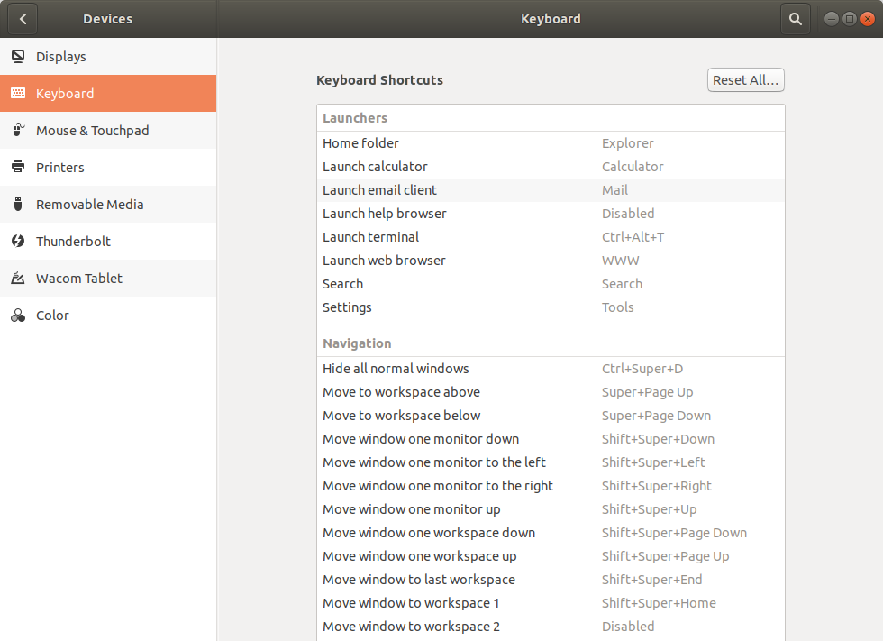
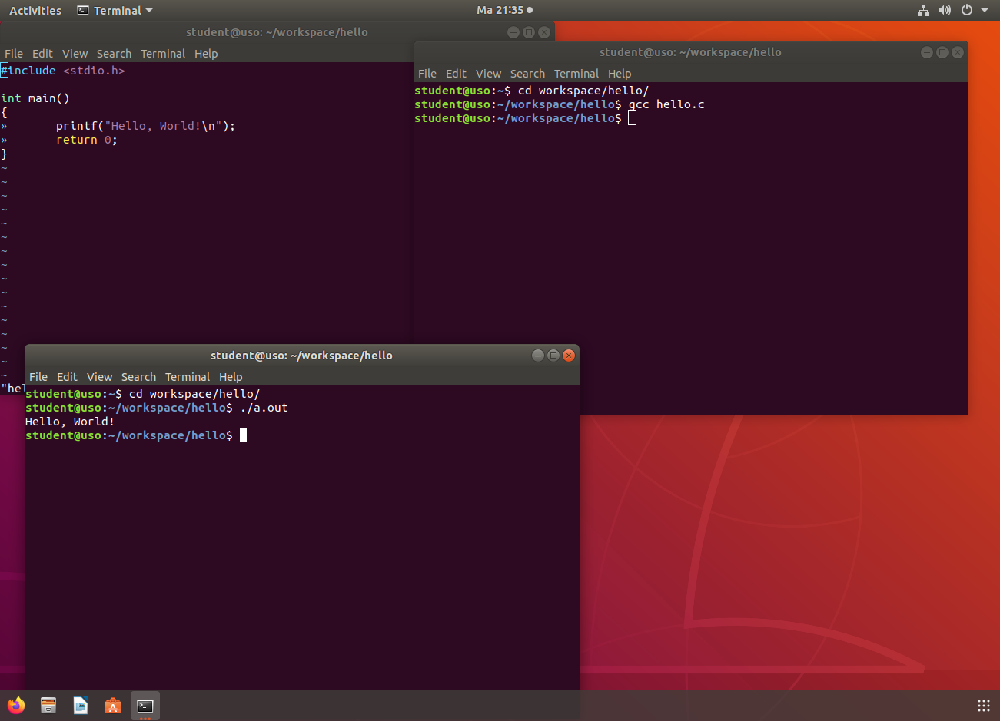
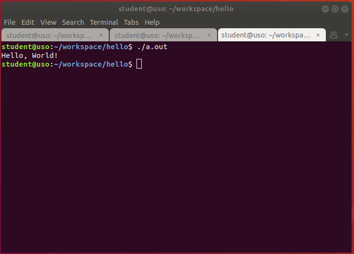
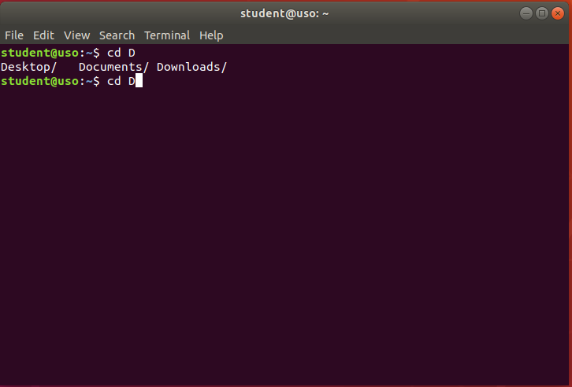
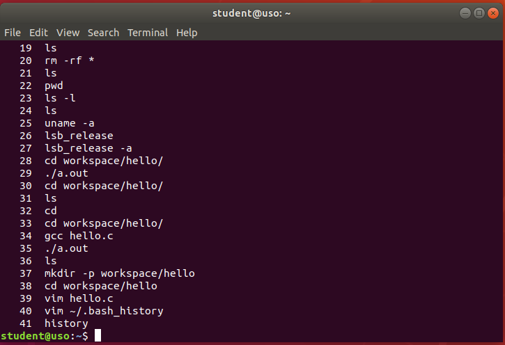

.. _improve_cli_improve_terminal:

Îmbunătățirea lucrului în linia de comandă
==========================================

Principalul atu al utilizării aplicațiilor în linie de comandă, și nu în mediul grafic, este viteza cu care rezolvăm anumite sarcini.
Această viteză este dată de posibilitatea de a combina utilitare în linia de comandă pentru a automatiza procese manuale, repetitive.
Întotdeauna ne dorim să fim mai rapizi și să automatizăm cât mai mult din sarcinile noastre deoarece cu cât ne terminăm treaba mai repede, cu atât avem mai mult timp liber la dispoziție.

De regulă, cu cât petrecem mai mult timp cu mâna pe tastatură și mai puțin pe mouse, cu atât suntem mai rapizi.
Aliniate la această idee, aplicațiile ne pun la dispoziție scurtături pe care suntem încurajați să le folosim pentru a ne utiliza timpul mai eficient.

Scurtături în cadrul sistemului de operare
------------------------------------------

Pornirea unei instanțe noi de terminal
^^^^^^^^^^^^^^^^^^^^^^^^^^^^^^^^^^^^^^

În capitolul **Instalarea și utilizarea aplicațiilor** am văzut diferite moduri prin care putem porni aplicația **GNOME Terminal**.
Unele distribuții pun la dispoziție scurtătura dată de combinația de taste ``Ctrl+Alt+t`` pentru a deschide o nouă instanță de terminal.

Pentru a vedea scurtăturile disponibile la nivel de sistem, și pentru a defini noi scurtături, pe distribuțiile **Ubuntu** accesați *Settings* -> *Devices* -> *Keyboards* -> *Keyboard Shortcuts* din mediul grafic al sistemului de operare, și veți ajunge la un meniu similar cu cel din imaginea de mai jos:

Există scenarii în care folosirea unei singure instanțe de terminal nu este cel mai productiv mod de lucru.
Un astfel de scenariu este dat de dezvoltarea aplicațiilor, scenariu pe care îl putem sparge în trei componente (sub-task-uri): scrierea aplicației, compilarea aplicației și testarea aplicației.
Am putea să folosim un singur terminal pentru cele trei sub-task-uri, dar este de preferat să folosim câte un terminal pentru fiecare sub-task; astfel avem o separare logică mai clară.
Astfel, ferestrele din sistem vor arăta similar cu imaginea de mai jos:

Am făcut un pas în direcția corectă, însă această abordare poate să ducă la o complexitate sporită a managementului ferestrelor: dacă am dezvolta în paralel două aplicații?
Am avea șase ferestre de terminal deschise, prin care trebuie să ciclăm.
Putem găsi o abordare mai bună.

În loc să pornim noi instanțe de terminal în ferestre diferite, le vom porni în taburi diferite ale aceleiași ferestre.
Folosind scurtătura ``Ctrl+Shift+t`` vom deschide o instanță nouă de terminal în cadrul aceleiași ferestre.
Putem observa acest lucru în imaginea de mai jos:

Acum structura este mai ordonată și am păstrat separarea logică: în primul tab vom scrie aplicația, în cel de-al doilea tab o vom compila și în ultimul tab (al treilea) o vom executa.

Separarea logică în fereastră per task și tab per sub-task este benefică atunci când vă ocupați concomitent de mai multe lucruri.

Pornirea unor instanțe noi de terminal folosind scurtături
""""""""""""""""""""""""""""""""""""""""""""""""""""""""""

**Exercițiu**: Deschideți două terminale în ferestre separate.
În fiecare fereastră deschideți un terminal într-un tab nou.
Puteți folosi exercițiile din capitolul **Dezvoltarea Aplicațiilor** ca suport pentru spargerea în task-uri și sub-task-uri.

.. note::

    Folosim combinația de taste ``Ctrl+d`` pentru a executa comanda ``exit`` într-un terminal.
    Aceasta va închide tabul în care a fost rulată.

Navigarea între ferestre și taburi
^^^^^^^^^^^^^^^^^^^^^^^^^^^^^^^^^^

Pentru a naviga între ferestrele aplicațiilor deschise în sistem folosim combinația de taste ``Alt+Tab``.

Pentru a naviga între instanțe ale aceleiași aplicații (ex. două terminale deschise în două ferestre diferite) folosim combinația de taste ``Alt+~`` (apăsăm tastele ``Alt`` și ``~`` simultan).

Pentru a naviga între taburi folosim combinația de taste ``Alt+#num`` unde **#num** reprezintă numărul tabului; taburile sunt numerotate de la unu (1) la nouă (9), de la stânga la dreapta.
Astfel, dacă vrem să navigăm la al doilea tab, într-o fereastră cu mai multe taburi, vom folosi combinația de taste ``Alt+2``.
Un caz particular este reprezentat de tabul cu numărul **10** care poate fi accesat folosind combinația de taste ``Alt+0``.

**Exercițiu**: Deschideți mai mult de 10 taburi într-o fereastră și navigați între ele folosind combinația de taste ``Alt+#num``.
Puteți naviga la al 11-lea tab?

.. note::

    Putem folosi și combinațiile de taste ``Ctrl+PgDn`` și ``Ctrl+PgUp`` pentru a naviga între taburile pe care le avem deschise.
    Putem folosi aceste scurtături în cazul în care avem mai mult de 10 taburi deschise.

Redimensionarea ferestrelor
^^^^^^^^^^^^^^^^^^^^^^^^^^^

Pentru redimensionarea ferestrelor avem două opțiuni:

* Manual, folosind mouse-ul
* Automat, la niște valori predefinite folosind combinația de taste ``Win Key+Arrow Keys``

**Exercițiu**: Deschideți două aplicații: un terminal și un browser web (Firefox).
Având terminalul în prim-plan, apăsați combinația de taste ``Win Key+Arrow Left``.
Observați cum fereastra s-a redimensionat și s-a aliniat în jumătatea din stânga a ecranului, în mod automat.
Acum, având browserul în prim-plan, apăsați combinația de taste ``Win Key+Arrow Right``.
Explorați și celelalte combinații de taste.

Scurtături în terminal
----------------------

Tab completion
^^^^^^^^^^^^^^

Funcția de **tab completion** este probabil una dintre cele mai utile funcții expuse de către terminal.
Prin simpla apăsare a tastei ``Tab`` în timp ce scriem numele unei comenzi, al unei opțiuni a unei comenzi sau calea către un director sau fișier, terminalul va completa în mod automat textul.
În cazul în care există mai multe opțiuni pentru auto-complete, prin dubla apăsare a tastei ``Tab`` ne va sugera opțiunile de auto-complete.

În imaginea de mai jos putem observa că pentru comanda ``cd D`` funcția de ``Tab`` completion a găsit mai multe opțiuni valide pentru auto-complete.
În astfel de scenarii, cu mai multe opțiuni valide, apăsarea tastei ``Tab`` o singură dată nu produce niciun rezultat; trebuie să apăsăm tasta ``Tab`` de două ori consecutiv pentru a genera afișarea opțiunilor de auto-complete.

Funcția de auto-complete este extrem de utilă și îmbunătățește semnificativ viteza cu care realizăm acțiuni în terminal.

Funcția este extrem de utilă atunci când lucrăm cu nume de fișiere, directoare și căi din sistem.
În loc să scriem manual o cale către un nume foarte lung lăsăm tasta ``Tab`` să facă asta pentru noi.

Un alt avantaj al folosirii tastei ``Tab`` este că atunci când aceasta nu produce nici un rezultat, este un indicator foarte bun că avem o eroare în comandă: am scris greșit o anumită parte din numele comenzii sau al fișierului, fișierul nu există, etc.

Folosiți funcția de ``Tab`` completion cât mai des cu putință.

.. note::

    Putem să ne găsim în situația în care ecranul terminalului nostru este plin cu rezultatele comenzilor rulate anterior sau cu opțiuni afișate de către auto-complete.
    Putem să curățăm ecranul folosind comanda ``clear``.
    O alternativă mai rapidă este să folosim combinația de taste ``Ctrl+l``.
    Aceasta va produce același rezultat (va curăța ecranul) și are avantajul că poate fi folosită în timp ce scriem deja o comandă.

.. _improve_cli_history_nav:

Navigarea în istoricul unei comenzi
^^^^^^^^^^^^^^^^^^^^^^^^^^^^^^^^^^^

Terminalul implementează funcția de a reține istoricul comenzilor pe care le-am executat.
Pentru a vedea istoricul curent putem rula comanda ``history``.
Vom obține un rezultat asemănător cu cel de mai jos:

Ciclăm prin comenzile date anterior folosind combinația de taste ``Arrow Up``, respectiv ``Arrow Down``.

**Exercițiu**: Ciclați prin istoricul de comenzi folosind combinația de taste ``Arrow Up``, respectiv ``Arrow Down``.

Căutarea inversă în istoricul comenzilor
""""""""""""""""""""""""""""""""""""""""

Terminalul ne pune la dispoziție un mod mai inteligent de a căuta în istoricul comenzilor prin combinația de taste ``Ctrl+r``, ordinea căutării fiind de la cea mai recentă comandă la cea mai veche.
Funcția este cunoscută sub numele de **reverse search**.

Pentru a porni căutarea, apăsați combinația de taste ``Ctrl+r`` și începeți să scrieți o parte din textul comenzii pe care o căutați, de exemplu ``cd``.

.. code-block:: bash

    (reverse-i-search)`cd': cd workspace/hello

De aici, avem următoarele opțiuni:

* Căutăm în continuare o comandă care conține șirul ``cd``, folosind combinația de taste ``Ctrl+r``
* Rulăm comanda pe care am găsit-o, folosind combinația de taste ``Ctrl+o``
* Anulăm căutarea comenzii și revenim la starea inițială, folosind combinația de taste ``Ctrl+g``

.. note::

    Textul căutat se poate afla oriunde în interiorul comenzii; nu trebuie să fie primele litere din comandă.
    Pentru exemplul de mai sus, căutarea folosind textul ``work`` ar fi produs același rezultat

    .. code-block:: bash

        (reverse-i-search)`work': cd workspace/hello

Expandarea comenzilor anterioare
""""""""""""""""""""""""""""""""

Terminalul ne pune la dispoziție și alte moduri prin care putem reutiliza comenzile din istoric.

Atunci când rulăm comanda ``history``, ca în subsecțiunea :ref:`improve_cli_history_nav` , vedem că fiecare comandă din istoric este precedată de un număr:

.. code-block:: bash

    23  ls -l

Acest număr funcționează ca un index pe care îl putem folosi pentru a executa comanda care îi corespunde:

.. code-block:: bash

    student@uso:~$ !23
    ls -l
    total 60
    drwxr-xr-x  2 student student 4096 aug  6  2018 Desktop
    drwxr-xr-x  3 student student 4096 aug 20  2018 Documents
    drwxr-xr-x  2 student student 4096 aug 11 19:35 Downloads
    drwxr-xr-x  2 student student 4096 aug  6  2018 Music
    drwxr-xr-x  2 student student 4096 aug 11 21:08 Pictures
    drwxr-xr-x  2 student student 4096 aug  6  2018 Public
    drwxr-xr-x  2 student student 4096 aug  6  2018 Templates
    drwxr-xr-x  2 student student 4096 aug  6  2018 Videos
    -rw-r--r--  1 student student 8980 aug  6  2018 examples.desktop
    drwxr-xr-x 14 student student 4096 aug 20  2018 uso.git
    -rw-r--r--  1 student student 4827 aug 21  2018 vm-actions-log.txt
    drwxr-xr-x  3 student student 4096 aug 11 20:28 workspace

Observăm că ``!23`` a fost înlocuit (expandat, în abuz de limbaj) cu comanda ``ls -l`` care corespundea indexului **23**.

Un caz particular, foarte des folosit, este ``!!``, care se va înlocui textual cu ultima comandă executată:

.. code-block:: bash

    student@uso:~$ ls
    Desktop    Downloads  Pictures  Templates  examples.desktop  vm-actions-log.txt
    Documents  Music      Public    Videos     uso.git           workspace
    student@uso:~$ !! -l workspace
    ls -l workspace
    total 4
    drwxr-xr-x 2 student student 4096 aug 11 21:32 hello

În exemplul de mai sus observăm că ``!!`` a fost înlocuit cu ``ls`` în textul comenzii, pentru ca apoi să se execute comanda ``ls -l workspace``.

**Exercițiu**: Rulați trei comenzi din istoricul vostru folosind atât înlocuirea numerică (``!2``), cât și înlocuirea ultimei comenzi (``!!``).
Folosiți-vă de faptul că această înlocuire are loc înaintea executării comenzii pentru a adăuga argumente comenzilor, similar exemplului de mai sus.

Reutilizarea argumentelor comenzii anterioare
"""""""""""""""""""""""""""""""""""""""""""""""

Terminalul ne oferă și o sintaxă prin care avem posibilitatea de a reutiliza argumentele comenzii anterioare în corpul comenzii curente.
Acest lucru este util în reutilizarea argumentelor lungi sau complicate, pentru că evităm rescrierea lor.
Astfel nu doar că suntem mai rapizi, dar evităm și apariția unor probleme din categoria typourilor.

Executăm următorul șir de comenzi:

.. code-block:: bash

    student@uso:~$ touch a/very/long/path/that-you-dont-want-to-retype
    student@uso:~$ ls -l !$
    ls -l a/very/long/path/that-you-dont-want-to-retype

Observăm că șirul ``!$`` din comanda ``ls -l !$`` a fost înlocuit cu ultimul argument al comenzii, anterioare, ``touch``.

Executăm următoarele comenzi:

.. code-block:: bash

    student@uso:~$ ls ~/Desktop ~/Documents ~/Downloads
    student@uso:~$ ls -l !^

Observăm că șirul ``!^`` din comanda ``ls -l !^`` a fost înlocuit cu primul argument al comenzii, anterioare, ``~/Desktop``.

Exerciții
"""""""""

#. Afișați istoricul vostru de comenezi.
   Rulați a zecea comandă din istoric, folosind sintaxa ``!#num``.

#. Rulați comanda ``ls -lh``.
   Acum rulați comanda anterioară, folosind sintaxa ``!!``, cu argumentul ``~/Downloads``.

#. Navigați către directorul ``~/Downloads``, folosit ca argument în exercițiul anterior, folosind sintaxa ``!$``.

#. Navigați către directorul ``~/Downloads``, folosit ca argument în exercițiul anterior, folosind sintaxa ``!^``.

Navigarea în interiorul unei comenzi
^^^^^^^^^^^^^^^^^^^^^^^^^^^^^^^^^^^^

Ne găsim des în situația în care căutăm o comandă în istoric folosind funcția de reverse search, modificăm un argument al comenzii și apoi o executăm.
Pentru navigarea în cadrul textului comenzii putem folosi ``Arrow Keys``, iar pentru ștergeri putem folosi tasta ``Backspace`` sau ``Del``.

Terminalul ne pune la dispoziție și o serie de scurtături cu ajutorul cărora putem face realiza aceeași acțiune mai rapid.
Dacă vreți să vă impresionați prietenii, acesta este un mod simplu, dar eficient, de a o face.

Pentru a naviga în corpul textului putem folosi combinațiile de taste:

* ``Ctrl+a`` - mută cursorul la începutul liniei
* ``Ctrl+e`` - mută cursorul la sfârșitul liniei
* ``Ctrl+f`` - mută cursorul cu un caracter înainte
* ``Ctrl+b`` - mută cursorul cu un caracter înapoi
* ``Alt+f`` - mută cursorul cu un cuvânt înainte
* ``Alt+b`` - mută cursorul cu un cuvânt înapoi

Pentru a efectua ștergeri în corpul textului putem folosi combinațiile de taste:

* ``Ctrl+k`` - șterge tot textul de la cursor până la sfârșitul liniei
* ``Ctrl+u`` - șterge tot textul de la cursor până la începutul liniei
* ``Alt+d`` - șterge tot textul de la cursor până la sfârșitul cuvântului

.. tip::

    Textul șters este salvat într-un registru și poate fi folosit folosind combinația de taste ``Ctrl+y``.
    Funcționalitatea este similară cu procesul de **Cut** (``Ctrl+k``, ``Ctrl+u`` sau ``Alt+d``) și **Paste** (``Ctrl+y``).

Exerciții
"""""""""

Rulați comanda ``ls Documents/ Downloads/ Desktop/ Pictures/ Music/`` înainte de a vă apuca de exerciții.

#. Apăsați tasta ``Arrow Up`` pentru a accesa comanda rulată anterior.

#. Săriți la începutul comenzii folosind combinația de taste ``Ctrl+a``.

#. Săriți la sfârșitul comenzii folosind combinația de taste ``Ctrl+e``.

#. Mergeți, cuvânt cu cuvânt, la începutul comenzii folosind combinația de taste ``Alt+b``.

#. Mergeți, cuvânt cu cuvânt, la sfârșitul comenzii folosind combinația de taste ``Alt+f``.

#. Rulați comanda ``ls Docuents/ Downlads/ Dektop/ Pitures/ Muic/``.

#. Apăsați tasta ``Arrow Up`` pentru a accesa comanda rulată anterior.
   Corectați typourile (greșelile de scriere) din comanda anterioară.
   Folosiți combinațiile de taste ``Ctrl+f``, ``Ctrl+b`` pentru a deplasa cursorul în cadrul comenzii.

#. Apăsați tasta ``Arrow Up`` pentru a accesa comanda rulată anterior (comanda corectată).
   Avansați până la începutul cuvântului ``Desktop/``.
   Ștergeți tot până la final folosind combinația de taste ``Ctrl+k``.
   Acum anulați comanda curentă apăsând combinația de taste ``Ctrl+c``.
   În acest moment, textul pe care l-ați șters folosind ``Ctrl+k`` (**Desktop/ Pictures/ Music/**) se află într-un buffer.
   O să rulați comanda ``ls`` pe textul din buffer.
   Scrieți comanda ``ls`` și apoi apăsați combinația de taste ``Ctrl+y``.
   Textul a fost scris din buffer în continuarea comenzii ``ls`` (scrisă de voi).

#. Rulați comanda ``ls Documents/ Downloads/ Desktop/ Pictures/ Music/``.
   Apăsați tasta ``Arrow Up`` pentru a accesa comanda rulată anterior (comanda corectată).
   Avansați până la începutul cuvântului ``Pictures/``.
   Ștergeți cuvântul folosind combinația de taste ``Alt+d``.
   Acum anulați comanda curentă apăsând combinația de taste ``Ctrl+c``.
   În acest moment, textul pe care l-ați șters folosind ``Alt+d`` (**Pictures**) se află într-un buffer.
   O să rulați comanda ``ls`` pe textul din buffer.
   Scrieți comanda ``ls`` și apoi apăsați combinația de taste ``Ctrl+y``.
   Textul a fost scris din buffer în continuarea comenzii ``ls`` (scrisă de voi).
