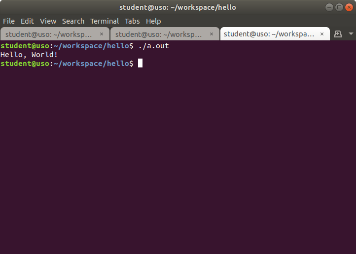

Îmbunătățirea lucrului în linia de comandă 
==========================================

Principalul atu al utilizării aplicațiilor în linie de comandă, și nu în mediul grafic, îl reprezintă viteza cu care rezolvăm anumite task-uri.
Această viteză este dată de posibilitatea de a combina utilitare în linia de comandă pentru a automatiza procese manuale, repetitive.
Întotdeauna ne dorim să fim mai rapizi și să automatizăm cât mai mult din sarcinile noastre pentru că cu cât ne terminăm treaba mai repede, cu atât avem mai mult timp liber la dispoziție.

De regulă, cu cât petrecem mai mult timp cu mâna pe tastatură și mai puțin pe mouse, cu atât suntem mai rapizi.
Aliniate la această idee, aplicațiile ne pun la dispoziție scurtături pe care suntem încurajați să le folosim pentru a ne utiliza timpul mai eficient.

1. Scurtături în cadrul sistemului de operare
---------------------------------------------

a. Pornirea unei instanțe noi de terminal
^^^^^^^^^^^^^^^^^^^^^^^^^^^^^^^^^^^^^^^^^

În capitolul anterior am văzut diferite moduri prin care putem porni aplicația **GNOME Terminal**.
Unele distribuții pun la dispoziție scurtătura dată de combinația de taste ``Ctrl+Alt+t`` pentru a deschide o nouă instanță de terminal.

Pentru a vedea scurtăturile disponibile la nivel de sistem, și pentru a defini noi scurtături, pe distribuțiile **Ubuntu** accesați *Settings* -> *Devices* -> *Keyboards* -> *Keyboard Shortcuts* din mediul grafic al sistemului de operare, și veți ajunge la un meniu similar cu cel din imaginea de mai jos:

.. image:: img/settings-keyboard-shortcuts.png
  :align: center
  :alt: Vizualizarea și definirea scurtăturilor din sistem

Există scenarii în care folosirea unei singure instanțe de terminal nu este cel mai productiv mod de lucru.
Un astfel de scenariu este dat de dezvoltarea aplicațiilor, scenariu pe care îl putem sparge în trei componente (sub-taskuri): scrierea aplicației, compilarea aplicației și testarea aplicației.
Am putea să folosim un singur terminal pentru cele trei sub-taskuri, dar este de preferat să folosim câte un terminal pentru fiecare sub-task; astfel avem o separare logică mai clară.
Astfel, ferestrele din sistem vor arăta similar cu imaginea de mai jos:

.. image:: img/hello-multi-terms.png
  :align: center
  :alt: Separarea unui task în sub-taskuri per terminal

Am făcut un pas în direcția corectă, însă această abordare poate să ducă la o complexitate sporită a managementului ferestrelor: dacă am dezvolta în paralel două aplicații?
Am avea șase ferestre de terminal deschise, prin care trebuie să ciclăm.
Putem găsi o abordare mai bună.

În loc să pornim noi instanțe de terminal în ferestre diferite, le vom porni în taburi diferite ale aceleiași ferestre.
Folosind scurtătura ``Ctrl+Shift+t`` vom deschide o instanță nouă de terminal în cadrul aceleiași ferestre, cum se poate observa în imaginea de mai jos:

Acum structura este mai "curată" și am păstrat separarea logică: în primul tab vom scrie aplicația, în cel de-al doilea tab o vom compila și în ultimul tab (al treilea) o vom rula.

Separarea logică în fereastră per task și tab per sub-task este benefică atunci când vă ocupați concomitent de mai multe lucruri.

Deschideți două terminale în ferestre separate.
În fiecare fereastră deschideți un terminal într-un tab nou.
Puteți folosi exercițiile de la dezvoltarea aplicațiilor ca suport pentru spargerea în taskuri și sub-taskuri.

b. Navigarea între ferestre și taburi
^^^^^^^^^^^^^^^^^^^^^^^^^^^^^^^^^^^^^

Pentru a naviga între ferestrele aplicațiilor deschise în sistem putem folosi combinația de taste ``Alt+Tab``.

Pentru a naviga între instanțe ale aceleiași aplicații (ex. două terminale deschise în două ferestre diferite) putem folosi combinația de taste ``Alt+~``.

Pentru a naviga între taburi putem folosi combinația de taste ``Alt+#num`` unde **#num** reprezintă numărul tabului; taburile sunt numerotate de la unu (1) la nouă (9), de la stânga la dreapta.
Astfel, dacă vrem să navigăm la al doilea tab, într-o fereastră cu mai multe taburi, vom folosi combinația de taste ``Alt+2``.

Deschideți mai mult de 10 taburi într-o fereastră și navigați între ele folosind combinația de taste ``Alt+#num``.
Puteți naviga la al 11-lea tab?

c. Redimensionarea ferestrelor
^^^^^^^^^^^^^^^^^^^^^^^^^^^^^^

Pentru redimensionarea ferestrelor avem două opțiuni:

* Manual, folosind mouse-ul
* Automat, la niște valori predefinite folosind combinația de taste ``Win Key+Arrow Keys``

Deschideți două aplicații: un terminal și un browser web (Firefox).
Având terminalul în prim-plan, apăsați combinația de taste ``Win Key+Arrow Left``.
Observați cum fereastra s-a redimensionat și s-a aliniat în jumătatea din stânga a ecranului, în mod automat.
Acum, având browserul în prim-plan, apăsați combinația de taste ``Win Key+Arrow Right``.
Explorați și celelalte combinații de taste.

d. Sumar: Scurtături în cadrul sistemului de operare
^^^^^^^^^^^^^^^^^^^^^^^^^^^^^^^^^^^^^^^^^^^^^^^^^^^^

* Deschidem o instanță nouă de terminal într-o fereastră nouă folosind combinația de taste ``Ctrl+Alt+t``.
  Deschidem o instanță nouă de terminal într-un tab nou în cadrul aceleiași ferestre folosind combinația de taste ``Ctrl+Shift+t``.

* Folosim combinația de taste ``Alt+Tab`` pentru a naviga între aplicațiile deschise în sistem.
  Folosim combinația de taste ``Alt+~`` pentru a naviga între instanțe ale aceleiași aplicații.
  Folosim combinația de taste ``Alt+#num`` pentru a naviga între taburile din cadrul unei ferestre.

* Combinațiile de taste ``Win Key+Arrow Keys`` redimensionează și realiniază automat ferestrele.

2. Scurtături în terminal
-------------------------

* Navigat în interiorul unei comenzi (ctrl+a, ctrl+e, alt+f, alt+b), modificări (ctrl+k, ctrl+u, alt+d) și paste (ctrl+y)
* History + navigat în istoricul comenzilor: arrow_keys, reverse search (ctrl+r) și ciclat prin ultimul argument al comenzilor anterioare (alt+., !!). Modificat dimensiune istoric

* Pornirea mai multor instanțe de shell în aceelași terminal. Comanda exit și shortcut-ul ctrl+d
* Comanda `clear` și alternativa ctrl+l; bonus pt ctrl+l îl putem folosi în timp ce scriem deja o comandă
* Insistat pe importanța tastei tab și a autocompletion-ului; nu ne face doar mai rapizi, dar putem folosi tab și pt a valida că comanda este validă