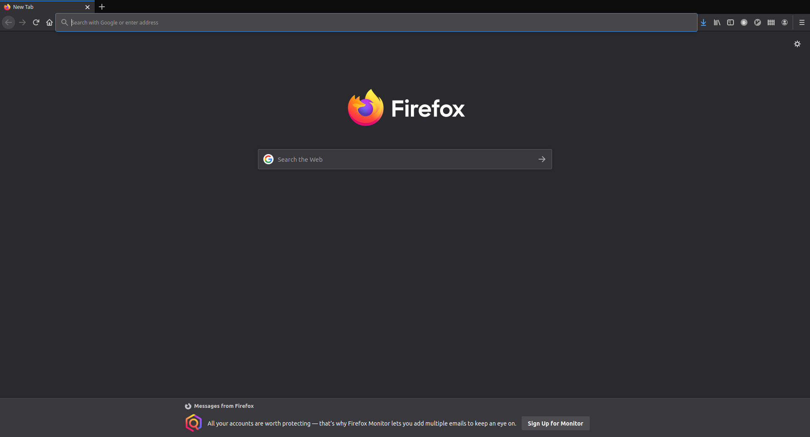

=======================
Efficient browser usage
=======================

1) Opening the browser
----------------------

.. ditaa::

    +--------+   +-------+    +-------+
    |        | --+ ditaa +--> |       |
    |  Text  |   +-------+    |diagram|
    |Document|   |!magic!|    |       |
    |     {d}|   |       |    |       |
    +---+----+   +-------+    +-------+
        :                         ^
        |       Lots of work      |
        +-------------------------+

  Firefox browser

.. caution:: Don't use too many tabs

   Using too many tabs kills the RAM
