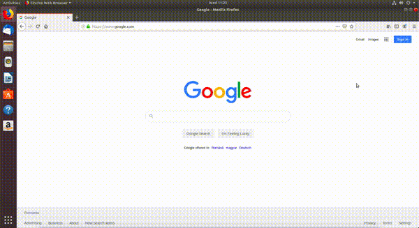
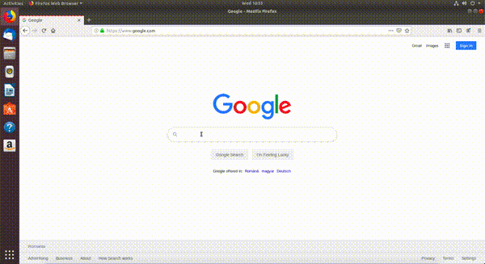

.. _network_browser:

Folosirea eficientă a browserului
==================================

Pentru instrucțiuni despre folosirea scurtăturilor în browser urmăriți secțiunea
:ref:`basic_use_browser`.

.. _network_browser_adblocker:

Instalarea şi folosirea unui ad blocker
---------------------------------------

Atunci când navigăm pe Internet, găsim foarte multe informații utile, dar și foarte multe reclame.
Recomandăm instalarea unui **ad blocker** [#ad_blocker]_ pentru a filtra reclamele care apar pe paginile web pe care le deschidem.
În această subsecțiune vom instala ad blockerul `AdBlock Plus <https://adblockplus.org>`_ care vine sub forma unui **plug-in** (*o extensie*) pentru browerul web, care elimină (pe cât posibil) reclamele de pe paginile web pe care le deschidem.
Pentru a instala ad blockerul *AdBlock Plus* urmăm pașii enumerați mai jos, prezenți și în GIF. Acești pași se aplică pentru browserul Mozilla Firefox.

.. _network_browser_adblocker_install:

Pașii instalării unui ad blocker
^^^^^^^^^^^^^^^^^^^^^^^^^^^^^^^^

#. Apăsăm pe meniul browserului din dreapta sus
#. Apăsăm pe butonul *Add-ons*
#. Ne aflăm în secțiunea *Extensions*.
   În bara de căutare din partea de sus a ecranului scriem *adblock plus* și apăsăm tasta ``Enter``.
   Se deschide un nou tab.
#. Apăsăm pe primul link apărut pe care scrie *AdBlock Plus*.
#. Apăsăm pe butonul *Add to Firefox*.
#. O fereastră de tip pop-up apare și apăsăm pe butonul *Add*.
#. O altă fereastră de tip pop-up apare și apăsăm pe butonul *Okay, Got it*.

.. _network_browser_bookmarks:

Folosirea bookmarkurilor
------------------------

Atunci când navigăm pe Internet putem să găsim, voluntar sau nu, pagini interesante pe care vrem să le revizităm cândva în viitor.
Ca să nu pierdem aceste pagini, folosim **bookmarkuri**.
În această sub-subsecțiune vom adăuga bookmarkuri noi pentru rețetele cele mai bune de prăjituri găsite pe Internet.
Deschidem din nou browserul Firefox, accesăm pagina **www.google.com** și căutăm *Best cake recipes* ca în imaginea de mai jos:

Putem să adăugăm un nou bookmark în mai multe moduri:

* Folosind meniul din dreapta sus al browserului ca în imaginea de mai jos:

.. figure:: ./gifs/firefox-bookmark-page-long.gif
  :alt: Adăugarea unei pagini la Bookmarks folosind meniul browserului

  Pașii pentru această variantă sunt:

  #. Click pe butonul meniu (*burger button*)
  #. Click pe butonul *Library*
  #. Click pe butonul *Bookmarks*
  #. Click pe butonul *Bookmark This Page*.
  #. Click pe butonul *Done*

* Apăsând pe butonul în formă de stea din browser din dreapta sus și apăsarea butonului *Done* ca în imaginea de mai jos:

  .. figure:: ./gifs/firefox-bookmark-page-short.gif
    :alt: Adăugarea unei pagini la Bookmarks folosind butonul stea

* Folosind combinația de taste ``Ctrl+d`` și apăsarea butonului *Done* ca în modurile de mai sus.

Putem vizualiza toate bookmarkurile pe care le-am creat în mai multe moduri:

* Folosind meniul din dreapta sus a browserului ca în imaginea de mai jos:

  .. figure:: ./gifs/firefox-view-bookmarks.gif
    :alt: Vizualizarea bookmarkurilor din browser

* Folosind combinația de taste ``Ctrl+Shift+o``.

Exerciții
^^^^^^^^^

#. Deschideți pagina **youtube.com** într-un tab nou.
#. Căutați primele 3 melodii preferate ale voastre și deschideți-le în taburi noi.
#. Salvați câte un bookmark pentru fiecare melodie.
#. Vizualizați toate bookmarkurile folosind combinația de taste ``Ctrl+Shift+o``.

.. rubric:: Notă de subsol

.. [#ad_blocker]

        https://en.wikipedia.org/wiki/Ad_blocking
        https://www.monetizemore.com/blog/what-is-an-ad-blocker/
