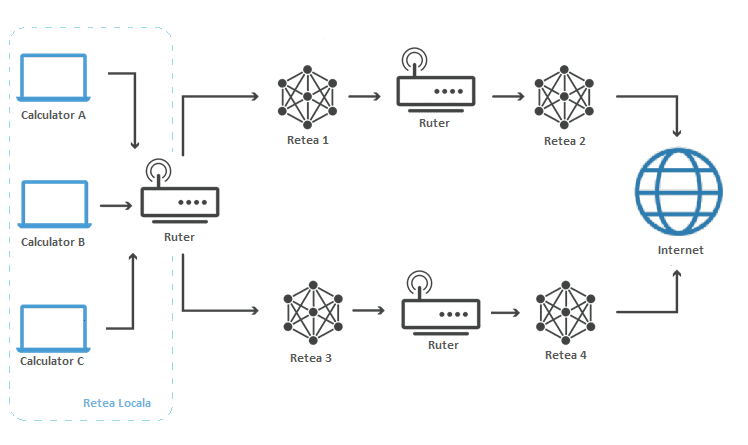

.. _network_connection:

Conectarea la rețea și la Internet
==================================

.. note::
    Pentru a parcurge această secțiune este recomandat să descărcați ultima
    versiune a respository-ului laboratorului. Pentru a descărca ultima versiune
    a repository-ului rulați comanda ``git pull`` în directorul
    ``~/uso-lab/labs/03-user/lab-containers/``.

    Infrastructura laboratorului este bazată pe containere docker ale căror
    imagini vor fi generate pe propriul calculator. Dacă nu aveți deja instalat
    Docker Engine pe sistem, scriptul
    ``~/uso-lab/labs/03-user/lab-containers/lab_prepare.sh`` vă va instala aplicația.

    După ce ați terminat de lucrat vă recomandăm să opriți containerele rulând
    comanda ``./lab-prepare.sh delete`` în directorul
    ``~/uso-lab/labs/03-user/lab-containers/``.

În cadrul acestei secțiuni vom învăța cum să reparăm problemele de
conectivitate la rețea sau în alte cuvinte, problema "nu-mi merge
Internetul". Pentru a face asta este necesar să parcurgem toate nivelurile de
rețea prin care trec datele pentru a fi trimise în Internet.

In continuare vom prezenta pașii pe care îi urmăm ca să verificăm funcționalitatea
conexiunii la Internet și cum putem să facem niște configurații sumare.

.. _network_connection_phys:

Interacţiunea cu nivelul fizic
------------------------------

Primul nivel cu care interacționăm este nivelul fizic, care are rolul de a
trimite date sub formă de semnale prin mediul de transmisie. De exemplu,
semnalele electrice sunt transmise prin fir de cupru, pulsurile luminoase prin
fibră optică și undele radio prin wireless.

Așa arată un cablu de cupru de tip UTP (Unshielded Twisted Pair):

.. image:: img/utp.png
    :align: center
    :alt: Cablu UTP

O altă componentă a nivelului fizic este placa de rețea a sistemului (in
engleză, NIC - *Network Interface Card*), care va trimite datele prin mediul
de transmisie.

Majoritatea timpului problemele de conexiune la Internet vin de la faptul că nu
este conectat cablul de Internet la placa de rețea sau de la faptul că avem
conexiune slabă la rețeaua wireless.

La nivel fizic, putem verifica conexiunea și funcționalitatea unei plăci de
rețea uitându-ne la ledurile care reprezintă conexiunea la mediul fizic.
Observăm în GIF-ul de mai jos cum arată ledurile unei plăci de rețea funcționale.
Dacă acestea nu sunt aprinse, atunci nu vom avea conectivitate la rețea.

.. figure:: ./gifs/nic.gif
    :alt: Conexiunea la o rețea

.. _network_connection_phys_show:

Investigarea nivelului fizic al rețelei
^^^^^^^^^^^^^^^^^^^^^^^^^^^^^^^^^^^^^^^

.. note::

    Pentru rularea acestui demo rulați în directorul
    ``~/uso.git/labs/03-user/lab-containers/`` comanda ``./lab_prepare.sh install fizic``.
    Pentru a ne conecta la infrastructura pentru această secțiune vom folosi
    comanda ``./lab_prepare.sh connect fizic``

O interfață de rețea este un mijloc de realizare a configurărilor de rețea
asociată de obicei unei plăci de rețea și identificată printr-un nume.

.. note::

    Există interfețe care nu corespund niciunei plăci de rețea fizice. De
    exemplu ``loopback`` este o interfață virtuală, de auto-adresare, care se
    adresează sistemului însuși. Este numită ``lo`` in Linux. 

La nivelul sistemului de operare putem verifica dacă o placă de rețea este
activă folosind comanda următoare:

.. code-block::

    root@fizic:~# ip link show
    1: lo: <LOOPBACK,UP,LOWER_UP> mtu 65536 qdisc noqueue state UNKNOWN mode DEFAULT group default qlen 1000
        link/loopback 00:00:00:00:00:00 brd 00:00:00:00:00:00
    99: eth0@if100: <BROADCAST,MULTICAST,UP,LOWER_UP> mtu 1500 qdisc noqueue state UP mode DEFAULT group default
        link/ether 02:42:0a:0a:0a:01 brd ff:ff:ff:ff:ff:ff link-netnsid 0
    113: eth1@if114: <BROADCAST,MULTICAST> mtu 1500 qdisc noqueue state DOWN mode DEFAULT group default
        link/ether 02:42:0b:0b:0b:01 brd ff:ff:ff:ff:ff:ff link-netnsid 0
    115: eth2@if116: <BROADCAST,MULTICAST> mtu 1500 qdisc noqueue state DOWN mode DEFAULT group default
        link/ether 02:42:0c:0c:0c:01 brd ff:ff:ff:ff:ff:ff link-netnsid 0

Starea fiecărei interfețe de rețea este reprezentată de numărul interfeței și
numele ei, împreună cu parametrii săi de rulare. Majoritatea informațiilor
afișate de comanda de mai sus nu sunt relevante pentru noi. O opțiune relevantă
este valoarea ``state``, urmată de starea interfeței de rețea, care poate să
fie ``UP``, ``DOWN`` sau ``UNKNOWN``.

.. note::

    Formatul pentru numele interfețelor diferă de la o distribuție la alta. În
    cadrul infrastructurii de laborator folosim containere de tip Docker în
    cadrul cărora numele interfețelor este de forma ``ethX``, unde X este un
    număr. În funcție de distribuția pe care rulăm numele interfețelor poate să
    se fie într-un format diferit.

Observăm că interfața de rețea cu numele ``eth0`` este pornită, deoarece linia
asociată interfeței conține șirul de caractere ``state UP``. În același timp
observăm că interfața de rețea ``eth1`` nu este activă deoarece pe linia sa
observăm șirul de caractere ``state DOWN``.

Pentru a porni interfața ``eth1`` vom folosi următoarea comandă:

.. code-block::

    root@uso:~# ip link set dev eth1 up

Mereu, după ce rulăm o comandă, trebuie să verificăm dacă s-a efectuat cu succes,
folosind o metodă de verificare. În cazul de față vom folosi tot comanda ``ip
link show``:

.. code-block::

    root@fizic:~# ip link show
    1: lo: <LOOPBACK,UP,LOWER_UP> mtu 65536 qdisc noqueue state UNKNOWN mode DEFAULT group default qlen 1000
        link/loopback 00:00:00:00:00:00 brd 00:00:00:00:00:00
    99: eth0@if100: <BROADCAST,MULTICAST,UP,LOWER_UP> mtu 1500 qdisc noqueue state UP mode DEFAULT group default
        link/ether 02:42:0a:0a:0a:01 brd ff:ff:ff:ff:ff:ff link-netnsid 0
    113: eth1@if114: <BROADCAST,MULTICAST,UP,LOWER_UP> mtu 1500 qdisc noqueue state UP mode DEFAULT group default
        link/ether 02:42:0b:0b:0b:01 brd ff:ff:ff:ff:ff:ff link-netnsid 0
    115: eth2@if116: <BROADCAST,MULTICAST> mtu 1500 qdisc noqueue state DOWN mode DEFAULT group default
        link/ether 02:42:0c:0c:0c:01 brd ff:ff:ff:ff:ff:ff link-netnsid 0

Exercițiu - Pornirea unei interfețe
"""""""""""""""""""""""""""""""""""

Porniți interfața de rețea ``eth2``.

.. _network_connection_internet:

Configurarea nivelului Internet
-------------------------------

.. _network_connection_internet_show:

Identificarea adresei de Internet
^^^^^^^^^^^^^^^^^^^^^^^^^^^^^^^^^

.. note::

    Pentru rularea acestui demo rulați în directorul
    ``~/uso.git/labs/03-user/lab-containers/`` comanda ``./lab_prepare.sh install internet``.
    Pentru a ne conecta la infrastructura pentru această secțiune vom folosi
    comanda ``./lab_prepare.sh connect internet``

Internetul este o interconectare de dispozitive, numite stații și organizate în
rețele, care se extinde pe toată Planeta. Datele trimise în Internet trebuie
redirecționate de la un nod la altul, așa incât să ajungă rapid de la o
stație la altă stație. 

Deci, pentru ca o stație să comunice cu o altă stație din Internet, trebuie
ca cele doua stații să fie conectate la Internet.

.. note::

    Mai exact, stațiile trebuie sa aiba un punct de ieșire din rețeaua locală, conectat la
    restul rețelelor din Internet, care se numește *default gateway* și de care vom menționa
    mai târziu.

Mai apoi, cele două stații trebuie să se poată adresa una alteia. Adică fiecare stație
are nevoie de un identificator, o adresă. Cum fiecare casă din lume are o adresă cu
care poate fi identificată unic, așa și fiecare stație are o adresă unică in Internet
numită adresa IP (*Internet Protocol*).

Fiecare interfață de rețea este o cale diferită către Internet, deci fiecare are
nevoie de a avea configurată câte o adresă IP.

Pentru a vedea adresele IP configurate pe interfețele de rețea folosim
următoarea comandă:

.. code-block::

    root@internet:~# ip address show
    1: lo: <LOOPBACK,UP,LOWER_UP> mtu 65536 qdisc noqueue state UNKNOWN group default qlen 1000
        link/loopback 00:00:00:00:00:00 brd 00:00:00:00:00:00
        inet 127.0.0.1/8 scope host lo
           valid_lft forever preferred_lft forever
    195: eth0@if196: <BROADCAST,MULTICAST,UP,LOWER_UP> mtu 1500 qdisc noqueue state UP group default 
        link/ether 02:42:0a:0a:0a:02 brd ff:ff:ff:ff:ff:ff link-netnsid 0
        inet 10.10.10.2/24 brd 10.10.10.255 scope global eth0
           valid_lft forever preferred_lft forever
    199: eth1@if200: <BROADCAST,MULTICAST> mtu 1500 qdisc noqueue state DOWN group default 
        link/ether 02:42:0b:0b:0b:02 brd ff:ff:ff:ff:ff:ff link-netnsid 0
    203: eth2@if204: <BROADCAST,MULTICAST> mtu 1500 qdisc noqueue state DOWN group default 
        link/ether 02:42:0c:0c:0c:02 brd ff:ff:ff:ff:ff:ff link-netnsid 0

Există două tipuri de adrese IP (IPv4 și IPv6), dar în cadrul acestui laborator
vom lucra numai cu adrese de tip IPv4. Adresele IP ale interfețelor sunt scrise
pe liniile care conțin ``inet``.  Adresele IPv4 sunt de forma ``A.B.C.D``, unde
A, B, C și D sunt numere cu valori între 1 si 255.

Pentru detalii despre adresele de tip IPv6 folosiți urmăriți această [#ipv6]_
explicație.

.. _network_connection_internet_config:

Configurarea unei adrese IP
^^^^^^^^^^^^^^^^^^^^^^^^^^^

Există două metode pentru configurarea unei adrese IP pe o interfață:

* configurare statică, prin care noi configurăm manual adresa IP pe interfața de
  rețea, implică să cunoaștem din ce rețea face parte interfața
  pe care vrem să o configurăm și ce adrese IP sunt libere;

* configurare dinamică, obținută automat, care nu presupune cunoașterea
  informațiilor despre rețea, deoarece acestea vor fi primite automat de pe
  rețea.

Vom insista pe configurarea dinamică, deoarece este mai simplă. În plus, nu avem
cum să aflăm informațiile despre rețea înainte de a configura interfața de
rețea.

Recapitulare - Pornirea interfețelor de rețea
"""""""""""""""""""""""""""""""""""""""""""""

Faceți modificările necesare astfel încât interfața ``eth1`` să fie în starea
``UP``.

Configurarea IP-ului în mod dinamic
"""""""""""""""""""""""""""""""""""

Pentru a obține o adresă IP în mod dinamic pe o interfață
folosim comanda ``dhclient``:

.. code-block::

    root@internet:~# dhclient eth1
    mv: cannot move '/etc/resolv.conf.dhclient-new.35' to '/etc/resolv.conf': Device or resource busy

.. admonition:: Observație:

    Linia ``mv: cannot move '/etc/resolv.conf.dhclient-new.35' to
    '/etc/resolv.conf': Device or resource busy`` apare mereu în containerele
    docker atunci când încercăm să obținem o adresă IP folosind comanda
    ``dhclient``. Nu este o problemă dacă aceasta apare.

Mai sus am rulat comanda pentru a obține o adresă IP pentru interfața ``eth1``.

Comanda ``dhclient`` este bazată pe protocolul DHCP (*Dynamic Host Configuration
Protocol*). Acesta presupune că există un server pe rețea care cunoaște ce IP-uri
sunt folosite pe rețea și care poate să ofere adrese IP calculatoarelor care fac
cereri pe rețea. ``dhclient`` face o cerere de rezervare a unei adrese IP către
serverul DHCP de pe rețea.

Recapitulare - Afișarea adreselor IP configurate pe interfețele de rețea
""""""""""""""""""""""""""""""""""""""""""""""""""""""""""""""""""""""""

Afișați adresele IP de pe toate interfețele.

Observați că am obținut o adresă IP pe interfața ``eth1``.

Exercițiu - Configurarea dinamică a unei adrese IP
""""""""""""""""""""""""""""""""""""""""""""""""""

Configurați adresa IP pe interfața ``eth2``.

Ștergerea unei configurații de rețea de pe o interfață
""""""""""""""""""""""""""""""""""""""""""""""""""""""

Pentru șterge o adresă IP de pe o interfața folosim comanda ``ip address flush`` în felul următor:

.. code-block::

    root@internet:~# ip address flush eth1
    root@internet:~# ip address show eth1
    199: eth1@if200: <BROADCAST,MULTICAST,UP,LOWER_UP> mtu 1500 qdisc noqueue state UP group default
        link/ether 02:42:0b:0b:0b:02 brd ff:ff:ff:ff:ff:ff link-netnsid 0

.. admonition:: Observație:

    Putem să afișăm configurația unei singure interfețe de rețea
    folosind numele interfeței ca parametru pentru comanda ``ip address show``

Exercițiu - Ștergerea configurației de rețea
""""""""""""""""""""""""""""""""""""""""""""

Ștergeți configurația de rețea de pe interfețele ``eth1`` și ``eth2``.

.. _network_connection_internet_ping:

Verificarea conectivității la o altă stație
^^^^^^^^^^^^^^^^^^^^^^^^^^^^^^^^^^^^^^^^^^^

.. note::

    Pentru rularea acestui demo, comenzile vor fi rulate în cadrul mașinii
    virtuale USO.

Pentru a verifica conexiunea dintre două stații folosim comanda ``ping``. Această
comandă trimite mesaje către o stație și așteaptă un răspuns de la ea.

Atunci când testăm conexiunea la internet, vrem să verificăm câteva aspecte,
odată ce am obținut o adresă IP de la serverul DHCP:

* verificăm dacă putem să ne conectăm la alte calculatoare din aceeași rețea

* verificăm dacă putem să comunicăm cu stații din afara rețelei

De exemplu, dacă vrem să verificăm conectivitatea la serverul ``8.8.8.8`` (un
server public din Internet), folosim comanda:

.. code-block::

    student@uso:~$ ping -c 4 8.8.8.8
    PING 8.8.8.8 (8.8.8.8) 56(84) bytes of data.
    64 bytes from 8.8.8.8: icmp_seq=1 ttl=61 time=23.0 ms
    64 bytes from 8.8.8.8: icmp_seq=2 ttl=61 time=25.7 ms
    64 bytes from 8.8.8.8: icmp_seq=3 ttl=61 time=24.8 ms
    64 bytes from 8.8.8.8: icmp_seq=4 ttl=61 time=25.2 ms

    --- 8.8.8.8 ping statistics ---
    4 packets transmitted, 4 received, 0% packet loss, time 3092ms
    rtt min/avg/max/mdev = 23.051/24.731/25.707/1.020 ms

Comportamentul implicit al comenzii ``ping`` este să trimită pachete la infinit.
Am folosit opțiunea ``-c 4`` în exemplul de mai sus pentru a reduce numărul de
pachete trimise la 4.

Atunci când nu pot fi trimise mesaje către stația identificată prin adresa IP,
mesajul de eroare va arăta în felul următor:

.. code-block::

    student@uso:~$ ping 10.10.10.10
    PING 10.10.10.10 (10.10.10.10) 56(84) bytes of data.
    From 10.10.10.3 icmp_seq=1 Destination Host Unreachable
    From 10.10.10.3 icmp_seq=2 Destination Host Unreachable
    From 10.10.10.3 icmp_seq=3 Destination Host Unreachable
    From 10.10.10.3 icmp_seq=4 Destination Host Unreachable
    ^C
    --- 10.10.10.10 ping statistics ---
    4 packets transmitted, 0 received, +4 errors, 100% packet loss, time 3074ms

Pentru verificarea conectivității în interiorul rețelei trebuie să verificăm că
putem să trimitem mesaje folosind utilitarul ``ping`` unui calculator din rețea.

În mod implicit comanda ``ping`` trimite mesaje de verificare a conexiunii la
infinit. De data aceasta, în loc să rulăm comanda ``ping`` folosind opțiunea
``-c 4``, am oprit rularea comenzii folosind combinația de taste ``Ctrl+c``.

O țintă bună de testare pentru trimiterea mesajelor în rețea este (default)
gateway-ul. Un gateway este un dispozitiv de rețea care se ocupă de
interconectarea rețelelor și care primește mesaje de la toate stațiile din
rețea pentru a le trimite în Internet.

Gateway-ul este configurat static sau dinamic, cum este configurată și adresa IP a unei interfețe.

Pentru a identifica gateway-ul, folosim comanda ``ip route show`` în felul următor:

.. code-block::

    student@uso:~$ ip route show
    default via 10.0.2.2 dev ens33 proto dhcp metric 100
    10.0.2.0/24 dev enp0s3 proto kernel scope link src 10.0.2.15 metric 100
    169.254.0.0/16 dev enp0s3 scope link metric 1000
    192.168.56.0/24 dev enp0s8 proto kernel scope link src 192.168.56.4 metric 101

Observăm că adresa IP a default gateway-ului este ``10.0.2.2``, deoarece
acesta se află pe linia care conține șirul de caractere ``default``.

Recapitulare - Afișarea adresei IP configurată pe o interfață
"""""""""""""""""""""""""""""""""""""""""""""""""""""""""""""

Aflați adresa de rețea de pe interfața ``enp0s3``.

.. admonition:: Observație:

    Adresa IP a gateway-ului și adresa IP a interfeței ``enp0s3`` sunt foarte
    similare. Acest lucru se întâmplă deoarece stațiile se află în aceeași
    rețea.

Exercițiu - Verificarea conectivității cu gateway-ul
""""""""""""""""""""""""""""""""""""""""""""""""""""

Verificați conexiunea cu gateway-ul folosind comanda ``ping``.

Pentru verificarea conexiunii la Internet este bine să verificăm cu o adresă
consacrată, în care avem încredere că nu va avea probleme tehnice. Un astfel de
exemplu este serverul oferit de Google de la adresa IP ``1.1.1.1``.

Exercițiu - Verificarea conectivității la Internet
""""""""""""""""""""""""""""""""""""""""""""""""""

Verificați conexiunea la serverul ``8.8.8.8`` oferit de Google folosind comanda
``ping``.

.. _network_connection_internet_dns:

Investigarea serviciului DNS
^^^^^^^^^^^^^^^^^^^^^^^^^^^^

După cum ați observat, până acum am lucrat numai cu adrese IP, dar noi lucrăm
în viața de zi cu zi cu numele site-urilor, deoarece ne este mai ușor să
reținem nume decât adrese IP.

Pentru a rezolva această necesitate folosim serviciul DNS (Domain Name Server).
Acesta este oferit de un server către care noi trimitem cereri de *lookup*
pentru o adresa *hostname* cum ar fi ``www.google.com``. Serverul DNS va
răspunde cu adresa IP asociată cu adresa cerută.

Ne dorim să avem un serviciu DNS funcțional în permanență pe sistemul pe care lucrăm.

În mod implicit serviciul DNS este configurat prin DHCP.

Identificarea serviciului DNS folosit implicit
""""""""""""""""""""""""""""""""""""""""""""""

Serviciul DNS poate fi configurat în multe moduri care depind de platforma pe
care o folosim. Pentru mașina virtuala folosită de noi ne putem folosi de
utilitarul ``nmcli`` pentru a identifica serverul DNS folosit. Comanda ``grep``
identifică din rezultatul unei comenzi doar linia care conține șirul de
caractere ``DNS``.

.. code-block::

    student@uso:~$ nmcli dev show | grep DNS
    IP4.DNS[1]:                             10.0.2.3

Conform cu outputul comenzii, serverul DNS către care sunt trimise comenzi este
``10.0.2.3``.

Efectuarea cererilor DNS
""""""""""""""""""""""""

Pentru a verifica funcționalitatea serviciului DNS, putem să facem o cerere DNS
folosind comanda ``host`` în felul următor:

.. code-block::

    student@uso:~$ host elf.cs.pub.ro
    elf.cs.pub.ro has address 141.85.227.116
    elf.cs.pub.ro mail is handled by 10 elf.cs.pub.ro.

Rezultatul rulării comenzii ``host`` este o lista cu servicii și adrese care pot
fi identificate prin numele ``elf.cs.pub.ro``. Pe linia care conține șirul de
caractere ``address`` se află adresa IPv4 asociată numelui. Observăm că serverul
``elf.cs.pub.ro`` găzduiește și un server de mail. Acest lucru este evidențiat
de linia care conține parametrul ``mail``.

Exemplu - Efectuarea cererilor DNS în mod implicit
""""""""""""""""""""""""""""""""""""""""""""""""""

Cererile DNS nu trebuie să fie făcute direct de noi atunci când încercăm să
accesăm o resursă din Internet folosind un nume, deoarece aplicațiile fac cereri
în mod implicit.

.. code-block::

    student@uso:~$ ping google.com
    PING google.com (216.58.214.238) 56(84) bytes of data.
    64 bytes from bud02s24-in-f14.1e100.net (216.58.214.238): icmp_seq=1 ttl=63 time=19.5 ms
    64 bytes from bud02s24-in-f14.1e100.net (216.58.214.238): icmp_seq=2 ttl=63 time=21.6 ms
    64 bytes from bud02s24-in-f14.1e100.net (216.58.214.238): icmp_seq=3 ttl=63 time=21.3 ms
    64 bytes from bud02s24-in-f14.1e100.net (216.58.214.238): icmp_seq=4 ttl=63 time=19.4 ms
    ^C
    --- google.com ping statistics ---
    4 packets transmitted, 4 received, 0% packet loss, time 3006ms
    rtt min/avg/max/mdev = 19.377/20.426/21.588/1.009 ms

Observați că utilitarul ``ping`` a aflat de unul singur care este adresa IP
asociată numelui ``google.com`` și a făcut cererea în fundal și a verificat
conexiunea cu serverul de la adresa IP ``216.58.214.238``.

Reconfigurarea temporară a serviciului DNS
""""""""""""""""""""""""""""""""""""""""""

În caz că vrem să schimbăm temporar serverul DNS pe care îl folosim trebuie să
modificăm fișierul ``/etc/resolv.conf``. Acest fișier specifică DNS-ul care va
fi folosit pentru cereri pe linia care conține cuvântul nameserver, după cum
puteți vedea mai jos.

.. code-block::

    student@uso:~$ cat /etc/resolv.conf
    student@uso:~$ cat /etc/resolv.conf
    <...>
    nameserver 127.0.0.53
    options edns0

Dacă schimbăm adresa serverului DNS cu altă adresă, cum ar fi cea a serverului DNS
oferit de Google, putem să vedem o schimbare în răspunsurile de la serverul DNS
pentru unele site-uri.

.. code-block::

    student@uso:~$ host google.com
    google.com has address 172.217.20.14
    google.com has IPv6 address 2a00:1450:400d:803::200e
    <...>
    student@uso:~$ cat /etc/resolv.conf
    nameserver 8.8.8.8
    options edns0
    student@uso:~$ host google.com
    google.com has address 172.217.18.78
    google.com has IPv6 address 2a00:1450:400d:809::200e
    <...>

.. admonition:: Atenție:

    Acestea sunt modificări temporare folosite pentru depanarea problemelor cu
    serviciul DNS.

Exercițiu - Schimbarea serverului DNS folosit
"""""""""""""""""""""""""""""""""""""""""""""

* Realizați modificările necesare astfel încât cererile de tip DNS să fie trimise
  către serverul de DNS oferit de CloudFlare de la adresa ``1.1.1.1``;

* Afișați cu ce adresă răspunde noul server DNS pentru numele ``google.com``.

.. _network_connection_transport:

Configurarea nivelului Transport
--------------------------------

Atunci când folosim Internetul, ce facem de fapt este că ne conectăm la
aplicații care rulează pe servere în Internet și noi pornim la rândul nostru
aplicații pe calculatorul nostru care așteaptă conexiuni din Internet.

Pentru a distinge aplicațiile și destinația mesajelor, folosim conceptul de
porturi. Astfel, fiecare aplicație deschide un port pentru a comunica cu exteriorul.

Portul este o adresă locală unei stații. Dacă adresa IP identifică stația,
portul identifică aplicația de rețea de pe stație. Astfel putem avea mai multe
aplicații rețea pe o stație.

Există două tipuri de porturi care pot fi deschise, în funcție de protocolul folosit:

* porturi TCP (*Transmission Control Protocol*), folosite de aplicații care
  depind de trimiterea corectă și în ordine a informației, cum ar fi servere
  web;

* porturi UDP (*User Datagram Protocol*), folosite de aplicații care trebuie să
  trimită informație repede și care sunt rezistente la greșeli de trimitere ale
  pachetelor, cum ar fi aplicații de video streaming

.. _network_connection_transport_show:

Conectivitatea între aplicații de rețea folosind porturi
^^^^^^^^^^^^^^^^^^^^^^^^^^^^^^^^^^^^^^^^^^^^^^^^^^^^^^^^

Pentru afișarea porturilor deschise, pe care comunică o aplicație, folosim
comanda ``netstat``:

.. code-block::

    student@uso:~$ sudo netstat -tlpn
    Active Internet connections (only servers)
    Proto Recv-Q Send-Q Local Address           Foreign Address         State       PID/Program name
    tcp        0      0 127.0.0.1:5939          0.0.0.0:*               LISTEN      794/teamviewerd
    tcp        0      0 127.0.0.53:53           0.0.0.0:*               LISTEN      530/systemd-resolve
    tcp        0      0 0.0.0.0:22              0.0.0.0:*               LISTEN      693/sshd: /usr/sbin
    tcp        0      0 127.0.0.1:631           0.0.0.0:*               LISTEN      572/cupsd
    tcp        0      0 127.0.0.1:6010          0.0.0.0:*               LISTEN      2630/sshd: student@
    tcp6       0      0 :::22                   :::*                    LISTEN      693/sshd: /usr/sbin
    tcp6       0      0 ::1:631                 :::*                    LISTEN      572/cupsd
    tcp6       0      0 ::1:6010                :::*                    LISTEN      2630/sshd: student@

Pentru comanda de mai sus folosim următoarele opțiuni pentru filtrarea afișării:

* ``-t`` afișează doar porturile TCP deschise

* ``-l`` afișează doar porturile deschise care ascultă mesaje, nu și cele deschide pentru trimiterea mesajelor

* ``-p`` afișează programul care a deschis portul [#netstat_sudo]_

* ``-n`` afișează IP-ul pe care se ascultă după conexiuni

Exercițiu - afișarea porturilor UDP deschise
""""""""""""""""""""""""""""""""""""""""""""

Afișați porturile UDP deschise pe stația pe care lucrați.

.. hint::

    Având în vedere că opțiunea ``-t`` se referă la porturile TCP, care credeți
    ca va fi opțiunea necesară pentru identificarea porturilor UDP?

.. _network_connection_transport_connect:

Conectarea TCP la o aplicație
^^^^^^^^^^^^^^^^^^^^^^^^^^^^^^

Vrem să observăm cum răspunde serverul HTTP la mesaje. De regulă un server HTTP răspunde printr-un mesaj în format HTML.

Pentru a trimite mesaje, indiferent de tipul aplicației care primește mesajul folosim comanda ``nc`` în felul următor

.. code-block::

        student@uso:~$ nc google.com 80
        test
        HTTP/1.0 400 Bad Request
        Content-Type: text/html; charset=UTF-8
        Referrer-Policy: no-referrer
        Content-Length: 1555
        Date: Tue, 20 Oct 2020 19:48:04 GMT

        <!DOCTYPE html>
        <html lang=en>
          <meta charset=utf-8>
          <meta name=viewport content="initial-scale=1, minimum-scale=1, width=device-width">
          <title>Error 400 (Bad Request)!!1</title>
          
          <a href=//www.google.com/></a>
          
<b>400.</b> <ins>That’s an error.</ins>
          
Your client has issued a malformed or illegal request.  <ins>That’s all we know.</ins>

Am rulat comanda ``nc`` iar apoi am scris mesajul ``test`` și am apăsat tasta
``Enter``.  Mesajul primit este un răspuns de tipul ``Bad Request``, deoarece
am trimis un mesaj care nu este în formatul așteptat de serverul HTTP.

Exercițiu - Testarea conexiunii la aplicații
""""""""""""""""""""""""""""""""""""""""""""

* Trimiteți un mesaj către programul care ascultă pe portul 22 pe sistemul local
  (cu IP-ul ``127.0.0.1``).

* Trimiteți un mesaj către programul care ascultă pe portul 80 de la adresa
  identificată prin numele ``elf.cs.pub.ro``.

.. rubric:: Note de subsol

.. [#netstat_sudo]
    Am folosit comanda ``sudo`` pentru a permite afișarea numelor programelor
    care ascultă pe portul deschis. Comanda ``netstat`` trebuie executată de un
    utilizatot privilegiat pentru această funcționalitate oferită de opțiunea
    ``-p``.

.. [#ipv6]
    https://en.wikipedia.org/wiki/IP_address#IPv6_addresses
