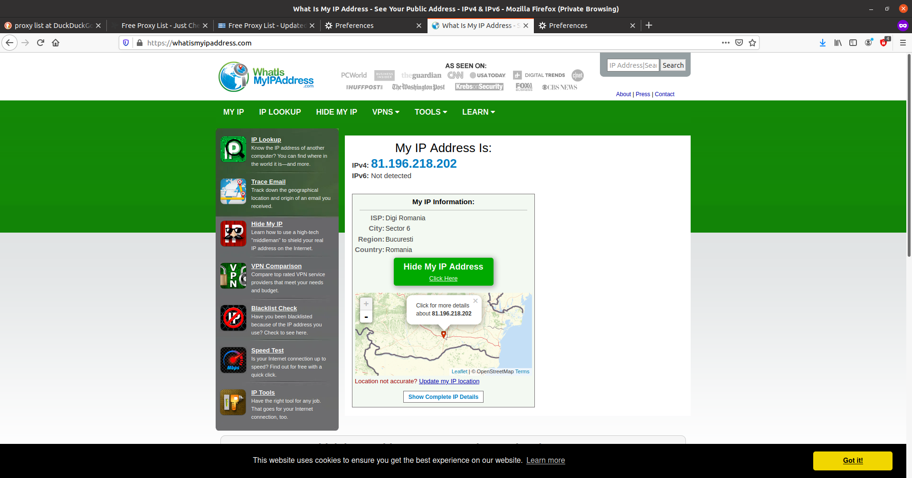
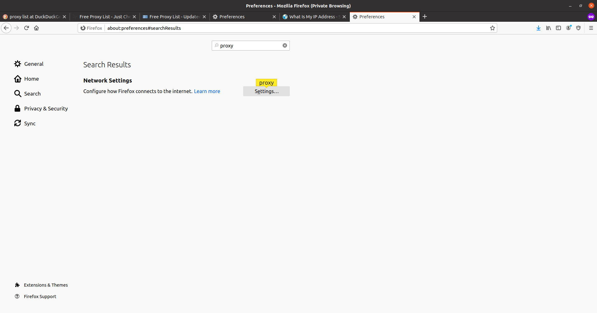
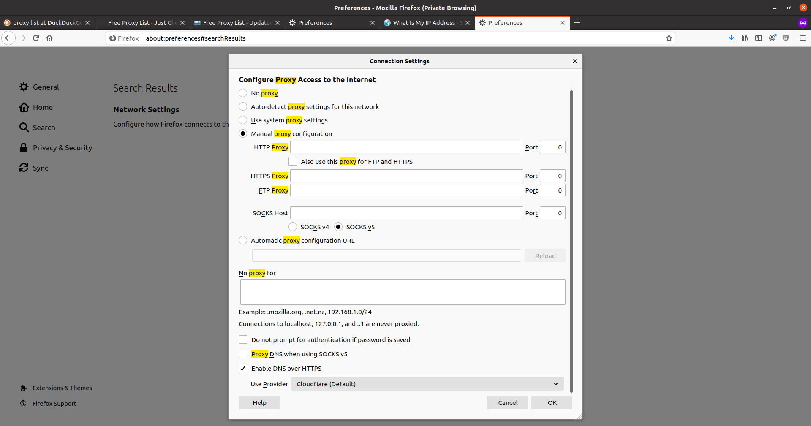
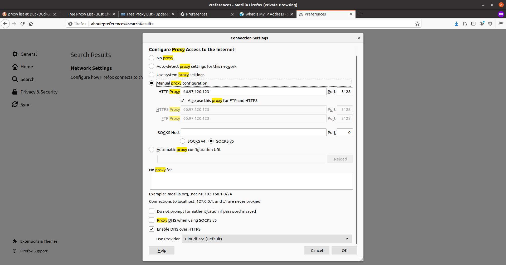
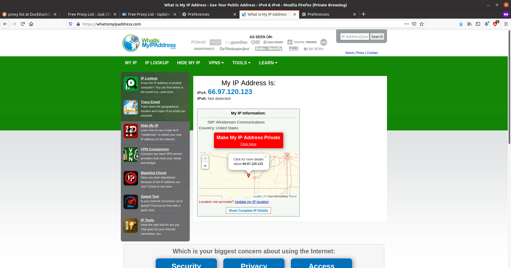
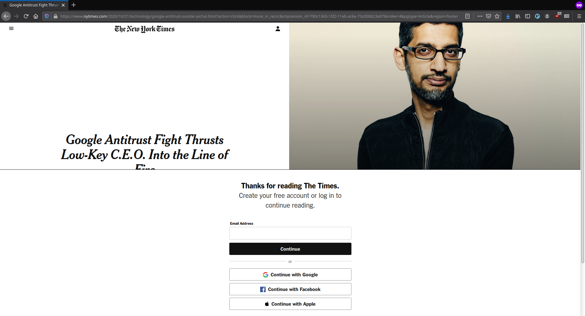

.. _network_extra:

Funcţionalităţi suplimentare de reţelistică
===========================================

Aceste exerciții și tutoriale sunt menite să abordeze lucruri care nu sunt
neapărat necesare pentru utilizarea și înțelegerea conceptelor din acest
capitol, dar oferă bune practici și cunoștințe extra despre conectarea
calculatorului la Internet și funcționarea serviciilor în Internet.

.. _network_extra_proxy:

Folosirea proxy-urilor HTTP
---------------------------

Din unele motive, anumite site-uri nu permit accesul utilizatorilor din unele
țări la ele. Acest lucru se întâmplă din motive logistice, legislative (cu
precădere la politicile de colectare a datelor interzise în anumite țări) sau
securitate. Presupunem că ne aflăm într-o astfel de situație, în care nu ne
putem conecta la un site din locul / rețeaua în care ne aflăm. Sau vrem să
ascundem poziția noastră. Putem identifica din ce țară apare calculatorul nostru
folosind site-ul `WhatsMyIP <https://whatsmyip.com/>`_ în felul următor:

Până acum am explorat cum putem să apărem în Internet ca o stație care provine
dintr-o altă adresă folosind un VPN.

Proxy-ul HTTP este o alternativă a VPN care în loc să tuneleze tot traficul
în Internet, o va face doar pentru traficul HTTP. Putem să folosim un serviciu
online de proxy-ing.

Proxy-ul se bazează pe faptul că există un sistem undeva care va primi
mesajele noastre și le va trimite mai departe. Există servere proxy libere în
Internet care oferă serviciul de proxy-ing gratis. Putem să obținem o listă cu
astfel de servere gratis. Putem obține o listă cu astfel de servere de `aici
<https://free-proxy-list.net>`_.

Pentru a folosi aceste servere în siguranță, fără ca acestea să poată vedea
traficul nostru, trebuie să identificăm servere care folosesc protocolul HTTPS.

Odată selectat un server, trebuie să îl configurăm în browser. Pentru aceasta
accesăm meniul de preferințe `Preferences <about:preferences>`_, apoi căutăm
după cuvântul cheie ``proxy`` în setările browserului:

În imaginea de mai jos se găsește configurația implicită:

Odată ajunși la setările pentru proxy, vom selecta setarea manuală a
proxy-urilor și vom introduce adresa proxy-ului selectat împreună cu portul
acestuia.

.. admonition:: Atenție!

    Selectăm opțiunea ``Also use this proxy fot FTP and HTTPS`` pentru a
    folosi proxy-ul pentru tot traficul.

Folosind site-ul `WhatsMyIP <https://whatsmyip.com/>`_ vedem că adresa noastră nu
mai apare ca cea inițială ci apare ca fiind dintr-o altă țară.

.. _network_extra_paywall:

Evitarea paywall-urilor pe site-uri web
---------------------------------------

Exista anumite site-uri, cum ar fi cele de știri, sau articole științifice care
ne limitează accesul la un număr de articole pe zi. Funcționalitatea de blocare
a conținutului de pe un site până la plata unei sume se numește un *paywall*.
*Paywall*-urile sunt foarte agasante atunci când încercăm să găsim mai multe
surse pentru știri, sau când vrem să parcurgem mai multe articole de pe același
site.

*Paywall*-urile se reduc la elemente HTML care pot fi șterse din pagină
pentru a afișa conținutul complet al unui articol. Elementele web pot fi șterse
manual, sau automat, folosind un add-on de browser.

Pentru ștergerea automată a blocajelor putem folosi `acest
<https://github.com/iamadamdev/bypass-paywalls-chrome/releases>`_ add-on de browser care
funcționează atât pe Google Chrome cât și pe Mozilla Firefox, care poate fi
descărcat și instalat în browser de `aici
<https://github.com/iamadamdev/bypass-paywalls-firefox/releases>`_.

Observăm cum după instalarea și activarea add-onului putem vedea conținutul
paginii web nerestricționat.

.. _network_extra_ssh:

Configurarea avansată pentru SSH
--------------------------------

.. _network_extra_ssh_shortcuts:

Configurarea scurtăturilor SSH
^^^^^^^^^^^^^^^^^^^^^^^^^^^^^^

.. note::

    Pentru rularea acestui demo rulați în directorul
    ``~/uso.git/labs/03-user/lab-containers/`` comanda ``./lab_prepare.sh install ssh``.
    Pentru a ne conecta la infrastructura pentru această secțiune vom folosi
    comanda ``./lab_prepare.sh connect ssh``

Aplicația SSH permite configurarea scurtăturilor pentru destinații la care vrem
să ne conectăm prin SSH.

Pentru a ne conecta în mod normal la stația ``10.10.10.3``, ca utilizatorul
``root`` folosind opțiunea ``-X``, ar fi nevoie să rulăm comanda:

.. code-block::

    student@uso:~$ ssh -X root@10.10.10.3

Introducerea acestei comenzi pentru fiecare conexiune succesivă este ineficientă și
există alternative pentru a reduce timpul de scriere al comenzii.

Vom configura o scurtătura pentru utilitarul ``ssh`` folosit de utilizatorul
``student``. Fișierul de configurare se regăsește la calea ``~/.ssh/config``.
Pentru adăugarea unei scurtături vrem să scriem în fișier o intrare de felul
următor:

.. code-block::

    student@uso:~$ cat ~/.ssh/config
    Host remote
        HostName 10.10.10.4
        User root
        ForwardX11 yes

Folosindu-ne de intrarea de mai sus, putem să ne conectăm la stația menționată
folosind comanda următoare:

.. code-block::

    student@uso:~$ ssh remote
    Welcome to Ubuntu 18.04.5 LTS (GNU/Linux 5.4.0-51-generic x86_64)

     * Documentation:  https://help.ubuntu.com
     * Management:     https://landscape.canonical.com
     * Support:        https://ubuntu.com/advantage
    This system has been minimized by removing packages and content that are
    not required on a system that users do not log into.

    To restore this content, you can run the 'unminimize' command.
    root@ssh:~#

Exercițiu - Configurarea scurtăturilor SSH
""""""""""""""""""""""""""""""""""""""""""

Realizați configurările necesare astfel încât să va puteți conecta la stația
``10.10.10.3`` ca utilizatorul ``student``, folosind opțiunea de X forwarding cu
scurtătura ``remote-stud``.

.. _network_extra_ssh_keys:

Configurarea accesului prin chei SSH
^^^^^^^^^^^^^^^^^^^^^^^^^^^^^^^^^^^^

După cum am observat în secțiunea :ref:`network_services_remotecli_key`, ca să
propagăm cheia publică pe o stație este necesar să cunoaștem parola utilizatorului
drept care vrem să ne autentificăm.

Însă există situații în care nu cunoaștem parola utilizatorului, dar avem acces
fizic sau printr-un protocol de comunicare la stație.

În această situație, putem să configurăm cheia publică folosindu-ne de fișierele
de configurare ale serverului SSH.

Pentru autentificarea utilizatorilor folosind chei publice-private, serverul SSH
verifică fișierul ``~/.ssh/authorized_keys``. Acest fișier conține o listă a
tuturor cheilor publice care au voie să se conecteze la server.

.. code-block::

    student@uso:~$ ssh root@10.10.10.3 cat .ssh/authorized_keys
    ssh-rsa AAAAB3NzaC1yc2EAAAADAQABAAABgQDdLi3SmYI1EvpacxU9qapNwqR2p2OX2GyUXPJsyJcF73kpCqT2qjoeAgHUR6fJkCotCpsusF4AXfK+GCCnLbTuVDZxnTZo85izUaRMQNbvylo+e9fj7+IRvtID6wLMSk4RdLJRFgwwej5WFAS4egdeuGPvrcvT123oZNE/lvW2V/LN9U61SUo0d+X5a8m0XL4pPLfG2/hzuSIlSjUo8iktU7mqfQelCKCeNlxxS1w65buut+dSRtH2WDzCWM/7C78f6aa6swML0zQwfHVRdMyVP2llMbgXaaGR+YJIqm091nKGze9pFFIT68lBrMKTuplhZVvrqP5292hwU376hhdaloHaph3iTtGk5cshCOpDmZPyj5BvSsdhk9hVvgsvPohK4sRoxpCxv/Xm0gLHGBiP39ZUOuGTSCrSO7IvLxgq7k6JZrMtGVoiHJUFur6tFJ0aZ020Ror6czw3CUBXyHk05bQMziuMKJGn/jjHpWUfZ4y1n16E8Gael1+7melI/v0= student@uso

Pentru adăugarea unei alte chei SSH pentru verificarea identității clienților,
este suficient să scriem cheia SSH a utilizatorului pe o linie nouă a fișierului
``authorized_keys``.

TODO infra

.. _network_extra_nmcli:

Gestiunea avansată a conexiunilor la rețea
------------------------------------------

Pentru a ușura configurarea conexiunii la Internet pentru utilizatorii Linux, a
fost adoptat ca serviciu standard pentru gestionarea conexiunilor la Internet
serviciul ``NetworkManager``. Acesta permite utilizatorilor să configureze din
mediul grafic parametrii de funcționare a rețelei, cum ar fi serviciul DNS
folosit.

``NetworkManager`` oferă și funcționalități în linie de comandă, cu scopul de a
face mai ușoară depanarea problemelor de rețea. Utilitarul pe care îl vom
folosi se numește ``nmcli``, iar acesta ne oferă funcționalități pentru
gestionarea configurărilor.

Din punctul de vedere al serviciului ``NetworkManager``, există interfețe pe care
acesta le configurează și există conexiuni care rețin configurările.

.. _network_extra_nmcli_connecition:

Configurarea conexiunilor folosind ``nmcli``
^^^^^^^^^^^^^^^^^^^^^^^^^^^^^^^^^^^^^^^^^^^^

Pentru interfețe conectate prin cablu există doar o singură conexiune în mod
normal.

Pentru a vizualiza parametrii de funcționare ai unei conexiuni rulăm comanda:

.. code-block::

    student@uso:~$ nmcli connection show "Wired connection 1" | less
    connection.id:                          Wired connection 1
    connection.uuid:                        eb564cd4-e37e-3d00-a94a-6596698ef4e3
    connection.stable-id:                   --
    connection.type:                        802-3-ethernet
    connection.interface-name:              enp0s3
    <...>

Observăm că sunt afișate lucruri cum ar fi ruta implicită, adresa IP configurată
pe interfață, serverul de DNS folosit, și modul prin care a fost configurată
interfața (prin DHCP sau în mod static).

Pentru modificarea unui atribut al conexiunii folosim comanda ``nmcli`` în felul
următor:

.. code-block::

    student@uso:~$ nmcli connection modify "Wired connection 1" ignore-auto-dns yes
    student@uso:~$ nmcli connection modify "Wired connection 1" ipv4.dns 1.1.1.1
    student@uso:~$ sudo systemctl restart network-manager.service

Pentru a folosi un sever DNS dorit de noi, în loc de cel primit prin DHCP este
nevoie să setăm parametrul ``ignore-audo-dns`` la valoarea ``yes``.  Atributul
``ipv4.dns`` reține date despre serverul DNS care va fi folosit în cadrul
conexiunii. Pentru a schimba serverul DNS folosit am setat acest parametru la
adresa IP ``1.1.1.1``.

Exercițiu - Setarea serverului DNS permanent folosind ``nmcli``
"""""""""""""""""""""""""""""""""""""""""""""""""""""""""""""""

Faceți modificările necesare folosind comanda ``nmcli`` astfel încât conexiunea
``Wired Connection 1`` să folosească serverul DNS ``8.8.8.8``.
