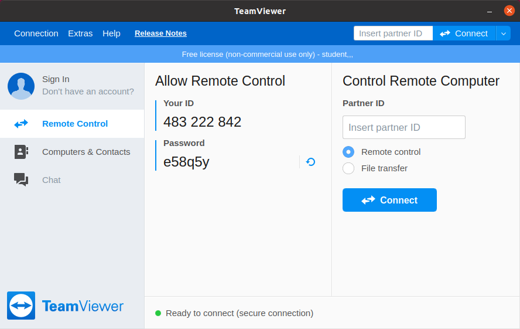
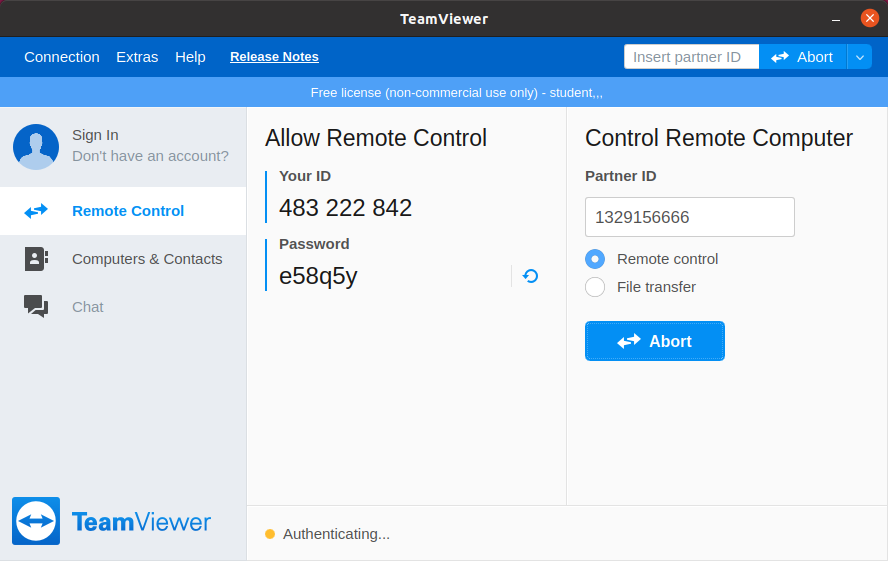
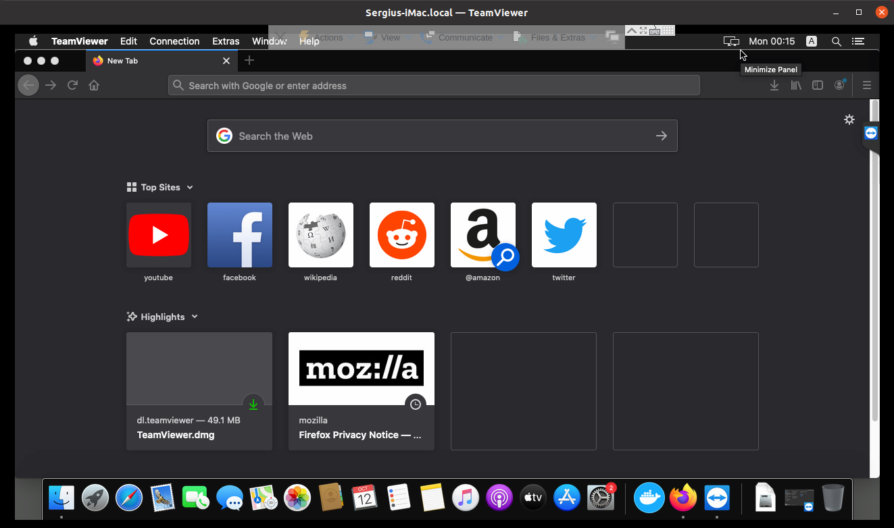
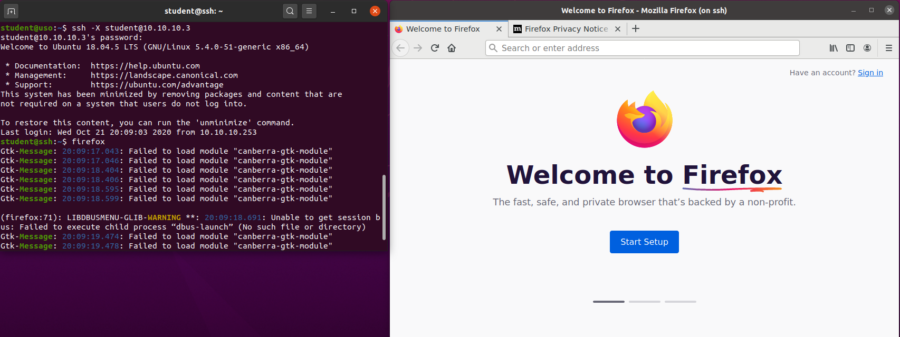

.. _network_services:

Servicii și clienți de rețea
============================

Dispozitivele pe care le folosim noi devin din ce în ce mai mici, mai eficiente
și ieftine. Asta se întâmplă deoarece multe dintre aplicațiile care până nu de
curând rulau pe calculatorul propriu s-au mutat în spațiu online. De exemplu, în
loc să descărcăm filme și să le urmărim de pe calculator, folosim o aplicație
cum ar fi Netflix pentru a ne transmite prin Internet filmul pe care vrem să îl
urmărim. Un alt exemplu relevant este Google Drive, care ne permite să stocăm,
să replicăm și să edităm documente într-o interfață web, în loc să le păstrăm
local pe calculatorul pe care îl folosim. Toată puterea de procesare și tot
spațiul de stocare s-a mutat de pe calculatorul propriu pe servere aflate în
Internet.

Vom numi aceste aplicații care rulează în Internet **servicii**.

Un serviciu este o aplicație care oferă o funcționalitate utilizatorilor care
apelează la ele. Serviciile în domeniul calculatoarelor lucrează folosind
paradigma server-client. Un avantaj major al acestei abordări este că reduce
puterea de calcul necesară pentru rularea aplicațiilor de către utilizatori.
Aceștia au nevoie doar de o aplicație client care știe să comunice cu serverul.
Astfel, aplicația client trimite o cerere către aplicația server, serverul
primește cererea, procesează cererea și servește răspunsul aplicației client
care a făcut cererea.

Această paradigmă poate fi observată în schema următoare:

.. image:: img/client-server.png
    :align: center
    :alt: Arhitectura client-server

Atunci când noi vrem să urmărim un film pe Netflix aplicația client Netflix de
pe calculator sau smart TV va trimite o cerere de descărcare a filmului de pe
serverul Netflix aflat la distanță.

.. _network_services_clients:

Clienţi web în linia de comandă
--------------------------------

În viață de zi cu zi aplicația pe care o folosim cel mai mult este browserul
web, deoarece majoritatea aplicațiilor pe care le folosim au fost transformate
în pagini web cu care noi interacționăm. Browserul web este o aplicație care
execută o cerere HTTP către un server web, identificat printr-o adresă, un link,
prin care face o acțiune și primește un răspuns. De exemplu, când accesăm pagina
``www.facebook.com`` se trimite o cerere către serverul HTTP, iar acesta trimite
un răspuns către browser sub forma unei pagini web, în formatul HTML, pe care
browserul o afișează.

Pentru interacțiunea cu serverele web putem folosi și clienți web în linie de
comandă. Clienții web folosiți în linie de comandă sunt folositori atunci când
nu avem acces la o interfață GUI, sau când încercăm să automatizăm un proces. De
exemplu, pentru a verifica automat starea unui site avem nevoie să descărcăm
pagina site-ului.

Există mai multe implementări de clienți web în linie de comandă. Vom folosi
comanda ``wget`` pentru descărcarea unei pagini web.

.. code-block::

        student@uso:~$ wget elf.cs.pub.ro
        --2020-10-20 23:01:02--  http://elf.cs.pub.ro/
        Resolving elf.cs.pub.ro (elf.cs.pub.ro)... 141.85.227.116
        Connecting to elf.cs.pub.ro (elf.cs.pub.ro)|141.85.227.116|:80... connected.
        HTTP request sent, awaiting response... 200 OK
        Length: 168 [text/html]
        Saving to: ‘index.html’

        index.html                        100%[===========================================================>]     168  --.-KB/s    in 0s

        2020-10-20 23:01:02 (7,61 MB/s) - ‘index.html’ saved [168/168]

        student@uso:~$ cat index.html
        <html>
        	<head>
        		<meta name="google-site-verification" content="gTsIxyV43HSJraRPl6X1A5jzGFgQ3N__hKAcuL2QsO8" />
        	</head>

        	<body>
        		<h1>It works!</h1>
        	</body>
        </html>

Comanda ``wget`` primește ca parametru link-ul către pagina pe care vrem să o
descărcăm.

Am folosit comanda ``cat`` pentru afișarea conținutului fișierului
``index.html``. Fișierul ``index.html`` este fișierul descărcat în mod
implicit, dacă nu descărcăm o pagină specifică.

Exercițiu - Descărcarea paginilor web
^^^^^^^^^^^^^^^^^^^^^^^^^^^^^^^^^^^^^

* Deschideți într-un editor de text pagina web descărcată pentru a vedea
  conținutul HTML.

* Descărcați pagina web de la adresa ``www.facebook.com``. Afișați conținutul
  fișierului descărcat.

.. admonition:: Observație:

    Clienții web nu sunt folosiți doar pentru accesarea paginilor web. Putem
    folosi clienți web pentru a descărca fișiere indiferent de tipul acestora.

* Descărcați pagina web de la adresa ``http://wttr.in/``. Afișați conținutul
  fișierului descărcat.

* Descărcați fișierul ``http://elf.cs.pub.ro/uso/res/final/07-feb/heroes.csv``.
  Ce tip de fișier este acesta?

.. _network_services_remotecli:

Accesul la distanţă în linie de comandă
---------------------------------------

.. note::

    Pentru rularea acestui demo rulați în directorul
    ``~/uso.git/labs/03-user/lab-containers/`` comanda ``./lab_prepare.sh install ssh``.
    Pentru a ne conecta la infrastructura pentru această secțiune vom folosi
    comanda ``./lab_prepare.sh connect ssh``

În multe situații atunci când lucrăm cu sisteme, este necesar să rulăm aplicații
pe alte stații în afara calculatorului nostru fără să avem acces fizic la
stații.

Protocolul cel mai folosit pentru accesul la stații la distanță este protocolul
SSH. SSH permite autentificarea la o stație pe care rulează un server SSH.
Când ne conecta la o stație, trebuie să precizăm utilizatorul cu care vrem să
ne logăm. Pentru autentificare introducem parola utilizatorului, sau
folosim o cheie de acces la stație.

.. _network_services_remotecli_pass:

Conectarea folosind autentificare cu parolă
^^^^^^^^^^^^^^^^^^^^^^^^^^^^^^^^^^^^^^^^^^^

Pentru a rula comenzi pe o altă stație putem folosi programul SSH (*Secure
Shell*) pentru a ne conecta la acesta în felul următor:

.. code-block::

        student@uso:~$ hostname
        uso
        student@uso:~$ ssh root@10.10.10.3
        The authenticity of host '10.10.10.3 (10.10.10.3)' can't be established.
        ECDSA key fingerprint is SHA256:I3Ybkkk7nF2FjwVHMzjkyujDnhlRlnSwPRVwUKm6OCM.
        Are you sure you want to continue connecting (yes/no/[fingerprint])? yes
        Warning: Permanently added '10.10.10.3' (ECDSA) to the list of known hosts.
        root@10.10.10.3's password:
        Welcome to Ubuntu 18.04.5 LTS (GNU/Linux 5.4.0-51-generic x86_64)

         * Documentation:  https://help.ubuntu.com
         * Management:     https://landscape.canonical.com
         * Support:        https://ubuntu.com/advantage
        This system has been minimized by removing packages and content that are
        not required on a system that users do not log into.

        To restore this content, you can run the 'unminimize' command.

        The programs included with the Ubuntu system are free software;
        the exact distribution terms for each program are described in the
        individual files in /usr/share/doc/\*/copyright.

        Ubuntu comes with ABSOLUTELY NO WARRANTY, to the extent permitted by
        applicable law.
        root@ssh:~# ls /
        bin  boot  dev  etc  home  lib  lib64  media  mnt  opt  proc  root  run  sbin  srv  sys  tmp  usr  var
        root@ssh:~# hostname
        ssh

Unde ``root`` este numele utilizatorului și ``10.10.10.3`` este adresa IP, sau
hostname-ul stației la care vrem să ne conectăm.

Atunci când ne conectăm la o stație, clientul SSH va încerca să autentifice
stația la care ne-am conectat. Dacă ne conectăm pentru prima oară la un sistem
trebuie să spunem clientului că am verificat datele clientului la care ne-am
conectat.

În mod implicit protocolul SSH va folosi autentificarea cu parolă. Parola
introdusă în exemplul de mai sus este parola ``root``.

Odată ce ne-am conectat la calculator, avem acces la un shell în care rulăm
comenzi ca mai sus. Putem observa că ne-am autentificat pe un calculator diferit
deoarece s-a schimbat promptul terminalului de la ``student@uso:~$`` la
``root@ssh:~#`` și s-a afișat un mesaj numit *Message of the Day*.

În exemplul de mai sus am rulat comanda ``hostname`` care afișează numele
stației la care ne-am conectat pentru a ne asigura că ne-am conectat pe un nou
calculator. Putem observa numele stației și din prompt.

Exercițiu - Conectarea la distanță
""""""""""""""""""""""""""""""""""

* Autentificați-vă la stația cu adresa IP ``11.11.11.3`` folosind utilizatorul
  ``root`` și parola ``root``.

* Autentificați-vă la stația  cu adresa IP ``12.12.12.3`` folosind utilizatorul
  ``student`` și parola ``student``.

.. admonition:: Observație:

    Atunci când ne conectăm la o stație folosind protocolul SSH este necesar să
    precizăm un nume de utilizator valid. Dacă utilizatorul nu există, serverul
    nu va preciza faptul că utilizatorul nu există pe sistem, ci va cere parola
    utilizatorului, dar nu va permite autentificarea la stație. De ce serverul SSH
    nu specifică dacă utilizatorul exista sau nu?

.. _network_services_remotecli_cmd:

Rularea unei singure comenzi prin SSH
^^^^^^^^^^^^^^^^^^^^^^^^^^^^^^^^^^^^^

Atunci când ne conectăm la o stație avem acces la un shell pe care putem să îl
folosim, dar dacă nu este necesar putem să rulăm mai multe comenzi, sau vrem să
automatizăm rularea comenzilor pe alte stații putem folosi comanda SSH în felul
următor:

.. code-block::

    student@uso:~$ ssh root@10.10.10.3 ip address show
    root@10.10.10.3's password:
    1: lo: <LOOPBACK,UP,LOWER_UP> mtu 65536 qdisc noqueue state UNKNOWN group default qlen 1000
        link/loopback 00:00:00:00:00:00 brd 00:00:00:00:00:00
        inet 127.0.0.1/8 scope host lo
           valid_lft forever preferred_lft forever
    544: eth0@if545: <BROADCAST,MULTICAST,UP,LOWER_UP> mtu 1500 qdisc noqueue state UP group default
        link/ether 02:42:0a:0a:0a:03 brd ff:ff:ff:ff:ff:ff link-netnsid 0
        inet 10.10.10.3/24 brd 10.10.10.255 scope global eth0
           valid_lft forever preferred_lft forever
    546: eth1@if547: <BROADCAST,MULTICAST,UP,LOWER_UP> mtu 1500 qdisc noqueue state UP group default
        link/ether 02:42:0b:0b:0b:03 brd ff:ff:ff:ff:ff:ff link-netnsid 0
        inet 11.11.11.3/24 brd 11.11.11.255 scope global eth1
           valid_lft forever preferred_lft forever
    550: eth2@if551: <BROADCAST,MULTICAST,UP,LOWER_UP> mtu 1500 qdisc noqueue state UP group default
        link/ether 02:42:0c:0c:0c:03 brd ff:ff:ff:ff:ff:ff link-netnsid 0
        inet 12.12.12.3/24 brd 12.12.12.255 scope global eth2
           valid_lft forever preferred_lft forever

Am rulat comanda ``ip address show`` pentru a afișa setările de rețea pe
stația de la adresa IP ``10.10.10.3``, autentificându-ne ca utilizatorul
``root``.

Execițiu - Rularea unei singure comenzi prin SSH
""""""""""""""""""""""""""""""""""""""""""""""""

Rulați comanda ``cat /etc/passwd`` pe stația de la IP-ul ``10.10.10.3`` fără să
intrați în interfața în linia de comandă de pe stații. Vă veți autentifica
folosind utilizatorul ``root`` și parola ``root``.

.. _network_services_remotecli_scp:

Transferul fișierelor la distanţă
^^^^^^^^^^^^^^^^^^^^^^^^^^^^^^^^^

Pentru a transfera fișiere la distanță folosim ``scp`` (secure copy). Comanda
``scp`` se folosește de protocolul SSH pentru transferul de date între stații,
astfel ne putem folosi de modelul de autentificare de la SSH, ca în comanda de
mai jos:

.. code-block::

    student@uso:~$ scp /bin/bash student@10.10.10.3:~/
    student@10.10.10.3's password:
    bash                                          100% 1156KB  30.5MB/s   00:00
    student@uso:~$ ssh student@10.10.10.3 ls ~
    student@10.10.10.3's password:
    bash

Fișierul ``/bin/bash`` a fost copiat de pe stația ``uso`` pe stația de la adresa IP
``10.10.10.3`` în directorul home al utilizatorului ``student``. Am rulat
comanda ``ls ~`` prin SSH pentru a verifica că s-a efectuat copierea cu succes.

Trimiterea fișierelor poate fi realizată în orice direcție:

* încărcarea fișierelor de la client la server

* descărcarea fișierelor de la server la client

Pentru descărcarea fișierelor de pe un server folosim comanda ``scp``:

.. code-block::

    student@uso:~$ scp root@10.10.10.3:/etc/resolv.conf .
    root@10.10.10.3's password:
    resolv.conf                                   100%   38    19.3KB/s   00:00
    student@uso:~$ cat resolv.conf
    nameserver 127.0.0.11
    options ndots:0
    student@uso:~$ ssh root@10.10.10.3 cat /etc/resolv.conf
    root@10.10.10.3's password:
    nameserver 127.0.0.11
    options ndots:0

Comanda rulată anterior a descărcat fișierul ``resolv.conf`` din directorul
``/etc/`` de pe stația ``10.10.10.3`` în directorul curent (``.``).

Exercițiu - Copierea fișierelor la distanță
"""""""""""""""""""""""""""""""""""""""""""

Descărcați fișierul ``/etc/passwd`` de la adresa ``10.10.10.3`` folosind
utilizatorul ``student`` și parola ``student`` în directorul
``/home/student/Downloads``.

Copierea directoarelor la distanță
""""""""""""""""""""""""""""""""""

Pentru copierea unui director folosim opțiunea ``-r``:

.. code-block::

    student@uso:~$ scp -r ./Downloads/ root@10.10.10.3:~/
    root@10.10.10.3's password:
    macos.txt                                     100%   18     4.2KB/s   00:00
    index.html                                    100%  168   168.4KB/s   00:00
    teamviewer_15.10.5_amd64.deb                  100%   14MB  48.1MB/s   00:00

Comanda anterioară a copiat directorul ``Downloads`` și conținutul său din
directorul curent în directorul home al utilizatorului ``root`` de la adresa
``10.10.10.3``.

Exercițiu - Copierea directoarelor la distanță
""""""""""""""""""""""""""""""""""""""""""""""

Copiați directorul ``/usr`` de pe stația de la adresa ``10.10.10.3`` în
directorul home al utilizatorului curent. Vă veți autentifica pe stația de la
distanță folosind utilizatorul ``root`` și parola ``root``.

.. _network_services_remotecli_key:

Conectarea folosind autentificare cu chei
^^^^^^^^^^^^^^^^^^^^^^^^^^^^^^^^^^^^^^^^^

În anumite scenarii ne dorim să evităm introducerea parolei pentru
autentificarea la o stație la distanță. De exemplu, ne dorim să rulăm aceeași
comandă pe 10 stații. Dacă am folosi autentificare bazată pe parolă ar fi nevoie
să scriem într-un fișier în clar parola. Aceasta este o problema de securitate,
deoarece dacă păstrăm o cheie în format text aceasta poate fi furată de cineva.
O alternativă ineficientă este să scriem parola de 10 ori de mână.

Pentru a trece de această problemă putem să folosim mecanismul de autentificare
cu chei. Autentificarea cu chei presupune existență a două chei pereche:

* **cheia privată**: este o cheie secretă care este folosită de un client SSH
  pentru a se autentifica
* **cheia publică**, este o cheie care este copiată pe stația unde este rulat
  serverul SSH. Cheia este folosită pentru identificarea clienților SSH care se
  conectează la server.

Cele două chei sunt legate matematic, iar posesorul cheii private se poate
autentifica pe orice sistem unde este disponibilă cheia publică. Câtă vreme
posesorul cheii private este singurul care are acces la cheie, nimeni nu se va
mai putea autentifica în locul său.

Pentru generarea unei perechi de chei folosim comanda ``ssh-keygen``:

.. code-block::

    student@uso:~$ ssh-keygen
    Generating public/private rsa key pair.
    Enter file in which to save the key (/home/student/.ssh/id_rsa):
    Enter passphrase (empty for no passphrase):
    Enter same passphrase again:
    Your identification has been saved in /home/student/.ssh/id_rsa
    Your public key has been saved in /home/student/.ssh/id_rsa.pub
    The key fingerprint is:
    SHA256:mN9IlWoU6bmSA1vvKBSAfAB/Rg9GwTaAhqZ1Kc0vfHM student@uso
    The key's randomart image is:
    +---[RSA 3072]----+
    |=+o**o  ..       |
    |+=++Oo  .. .     |
    |+.o*oo....o      |
    |.  o= =+Eo       |
    |     Bo=S.       |
    |    o ++oo       |
    |   .   =o .      |
    |    . . .        |
    |     .           |
    +----[SHA256]-----+

În procesul de generare a cheilor ni se cere și un passphrase
pentru a asigura securitatea cheii private în cazul în care este pierdută,
furată sau altcineva are acces accidental la ea. Desigur, uitarea
passphrase-ului face cheia nefolosibilă. Așa că passphrase-ul trebuie reținut
(și protejat) ca orice altă parolă. Este indicat să nu protejați cheia printr-un
passphrase deoarece prezintă aceleași probleme ca folosirea unei parole.

Pentru copierea cheii publice pe o stație folosim comanda ``ssh-copy-id``:

.. code-block::

    student@uso:~$ ssh-copy-id root@10.10.10.3
    /usr/bin/ssh-copy-id: INFO: Source of key(s) to be installed: "/home/student/.ssh/id_rsa.pub"
    /usr/bin/ssh-copy-id: INFO: attempting to log in with the new key(s), to filter out any that are already installed
    /usr/bin/ssh-copy-id: INFO: 1 key(s) remain to be installed -- if you are prompted now it is to install the new keys
    root@10.10.10.3's password:

    Number of key(s) added: 1

    Now try logging into the machine, with:   "ssh 'root@10.10.10.3'"
    and check to make sure that only the key(s) you wanted were added.

Este necesar să cunoaștem parola utilizatorului pentru copierea cheii publice.

Atunci când copiem cheia publică, aceasta va fi copiată pentru un singur
utilizator. Dacă vrem să ne autentificăm pe același sistem ca utilizatori
diferiți fără parola, este necesar să copiem cheia publică pentru fiecare
utilizator.

Exercițiu - Utilizarea cheilor SSH
""""""""""""""""""""""""""""""""""

* Generați o nouă cheie SSH de tip RSA cu passphrase-ul ``mere``.

* Efectuați modificările necesare astfel încât să vă puteți autentifica drept
  utilizatorul ``student`` de pe stația ``10.10.10.3`` fără parolă.

.. _network_services_remotegui:

Controlul la distanță în mediul grafic
--------------------------------------

Există anumite tipuri de aplicații care funcționează în mod implicit în mediul
grafic și aceste aplicații nu pot fi rulate în interfața în linie de comandă. De
exemplu, installer-ul unui joc nu poate să fie rulat din linie de comandă.

Controlul acestor aplicații se poate reduce la două probleme:

* controlul întregului desktop;

* controlul unei singure aplicații.

.. _network_services_remotegui_dekstop:

Controlul desktopului la distanţă
^^^^^^^^^^^^^^^^^^^^^^^^^^^^^^^^^^^

Pentru control complet al unei sesiuni desktop grafice există o mai multe
soluții, cum ar fi VNC, sau FreeRDP, dar noi ne vom concentra pe soluția numită
TeamViewer, deoarece oferă suport pentru toate sistemele convenționale.

TeamViewer poate fi descărcat de la `această
<https://www.teamviewer.com/en/download/linux/>`_ adresă și permite
autentificarea la o mașină folosind un ID și o parolă generate de aplicația
server.

Recapitulare - Instalarea aplicației TeamViewer
"""""""""""""""""""""""""""""""""""""""""""""""

Descărcați și instalați aplicația TeamViewer pe mașina virtuală ``USO`` și pe
stația voastră fizică.

Folosirea TeamViewer
""""""""""""""""""""

Pentru a ne conecta la o mașină la distanță avem nevoie de ID-ul mașinii și
parola conexiunii. Aceste informații se găsesc în primul ecran al aplicației
TeamViewer, cum se vede mai jos.

Vom scrie ID-ul stației la care vrem să ne conectăm în câmpul ``Partner ID`` de
pe calculatorul de pe care vrem să ne conectăm (stația client).

După ce apăsăm tasta ``Enter`` apare promptul pentru parolă, unde completăm
parola stației la care vrem să ne conectăm.

.. image:: img/teamviewer_pass.png
    :align: center
    :alt: Parola în TeamViewer

După ce am introdus parola a apărut pe ecran desktop-ul mașinii la care am vrut
să mă conectez. În cazul de față este vorba de un sistem MacOS pe care am rulat
TeamViewer.

Deasupra cadrului în care apare desktop-ul de la distanță apar butoane ce ne
permit să închidem conexiunea, sau să trimitem acțiuni și fișiere către
calculatorul server.

Exercițiu - Conectarea la distanță folosind TeamViewer
"""""""""""""""""""""""""""""""""""""""""""""""""""""""

Conectați-vă la mașina virtuală USO de pe stația voastră fizică.

.. _network_services_remotegui_window:

Controlul unei ferestre la distanţă
^^^^^^^^^^^^^^^^^^^^^^^^^^^^^^^^^^^^

Pentru controlul unei ferestre de pe stația server putem să folosim protocolul
SSH în modul *X Forwarding* (se referă la *X Window System*, care este un
protocol de afișare al ferestrelor întâlnit în Linux). În acest fel se afișează
pe stația client datele aplicației grafice care ar fi afișate pe stația server.

Acest mod de transfer nu este rapid, deoarece transferul se face printr-un
protocol care nu este menit pentru aplicații care au nevoie să fie responsive,
cum sunt ferestrele interactive, dar pot fi folosite pentru aplicații cum ar fi
kituri de instalare ale programelor.

Pentru a porni o aplicație grafică pe un calculator la distanță trebuie să ne
conectăm la această stație folosind opțiunea ``-X`` a comenzii ``ssh``.

Pentru a rula browserul ``firefox`` pe stația de la adresa ``10.10.10.3``, ne-am
conectat la aceasta folosind comanda ``ssh`` cu opțiunea ``-X`` și am pornit
aplicația ca și când am porni-o local.

.. admonition:: Observație:

    Nu putem să preluăm controlul unei aplicații dacă aceasta a fost pornită
    deja pe stația de la distanță, deoarece putem doar sa primim semnalul
    video pentru aplicații nou pornite.

Exercițiu - Controlul une ferestre la distanță
""""""""""""""""""""""""""""""""""""""""""""""

Deschideți aplicația grafică ``qbittorrent`` ca utilizatorul ``student`` pe
stația ``10.10.10.3``.

.. _network_services_vpn:

Securizarea conexiunii la Internet folosind un VPN
--------------------------------------------------

O aplicație de tip VPN (*Virtual Private Network*) este o aplicație care permite
crearea rețelelor de calculatoare în Internet fără ca acestea să fie neapărat în
aceeași rețea fizică.

Funcționalitatea unui VPN este încapsularea datelor trimise de către un
calculator, criptarea și trimiterea lor către un server care le va trimite
mai departe către destinație.

Primul avantaj al folosirii unui VPN este "ascunderea" traficului între client și
serverul VPN-ului. Astfel, acesta nu mai pot fi văzute de alte entități până când
ajung la serverul VPN. Mai mult, datele care se vor îndrepta spre o destinație pot
să depășească anumite filtre bazate pe locație, deoarece locația de unde provin va
fi înlocuită de serverul VPN.

Al doilea avantaj al VPN-urilor este interconectarea facilă între calculatoare
care se află în rețele locale diferite. De exemplu, pentru a juca un joc în
LAN (Minecraft pe rețea), putem folosi un VPN, cum ar fi Hamachi [#Hamachi]_ ,
la care se conectează doi utilizatori. Serverul de VPN va primi datele de la
clienți și le va trimite mai departe dintr-o rețea locală în alta.

<insert diagramă>TODO

Recapitulare - Identificarea adreselor IP ale interfețelor
^^^^^^^^^^^^^^^^^^^^^^^^^^^^^^^^^^^^^^^^^^^^^^^^^^^^^^^^^^
.. note::

    Pentru rularea acestui demo rulați în directorul
    ``~/uso.git/labs/03-user/lab-containers/`` comanda ``./lab_prepare.sh install vpn``.
    Pentru a ne conecta la infrastructura necesară acestei secțiuni, vom folosi
    comanda ``./lab_prepare.sh connect openvpn-client1`` pentru stația
    ``openvpn-client1`` și ``./lab_prepare.sh connect openvpn-client2`` pentru a vă
    conecta la stația ``openvpn-client2``.

Identificați adresele IP configurate pe interfețele stațiilor
``openvpn-client1`` și ``openvpn-client2``.

Recapitulare - Verificarea conexiunii între două stații
^^^^^^^^^^^^^^^^^^^^^^^^^^^^^^^^^^^^^^^^^^^^^^^^^^^^^^^

Verificați conectivitatea între cele două stații folosind adresele IP
identificate mai sus.

.. admonition:: Observație:

    Nu există conectivitate între cele două stații, deoarece acestea se află în
    rețele locale diferite.

Pentru a porni VPN-ul, vom folosi comanda ``openvpn``. Rulați următoarea comandă
pe ambele stații pentru a porni clientul de VPN:

.. code-block::

    root@openvpn-client1:~# openvpn --config ./openvpn-client1.ovpn --daemon
    root@openvpn-client1:~# ip address show
    1: lo: <LOOPBACK,UP,LOWER_UP> mtu 65536 qdisc noqueue state UNKNOWN group default qlen 1000
        link/loopback 00:00:00:00:00:00 brd 00:00:00:00:00:00
        inet 127.0.0.1/8 scope host lo
           valid_lft forever preferred_lft forever
    3: tun0: <POINTOPOINT,MULTICAST,NOARP,UP,LOWER_UP> mtu 1500 qdisc fq_codel state UNKNOWN group default qlen 100
        link/none
        inet 192.168.255.6 peer 192.168.255.5/32 scope global tun0
           valid_lft forever preferred_lft forever
    45: eth0@if46: <BROADCAST,MULTICAST,UP,LOWER_UP> mtu 1500 qdisc noqueue state UP group default
        link/ether 02:42:0a:0a:0a:0f brd ff:ff:ff:ff:ff:ff link-netnsid 0
        inet 10.10.10.15/24 brd 10.10.10.255 scope global eth0
           valid_lft forever preferred_lft forever

    root@openvpn-client2:~# openvpn --config ./openvpn-client2.ovpn --daemon
    root@openvpn-client2:~# ip address show
    1: lo: <LOOPBACK,UP,LOWER_UP> mtu 65536 qdisc noqueue state UNKNOWN group default qlen 1000
        link/loopback 00:00:00:00:00:00 brd 00:00:00:00:00:00
        inet 127.0.0.1/8 scope host lo
           valid_lft forever preferred_lft forever
    2: tun0: <POINTOPOINT,MULTICAST,NOARP,UP,LOWER_UP> mtu 1500 qdisc fq_codel state UNKNOWN group default qlen 100
        link/none
        inet 192.168.255.10 peer 192.168.255.9/32 scope global tun0
           valid_lft forever preferred_lft forever
    47: eth0@if48: <BROADCAST,MULTICAST,UP,LOWER_UP> mtu 1500 qdisc noqueue state UP group default
        link/ether 02:42:0b:0b:0b:0f brd ff:ff:ff:ff:ff:ff link-netnsid 0
        inet 11.11.11.15/24 brd 11.11.11.255 scope global eth0
           valid_lft forever preferred_lft forever

Observăm că a apărut o nouă interfață de rețea în sistem care nu are o componentă
fizică. Adresa IP setată pe această interfață este adresa care identifică
stațiile în rețeaua VPN-ului. Observați că ambele adrese de pe interfețele
``tun0`` sunt foarte similare. Asta înseamnă că cele două stații sunt acum în
aceeași rețea virtuală.

Recapitulare - Verificarea conexiunii între două stații
^^^^^^^^^^^^^^^^^^^^^^^^^^^^^^^^^^^^^^^^^^^^^^^^^^^^^^^

Testați conectivitatea de pe stația ``openvpn-client1`` cu stația
``openvpn-client2``. Folosiți adresele IP configurate pe interfețele ``tun0`` de
pe fiecare stație.

Modificarea drumului prin care trec datele
^^^^^^^^^^^^^^^^^^^^^^^^^^^^^^^^^^^^^^^^^^

Pentru a valida că datele chiar trec prin VPN, rulăm comanda
``traceroute 8.8.8.8`` și observăm că mesajele spre Internet nu trec prin
interfața ``eth0``. Mesajele trec prin interfața ``tun0``, ajung la serverul VPN
identificat prin adresa ``192.168.255.1`` în pasul 1, iar abia apoi sunt lansate
mai departe spre Internet.

.. code-block::

    root@openvpn-client1:~# traceroute 8.8.8.8
    traceroute to 8.8.8.8 (8.8.8.8), 30 hops max, 60 byte packets
     1  192.168.255.1 (192.168.255.1)  6.033 ms  6.031 ms  5.881 ms
     2  10.10.10.253 (10.10.10.253)  8.582 ms  8.447 ms  8.306 ms
     3  10.0.2.2 (10.0.2.2)  8.165 ms  8.031 ms  7.808 ms
     4  * * *
     5  * * *
     6  r-c3550-l3-vlan11.bucharest.roedu.net (141.85.0.65)  8.308 ms  5.578 ms  4.876 ms
     7  172.31.255.93 (172.31.255.93)  4.681 ms  6.882 ms  6.855 ms
     8  po-23.acc1.buc.roedu.net (37.128.225.225)  16.711 ms  16.151 ms  16.751 ms
     9  bu-13.core2.buc.roedu.net (37.128.232.177)  9.248 ms  9.268 ms  9.232 ms
    10  hu-0-0-0-0.core3.nat.roedu.net (37.128.239.101)  8.510 ms  8.466 ms  6.542 ms
    11  te-0-6-0-1.peers1.nat.roedu.net (37.128.239.42)  6.347 ms  5.894 ms  5.987 ms
    12  google.interlan.ro (86.104.125.129)  31.665 ms  31.614 ms  31.529 ms
    13  108.170.252.65 (108.170.252.65)  31.506 ms 108.170.251.193 (108.170.251.193)  31.146 ms 108.170.252.1 (108.170.252.1)  31.591 ms
    14  172.253.73.153 (172.253.73.153)  31.795 ms 74.125.37.197 (74.125.37.197)  30.256 ms 74.125.37.167 (74.125.37.167)  30.068 ms
    15  dns.google (8.8.8.8)  29.710 ms  34.122 ms  30.538 ms

Aceasta a fost o demonstrație a modului de lucru folosind ``openvpn`` în linie
de comandă pentru configurarea unui VPN folosind fișiere de configurare. Aceasta
nu este singura metodă de conectare la VPN, există implementări diferite, cum ar
fi WireGuard [#WireGuard]_ sau Cisco AnyConnect [#AnyConnect]_ care oferă același
serviciu dar implementat în mod diferit, oferind interfață grafică sau un mod
facil de configurare.

.. rubric:: Notă de subsol

.. [#Hamachi]
        https://www.vpn.net/

.. [#WireGuard]
        https://www.wireguard.com/

.. [#AnyConnect]
        https://www.cisco.com/c/en/us/products/security/anyconnect-secure-mobility-client/index.html
