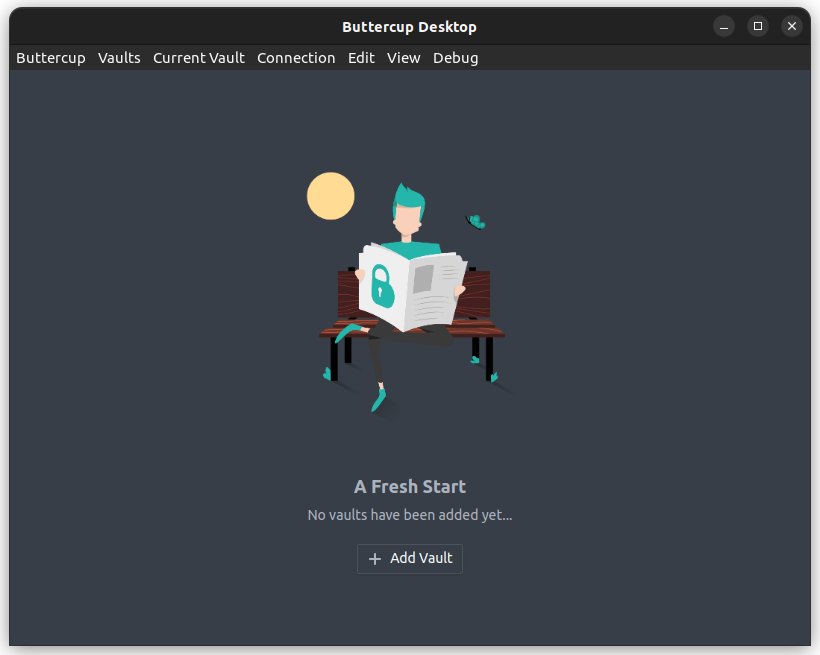
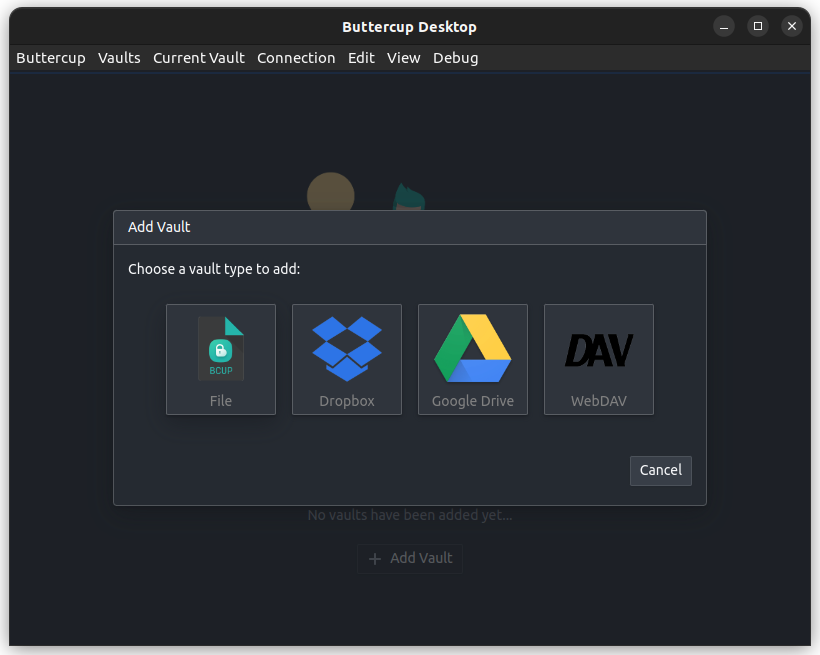
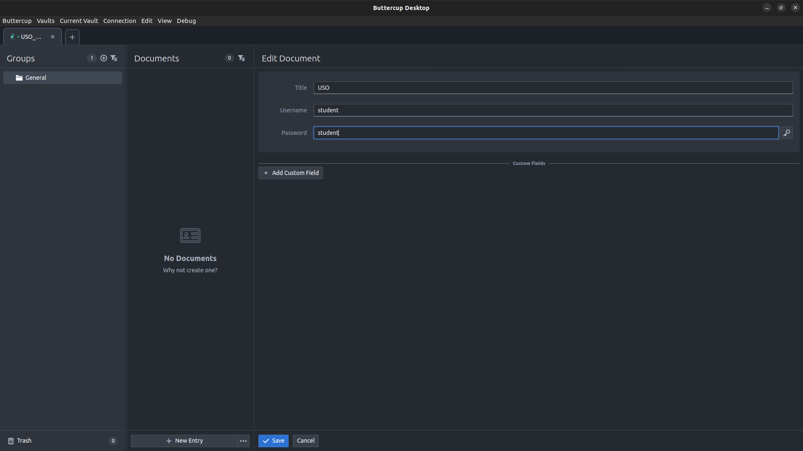

Securitatea Accesului. Autentificare
====================================

Autentificarea presupune transmiterea unor informații de secrete/personale (credențiale) compuse uzual dintr-un nume de utilizator (*username*) și un element de autentificare (*authentication token*), adesea o parolă.

Pentru sporirea nivelului de securitate în cazul autentificării putem folosi autentificare de tip multi-factor (*multi-factor authentication*).
Forma uzuală este *two-factor authentication* (2FA).
În acest caz sunt folosite mai multe moduri de autentificare: parolă + e-mail sau parolă + identificator biometric sau alte combinații.
Astfel, folosind două (sau mai multe) tipuri de autentificare, micșorăm șansele ca un actor malițios să ne poată impersona.

Parole în Linux
---------------

În Linux informațiile despre utilizatori sunt reținute în fișierul ``/etc/passwd`` care este citibil de către toți utilizatorii.

.. code-block:: bash

    student@uso-demo:~/securitate/stocks$ cat /etc/passwd
    root:x:0:0:root:/root:/bin/bash
    daemon:x:1:1:daemon:/usr/sbin:/usr/sbin/nologin
    bin:x:2:2:bin:/bin:/usr/sbin/nologin
    sys:x:3:3:sys:/dev:/usr/sbin/nologin
    sync:x:4:65534:sync:/bin:/bin/sync
    games:x:5:60:games:/usr/games:/usr/sbin/nologin
    man:x:6:12:man:/var/cache/man:/usr/sbin/nologin
    lp:x:7:7:lp:/var/spool/lpd:/usr/sbin/nologin
    mail:x:8:8:mail:/var/mail:/usr/sbin/nologin
    news:x:9:9:news:/var/spool/news:/usr/sbin/nologin
    uucp:x:10:10:uucp:/var/spool/uucp:/usr/sbin/nologin
    proxy:x:13:13:proxy:/bin:/usr/sbin/nologin
    www-data:x:33:33:www-data:/var/www:/usr/sbin/nologin
    backup:x:34:34:backup:/var/backups:/usr/sbin/nologin
    list:x:38:38:Mailing List Manager:/var/list:/usr/sbin/nologin
    irc:x:39:39:ircd:/var/run/ircd:/usr/sbin/nologin
    gnats:x:41:41:Gnats Bug-Reporting System (admin):/var/lib/gnats:/usr/sbin/nologin
    nobody:x:65534:65534:nobody:/nonexistent:/usr/sbin/nologin
    systemd-timesync:x:100:103:systemd Time Synchronization,,,:/run/systemd:/bin/false
    systemd-network:x:101:104:systemd Network Management,,,:/run/systemd/netif:/bin/false
    systemd-resolve:x:102:105:systemd Resolver,,,:/run/systemd/resolve:/bin/false
    systemd-bus-proxy:x:103:106:systemd Bus Proxy,,,:/run/systemd:/bin/false
    Debian-exim:x:104:109::/var/spool/exim4:/bin/false
    messagebus:x:105:110::/var/run/dbus:/bin/false
    statd:x:106:65534::/var/lib/nfs:/bin/false
    avahi-autoipd:x:107:113:Avahi autoip daemon,,,:/var/lib/avahi-autoipd:/bin/false
    sshd:x:108:65534::/var/run/sshd:/usr/sbin/nologin
    student:x:1000:1000:Student User,,,:/home/student:/bin/bash
    avahi:x:109:115:Avahi mDNS daemon,,,:/var/run/avahi-daemon:/bin/false
    Amazon:x:1001:1001::/home/Amazon:/bin/sh

Observăm utilizatorii ``root``, ``student``, ``Amazon``.
Chiar dacă fișierul se numește ``passwd`` acesta nu conține informații confidențiale, precum parole.

Informațiile despre parole sunt reținute în fișierul ``/etc/shadow`` care este citibil doar de procese privilegiate.

.. code-block:: bash

    student@uso-demo:~/securitate/stocks$ sudo cat /etc/shadow
    root:$6$8esr1Ey5$giBB2WfjBlEp2COdj.HO1J0vHA8Tm/n15.yA2d81GkgDnlezY84tCSK5uOWby/IuZYupYfIanj0ernAiPueoi/:16760:0:99999:7:::
    daemon:*:16760:0:99999:7:::
    bin:*:16760:0:99999:7:::
    sys:*:16760:0:99999:7:::
    sync:*:16760:0:99999:7:::
    games:*:16760:0:99999:7:::
    man:*:16760:0:99999:7:::
    lp:*:16760:0:99999:7:::
    mail:*:16760:0:99999:7:::
    news:*:16760:0:99999:7:::
    uucp:*:16760:0:99999:7:::
    proxy:*:16760:0:99999:7:::
    www-data:*:16760:0:99999:7:::
    backup:*:16760:0:99999:7:::
    list:*:16760:0:99999:7:::
    irc:*:16760:0:99999:7:::
    gnats:*:16760:0:99999:7:::
    nobody:*:16760:0:99999:7:::
    systemd-timesync:*:16760:0:99999:7:::
    systemd-network:*:16760:0:99999:7:::
    systemd-resolve:*:16760:0:99999:7:::
    systemd-bus-proxy:*:16760:0:99999:7:::
    Debian-exim:!:16760:0:99999:7:::
    messagebus:*:16760:0:99999:7:::
    statd:*:16760:0:99999:7:::
    avahi-autoipd:*:16760:0:99999:7:::
    sshd:*:16760:0:99999:7:::
    student:$6$/Ajn.K.P$KhLPgGusAakWEohMH.ejVz9Y2TDu9fJ3x.OD3pl3audmCWElLFYT5loZK7trAlt3JbgbAAsJUWo/D2xGjyHBO0:16760:0:99999:7:::
    avahi:*:16760:0:99999:7:::
    Amazon:$6$nlimOUzV$YmDo8EIcQ3KqGWt/6r4GRwxGfIBtpbd0kAT3tpYHVMYybhCTe6ZxB40GjPcZX3pVPANbkDwQKLlTPrnPc.7un.:18865:0:99999:7:::

Pentru a accesa fișierul ``etc/shadow`` ca utilizator privilegiat, am utilizat cuvântul cheie ``sudo``.
Observăm că în fișierul ``/etc/shadow`` parolele sunt reținute ca rezumat, nu în format citibil (plaintext).

Există diverse utilitare pentru generale de parole; cel mai uzual este utilitarul ``pwgen``:

.. code-block:: bash

    student@uso-demo:~/securitate/stocks$ pwgen
    kiloo3Th uPh2goh5 Xae2xah9 ixu0fiaY Sai7oowa ohCh7aid nohBah8n Xiedae2f
    yoh6GaeJ IoPhae9f ooX6oquu Uangu7sh miu4ohC5 IeLah6Ea chieP3ra eir4Aevo
    lacoch5U AiN6Aing Phie4hae Cho3beeT MahGh0to Daegoo4O Thee5Eis Maisai2e
    aiZuph6o teeN2yu7 cheiLee0 Queong2D iXoh2bei Xonee5ae thah2Iey chieD4wi
    unahMah3 axahH5qu gaeh0Rok Lae1aemo aeSoo0es Soh9iek6 Cheifoh1 an8oog2I
    vaeG7duK Piechis1 ooGhoPh3 aeNgee4l pheuLa1v IzaiD0Ah gauju5Je Thiex4oo
    eeTh5equ Cohc8lee aizo4ieT CeeV9nee Uequ0ahf ung6ahR9 xiNah3ai AVea6Ohc
    rae9Yof8 Azah5aa6 WoodeK7j yohQuoo0 Ool1Uque aijoRoo4 sainoi7I ux4Ees1A
    Sho5Foo0 riosha8I heexoo4F Saegh6ov OoZei8Ia UoL5AeWe raiz0ieR FolaP9ja
    eix4aT6s noojohB2 aib2Iep8 OWee4Yau ohh8Yei1 aphee5Ai aiD5Ooxi iedoo0Ph
    oohi4Aih ohr4ahFu doh5caiL Hi7Ail4k aeluTh4v eeCahch4 we6yiaTh zerae0oN
    up5eshuR ee7Eigiy Vo4cieco otooY4iT ri6Phei1 choF1tie aithin2R Cee1Oi2a
    wo6die5E iN5LieC5 aL2Iefeo eing1OhK eezuph8I TiWaa1Oo Va3sui8A miepu5Ie
    Ja6eg5je Caiquei2 Dei7oix6 aey2Aece daeg3Eir Zau4ih6u Iemee7ie ooShohk5
    ora6Ohh9 aiSh3ahf tai7sohH ieyaiF6k raeg9See debael5U Fie2eic2 sohNam7v
    IeT3vi4o Eer6Daen fa9eePh1 Aemaim7j Geda8ahs EeguP9ov naChieS2 ooch7aLe
    raeg9Iex Geez8ofo UoCh8oot ohSho4oh aqu0zieV wooCha7i paoS4woo eigh0Eiw
    fei7Gee2 jaifaV5n eigh7AGh eey8Zaeb yaiH3Iec eiMo9ooB Vie3riwo gah4Eeyi
    Rif5keeT Poo2aeji soh5ad6W kaS5cee1 oyeePai5 ooSha9wo beaBew5x eiGh7iqu
    iiBae8du aeGheuf9 aeZ5cahM Ize9ki7i uuPh6Doo ai8chooR Ohr6sohh eeRo0zie

Observăm că am generat 160 parole a câte 8 caractere fiecare.

În continuare generăm 2 parole a câte 17 caractere fiecare:

.. code-block:: bash

    student@uso-demo:~/securitate/stocks$ pwgen 17 2
    if5aerai1uc2giuJ1 maiTeiwahm9loo0li

Primul parametru se referă la numărul de caractere pentru fiecare parolă și al doilea se referă la numărul de parole generate.

Putem adăuga complexitate parolelor pentru a fi mai sigure, folosind parametrul ``-sync``:

.. code-block:: bash

    student@uso-demo:~/securitate/stocks$ pwgen -c 17 2
    yephaet5Heeh0IeYi choh2OuThu0ieGh0j
    student@uso-demo:~/securitate/stocks$ pwgen -nc 17 2
    aexohHochie0fum6g nahF6hiet9ie0tuTe
    student@uso-demo:~/securitate/stocks$ pwgen -ync 17 2
    aesahfa3eiDo~thee ahSh%ie2agh/uagux
    student@uso-demo:~/securitate/stocks$ pwgen -sync 17 2
    vultw""8nkOj8H)u# nh<afGZt(#ag58-UW

Astfel, ``-c`` adaugă cel puțin o literă mare în parolă, ``-n`` adaugă cel puțin o cifră, ``-y`` un caracter special, iar ``-s`` adaugă complexitate parolelor.

.. note::
   O parolă precum **Tr0oub4dor&3** este mai greu de reținut și mai ușor de spart decât passphrase-ul **horse battery staple**.

   Ideal, parolele ar trebui să aibă minim 16 caractere, să conțină litere mari, cifre, semne de punctuație.

   Mai mult, folosirea multi-factor authentication este recomandată.

Manager de parole
-----------------

Ținând cont de:
* numărul mare de aplicații ce folosesc parole pentru autentificare
* bunele practici de securitate ce recomandă folosirea parolelor de minim 16 caractere, cu litere mici, mari, cifre și semne de punctuație

este util să apelăm la **manager de parole**.

Browserele web moderne au integrate manager de parole care vor genera la cerere și vor completa automat câmpurile din formularele web de conturi și parole:

Avantajul managerului de parole din browser este disponibilitatea pe diverse dispozitive (i.e. parolele din Chrome pot fi folosite pe laptop, desktop, telefon mobil, tabletă, etc.)
Dacă singura necesitate este autentificare pe web, managerul de parole din browser este suficient, însă există manager de parole ca aplicație separată pe sistemele gazdă.

Putem folosi manager de parole local, în cadrul sistemlui nostru de operare.
Un astfel de exemplu este **Buttercup**, disponibil pe Linux, Windows, mobil, etc.
Puteți descărca această aplicație de la acest link [#buttercup]_.

Odată instalat, aplicația va avea următorul meniu:

Putem adăuga un **Vault** folosind mai multe opțiune de stocare.
Pentru accesarea acestuia, este nevoie de o parolă (*password manager*).

În acest exemplu, folosim fișier local pe disc.
În continuare adăugăm o parolă, ce va fi stocată în vault-ul creat:

.. [#buttercup]
    https://buttercup.pw/