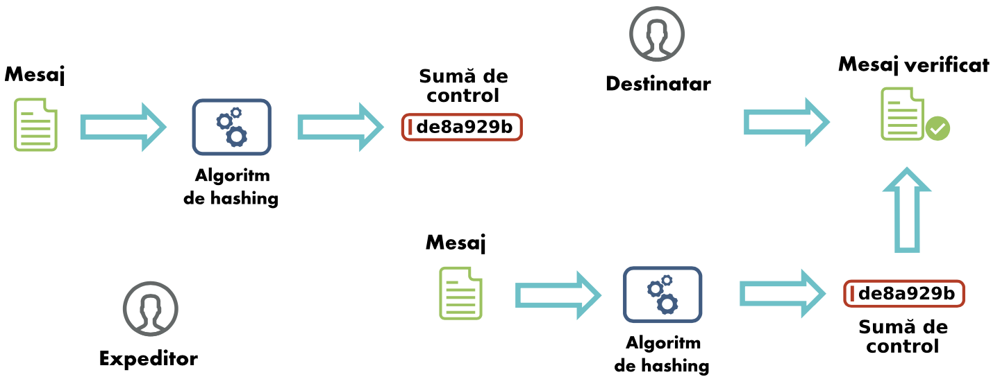

Securitatea datelor
===================

Securitatea în sistemul de fișiere
----------------------------------

Pentru accesul corect al fișierelor, sistemele de operare permit configurarea de **permisiuni de acces** (*access permissions* sau *access rights*).
Așa cum am precizat mai sus, în cazul acestor permisiuni, utilizatorii și procesele lor sunt subiecții, iar fișierele sunt obiectele.
În forma simplă, permisiunile pe fișiere și directoare sunt de citire, scriere și execuție, așa cum am văzut în Secțiunea **TODO Secțiune**.

Pentru a afișa permisiunile fișierelor folosim utilitarul *ls* cu opțiunea *-l*:

.. code-block:: bash

   student@uso-demo:~/securitate/stocks$ ls -l
    total 24
    drwxr-xr-x 2 student student 4096 Aug 26 12:57 Amazon
    drwxr-xr-x 2 student student 4096 Aug 26 12:57 Apple
    drwxr-xr-x 2 student student 4096 Aug 26 12:57 Facebook
    drwxr-xr-x 2 student student 4096 Aug 26 12:57 Google
    -rw-r--r-- 1 student student   37 Aug 26 14:30 NASDAQ
    drwxr-xr-x 2 student student 4096 Aug 26 12:58 Netflix

Pentru fiecare linie asociată unui fișier observăm primul caracter (*d* - director sau *-* fișier simplu) după care nouă caractere de tipul *r (read)*, *w (write)*, *x (execute)*.
Pentru lipsa permisiunii respective avem caracterul *-*.
Ne amintim din capitolul **TODO Sectiune** că primele trei caractere se referă la permisiunile care se aplică utilizatorului (*user*), următoarele trei se aplică grupului (*group*), iar ultimele trei se aplică restului utilizatorilor din sistem (*others*).

Coloanele trei și patru de mai sus reprezintă utilizatorul și grupul ce dețin fișierul.
Acestea pot fi schimbate cu ajutorul utilitarului *chown*:

.. code-block:: bash

    student@uso-demo:~/securitate/stocks$ chown Amazon:Amazon Amazon
    chown: changing ownership of 'Amazon': Operation not permitted
    student@uso-demo:~/securitate/stocks$ sudo chown Amazon:Amazon Amazon
    student@uso-demo:~/securitate/stocks$ ls -l
    total 24
    drwxr-xr-x 2 Amazon  Amazon  4096 Aug 26 12:57 Amazon
    drwxr-xr-x 2 student student 4096 Aug 26 12:57 Apple
    drwxr-xr-x 2 student student 4096 Aug 26 12:57 Facebook
    drwxr-xr-x 2 student student 4096 Aug 26 12:57 Google
    -rw-r--r-- 1 student student   37 Aug 26 14:30 NASDAQ
    drwxr-xr-x 2 student student 4096 Aug 26 12:58 Netflix

Observăm din eroarea primită din partea sistemului că pentru a schimba deținătorul unui fișier este nevoie de drepturi privilegiate.
Pentru aceasta, am folosit utilitarul *sudo* împreună cu comanda *chown*.
Parametrii folosiți sunt *utilizator:grup* și fișierul ``Amazon``.

    Pentru a modifica permisiunile, folosim utilitarul *chmod*:

.. code-block:: bash

    student@uso-demo:~/securitate/stocks$ sudo chmod -r Amazon/
    student@uso-demo:~/securitate/stocks$ ls -l
    total 24
    d-wx--x--x 2 Amazon  Amazon  4096 Aug 26 12:57 Amazon
    drwxr-xr-x 2 student student 4096 Aug 26 12:57 Apple
    drwxr-xr-x 2 student student 4096 Aug 26 12:57 Facebook
    drwxr-xr-x 2 student student 4096 Aug 26 12:57 Google
    -rw-r--r-- 1 student student   37 Aug 26 14:30 NASDAQ
    drwxr-xr-x 2 student student 4096 Aug 26 12:58 Netflix

Observăm că pentru a scoate permisiunile de citire folosim parametrul  *-r*, după care fisierul/directorul țintă.
Pentru mai multe detalii de manipulare a permisiunilor, parcurgeți capitolul.

Exerciții - sistemul de fișiere
^^^^^^^^^^^^^^^^^^^^^^^^^^^^^^^

#. Modificați permisiunile fișierului ``Google`` astfel încât doar utilizatorul care deține fișierul (*user*) să aibă drepturi de citire (*read*).
#. Modificați permisiunile fișierului ``Netflix`` astfel încât doar grupul ce deține fișierul (*owner*) să aibă drepturi de execuție (*execute*).
#. Modificați permisiunile fișierului ``Amazon`` astfel încât toți utilizatorii să aibă drepturi de scriere (*write*).

Confidențialitatea datelor
--------------------------

Sistemele și dispozitivele moderne au legătură aproape permanentă la Internet și transferă informații între ele.
În această situație, permisiunile pe fișiere în sistemul local sunt nerelevante pentru un atacator care poate să captureze datele când sunt transferate.
De aceea avem nevoie de moduri de a ascunde aceste date astfel încât, chiar capturate, să nu fie citite de un atacator, adică să păstrăm *confidențialitatea datelor*. *Confidențialitatea datelor* este asigurată, în general, prin *criptare*.
De asemenea, folosim *permisiunile de acces* împreună cu *criptarea* pentru a avea o formă de *securitate în adâncime*.

Folosind utilitarul ``openssl`` putem să criptăm conținutul unui fișier:

.. code-block:: bash

    student@uso-demo:~/securitate/stocks/Apple$ echo -n "Your password is safe with your iOS" > motto.txt
    student@uso-demo:~/securitate/stocks/Apple$ openssl aes-256-cbc -in motto.txt -out motto.enc -pass pass:"Apple security is better than yours"
    student@uso-demo:~/securitate/stocks/Apple$ ls
    motto.enc  motto.txt

Am creat fișierul ``motto.txt`` și l-am criptat folosind un algoritm de criptare AES cu o cheie pe 256 biți (``aes-256-cbc``).
Fișierul dat de ``-in`` este cel de intrare, necriptat, iar cel dat de ``-out`` este rezultatul criptării.
Am folosit parametrul ``-pass`` pentru a introduce din linia de comandă parola de criptare.

Verificăm fișierul criptat ``motto.enc``:

.. code-block:: bash

    student@uso-demo:~/securitate/stocks/Apple$ xxd motto.enc
    0000000: 5361 6c74 6564 5f5f 2562 0ad0 cc5c 7969  Salted__%b...\yi
    0000010: 5215 6e86 796c 6949 ac43 c9f6 056d f8a2  R.n.yliI.C...m..
    0000020: c2cf 8d57 ce81 6c19 f40d 6ffe e108 5668  ...W..l...o...Vh
    0000030: 640f a92a db41 56f6 dbde d898 29f5 0bf6  d..*.AV.....)...

Utilizând parametrul ``-d`` putem decripta fișierul ``motto.enc``:

.. code-block:: bash

    student@uso-demo:~/securitate/stocks/Apple$ openssl aes-256-cbc -d -in motto.enc -out decrypted_motto.txt -pass pass:"Apple security is better than yours"
    student@uso-demo:~/securitate/stocks/Apple$ ls
    decrypted_motto.txt  motto.enc  motto.txt
    student@uso-demo:~/securitate/stocks/Apple$ cat decrypted_motto.txt
    Your password is safe with your iOSstudent@uso-demo:~/securitate/stocks/Apple$

Am folosit parametrul ``-d`` pentru criptare, ``-in`` pentru a oferi fișierul criptat și ``-out`` pentru rezultat.
Observăm că textul decriptat este identic cu cel original.

Exerciții - confidentialitatea datelor
^^^^^^^^^^^^^^^^^^^^^^^^^^^^^^^^^^^^^^

#. Criptați propoziția următoare folosind algoritmul *aes-256-cbc*: *My password is better than yours!*;
#. Decriptați fișierul obținut.

Integritatea datelor
--------------------

Un atacator poate urmări să citească datele, sau, în cazul în care acestea sunt criptate, poate decide să le modifice.
Chiar și în absența atacatorului, datele pot fi corupte de defecte hardware ale dispozitivelor de stocare sau a celor de rețea.
De aceea este necesar ca, în cazul transferului datelor, să asigurăm integritatea acestora.
Integritatea datelor se realizează în general cu algoritmi de hashing.
Un algoritm de hashing generează un rezumat de mici dimensiuni pentru un mesaj de intrare.
Un fișier oricât de mare va avea un rezumat de doar câteva zeci de octeți, numit **sumă de control** (*checksum*).

Procedura uzuală de verificare a integrității datelor este urmatoarea:

Exemple de algoritmi de hashing: md5 (utilitar ``md5sum``), SHA-1 (utilitar ``sha1sum``), SHA-256 (utilitarul ``sha256sum``).
În continuare vom folosim utilitarul ``md5sum``:

.. code-block:: bash

    student@uso-demo:~/securitate/stocks$ echo "FAANG is the place to be" | md5sum
    ffe3ae3af537e5dd8999c86e54ac513e  -
    student@uso-demo:~/securitate/stocks$ echo "FAANG is the place to be!" | md5sum
    95a4cb03ec3f1b2f31048ff913cc4b6a  -

Observăm că *ffe3ae3af537e5dd8999c86e54ac513e* este suma de control pentru *FAANG is the place to be*.
Mai mult, observăm că la introducerea unui nou caracter **!**, suma de control este complet diferită.

Obținem suma de control pentru fișierul ``NASDAQ`` folosind utilitarul ``sha256``:

.. code-block:: bash

    student@uso-demo:~/securitate/stocks$ cat NASDAQ
    Facebook
    Apple
    Amazon
    Netflix
    Google
    student@uso-demo:~/securitate/stocks$ sha256sum NASDAQ
    05b3438dbc3530b185d1c005aaceab6043dc2e006b6b4fe1d1f40cc5a6588068  NASDAQ

Un exemplu de utilizare a sumei de control este cazul în care descărcăm un fișier.
Spre exemplu, dacă descărcăm `VirtualBox pentru Ubuntu 16.04`_, putem verifica integritatea fișierului descărcat folosind sume control:

.. _VirtualBox pentru Ubuntu 16.04: https://download.virtualbox.org/virtualbox/6.1.26/virtualbox-6.1_6.1.26-145957~Ubuntu~eoan_amd64.deb

.. code-block:: bash

     student@uso-demo:~/securitate/stocks$ md5sum ~/virtualbox-6.1_6.1.26-145957~Ubuntu~bionic_amd64.deb
     223d915605c9001665f2b7469464bb0e  /home/student/virtualbox-6.1_6.1.26-145957~Ubuntu~bionic_amd64.deb

Cei de la VirtualBox ne oferă un `fișier cu sumele de control`_ pentru fișierele oferite.

.. _fișier cu sumele de control: https://www.virtualbox.org/download/hashes/6.1.26/MD5SUMS

Exerciții - integritatea datelor
^^^^^^^^^^^^^^^^^^^^^^^^^^^^^^^^

#. Creați suma de control pentru: "Facebook Amazon Apple Netflix Google (FAANG)";
#. Modificați un caracter din șirul de mai sus și refaceți suma de control;
#. Creați suma de control pentru un fișier din sistemul de fișiere (poate fi creat de voi);
#. Modificați un caracter din acel fișier și refaceți suma de control. Este identică?
#. Descărcați de pe platforma `VirtualBox`_ o versiune de utilitar. Faceți suma de control și comparați cu ce oferă cei de la VirtualBox.

.. _VirtualBox: https://www.virtualbox.org/wiki/Linux_Downloads
