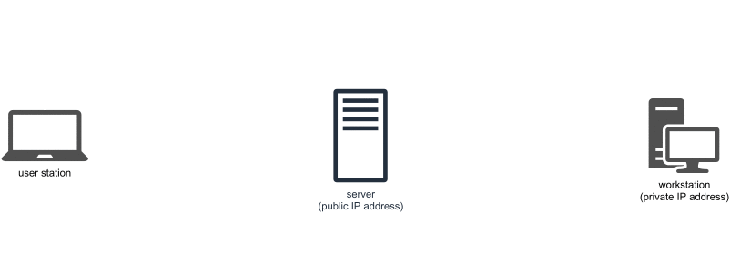

.. _task_admin_remote:

Conectarea la workstation
=========================

.. note::

    Pentru a parcurge această secțiune este recomandat să descărcați ultima versiune a respository-ului laboratorului.
    Pentru a descărca ultima versiune a repository-ului, rulați comanda ``git pull`` în directorul ``~/uso-lab/labs/10-tasks-admin/lab-containers/``.

    Infrastructura laboratorului este bazată pe containere Docker ale căror imagini vor fi generate pe propriul calculator.
    Dacă nu aveți deja instalat Docker Engine pe sistem, scriptul ``~/uso-lab/labs/10-tasks-admin/lab-containers/lab_prepare.sh`` va instala aplicația.

    După ce ați terminat de lucrat, vă recomandăm să opriți containerele rulând comanda ``./lab-prepare.sh delete`` în directorul ``~/uso-lab/labs/10-tasks-admin/lab-containers/``.

Prima problemă cu care ne vom confrunta este conectarea la stație, deoarece, în majoritatea cazurilor, nu vom lucra în aceeași rețea cu sistemul la distanță și stația nu va avea o adresă IP publică.
Așadar, nu ne vom putea conecta direct la sistem folosind un protocol de comunicare la distanță, cum ar fi SSH fără să facem pași suplimentari.

Câteva soluții de conectare la sistem pe care le vom aborda sunt:

* VPN
* tunel SSH
* DDNS (*Dynamic Domain Name System*)

Nu vom aborda soluția bazată pe DDNS, deoarece aceasta presupune că avem o adresă IP publică configurată pe ruterul primit de la furnizorul de Internet, dar acest lucru nu este valabil pentru majoritatea stațiilor.

.. _task_admin_remote_ip:

Problema adreselor IP private
-----------------------------

.. note::

    Pentru rularea acestui demo, rulați în directorul ``~/uso.git/labs/03-user/lab-containers/`` comanda ``./lab_prepare.sh install remote`` și comanda  ``./lab_prepare.sh install local``
    Pentru a ne conecta la infrastructura pentru această secțiune, vom folosi comanda ``./lab_prepare.sh connect`` având ca parametru numele mașinii la care vrem să ne conectăm, ``local`` sau ``remote``.

Adresele IPv4 au fost proiectate pentru a fi identificatori unici în Internet pentru stații, așa cum este prezentat în capitolul :ref:`network_connection_internet`.
Acestea pot să identifice maxim :math:`2^{32}` stații în Internet.
Însă acum există mai multe dispozitive conectate la Internet decât există adrese IPv4 care se pot asigna pe dispozitive.

Pentru a rezolva această problemă, au fost alese anumite intervale de adrese IP care pot fi atribuite pe mai multe dispozitive în același timp.
Astfel, s-a rezolvat problema suprapunerii adreselor IP.
Dezavantajul este că aceste adrese, nemaifiind unice, nu mai pot să fie accesibile de oriunde din Internet.
Aceste adrese IP sunt **adrese IP private**;
celelalte adrese, accesibile din Internet, sunt **adrese IP publice** sau **rutabile**.

Intervalele adreselor IPv4 private sunt următoarele:

* ``10.0.0.0`` - ``10.255.255.255``;
* ``172.16.0.0`` - ``172.31.255.255``;
* ``192.168.0.0`` - ``192.168.255.255``

Nicio adresă IP din intervalele de mai sunt nu poate fi accesată direct din Internet.

În această subsecțiune vom lucra cu 2 stații care sunt distribuite în felul următor:

* ``local``, reprezintă stația "locală", adică laptopul de pe care ne-am conecta, dacă ar fi vorba de un scenariu real; are o singură interfață de rețea cu adresa IP ``10.10.10.3``;
* ``remote``, reprezintă workstationul la care vrem să ne conectăm; are o singură interfață cu adresa IP ``10.11.11.3``.

Vom verifica conectivitatea cu stația ``remote`` de pe stația ``local`` folosind comanda ``ping`` (am introdus utilitarul ``ping`` în secțiunea :ref:`network_connection_internet_ping`).

.. code-block::

    root@local:~# ping -c 2 10.10.10.3
    PING 10.10.10.3 (10.10.10.3) 56(84) bytes of data.

    --- 10.10.10.3 ping statistics ---
    2 packets transmitted, 0 received, 100% packet loss, time 1010ms

    root@local:~# ping -c 2 141.85.241.99
    PING 141.85.241.99 (141.85.241.99) 56(84) bytes of data.
    64 bytes from 141.85.241.99: icmp_seq=1 ttl=61 time=9.02 ms
    64 bytes from 141.85.241.99: icmp_seq=2 ttl=61 time=8.58 ms

    --- 141.85.241.99 ping statistics ---
    2 packets transmitted, 2 received, 0% packet loss, time 1001ms
    rtt min/avg/max/mdev = 8.588/8.806/9.024/0.218 ms

Rezultatul primei rulări a comenzii ``ping`` arată că nu avem conectivitate între stația ``local`` și stația ``remote``.
Totuși, am testat și conectivitatea cu o altă adresă IP din Internet (în cazul acesta folosind adresa IP a stației ``fep.grid.pub.ro`` - cu adresa IP 141.85.241.99);
cu aceasta am putut să comunicăm, deci nu este o problemă de conectare la Internet.

.. _task_admin_remote_vpn:

Conectarea prin VPN
-------------------

O primă soluție pentru conectarea la o stație care folosește o adresă IP privată o reprezintă serviciile de tip VPN (*Virtual Private Network*).
Acestea conectează două stații care în mod fizic nu sunt conectate la aceeași rețea.

Pentru această soluție avem două moduri de conectare: folosind un server public pe care îl configurăm noi drept server de VPN, sau folosirea unui serviciu public de VPN cum ar fi `Hamachi <www.vpn.com/>`_ sau `ZeroTier <www.zerotier.com/>`_.
Am folosit ca exemplu serviciile Hamachi sau ZeroTier, deoarece acestea pot fi folosite gratuit și sunt ușor de configurat, așa cum reiese din tabelul de mai jos.

.. list-table:: Soluții VPN
   :widths: 25 25 50
   :header-rows: 1

   * - Nume soluție
     - Avantaje
     - Dezavantaje
   * - Hamachi
     - * Ușor de configurat

       * Aplicație client disponibilă pe Linux și pe Windows

       * Nu necesită înregistrarea
     - * Latență mai mare decât alte soluții

       * Soluția gratis nu este optimă pentru un număr mare de calculatoare
   * - ZeroTier
     - * Ușor de instalat și cofigurat

       * Permite 50 de stații într-o rețea

     - * Necesită înregistrare pentru folosire
   * - FreeLAN
     - * Soluție gratis
       * Nu limitează numărul de stații dintr-o rețea
     - * Configurare dificilă
       * Nu funcționează pe toate stațiile, este nevoie de anumite condiții
         speciale

.. _task_admin_remote_vpn_hamachi:

Folosirea serviciului Hamachi
^^^^^^^^^^^^^^^^^^^^^^^^^^^^^

Pentru început, recomandăm folosirea aplicației Hamachi, deoarece acesta nu presupune înregistrarea unui cont pentru a fi folosită.
Hamachi vine cu dezavantajul că putem să conectăm maxim cinci stații între ele și viteza conexiunii este mai mică decât dacă am folosi unele servicii plătite, cum ar fi OpenVPN.

.. _task_admin_remote_vpn_hamachi_install:

Instalarea Hamachi
""""""""""""""""""

Nu vom instala pachetul folosind comanda ``apt``, deoarece repository-ul de pachete folosit de Ubuntu nu conține pachetul pentru Hamachi.
Pentru instalarea aplicației Hamachi vom descărca și instala manual pachetul.

Vom folosi comanda ``wget`` pentru a descărca pachetul:

.. code-block::

    root@remote:~# wget https://www.vpn.net/installers/logmein-hamachi_2.1.0.203-1_amd64.deb
    --2021-01-05 15:49:15--  https://www.vpn.net/installers/logmein-hamachi_2.1.0.203-1_amd64.deb
    Resolving www.vpn.net (www.vpn.net)... 64.95.128.197, 64.95.128.199
    Connecting to www.vpn.net (www.vpn.net)|64.95.128.197|:443... connected.
    HTTP request sent, awaiting response... 200 OK
    Length: 1613102 (1.5M) [application/vnd.debian.binary-package]
    Saving to: 'logmein-hamachi_2.1.0.203-1_amd64.deb'

    logmein-hamachi_2.1.0.203-1_amd64 100%[==========================================================>]   1.54M  4.14MB/s    in 0.4s    

    2021-01-05 15:49:16 (4.14 MB/s) - 'logmein-hamachi_2.1.0.203-1_amd64.deb' saved [1613102/1613102]

    root@remote:~# dpkg -i logmein-hamachi_2.1.0.203-1_amd64.deb
    Selecting previously unselected package logmein-hamachi.
    (Reading database ... 12216 files and directories currently installed.)
    Preparing to unpack logmein-hamachi_2.1.0.203-1_amd64.deb ...
    Unpacking logmein-hamachi (2.1.0.203-1) ...
    Setting up logmein-hamachi (2.1.0.203-1) ...
    mknod: /dev/net/tun: File exists
    Starting LogMeIn Hamachi VPN tunneling engine logmein-hamachi
    starting - success
    Processing triggers for systemd (245.4-4ubuntu3.3) ...

Am folosit comanda ``dpkg`` care gestionează aplicații sub forma pachetelor ``.deb``, specifice distribuțiilor Debian, Ubuntu și Mint.
Opțiunea ``-i`` specifică comenzii ``dpkg`` că vrem să instalăm o aplicație.

Verificăm instalarea folosind comanda ``hamachi``:

.. code-block::

    root@remote:~# hamachi
      version    : 2.1.0.203
      pid        : 42
      status     : offline
      client id  :
      address    :
      nickname   :
      lmi account:

Pentru a ne autentifica la serverele Hamachi, folosim comanda ``hamachi login``:

.. code-block::

    root@remote:~# hamachi login
    Logging in .......... ok
    root@remote:~# hamachi
      version    : 2.1.0.203
      pid        : 42
      status     : logged in
      client id  : 253-932-022
      address    : 25.114.254.180    2620:9b::1972:feb4
      nickname   : remote
      lmi account: -

Această comandă generează un identificator unic per stație și stabilește un nickname.
Rulând comanda ``hamachi`` vor fi afișate identificatorul, nickname-ul sistemului și adresa IP din VPN.

.. _task_admin_remote_vpn_hamachi_install_ex:

Exercițiu: Instalare Hamachi
""""""""""""""""""""""""""""

Instalați Hamachi pe stația ``local``.

.. _task_admin_remote_vpn_hamachi_create:

Crearea unei rețele private
"""""""""""""""""""""""""""

Odată ce am instalat Hamachi pe ambele stații pe care vrem să le conectăm, trebuie să creăm o rețea virtuală prin care acestea două să comunice.
Această rețea va conecta cele două stații, cu toate că ele nu sunt fizic în aceeași rețea.

Vom crea rețeaua virtuală de pe stația ``remote``.
Pentru a crea o rețea virtuală folosim comanda ``hamachi create`` împreună cu numele rețelei și parola acesteia.
Stația ``remote`` va avea drepturi de administrare a rețelei.
Doar având drepturi administrative se pot scoate sisteme din rețea, sau se poate șterge rețeaua.
În comanda de mai jos, folosiți în loc de șirul de caractere ``nume-prenume`` numele și prenumele vostru:

.. code-block::

    root@remote:~# hamachi create nume-prenume 12345667890
    Creating nume-prenume .. ok
    root@remote:~# hamachi list
     * [nume-prenume]  capacity: 1/5, subscription type: Free, owner: This computer

Am folosit comanda ``hamachi list`` pentru a verifica faptul că a fost creată rețeaua.
Comanda ``hamachi list`` afișează toate rețelele din care face parte stația.

.. _task_admin_remote_vpn_hamachi_connect:

Conectarea la o rețea
"""""""""""""""""""""

Pentru a conecta stația ``local`` la rețeaua privată vom, folosi comanda ``hamachi join`` urmată de numele rețelei la care vom conecta stația și parola rețelei:

.. code-block::

    root@local:~# hamachi join nume-prenume 12345667890
    Joining nume-prenume .. ok
    root@local:~# hamachi list
     * [nume-prenume]  capacity: 2/5, subscription type: Free, owner: remote (253-932-022)
     * 253-932-022   remote                     25.114.254.180    alias: not set           2620:9b::1972:feb4                          via server  TCP

Rulând comanda ``hamachi list``, am afișat rețelele la care este conectată stația ``local`` și stațiile cu care împarte rețelele.
Adresa IP a stației ``remote`` din rețeaua privată este ``25.114.254.180``, conform rezultatului comenzii.

Pentru a testa conectivitatea între stațiile ``local`` și ``remote`` vom rula comanda ``ping``:

.. code-block::

    root@local:~# ping -c 2 25.114.254.180
    PING 25.114.254.180 (25.114.254.180) 56(84) bytes of data.
    64 bytes from 25.114.254.180: icmp_seq=1 ttl=64 time=76.5 ms
    64 bytes from 25.114.254.180: icmp_seq=2 ttl=64 time=92.3 ms

    --- 25.114.254.180 ping statistics ---
    2 packets transmitted, 2 received, 0% packet loss, time 1003ms
    rtt min/avg/max/mdev = 76.592/84.493/92.394/7.901 ms

.. _task_admin_remote_vpn_hamachi_connect_ex:

Exercițiu: Crearea și folosirea unei rețele private
"""""""""""""""""""""""""""""""""""""""""""""""""""

Creați o nouă rețea privată numită ``prenume-nume``, cu parola de acces ``anaaremere``.
Conectați stațiile ``local`` și ``remote`` la noua rețea.

.. _task_admin_remote_vpn_private:

Folosirea unui VPN privat
^^^^^^^^^^^^^^^^^^^^^^^^^

Pentru folosirea unui VPN privat este nevoie să avem o stație în Internet la care să avem acces atât de la stația locală (cum ar fi laptopul) cât și de la cea de la distanță (workstationul).
Putem obține acces la astfel de stații cumpărând acces la o mașină virtuală de la un serviciu de hosting, cum ar fi AWS, DigitalOcean, Microsoft Azure sau Linode.

Odată ce am obținut o stație cu o adresă IP publică, este nevoie să configurăm un serviciu de VPN.
Pentru aceasta putem folosi infrastructura pe care am prezentat-o în secțiunea :ref:`network_connection`, infrastructură care pornește un server OpenVPN.

.. _task_admin_remote_tunnel:

Conectarea folosind un tunel SSH
--------------------------------
.. note::

    Pentru rularea acestui demo, rulați în directorul ``~/uso.git/labs/10-task-admin/lab-containers/`` comanda ``./lab_prepare.sh install ssh-server``.
    Pentru a ne conecta la infrastructura pentru această secțiune, vom folosi comanda ``./lab_prepare.sh connect`` având ca parametrul numele mașinii la care vrem să ne conectăm, ``local``, ``remote`` sau ``ssh-server``.

Abordările pe care le-am discutat mai sus presupun accesul la un server central și drepturi de administrator din partea utilizatorului pentru instalarea aplicațiilor (cum ar fi Hamachi sau OpenVPN).
Dacă nu avem acces la un cont de administrator, nu putem să ne conectăm la stația de la distanță.

O alternativă care nu presupune drepturi administrative sunt tunelurile SSH.
Un tunel SSH reprezintă o conexiune între două stații facilitată de protocolul SSH.
Prin această conexiune se pot "tunela" alte mesaje, inclusiv o altă conexiune SSH.

Dezavantajul acestei abordări este că necesită accesul la un server terț care să fie accesibil de ambele stații.

În această subsecțiune vom lucra cu 3 stații care sunt distribuite în felul următor:

* ``local``, reprezintă stația "locală", adică laptopul de pe care ne-am conecta, dacă ar fi vorba de un scenariu real;
  are o singură interfață de rețea cu adresa IP ``10.10.10.3``;
* ``remote``, reprezintă workstationul la care vrem să ne conectăm;
  are o singură interfață cu adresa IP ``10.11.11.3``;
* ``ssh-server``, reprezintă serverul terț prin care ne vom conecta ca să ajungem la workstation;
  această stație are două interfețe conectate la ea, cu adresele IP ``10.10.10.2`` și ``10.11.11.2``, dar în realitate aceasta ar avea o singură placă de rețea.

Stațiile ``local`` și ``remote`` nu au conectivitate între ele, dar au conectivitate la stația ``ssh-server``, deoarece sunt fiecare în rețea cu stația.

În continuare descriem pașii pentru folosirea tunelului SSH, pași care sunt prezentați și în animația de mai jos.

.. _task_admin_remote_tunnel_init:

Inițializarea tunelului SSH
^^^^^^^^^^^^^^^^^^^^^^^^^^^

Primul pas necesar pentru conectarea la o stație prin tunel SSH este inițializarea tunelului.
Când inițializăm tunelul acesta va deschide portul ``4242`` pe stația ``ssh-server`` de la adresa ``10.11.11.2``, astfel încât mesajele trimise către portul ``4242`` vor fi trimise către portul ``22`` de pe stația ``remote`` , stația de pe care inițializăm tunelul SSH.
Vom folosi utilizatorul ``root`` și parola ``root`` pentru a ne conecta.

Pentru a deschide tunelul vom folosi comanda următoare:

.. code-block::

    root@remote:~# ssh -N -R 4242:localhost:22 root@10.10.10.2
    The authenticity of host '10.10.10.2 (10.10.10.2)' can't be established.
    ECDSA key fingerprint is SHA256:xV1orHYj4fhkc5HE91sfh8QhaVqke/AEMa8mYI423HY.
    Are you sure you want to continue connecting (yes/no)? yes
    Warning: Permanently added '10.10.10.2' (ECDSA) to the list of known hosts.
    root@10.10.10.2's password:

Opțiunile comenzii ``ssh`` folosite sunt următoarele:

* ``-N`` este folosită atunci când deschidem tuneluri pentru a nu deschide shelluri în care să dăm comenzi;
* ``4242`` este portul pe care vrem să îl deschidem pe stația ``ssh-server``;
* ``localhost`` este stația către care vor fi trimise mesajele primite pe portul ``4242``. În cazul acesta mesajele vor fi trimise către ``localhost``, adică stația ``remote``, cea de pe care rulăm comanda de tunelare;
* ``22`` este portul de pe stația ``localhost`` către care vrem să fie trimise mesajele primite pe portul ``4242`` de pe stația ``ssh-server``;
* ``root@10.10.10.2``, utilizatorul și adresa IP a stației către care vrem să deschidem tunelul;
  în cazul acesta este adresa IP a stației ``ssh-server``.

.. admonition:: Atenție!

    După ce am pornit tunelul, comanda ``ssh`` nu va mai afișa nimic la terminal.
    Tunelul va rămâne activ cât timp comanda ``ssh`` de mai sus rulează.

Putem să verificăm că a fost deschis portul ``4242`` pe stația ``ssh-server`` rulând comanda ``netstat -tlpn``:

.. code-block::

    root@ssh-server:~# netstat -tlpn
    Active Internet connections (only servers)
    Proto Recv-Q Send-Q Local Address           Foreign Address         State       PID/Program name
    tcp        0      0 0.0.0.0:22              0.0.0.0:*               LISTEN      24/sshd
    tcp        0      0 127.0.0.1:4242          0.0.0.0:*               LISTEN      99/sshd: root
    tcp        0      0 127.0.0.11:42991        0.0.0.0:*               LISTEN      -
    tcp6       0      0 :::22                   :::*                    LISTEN      24/sshd

Cât timp această fereastră rămâne deschisă, tunelul va fi activ.
Vom prezenta în secțiunea :ref:`task_admin_services_config_custom` cum să rulăm această comandă în afara terminalului și cum să ne asigurăm că tunelul este mereu deschis.

.. _task_admin_remote_tunnel_usage:

Folosirea tunelului SSH
^^^^^^^^^^^^^^^^^^^^^^^

Odată creat tunelul, vrem să îl folosim de pe stația ``local``, pentru a putea rula comenzi pe stația ``remote``.

Pentru a face acest lucru, trebuie să ne conectăm la stația ``server``. Serverul ``server`` poate fi accesat la adresa ``10.11.11.2``.

.. code-block::

    root@local:~# ssh root@10.11.11.2
    root@10.11.11.2's password:
    Welcome to Ubuntu 18.04.5 LTS (GNU/Linux 5.4.0-52-generic x86_64)

     * Documentation:  https://help.ubuntu.com
     * Management:     https://landscape.canonical.com
     * Support:        https://ubuntu.com/advantage
    This system has been minimized by removing packages and content that are
    not required on a system that users do not log into.

    To restore this content, you can run the 'unminimize' command.
    Last login: Tue Jan  5 23:08:53 2021 from 10.11.11.3
    root@ssh-server:~#

După cum am observat mai sus, în rezultatul comenzii ``netstat``, tunelul SSH este deschis pe portul ``4242`` al stației ``ssh-server`` și redirectează mesajele către portul ``22`` al stației ``remote``.
Pentru a ne conecta la acest port folosind clientul SSH, rulăm următoarea comandă:

.. code-block::

    root@ssh-server:~# ssh root@localhost -p 4242
    [...]
    root@remote:~#

Am folosit opțiunea ``-p`` pentru a ne conecta folosind SSH pe un alt port decât portul predefinit (``22``).
În comanda de mai sus ne-am conectat la stația ``localhost``, adică stația ``ssh-server`` dar, deoarece portul ``4242`` este de fapt un tunel, conexiunea a fost redirectată la stația ``remote``.

Observăm că promptul s-a schimbat în ``root@remote:~#``, deci ne-am conectat la stația ``remote``.

RD: Pus un sumar 1, 2, 3 cu pașii ce trebuie făcuți ca să ai o conexiune între laptop și workstation folosind tunel SSH și un intermediar.

.. _task_admin_remote_tunnel_usage_ex:

Exercițiu: Crearea și folosirea tunelurilor SSH
^^^^^^^^^^^^^^^^^^^^^^^^^^^^^^^^^^^^^^^^^^^^^^^

Creați un tunel SSH care să ducă de la stația ``local`` la ``ssh-server`` folosind portul ``6970`` și conectați-vă la stația ``local`` din stația ``remote`` folosindu-vă de stația ``ssh-server`` ca mai sus.
