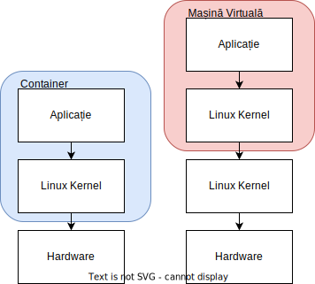
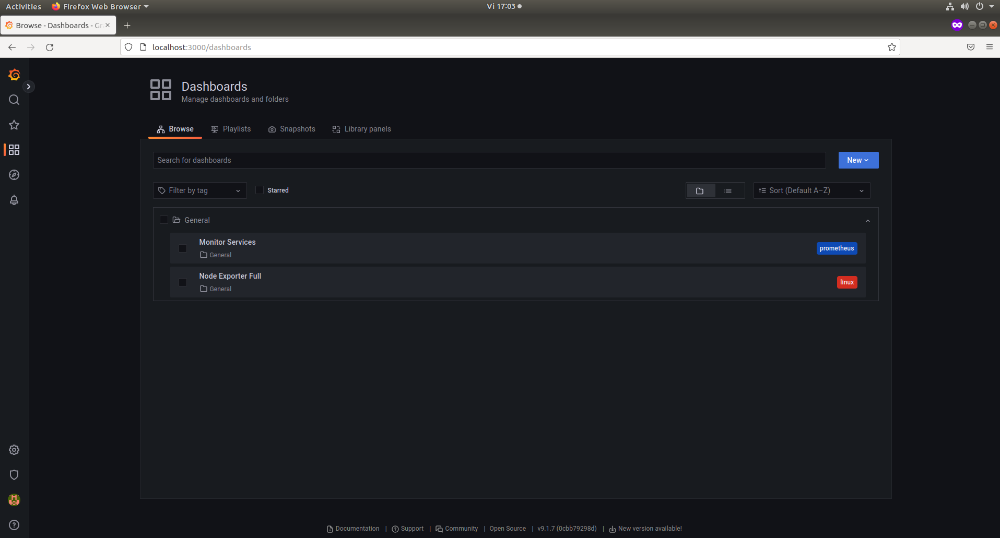
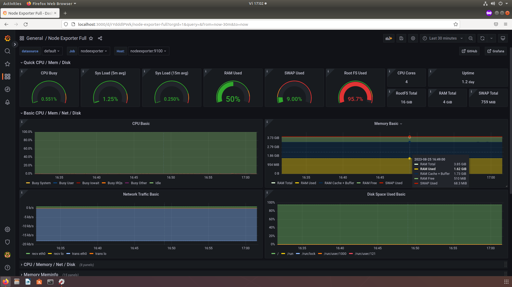

Instalarea aplicațiilor (serviciilor) folosind Docker
=====================================================

Scopul acestui capitol este să vă introducem în instalarea, folosirea containerelor și în instalarea serviciilor folosind containerele.

Instalarea serviciilor nu este o operație ușoară.
Acestea depind de aplicații și biblioteci care uneori nu sunt disponibile, sau nu există versiunile necesare pentru distribuția noastră.
O altă problemă vine de la faptul că serviciile nu sunt de tipul "plug-and-play", adică nu oferă o configurație simplă care să permită rularea serviciului imediat după instalarea aplicației.

`Docker <https://www.docker.com/>`_ vine ca o soluție pentru această problemă, deoarece acesta ne oferă servicii pre-împachetate cu dependențele pe care le are serviciul respectiv și cu configurările necesare pentru rularea serviciului.
Un alt avantaj al folosirii Docker este că mediul oferit de Docker este unul izolat și efemer, adică o aplicație care rulează în Docker nu are acces în mod obișnuit la restul sistemului, iar orice modificare asupra sistemului de fișiere din Docker nu se va reflecta asupra sistemului.

Containerele sunt un mediu în care putem rula aplicații izolate de sistemul gazdă.

În sistemele de operare bazate pe Linux, containerele sunt rulate ca o aplicație care are acces la resursele stației gazdă, dar care poate interacționa cu procesele din afara mediului izolat.

Avantajul utilizării unui container pentru rularea aplicațiilor este că poate fi pornit, modificat și oprit cu ușurință.
Astfel, putem instala aplicații într-un container, le putem configura și rula fără a afecta celelalte componente ale sistemului.

Folosirea Docker
----------------

Un caz de utilizare în care rulăm containere este atunci când vrem să setăm un server care depinde de versiuni specifice ale anumitor biblioteci.
Nu vrem să rulăm acel server pe sistemul nostru fizic, deoarece pot apărea conflicte cu alte aplicații.
Rulând aplicația într-un container, putem avea o versiune a bibliotecii instalată pe mașina fizică și o altă versiune instalată în container fără conflict între ele.

Containere versus mașini virtuale
^^^^^^^^^^^^^^^^^^^^^^^^^^^^^^^^^

Atât containerele cât și mașinile virtuale ne permit să rulăm aplicații într-un mediu izolat.
Totuși, există diferențe fundamentale între cele două mecanisme.
Conform schemei de mai jos, un container rulează direct peste nucleul sistemului de operare gazdă.
În schimb, o mașină virtuală execută propriul nucleu care apoi rulează aplicațiile.
Acest nivel în plus de operații executate adaugă overhead rulării aplicațiilor dorite, iar overheadul încetinește viteza de execuție.

Un alt avantaj al containerelor este abilitatea de a le construi iterativ.
Noi putem să descărcăm cu ușurință un container de pe un repository public, să îl modificăm și să îl încărcăm într-un repository public fără să încărcăm întreaga imagine.
Putem face asta, deoarece modificările asupra unui container sunt făcute iterativ, salvând diferențele dintre imaginea inițială și versiunea modificată.

Există și cazuri în care vrem să rulăm aplicațiile în interiorul unei mașini virtuale.
De exemplu, dacă vrem să rulăm o aplicație compilată pentru un alt sistem de operare în afară de Linux, nu vom putea face asta, deoarece containerele pot executa aplicații care sunt compilate pentru sistemul de operare gazdă.
Mașinile virtuale pot să ruleze și sisteme de operare diferite de sistemul de operare gazdă.

Gestionarea containerelor
^^^^^^^^^^^^^^^^^^^^^^^^^

În această sub-subsecțiune vom prezenta cum să descarce și cum să pornească un container care oferă o pagină web simplă, ca apoi să oprească containerul.

Pentru a porni o aplicație în interiorul unui container Docker folosim următoarea comandă:

.. code-block:: bash

        student@uso:~$ docker run -it ubuntu:18.04 bash
        Unable to find image 'ubuntu:18.04' locally
        18.04: Pulling from library/ubuntu
        92dc2a97ff99: Pull complete
        be13a9d27eb8: Pull complete
        c8299583700a: Pull complete
        Digest: sha256:4bc3ae6596938cb0d9e5ac51a1152ec9dcac2a1c50829c74abd9c4361e321b26
        Status: Downloaded newer image for ubuntu:18.04
        root@86c268b30cd6:/#

Comanda ``docker`` a fost rulată folosind următorii parametrii:

* ``run``, pornește un container;
* ``-i``, pornește un container "interactiv", care acceptă input de la tastatură;
* ``-t``, asociază un termina virtual comenzii rulate;
* ``ubuntu:18.04`` este numele imaginii pe care vrem să o folosim. `Dockerhub <https://hub.docker.com/>`_ este un repository public de imagini de unde putem descărca imagini deja construite;
* ``bash``, comanda pe care vrem să o rulăm în cadrul containerului.

Putem rula și o comandă neinteractivă în container în felul următor:

.. code-block:: bash

        student@uso:~$ docker run ubuntu:18.04 ps -ef
        UID          PID    PPID  C STIME TTY          TIME CMD
        root           1       0  0 12:01 ?        00:00:00 ps -ef

* instalarea facilă a unui serviciu
* configurarea unui mediu de dezvoltare izolat
* replicarea unui serviciu din producție local
* configurarea unui mediu replicabil pentru testare

.. note::

        Comanda ``ps -ef`` afișează toate procesele active din sistem.
        Observăm că în rezultatul de mai sus apare o singură comandă, deoarece rulăm într-un mediu izolat.

Cu toate acestea, nu dorim să rulăm întotdeauna containere în prim plan.
Dacă vrem să rulăm un script care nu poate fi rulat în mediul gazdă, iar acest script va rula mult timp, preferăm să rulăm comanda în fundal.

Pentru a rula un script în fundal în cadrul unui container Docker vom folosi opțiunea ``-d`` a comenzii ``docker run`` în felul următor:

.. code-block:: bash

        student@lab-docker:~$ sudo docker run -d ubuntu:18.04 sleep 10000
        a63ee06826a33c0dfab825a0cb2032eee2459e0721517777ee019f59e69ebc02
        student@lab-docker:~$ sudo docker ps
        CONTAINER ID   IMAGE          COMMAND         CREATED         STATUS         PORTS     NAMES
        a63ee06826a3   ubuntu:18.04   "sleep 10000"   7 seconds ago   Up 5 seconds             wonderful_lewin
        student@lab-docker:~$ sudo docker exec -it a63ee06826a3 /bin/bash
        root@a63ee06826a3:/# ps -ef
        UID          PID    PPID  C STIME TTY          TIME CMD
        root           1       0  0 02:19 ?        00:00:00 sleep 10000
        root           7       0  2 02:19 pts/0    00:00:00 /bin/bash
        root          19       7  0 02:20 pts/0    00:00:00 ps -ef
        root@a63ee06826a3:/# exit

Putem vedea dacă containerul pornit de noi încă rulează rulând comanda ``docker ps``.
Coloane relevante sunt:

* ``CONTAINER ID``;
* ``NAMES``.

Pentru a ne conecta la un container care rulează în fundal, ne folosim de comanda ``docker exec`` împreună cu ID-ul containerului sau numele selectat folosind comanda ``docker ps``:

.. code-block:: bash

        student@lab-docker:~$ sudo docker ps
        CONTAINER ID   IMAGE          COMMAND         CREATED         STATUS         PORTS     NAMES
        a63ee06826a3   ubuntu:18.04   "sleep 10000"   7 seconds ago   Up 5 seconds             wonderful_lewin
        student@lab-docker:~$ sudo docker exec -it a63ee06826a3 /bin/bash
        root@a63ee06826a3:/# ps -ef
        UID          PID    PPID  C STIME TTY          TIME CMD
        root           1       0  0 02:19 ?        00:00:00 sleep 10000
        root           7       0  2 02:19 pts/0    00:00:00 /bin/bash
        root          19       7  0 02:20 pts/0    00:00:00 ps -ef
        root@a63ee06826a3:/# exit

Pentru a opri un container care rulează în fundal, utilizați comanda ``docker stop`` împreună cu ID-ul sau numele containerului, în felul următor:

.. code-block:: bash

        student@lab-docker:~$ sudo docker stop a63ee06826a3
        a63ee06826a3
        student@lab-docker:~$ sudo docker ps
        CONTAINER ID   IMAGE     COMMAND   CREATED   STATUS    PORTS     NAMES
        student@lab-docker:~$

Exerciții: Gestionarea containerelor
""""""""""""""""""""""""""""""""""""

* Porniți un nou container în fundal folosind imaginea de bază ``centos:7``;
* Conectați-vă la containerul tocmai pornit și instalați aplicația ``bind-utils`` folosind comanda ``yum install bind-utils``. Pentru a verifica faptu că ați instalat aplicația corect, verificați-vă rulând comanda ``nslookup google.com``;
* Deconectați-vă de la container și opriți-l.

Instalarea serviciilor folosind Docker
--------------------------------------

Cum am prezentat mai devreme, un avantaj al folosirii containerelor este faptul că putem să descărcăm containere care pot rula servicii.
Aceste servicii nu vor mai fi lansate și gestionate de aplicația ``systemd`` care rulează pe stația de lucru, deoarece acestea vor rula în cadrul unui container care va gestiona rularea serviciului.
Noi trebuie doar să ne asigurăm ca rulăm containerul folosind opțiunile potrivite.

Identificarea containerelor pe DockerHub
^^^^^^^^^^^^^^^^^^^^^^^^^^^^^^^^^^^^^^^^

Precum aplicațiile obișnuite, și containerele Docker pot fi descărcate dintr-un repository central.
Repository-ul central pentru containere pe care îl vom folosi este `DockerHub <hub.docker.com/>`_. Acesta nu este singurul repository de containere pe care putem să îl folosim, dar este cel mai vast.
Vom folosi site-ul DockerHub pentru a căuta containere împreună cu instrucțiuni de folosire ale acestora.

Studiu de caz: Instalarea unui server de Minecraft folosind containere
^^^^^^^^^^^^^^^^^^^^^^^^^^^^^^^^^^^^^^^^^^^^^^^^^^^^^^^^^^^^^^^^^^^^^^

În următoarea secțiune vom prezenta un studiu de caz pentru rularea unui server de Minecraft și monitorizarea lui folosind containere.

Pentru a descărca imaginea unui container pentru un server de Minecraft, trebuie să identificăm un serviciu deja containerizat pe DockerHub.
Vom face asta folosind funcția de căutare oferită de platformă.

În alegerea unui container pe care să îl folosim trebuie să avem în vedere următorii factori:

* numărul de persoane care au descărcat deja containerul; ne dorim să folosim un serviciu are a fost folosit și verificat de cât mai mulți utilizatori;
* data ultimului update; în general cu cât sunt actualizări mai noi, cu atât este mai bun suportul pentru serviciu;
* starea documentației; cu cât instrucțiunile pentru configurare sunt mai complete și concise, cu atât ne putem baza pe faptul că nu vom petrece mult timp în pregătirea mediului de rulare al containerului.

Conform instrucțiunilor de instalare din pagina containerului, putem porni serviciul folosind comanda următoare:

.. code-block:: bash

    student@uso:~/.../labs/09-task-admin/lab-container$ sudo docker run -d -p 25565:25565 --name mc itzg/minecraft-server
    Unable to find image 'itzg/minecraft-server:latest' locally
    latest: Pulling from itzg/minecraft-server
    675920708c8b: Pull complete
    74b551139104: Pull complete
    c290a58bcfd7: Pull complete
    4d6bcabdde06: Pull complete
    02ff7afd9866: Pull complete
    58640237d5df: Pull complete
    d9165be859a2: Pull complete
    575fb4190f2f: Pull complete
    c3c6d5d36ce5: Pull complete
    9f1d7790dab7: Pull complete
    a7a32c154b26: Pull complete
    e253f974e9a6: Pull complete
    d61d99ed5e98: Pull complete
    c78f023f58b3: Pull complete
    70401c8e828a: Pull complete
    4f4fb700ef54: Pull complete
    087988aa5331: Pull complete
    13ee4174c665: Pull complete
    9381121a4fe0: Pull complete
    6a8a23430798: Pull complete
    b5b33c72ea51: Pull complete
    edf873f8c85d: Pull complete
    Digest: sha256:0697315bd265c751821d5796662436efd94edea8e77b42a7404dab22586af73f
    Status: Downloaded newer image for itzg/minecraft-server:latest
    53a920004fa8316ef87e4776f57f6b826825edf8237d08b9791c1936f40e50e2
    student@uso:~/.../labs/09-task-admin/lab-container$ sudo docker image ls
    REPOSITORY              TAG       IMAGE ID       CREATED      SIZE
    itzg/minecraft-server   latest    616bdcb51f15   7 days ago   670MB
    student@uso:~/.../labs/09-task-admin/lab-container$ sudo docker ps
    CONTAINER ID   IMAGE                   COMMAND    CREATED         STATUS                            PORTS                                                      NAMES
    53a920004fa8   itzg/minecraft-server   "/start"   5 seconds ago   Up 4 seconds (health: starting)   0.0.0.0:25565->25565/tcp, :::25565->25565/tcp, 25575/tcp   mc

Am folosit opțiunea ``--name`` a utilitarului ``docker run`` pentru a specifica un nume ușor de reținut pentru containerul pornit, în cazul acesta numele este ``mc``. Am adăugat opțiunea ``-p`` pentru a deschide portul ``25565`` pe mașină pe care rulează containerul, port pe care se realizează comunicarea cu serverul de Minecraft.

Observăm că a fost descărcat containerul și a început să ruleze.
Pentru a verifica faptul că am descărcat imaginea containerului, rulăm comanda ``docker image ls``, care listează toate containerele de pe sistem.
Regăsim în lista containerelor imaginea cu numele ``itzg/minecraft-server``.

Pentru a verifica funcționarea containerului ne vom conecta la serverul de Minecraft folosind portul expus mai sus.

.. code-block:: bash

        student@uso:~/.../labs/09-task-admin/lab-container$ curl localhost:25565
        {"translate":"disconnect.genericReason","with":["Internal Exception: io.netty.handler.codec.DecoderException: java.lang.IndexOutOfBoundsException: Index 69 out of bounds for length 1"]}
        student@uso:~/.../labs/09-task-admin/lab-container$

Observăm că am primit înapoi o eroare de Java, asta înseamnă că serverul de Minecraft, care este bazat pe limbajul de programare Java, este accesibil.
Eroarea apare deoarece încercam să accesăm containerul folosind un client HTTP, în loc de a folosi Java

Folosirea Docker Compose pentru gestiunea containerelor complexe
^^^^^^^^^^^^^^^^^^^^^^^^^^^^^^^^^^^^^^^^^^^^^^^^^^^^^^^^^^^^^^^^

După cum putem vedea din exemplul de mai sus, putem porni containerele folosind comanda ``docker run``, dar asta înseamnă rularea unei comenzi pentru fiecare container.
Acest lucru este simplu atunci când trebuie să pornim doar două containere, dar dacă vrem să pornim mai mult de două containere, sau dacă vrem să folosim o soluție "one click" și folosim o suită de containere necesare pentru soluția noastră, avem nevoie de o nouă metodă de pornire a containerelor.

Soluția la această problemă este serviciul Docker Compose.
Acesta permite unui utilizator să scrie o specificație pentru un mediu de lucru, inclusiv opțiuni pentru rularea containerelor, volumele atașate containerelor și rețelele prin care containerele vor comunica.

Comanda folosită pentru gestionarea containerelor este ``docker-compose``, iar specificația containerelor este scrisă în fișierul ``docker-compose.yml``.

Formatului fișierului ``docker-compose.yml`` este de forma:

.. code-block:: bash

        services:
            nume_serviciu:
                image: <nume imagine>
                volumes:
                    <listă volume>
                ports:
                    <listă porturi deschise>
                environment:
                    <lista variabile mediu>
        volumes:
            nume_volum:
        networks:
            nume_rețele:

Serviciul de vizualizare Grafana este un standard în industrie pentru afișarea graficelor de diverse forme și alertarea bazată pe condiții specificate de utilizator.

Grafana se folosește de o bază de date și de un agregator de informații.
Un agregator des folosit în Grafana este Prometheus, care poate să se conecteze la clienți externi și să descarce informații de la aplicații care expun informații numite exportere.

Ambele servicii folosesc fișiere și variabile de configurare complexe pentru specificarea modului de rulare.
Din această cauză, nu este facil să rulăm comenzile de pornire ale lor direct în line de comandă.

Ne dorim să monitorizăm serverul de Minecraft, pentru a observa cum se schimbă folosirea resurselor.
Vom folosi exporterul ``node-exporter`` pentru colectarea informațiilor despre sistemul pe care rulează serverul.

Vom scrie în fișierul ``docker-compose.yml`` următoarea rețetă YAML:

.. code-block:: bash

        version: '2.1'

        volumes:
            prometheus_data:
            grafana_data:

        services:

          prometheus:
            image: prom/prometheus:v2.37.9
            container_name: prometheus
            volumes:
              - ./prometheus:/etc/prometheus
              - prometheus_data:/prometheus
            command:
              - '--config.file=/etc/prometheus/prometheus.yml'
              - '--storage.tsdb.path=/prometheus'
              - '--web.console.libraries=/etc/prometheus/console_libraries'
              - '--web.console.templates=/etc/prometheus/consoles'
              - '--storage.tsdb.retention.time=200h'
              - '--web.enable-lifecycle'
            restart: unless-stopped
            ports:
              - 9090:9090

          nodeexporter:
            image: prom/node-exporter:v1.6.1
            container_name: nodeexporter
            volumes:
              - /proc:/host/proc:ro
              - /sys:/host/sys:ro
              - /:/rootfs:ro
            command:
              - '--path.procfs=/host/proc'
              - '--path.rootfs=/rootfs'
              - '--path.sysfs=/host/sys'
              - '--collector.filesystem.ignored-mount-points=^/(sys|proc|dev|host|etc)($$|/)'
            restart: unless-stopped
            ports:
              - 9100:9100

          grafana:
            image: grafana/grafana:9.1.7
            container_name: grafana
            volumes:
              - grafana_data:/var/lib/grafana
              - ./grafana/provisioning:/etc/grafana/provisioning
            environment:
              - GF_SECURITY_ADMIN_USER=admin
              - GF_SECURITY_ADMIN_PASSWORD=usorules
              - GF_USERS_ALLOW_SIGN_UP=false
            restart: unless-stopped
            ports:
              - 3000:3000

Acest fișier a fost generat pe baza unui `repository <https://github.com/Einsteinish/Docker-Compose-Prometheus-and-Grafana/>`_ open source deja existent, adaptat pentru cazul nostru de folosire.

Intrările sub tag-ul ``volumes`` reprezintă directoare partajate între container și sistemul fizic.
Volumele containerelor oferă persistență informației înregistrate în container.
În mod predefinit containerele stochează informație în mod efemer, dacă un container a fost șters, a fost ștersă și informația din cadrul acestuia.

Un director montat este de forma ``<director sursă>:<director destinație>``.
În cazul în care directorul sursă nu este o cale în sistem, acesta este generat un volum în cadrul directorului de lucru al serviciului Docker.

Serviciile Grafana, Prometheus și ``node_exporter`` sunt accesibile pe rețea dintr-un browser și comunică prin porturi.
Pentru a putea accesa aceste servicii trebuie să expunem porturile.
Expunerea porturilor este realizată sub eticheta ``ports``, fiecare port fiind definind sub forma ``<port sursă>:<port destinație>``.

Serviciile containerzate sunt configurate folosind eticheta ``environment``.
Parola sistemului Grafana a fost configurată folosind variabilele de mediu ``GF_USERS_ADMIN_USER`` și ``GF_SECURITY_ADMIN_PASSWORD``.

Ne vom autentifica în mașina virtuală la serviciul de monitorizare în browser la
adresa ``localhost:3000``.
Am setat utilizator administrator ``admin`` și parola ``usorules``.
Vom fi rugați sa modificăm aceste informații.

Odată autentificați, apăsăm pe butonul dashboards, apoi pe browse și accesăm panoul ``Node Exporter Full`` apăsând pe numele acestuia.

Afișarea informațiilor în Grafana este realizată folosind dashboarduri (panouri de control).
Acestea pot fi generate de utilizatori în mod dinamic, sau pot să fie descărcate drept fișiere JSON.
În cadrul infrastructurii curente am descărcat dahsboardul ``Node Exporter Full``, unde putem să urmărim detalii despre resurse folosite, cum ar fi traficul pe rețea sau câtă memorie este folosită.

Atunci când folosim servicii bazate pe ``docker-compose``, nu este suficient să avem un fișier ``docker-compose.yaml``.
Serviciile sunt configurabile și prin fișiere de configurare pe care trebuie să le definim.
În cadrul directorului ``/home/student/uso.git/labs/09-task-admin/lab-container/grafana`` am generat fișierele de configurare pentru serviciile Prometheus și Grafana.
Aceste fișiere configurează Prometheus să se conecteze la ``node_exporter`` și configurează Grafana să se afișeze informațiile stocate în Prometheus.
Aceste fișiere nu sunt relevante pentru un setup simplu, avantajul folosirii serviciilor containerizate este tocmai faptul că nu trebuie să scriem noi toate fișierele de configurare și avem un serviciu deja funcțional configurat.

Observăm mai jos ierarhia de fișiere completă:

.. code-block:: bash

        grafana
        ├── docker-compose.yml
        ├── grafana
        │   └── provisioning
        │       ├── dashboards
        │       │   ├── 1860_rev31.json
        │       │   ├── dashboard.yml
        │       │   └── monitor_services.json
        │       └── datasources
        │           └── datasource.yml
        └── prometheus
            └── prometheus.yml

Instalarea unui serviciu de media hosting
"""""""""""""""""""""""""""""""""""""""""

Un exemplu pentru folosirea containerelor Docker într-un mod facil este pentru găzduirea unui server de media privat.
Serviciul oferit este ca și cum am folosi serviciul Netflix sau Disney+ găzduit pe propriul calculator.
Serviciile de media hosting sunt folosite pentru gestionarea propriei biblioteci
media, organizarea, sortarea și descărcarea metadatelor într-un portal centralizat.
Un alt avantaj al acestor servicii este faptul că ele pot fi vizualizate pe orice dispozitiv are acces la calculatorul care rulează containerul printr-un browser, fie că este televizor, tabletă sau telefon mobil.

Serviciul Plex este unul dintre cele mai cunoscute servicii de media hosting.
Acesta poate să gestioneze conținut audio, foto și video.
Serviciul poate să fie rulat nativ în cadrul sistemului, sau poate să ruleze în container.
Avantajul folosirii Plex într-un container este ușurința de instalare și gestiune a sistemului.
Este suficient doar să descărcăm containerul și să îl pornim folosind comanda ``docker-compose``.

Pentru acest exercițiu, este suficient să cautăm o imagine de container pentru serviciul Plex pe platforma `DockerHub <https://hub.docker.com/>`_.

Observăm că avem două posibilități de containere oficiale, primul este
împachetat și oferit de `linuxserver.io <https://hub.docker.com/r/linuxserver/plex>`_, iar al doilea este oferit de `Plex Inc <https://hub.docker.com/r/linuxserver/plex/>`_.
Vom folosi soluția oferită de linuxserver.io, deoarece aceștia oferă, în general, containere împachetate optim pentru folosirea în containere.

Exercițiu
"""""""""

Pe baza exemplului de fișier ``docker-compose.yaml`` oferit de linuxserver.io pe pagina de Docker Hub, realizați configurările necesare astfel încât să porniți un server de media Plex care are încărcată biblioteca folosind un volum din directorul ``/home/student/uso.git/labs/09-task-admin/lab-container/plex`` și expune portul de acces 32400 către sistemul gazdă.

Verificați că puteți reda melodia încărcată în directorul ``/home/student/uso.git/labs/09-task-admin/lab-container/plex`` folosind Plex.
