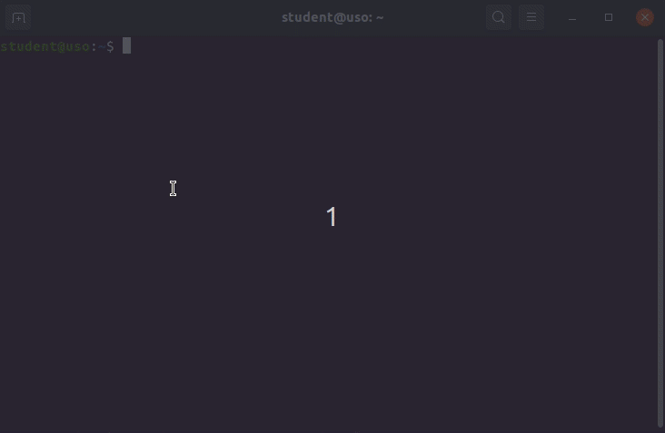
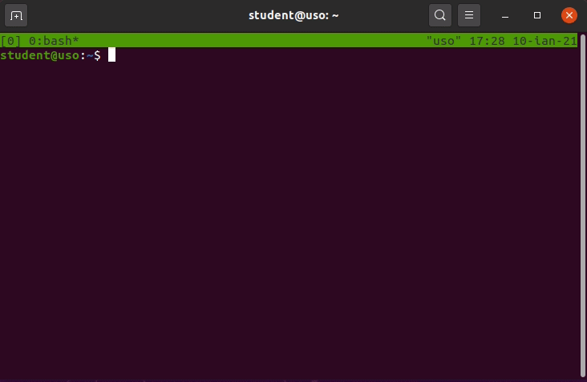
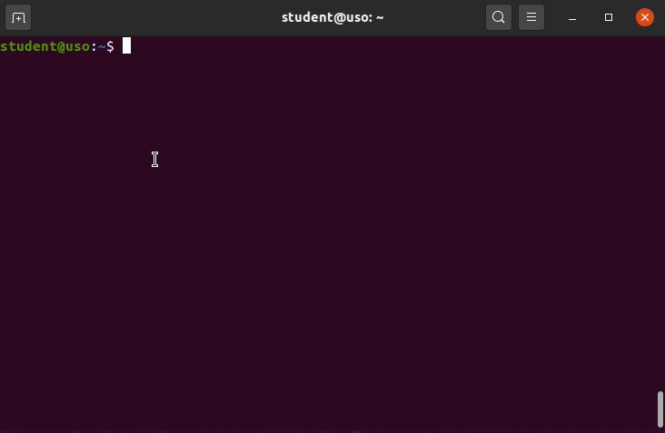
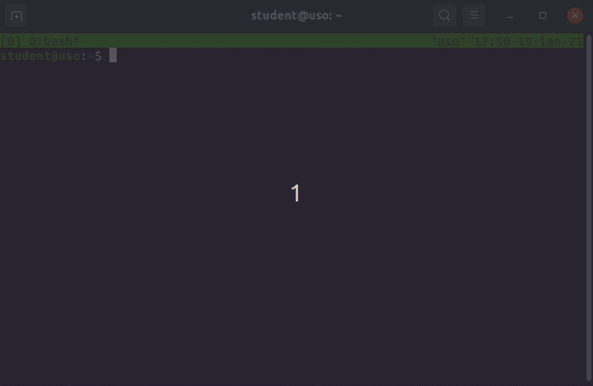

.. _task_admin_usage:

Folosirea stației la distanță
=============================

Odată ce am reușit să realizăm o conexiune persistentă între stația locală și workstationul remote pe care vrem să lucrăm, și ne-am configurat mediul de lucru la distanță, vrem să folosim stația.

Pentru folosirea stației vom presupune următorul flux de lucru:

* ne conectăm la stație
* edităm fișiere sursă sau fișiere de configurare
* compilăm un program, sau rulăm o aplicație
* ne deconectăm de la stație

.. _task_admin_usage_tmux:

Folosirea ``tmux``
------------------

Spre deosebire de un laptop unde, dacă închidem ecranul și îl punem în ghiozdan, acesta intră în hibernare, stația de lucru poate să lucreze în continuare.
Acest lucru ne oferă persistența mediului de lucru;
astfel nu mai este nevoie să repornim IDE-ul, mediul de lucru, taburile pentru debugging și așa mai departe.

Totuși, atunci când ne conectăm la un calculator printr-un client SSH și rulăm comenzi, acestea vor rula în foreground.
Dacă avem o aplicație care rulează mult timp, cum ar fi o căutare intensă în sistemul de fișiere folosind ``updatedb``, și conexiunea SSH se întrerupe, se va întrerupe și execuția comenzii ``updatedb``.

Pentru a rezolva această problemă, și pentru a ne folosi de disponibilitatea oferită de un sistem distanță, vom folosi utilitarul ``tmux``.
Acest utilitar pornește o sesiune de shell care este independentă de terminalul în care rulează;
adică putem să ne conectăm și să ne deconectăm de la sesiunea de shell.

.. _task_admin_usage_tmux_create:

Crearea unei sesiuni ``tmux``
^^^^^^^^^^^^^^^^^^^^^^^^^^^^^

Fiecare pornire a aplicației ``tmux`` deschide o nouă sesiune.

Putem considera fiecare sesiune ca o fereastră a unui browser.
De regulă nu este nevoie să avem mai multe ferestre de browser sau de ``tmux`` pornite, deoarece avem alte moduri de organizare a spațiului de lucru.
În plus, pentru fiecare sesiune de ``tmux`` ar fi nevoie să pornim un nou client SSH, lucru care, în funcție de modul de conectare la stație, adaugă pași în plus.

.. _task_admin_usage_tmux_session:

Detașarea și reatașarea la o sesiune ``tmux``
^^^^^^^^^^^^^^^^^^^^^^^^^^^^^^^^^^^^^^^^^^^^^

Aplicația ``tmux`` permite detașarea de la o sesiune folosind combinația de taste ``Ctrl+v d``

.. admonition:: Observație

        Vom vedea pe parcursul acestei subsecțiuni că toate scurtăturile de taste ale aplicației ``tmux`` folosesc ca prefix combinația ``Ctrl+v``.
        Această combinație este predefinită pe mașina virtuală ``USO.ova``, dar pe sistemele obișnuite combinația va fi ``Ctrl+b``.
        Putem modifica prefixul în fișierul de configurare ``tmux.conf``.

Pentru a ne reatașa la o sesiune trebuie să ne dăm seama la care sesiune să ne atașăm.
Fiecare sesiune ``tmux`` are asociat un identificator.

Vom afișa toate sesiunile deschise folosind comanda ``tmux ls``:

.. code-block::

    student@uso:~$ tmux ls
    0: 1 windows (created Wed Jan  6 02:44:06 2021)

În momentul de față există o singură sesiune cu identificatorul ``0``.

Pentru a ne reatașa la sesiune folosim comanda ``tmux attach-session -t 0``.

.. _task_admin_usage_tmux_tabs:

Taburi în ``tmux``
^^^^^^^^^^^^^^^^^^

Pentru a ne organiza terminalele deschise pe stația de la distanță, recomandăm folosirea taburilor (numite ferestre - *window* în ``tmux``), deoarece acestea sunt deschise pe durata sesiunii și permit crearea și gestiunea facilă.

De exemplu, pentru a lucra la o aplicație, avem nevoie să deschidem într-un tab documentul sursă pe care îl gestionăm, într-un tab avem un shell în care compilăm aplicația și într-un tab rulăm comenzi de verificare a aplicației.
Având fiecare tab cu sarcina sa desemnată, păstrăm un istoric mai curat și mai ușor de interpretat.
Astfel vom reduce numărul de comenzi pe care le rulăm pentru a reporni editorul de text, pentru a schimba directul de lucru etc.

Pentru a porni un nou tab folosim combinația de taste ``Ctrl+v c``.

.. admonition:: Observație

    În bara de taburi din terminal a apărut un nou tab cu denumirea ``1:bash*``.

Fiecare tab are propriul identificator și propriul nume.
De exemplu, ``Ctrl+v 0`` ne va plasa pe primul tab, iar ``Ctrl+v 1`` ne va plasa pe al doilea tab.

.. admonition:: Observație

    Odată ce se schimbă tabul activ se schimbă și sublinierea tabului activ din bara de taburi.

.. _task_admin_usage_tmux_ex:

Exerciții
^^^^^^^^^

#. Creați două sesiuni de ``tmux``.

#. În prima sesiune creată deschideți două taburi.
   Rulați în primul tab comanda ``htop``;
   în al doilea tab deschideți fișierul ``/etc/passwd`` folosind editorul de text ``nano``.

#. În a doua sesiune creată deschideți trei taburi.
   Rulați în primul tab comanda ``sudo apt-get update``;
   rulați în al doilea terminal comanda ``iostat -x 2 5``;
   și în al treilea tab rulați comanda ``tail -f /var/log/syslog``.
   Reveniți la primul tab din sesiune.
